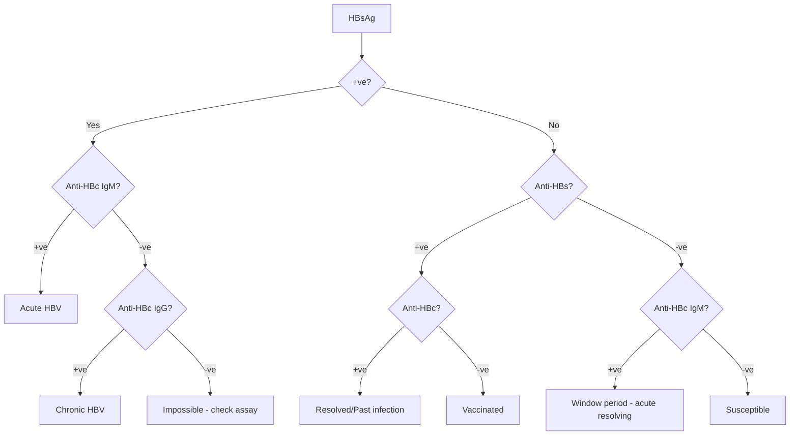

## 1. Learning Objectives
- [ ] Recognize LFT patterns in acute HAV, HBV, HCV, HEV
- [ ] Interpret serology for each virus
- [ ] Know incubation periods and transmission
- [ ] Differentiate acute vs chronic infection
- [ ] Identify FCPS/MRCP high-yield associations

---

## 2. Overview: LFT Patterns by Virus

| Virus | Incubation | Transmission | ALT Peak | Key Serology | Chronic Risk |
|-------|------------|--------------|----------|--------------|--------------|
| **HAV** | 15-50 days | Faecal-oral | 500-5000 | IgM anti-HAV | None (self-limited) |
| **HBV** | 60-150 days | Blood/sexual/vertical | 500-5000 | HBsAg, IgM anti-HBc | 5-10% adults, 90% neonates |
| **HCV** | 14-180 days | Blood | 200-3000 | Anti-HCV, HCV RNA | 75-85% |
| **HEV** | 15-60 days | Faecal-oral | 500-5000 | IgM anti-HEV | Rare (except immunosuppressed) |

---

## 3. Hepatitis A (HAV)

### LFT Pattern
- **Acute hepatocellular**: ALT 1000-5000, AST slightly lower
- **Bilirubin**: Often ↑↑ (cholestatic features common)
- **ALP**: Mild ↑ (2-3× ULN)
- **Duration**: 4-8 weeks to normalize

### Serology
| Phase | Anti-HAV IgM | Anti-HAV IgG |
|-------|--------------|--------------|
| Acute | + | - |
| Convalescent | + | + |
| Past/Immune | - | + |

### FCPS/MRCP Keys
- Relapsing HAV: 10-15% (prolonged cholestasis) — NOT chronic
- Vaccination: Inactivated vaccine, 2 doses 6-12 months apart
- Post-exposure: IgG (HNIG) within 2 weeks

---

## 4. Hepatitis B (HBV) — Acute vs Chronic

### Acute HBV LFT Pattern
- **ALT**: 1000-5000 (can be >10,000 in fulminant)
- **AST**: Slightly lower than ALT
- **Bilirubin**: Variable
- **HBsAg**: +ve during acute phase
- **IgM anti-HBc**: **Hallmark of acute infection**

### Serology Interpretation (8 Scenarios)



### Phases of Chronic HBV

| Phase | HBsAg | HBeAg | HBV DNA | ALT | Infectivity |
|-------|-------|-------|---------|-----|-------------|
| **Immune Tolerant** | + | + | >10⁷ | Normal | High |
| **Immune Active** | + | ± | >2×10³ | ↑ | High |
| **Inactive Carrier** | + | - | <2×10³ | Normal | Low |
| **HBeAg-Negative Reactivation** | + | - | >2×10³ | ↑ | High |

### FCPS/MRCP Keys
- **Window period**: HBsAg -, anti-HBc IgM + (only marker)
- **Occult HBV**: HBsAg -, anti-HBc +, HBV DNA + (liver)
- **Treatment indication**: Immune active phase + fibrosis (F≥2)

---

## 5. Hepatitis C (HCV) — Acute

### LFT Pattern
- **ALT**: Often lower than HAV/HBV (500-3000)
- **Fluctuating ALT** — may normalize intermittently
- **Anti-HCV**: Appears 8-12 weeks post-exposure
- **HCV RNA**: Detectable 1-2 weeks post-exposure

### Acute HCV → Chronic
- 75-85% become chronic
- Spontaneous clearance: 15-25% (associated with IFNL3 genotype)

### FCPS/MRCP Keys
- **No vaccine for HCV**
- **DAA treatment**: Wait 6 months for spontaneous clearance OR treat acute if high risk
- **SVR12**: Undetectable HCV RNA 12 weeks post-treatment

---

## 6. Hepatitis E (HEV)

### LFT Pattern
- Similar to HAV: ALT 1000-5000, cholestatic features common
- **Pregnancy (3rd trimester)**: 20% mortality, fulminant hepatic failure

### Genotypes
| Genotype | Region | Transmission | Chronic? |
|----------|--------|--------------|----------|
| 1, 2 | Asia/Africa | Waterborne | No |
| 3, 4 | Europe/USA | Zoonotic (pork) | **Yes in immunosuppressed** |

### FCPS/MRCP Keys
- **Chronic HEV**: Only in immunosuppressed (transplant, HIV)
- **Ribavirin**: 600-800mg/day × 3 months for chronic HEV
- **Severe acute HEV in pregnancy**: Consider early delivery + supportive care

---

## 7. Comparative Table: Acute Viral Hepatitis

| Feature | HAV | HBV Acute | HCV Acute | HEV |
|---------|-----|-----------|-----------|-----|
| **Incubation** | 2-7 weeks | 2-5 months | 2-26 weeks | 2-8 weeks |
| **ALT peak** | 1000-5000 | 1000-5000 | 500-3000 | 1000-5000 |
| **Cholestasis** | Common | Uncommon | Rare | Common |
| **Chronic** | No | 5-10% | 75-85% | Rare (genotype 3/4) |
| **Vaccine** | Yes | Yes | No | Yes (China only) |
| **Fulminant risk** | <1% | 1% | <1% | 1-2% (20% pregnant) |

---

## 8. Viva Questions

1. **Interpret: HBsAg +, anti-HBc IgM +, anti-HBs -**
2. **Interpret: HBsAg -, anti-HBc IgM +, anti-HBs -**
3. **Interpret: HBsAg +, anti-HBc IgG +, HBeAg +, HBV DNA 10⁸**
4. **What is the window period in HBV?**
5. **How do you diagnose acute HCV?**
6. **When does anti-HCV appear after exposure?**
7. **Which HEV genotypes cause chronic infection?**
8. **Management of acute HEV in 3rd trimester pregnancy?**
9. **Differentiate relapsing HAV from chronic hepatitis.**
10. **What is occult HBV?**

---

## 9. Confusions & Mnemonics

| Confusion | Clarification |
|-----------|---------------|
| Acute vs chronic HBV | IgM anti-HBc = acute; IgG anti-HBc + HBsAg = chronic |
| Window period vs occult | Window: anti-HBc IgM + only; Occult: HBsAg -, anti-HBc +, HBV DNA + (liver) |
| HAV chronicity | HAV NEVER causes chronic hepatitis — relapsing ≠ chronic |
| HCV spontaneous clearance | 15-25% clear spontaneously — wait 6 months before DAA unless high risk |

---

## 10. Mind Map

```mermaid
mindmap
  root((Acute Viral Hepatitis))
    HAV
      Faecal-oral
      IgM anti-HAV
      Self-limited
      Vaccine available
    HBV
      Blood/Sexual/Vertical
      IgM anti-HBc = Acute
      5-10% chronic
      Phases: Tolerant → Active → Inactive → Reactivation
    HCV
      Blood
      Anti-HCV appears 8-12 wks
      75-85% chronic
      No vaccine
      DAA cure
    HEV
      Faecal-oral (gen 1,2) / Zoonotic (3,4)
      Pregnancy = High mortality
      Gen 3/4 chronic in immunosuppressed
      Ribavirin for chronic
```

---

## 11. One-Page Revision Card

| Virus | Transmission | Key Acute Marker | Chronic? | Vaccine |
|-------|--------------|------------------|----------|---------|
| HAV | Faecal-oral | IgM anti-HAV | No | Yes |
| HBV | Blood/sexual/vertical | IgM anti-HBc | 5-10% adults | Yes |
| HCV | Blood | HCV RNA (early) / Anti-HCV (late) | 75-85% | No |
| HEV | Faecal-oral / Zoonotic | IgM anti-HEV | Rare (gen 3/4 in immunosuppressed) | China only |

---

## 12. Spaced Repetition Tracker

| Day | 1 | 3 | 7 | 15 | 30 |
|-----|---|---|---|----|----|
| Serology table (8 scenarios) | ☐ | ☐ | ☐ | ☐ | ☐ |
| Chronic HBV phases | ☐ | ☐ | ☐ | ☐ | ☐ |
| HCV timeline | ☐ | ☐ | ☐ | ☐ | ☐ |
| HEV genotypes | ☐ | ☐ | ☐ | ☐ | ☐ |

---

## 13. Self-Test Scorecard

| Question | My Answer | Correct? |
|----------|-----------|----------|
| HBV window period serology |  |  |
| 4 phases chronic HBV |  |  |
| HCV acute vs chronic cutoff |  |  |
| HEV in pregnancy |  |  |

---

## 14. Local Navigation

- [[Viral Hepatitis/Hepatitis A|Hepatitis A]]
- [[Viral Hepatitis/Hepatitis B|Hepatitis B]]
- [[Viral Hepatitis/Hepatitis C|Hepatitis C]]
- [[Viral Hepatitis/Hepatitis E|Hepatitis E]]
- [[Viral Hepatitis/Hepatitis B Serology Interpretation|HBV Serology]]
- [[Acute Liver Failure/Acute viral hepatitis|ALF: Viral Hepatitis]]
---

> Auto-generated study sections for "Jaundice and LFT Interpretation" — Ch 23: Hepatology.

## Flashcards (1 generated)

- Q: What is the definition of Jaundice and LFT Interpretation?
  A: - Acute hepatocellular: ALT 1000-5000, AST slightly lower

## MCQs (1 generated)

1. **Which of the following best describes Jaundice and LFT Interpretation?**
   A. **- Acute hepatocellular: ALT 1000-5000, AST slightly lower**
   B. An unrelated condition not matching the clinical picture of Jaundice and LFT Interpretation
   C. A complication seen late in the disease course of Jaundice and LFT Interpretation
   D. A condition that mimics Jaundice and LFT Interpretation but has a different underlying cause

## SBA Questions (1 generated)

1. A patient with suspected Jaundice and LFT Interpretation presents with: Relapsing HAV: 10-15% (prolonged cholestasis) — NOT chronic; Vaccination: Inactivated vaccine, 2 doses 6-12 months apart; Post-exposure: IgG (HNIG) within 2 weeks. What is the most likely diagnosis?
   A. **Jaundice and LFT Interpretation**
   B. A condition that mimics Jaundice and LFT Interpretation but is not the same entity
   C. A complication of Jaundice and LFT Interpretation rather than the primary diagnosis
   D. An unrelated condition in the same clinical category as Jaundice and LFT Interpretation

