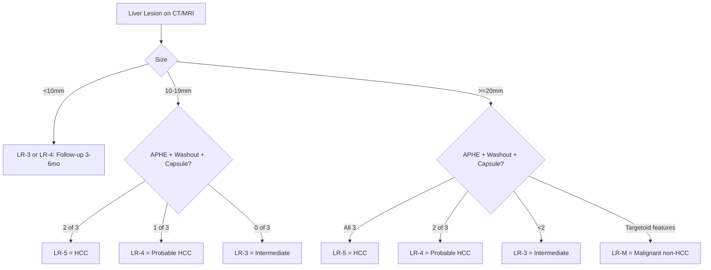
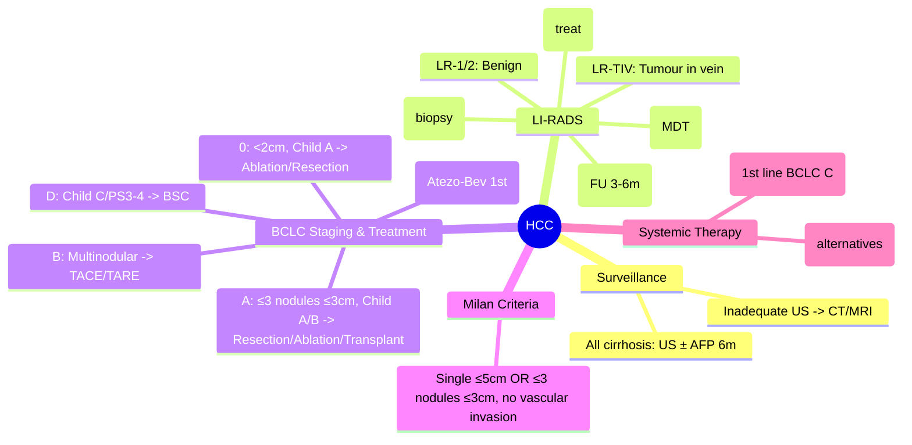

# HCC (Hepatocellular Carcinoma): Surveillance, LI-RADS, BCLC

## Learning Objectives
- [ ] Identify patients needing HCC surveillance
- [ ] Apply LI-RADS categories for imaging diagnosis
- [ ] Stage using BCLC and select treatment
- [ ] Know surveillance intervals and modalities
- [ ] Recognize FCPS/MRCP high-yield management steps

---

## Surveillance: Who and How

### Indications for Surveillance (All Cirrhosis + Selected Non-Cirrhotic)

| Population | Surveillance? |
|------------|---------------|
| **All cirrhosis** (Child A/B/C) | **YES** |
| **Chronic HBV** (Asian/Male >40, Female >50, Family HCC, High DNA) | **YES** |
| **Chronic HBV** (African >20) | **YES** |
| **NAFLD cirrhosis** | **YES** |
| **Other cirrhosis aetiologies** | **YES** |
| **Non-cirrhotic HBV** (low risk) | No (but consider if high risk) |
| **Non-cirrhotic HCV** (post-SVR F3) | Consider |

> **FCPS/MRCP**: **All cirrhosis = surveillance** — no exceptions

### Surveillance Protocol

| Modality | Interval | Sensitivity |
|----------|----------|-------------|
| **Ultrasound (US) ± AFP** | **6-monthly** | US 60-80% (operator dependent); AFP adds 10-20% |
| **CT/MRI** | If US inadequate / high risk | CT/MRI >90% |

**Inadequate US**: Obesity, nodular liver, ascites limiting views → CT/MRI

---

## LI-RADS (Liver Imaging Reporting and Data System) v2018

### Categories (CT/MRI with Contrast)

| Category | Definition | Management |
|----------|------------|------------|
| **LR-1** | Definitely benign | Routine surveillance |
| **LR-2** | Probably benign | Routine surveillance |
| **LR-3** | Intermediate probability | **Short-interval follow-up (3-6mo)** or alternative imaging |
| **LR-4** | Probably HCC | **Diagnostic confidence high** — treat as HCC (MDT) |
| **LR-5** | **Definitely HCC** | **Treat as HCC** — no biopsy needed |
| **LR-M** | **Probably malignant, not HCC-specific** (e.g., CCA, metastasis) | **Biopsy / MDT** |
| **LR-TIV** | Tumour in vein | Stage IV |

### LR-5 Criteria (Definite HCC) — ≥10 mm
- **Arterial phase hyperenhancement (APHE)** + **Washout** (portal venous/delayed) + **Capsule** (enhancing rim) — **2 of 3** if 10-19mm; **all 3** if ≥20mm



---

## BCLC (Barcelona Clinic Liver Cancer) Staging & Treatment

```mermaid
flowchart TD
    A[HCC Diagnosis] --> B{BCLC Stage}
    B -->|Very Early (0)| C[Single <2cm, Child A, PS 0]
    C --> D[Ablation OR Resection]
    B -->|Early (A)| E[Single or ≤3 nodules ≤3cm, Child A/B, PS 0]
    E --> F[Resection / Ablation / Transplant]
    B -->|Intermediate (B)| G[Multinodular, Child A/B, PS 0]
    G --> H[TACE / TARE]
    B -->|Advanced (C)| I[Vascular invasion / Extrahepatic spread / PS 1-2]
    I --> J[Systemic Therapy: Sorafenib / Lenvatinib / Atezolizumab-Bevacizumab]
    B -->|Terminal (D)| K[Child C / PS 3-4]
    K --> L[Best Supportive Care]
```

### BCLC Stage Details

| Stage | Tumour | Liver Function | PS | Treatment | Median Survival |
|-------|--------|----------------|----|-----------|-----------------|
| **0 (Very Early)** | Single <2cm | Child A | 0 | **Ablation / Resection** | >5 years |
| **A (Early)** | Single or ≤3 nodules ≤3cm | Child A/B | 0 | **Resection / Ablation / Transplant** | 3-5 years |
| **B (Intermediate)** | Multinodular (beyond A) | Child A/B | 0 | **TACE / TARE** | 2-3 years |
| **C (Advanced)** | Vascular invasion / Extrahepatic / N1 | Child A/B | 1-2 | **Systemic: Sorafenib / Lenvatinib / Atezo-Bev** | 1-2 years |
| **D (Terminal)** | Any | **Child C** | 3-4 | **Best Supportive Care** | <3 months |

---

## Treatment Modalities

### Curative (BCLC 0/A)
| Modality | Indication | 5-Year Survival |
|----------|------------|-----------------|
| **Surgical Resection** | Single tumour, **Child A**, **normal bilirubin**, **no portal hypertension** (HVPG <10), preserved liver reserve | 50-70% |
| **Liver Transplant** | **Milan Criteria**: Single ≤5cm OR ≤3 nodules ≤3cm, no vascular invasion | **70-80%** (best) |
| **Ablation (RFA/MWA)** | ≤3cm, not near major vessels/bile ducts, Child A/B | 40-50% |

**Milan Criteria for Transplant**:
- Single tumour ≤5cm **OR**
- Up to 3 nodules, all ≤3cm
- **No vascular invasion, no extrahepatic spread**

**UCSF Criteria** (expanded): Single ≤6.5cm OR ≤3 nodules ≤4.5cm, total diameter ≤8cm

### Palliative (BCLC B/C)
| Modality | Indication | Mechanism |
|----------|------------|-----------|
| **TACE (Transarterial Chemoembolization)** | BCLC B (multinodular, preserved liver) | Chemo (doxorubicin/cisplatin) + embolic beads |
| **TARE / SIRT (Y-90)** | BCLC B, portal vein thrombosis | Radioembolization |
| **Systemic: Sorafenib** | BCLC C | Multi-kinase inhibitor (VEGFR, PDGFR, RAF) |
| **Systemic: Lenvatinib** | BCLC C | Non-inferior to sorafenib |
| **Systemic: Atezolizumab + Bevacizumab** | **BCLC C (1st line preferred)** | PD-L1 + VEGF inhibitor; superior OS |

---

## AFP (Alpha-Fetoprotein)

| Use | Detail |
|-----|--------|
| **Surveillance adjunct** | Adds 10-20% sensitivity to US |
| **Diagnostic** | >200 ng/mL + typical imaging = HCC (in cirrhosis) |
| **Monitoring** | Trends during treatment (TACE, systemic) |
| **Limitations** | False +ve: active hepatitis, pregnancy, germ cell tumours; False -ve: 30-40% HCC |

---

## FCPS/MRCP High-Yield Summary

| Concept | Key Points |
|---------|------------|
| **Surveillance** | **All cirrhosis: US ± AFP 6-monthly** |
| **Inadequate US** | → CT/MRI |
| **LI-RADS** | LR-5 = definite HCC (treat); LR-4 = probable (MDT); LR-M = malignant non-HCC (biopsy) |
| **LR-5 criteria** | APHE + Washout + Capsule (size-dependent) |
| **BCLC** | 0/A: Curative (Resection/Ablation/Transplant); B: TACE; C: Systemic; D: BSC |
| **Milan Criteria** | Single ≤5cm OR ≤3 nodules ≤3cm, no vascular invasion |
| **1st line systemic** | **Atezolizumab + Bevacizumab** (if no contraindication) |
| **Transplant** | Best survival (70-80% at 5y) |

---

## Viva Questions

1. **Who needs HCC surveillance? Interval? Modalities?**
2. **What are LI-RADS categories? Which = definite HCC?**
3. **What are LR-5 criteria for 10-19mm vs ≥20mm lesions?**
4. **Describe BCLC staging and treatment for each stage.**
5. **What are Milan criteria for liver transplant?**
6. **Resection vs ablation vs transplant: indications?**
7. **What is TACE? Indication?**
8. **First-line systemic therapy for advanced HCC?**
9. **AFP: uses and limitations?**
10. **BCLC C vs B: how to differentiate?**

---

## Confusions & Mnemonics

| Confusion | Clarification |
|-----------|---------------|
| LI-RADS LR-4 vs LR-5 | LR-4 = probable HCC (MDT); LR-5 = definite HCC (treat without biopsy) |
| LR-M | Malignant but **not HCC-specific** (CCA, metastasis) — needs biopsy |
| BCLC B vs C | B = multinodular, PS0; C = vascular invasion/extrahepatic/PS1-2 |
| Milan vs UCSF | Milan: Single ≤5cm or ≤3 ≤3cm; UCSF: Single ≤6.5cm or ≤3 ≤4.5cm, total ≤8cm |
| Resection criteria | Child A, normal bilirubin, no portal hypertension (HVPG<10) |
| Atezolizumab-Bevacizumab | **1st line for BCLC C** (superior to sorafenib) — contraindicated if high bleed risk/varices untreated |
| LR-TIV | Tumour in vein = automatic Stage IV |

---

## Mind Map



---

## One-Page Revision Card

| **Surveillance** | **Details** |
|------------------|-------------|
| Who | All cirrhosis + selected HBV |
| Modality | US ± AFP |
| Interval | **6-monthly** |

| **LI-RADS** | **Action** |
|-------------|------------|
| LR-1/2 | Routine surveillance |
| LR-3 | FU 3-6m |
| LR-4 | MDT (probable HCC) |
| **LR-5** | **Treat as HCC (no biopsy)** |
| LR-M | Biopsy (malignant, non-HCC) |
| LR-TIV | Stage IV |

| **BCLC** | **Stage** | **Treatment** |
|----------|-----------|--------------|
| 0 | Very Early | Ablation / Resection |
| A | Early | Resection / Ablation / **Transplant** |
| B | Intermediate | **TACE / TARE** |
| C | Advanced | **Systemic (Atezo-Bev 1st)** |
| D | Terminal | **BSC** |

| **Milan Criteria** | |
|--------------------|--|
| Single ≤5cm OR ≤3 nodules ≤3cm | No vascular invasion |

---

## Spaced Repetition Tracker

| Day | 1 | 3 | 7 | 15 | 30 |
|-----|---|---|---|----|----|
| Surveillance criteria | ☐ | ☐ | ☐ | ☐ | ☐ |
| LI-RADS categories | ☐ | ☐ | ☐ | ☐ | ☐ |
| LR-5 criteria | ☐ | ☐ | ☐ | ☐ | ☐ |
| BCLC stages + treatment | ☐ | ☐ | ☐ | ☐ | ☐ |
| Milan criteria | ☐ | ☐ | ☐ | ☐ | ☐ |

---

## Self-Test Scorecard

| Question | My Answer | Correct? |
|----------|-----------|----------|
| Surveillance who/interval |  |  |
| LR-5 criteria 10-19mm |  |  |
| BCLC A vs B vs C |  |  |
| Milan criteria |  |  |
| 1st line systemic BCLC C |  |  |

---

## Local Navigation

- [[Liver Tumours/Liver Tumours|Liver Tumours Overview]]
- [[Liver Tumours/Metastatic liver disease|Metastatic Liver Disease]]
- [[Liver Tumours/Benign liver tumours|Benign Liver Tumours]]
- [[Liver Transplantation/Liver Transplantation|Liver Transplant]]
- [[Cirrhosis Complications/HCC surveillance|HCC Surveillance in Cirrhosis]]