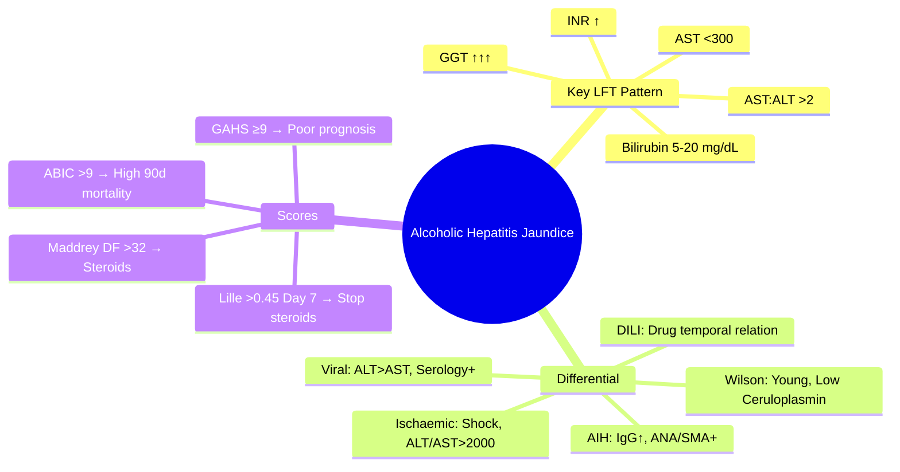

## 1. Learning Objectives
- [ ] Recognise alcoholic hepatitis as cause of jaundice
- [ ] Apply AST:ALT >2 ratio and other diagnostic clues
- [ ] Differentiate from viral, autoimmune, DILI, ischaemic hepatitis
- [ ] Apply Maddrey DF and other scoring systems
- [ ] Identify FCPS/MRCP high-yield diagnostic features

---

## 2. Alcoholic Hepatitis in Jaundice Context

```mermaid
flowchart TD
    A[Patient with Jaundice + Heavy Alcohol History] --> B{LFT Pattern}
    B -->|Hepatocellular R>5| C[AST:ALT Ratio]
    C -->|>2:1 (AST > ALT)| D[Alcoholic Hepatitis Likely]
    C -->|<1:1 (ALT > AST)| E[Viral / AIH / DILI / Ischaemic]
    C -->|1-2:1| F[Consider NASH / Early Obstruction]
```

> **FCPS/MRCP Pearl**: **AST:ALT >2 is hallmark** of alcoholic hepatitis (AST rarely >300, ALT often normal)

---

## 3. Key Features of Alcoholic Hepatitis

| Feature | Typical Finding |
|---------|-----------------|
| **Jaundice** | Present (bilirubin often 5-20 mg/dL) |
| **AST** | ↑↑ but **<300 U/L** (rarely higher) |
| **ALT** | ↑ but **lower than AST** |
| **AST:ALT Ratio** | **>2:1** (classic) |
| **GGT** | **Markedly elevated** |
| **ALP** | Mild-moderate ↑ |
| **INR** | ↑ (synthetic dysfunction) |
| **Albumin** | Low |

---

## 4. Differential Diagnosis: Jaundice + Alcohol History

```mermaid
flowchart TD
    A[Alcohol History + Jaundice] --> B{AST:ALT >2?}
    B -->|Yes| C[Alcoholic Hepatitis]
    B -->|No (ALT>AST)| D{Viral Serology}
    D -->|HBsAg/HCV Ab +| E[Viral Hepatitis]
    D -->|Negative| E{ANA/SMA/IgG?}
    E -->|High| F[Autoimmune Hepatitis]
    E -->|Normal| G{Drug History}
    G -->|Hepatotoxic Drug| H[DILI]
    G -->|No Drug| I[Ischaemic / Wilson / Other]
    I --> J[Clinical Context]
```

---

## 5. Key Diagnostic Clues

| Clue | Alcoholic Hepatitis | Viral Hepatitis | AIH | Ischaemic |
|------|---------------------|-----------------|-----|-----------|
| **AST:ALT** | **>2** (AST<300) | <1 (ALT>AST) | <1 | Variable |
| **GGT** | **↑↑↑** | Normal/↑ | Normal/↑ | Normal |
| **Bilirubin** | 5-20 mg/dL | Variable | Variable | Often high |
| **INR** | ↑ | Variable | ↑ | ↑ |
| **IgG** | Normal | Normal | **↑↑** | Normal |
| **Autoantibodies** | Negative | Negative | **ANA/SMA+** | Negative |
| **History** | Heavy alcohol | Risk factors | Autoimmune dz | Shock/Hypotension |

---

## 6. Scoring Systems (Quick Reference)

| Score | Use | Key Threshold |
|-------|-----|---------------|
| **Maddrey DF** | Steroid indication | **>32 = Severe → Steroids** |
| **Glasgow (GAHS)** | Prognosis | **≥9 = Poor (50% 28d mort)** |
| **ABIC** | 90-day mortality | **>9 = High risk** |
| **Lille (Day 7)** | Steroid response | **>0.45 = Stop steroids** |

> **Detail**: See `Alcoholic hepatitis scoring (Maddrey DF, Glasgow, ABIC, Lille).md`

---

## 7. FCPS/MRCP High-Yield Summary

| Concept | Key Points |
|---------|------------|
| **AST:ALT >2** | Hallmark (AST<300, ALT often normal) |
| **GGT** | Markedly elevated (enzyme induction) |
| **Bilirubin** | 5-20 mg/dL typical |
| **MCV** | Often ↑ (folate deficiency) |
| **Neutrophilia** | Common (no infection) |
| **Maddrey DF >32** | Start steroids (if no contraindication) |
| **Lille >0.45 Day 7** | Stop steroids |

---

## 8. Viva Questions

1. **What is the typical AST:ALT ratio in alcoholic hepatitis?**
2. **Why is AST rarely >300 in alcoholic hepatitis?**
3. **What is the significance of markedly elevated GGT?**
4. **How do you differentiate alcoholic hepatitis from viral hepatitis?**
5. **What is the Maddrey DF threshold for steroids?**
6. **What does Lille score >0.45 mean?**
7. **Why is ALT often normal in alcoholic hepatitis?**
8. **What other lab abnormalities suggest alcohol aetiology?**
9. **Differentiate alcoholic hepatitis from DILI.**
10. **Can you have alcoholic hepatitis without cirrhosis?**

---

## 9. Confusions & Mnemonics

| Confusion | Clarification |
|-----------|---------------|
| AST:ALT >2 | AST>ALT but **both <300** (unlike viral where ALT>AST>1000) |
| Alcoholic hepatitis vs DILI | Alcohol: AST:ALT>2, GGT↑↑; DILI: Variable, temporal drug relationship |
| Alcoholic vs Ischaemic | Ischaemic: Shock history, ALT/AST >2000, rapid fall |
| GGT in alcohol | **Most sensitive marker** of alcohol use (induced by ethanol) |

---

## 10. Mind Map



---

## 11. One-Page Revision Card

| **Alcoholic Hepatitis** | **LFT Pattern** |
|-------------------------|-----------------|
| **AST:ALT Ratio** | **>2:1** (AST<300) |
| **GGT** | **Markedly ↑** |
| **Bilirubin** | 5-20 mg/dL |
| **INR** | Elevated |
| **MCV** | Elevated (folate/B12 def) |

| **Differential** | **Key Differentiator** |
|------------------|------------------------|
| Viral Hepatitis | ALT>AST, Serology+ |
| AIH | IgG↑, ANA/SMA+ |
| DILI | Drug temporal relation |
| Ischaemic | Shock, ALT/AST>2000 |
| Wilson | Young, Low Ceruloplasmin |

| **Scoring** | **Threshold** | **Action** |
|-------------|---------------|------------|
| Maddrey DF | >32 | Steroids |
| Lille (Day 7) | >0.45 | **Stop Steroids** |
| GAHS | ≥9 | 50% 28d mortality |
| ABIC | >9 | High 90d mortality |

---

## 12. Spaced Repetition Tracker

| Day | 1 | 3 | 7 | 15 | 30 |
|-----|---|---|---|----|----|
| AST:ALT ratio | ☐ | ☐ | ☐ | ☐ | ☐ |
| Differential diagnosis | ☐ | ☐ | ☐ | ☐ | ☐ |
| Maddrey DF threshold | ☐ | ☐ | ☐ | ☐ | ☐ |
| Lille >0.45 action | ☐ | ☐ | ☐ | ☐ | ☐ |

---

## 13. Self-Test Scorecard

| Question | My Answer | Correct? |
|----------|-----------|----------|
| AST:ALT ratio |  |  |
| GGT significance |  |  |
| Maddrey DF >32 |  |  |
| Lille >0.45 |  |  |
| Viral vs Alcoholic |  |  |

---

## 14. Local Navigation

- [[Alcoholic Liver Disease/Alcoholic hepatitis scoring (Maddrey DF, Glasgow, ABIC, Lille)|Scoring Systems]]
- [[Alcoholic Liver Disease/Corticosteroid therapy (prednisolone)|Corticosteroid Therapy]]
- [[Jaundice and LFT Interpretation/Hepatocellular vs Cholestatic Pattern|Hepatocellular vs Cholestatic]]
- [[Acute Liver Failure/Definition and Aetiology|ALF Aetiology]]
---

> Auto-generated study sections for "Jaundice and LFT Interpretation" — Ch 23: Hepatology.

## Flashcards (1 generated)

- Q: What is the definition of Jaundice and LFT Interpretation?
  A: | Jaundice | Present (bilirubin often 5-20 mg/dL) |

## MCQs (1 generated)

1. **Which of the following best describes Jaundice and LFT Interpretation?**
   A. **| Jaundice | Present (bilirubin often 5-20 mg/dL) |**
   B. An unrelated condition not matching the clinical picture of Jaundice and LFT Interpretation
   C. A complication seen late in the disease course of Jaundice and LFT Interpretation
   D. A condition that mimics Jaundice and LFT Interpretation but has a different underlying cause

## SBA Questions (1 generated)

1. A patient with suspected Jaundice and LFT Interpretation presents with: Feature — Typical Finding; Jaundice — Present (bilirubin often 5-20 mg/dL); AST — ↑↑ but <300 U/L (rarely higher). What is the most likely diagnosis?
   A. **Jaundice and LFT Interpretation**
   B. A condition that mimics Jaundice and LFT Interpretation but is not the same entity
   C. A complication of Jaundice and LFT Interpretation rather than the primary diagnosis
   D. An unrelated condition in the same clinical category as Jaundice and LFT Interpretation

