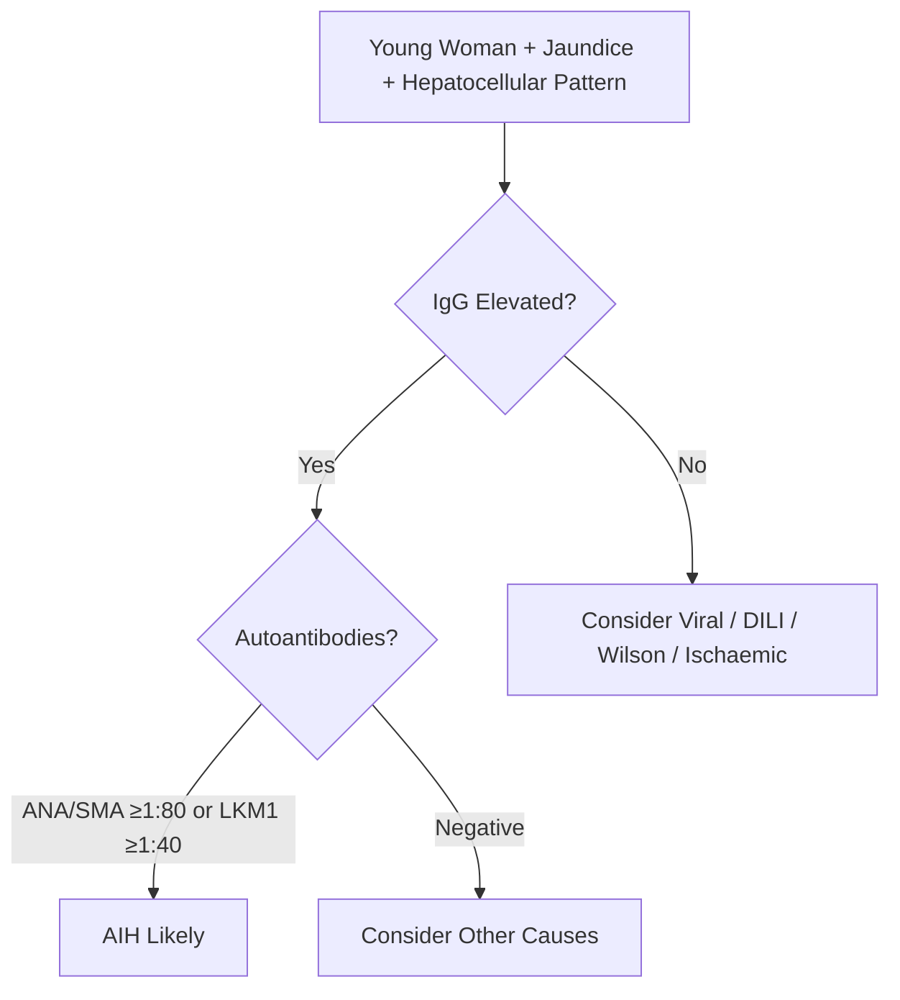
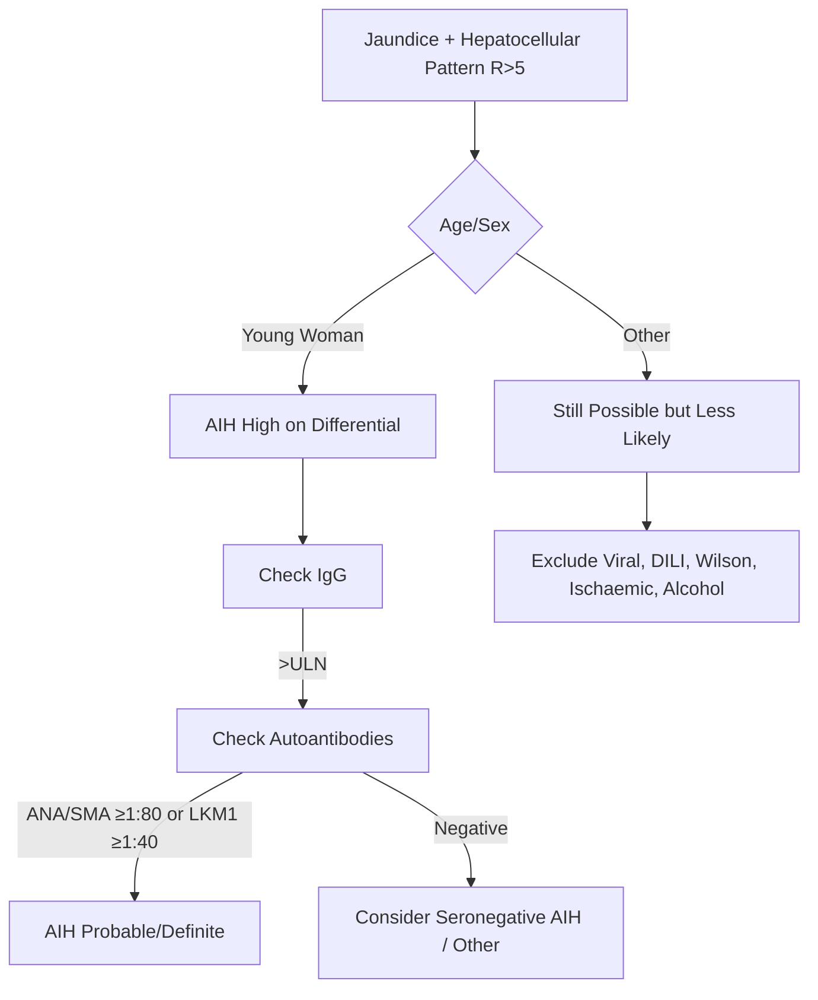
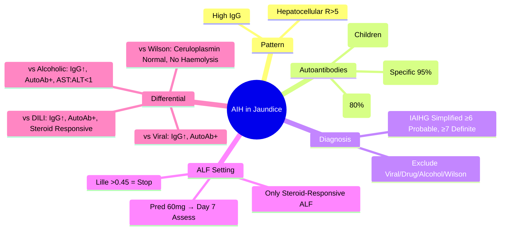

## 1. Learning Objectives
- [ ] Recognise AIH as cause of jaundice (hepatocellular pattern)
- [ ] Apply IAIHG simplified criteria in jaundice workup
- [ ] Differentiate AIH from viral, alcoholic, DILI, Wilson
- [ ] Identify Type 1 vs Type 2 vs Type 3 AIH
- [ ] Identify FCPS/MRCP high-yield diagnostic clues

---

## 2. AIH in Jaundice Context



> **FCPS/MRCP Pearl**: **Young woman + high IgG + autoantibodies = AIH until proven otherwise**

---

## 3. AIH Patterns in Jaundice Workup



---

## 4. Autoantibody Types & Patterns

| Type | Autoantibodies | Age/Sex | Severity | Steroid Response |
|------|----------------|---------|----------|------------------|
| **Type 1 (Classic)** | **ANA ≥1:40** and/or **SMA ≥1:40** | Adults (peak 20-40), F>M | Variable | Good |
| **Type 2** | **Anti-LKM1 ≥1:40** (ANA/SMA -) | Children/Young adults, F>M | **More severe** | Less favourable |
| **Type 3** | **Anti-SLA/LP ≥1:40** | Adults | Severe | Good |

> **Seronegative AIH**: No autoantibodies but meets other criteria (10-15%)

---

## 5. Diagnostic Criteria in Jaundice Setting

### IAIHG Simplified Criteria (Adapted for Jaundice Workup)

| Parameter | Points |
|-----------|--------|
| **ANA/SMA ≥1:80** | 2 |
| **ANA/SMA ≥1:40** | 1 |
| **Anti-LKM1 ≥1:40** | 2 |
| **IgG >ULN** | 1 |
| **IgG >1.1×ULN** | 2 |
| **Histology (if biopsy)** | Compatible 1 / Typical 2 |
| **Exclusion of viral hepatitis** | 2 |

| Score | Interpretation |
|-------|----------------|
| **≥7** | Definite AIH |
| **6** | Probable AIH |

> **In jaundice/ALF setting**: Biopsy often unavailable → rely on serology + IgG + exclusion

---

## 6. AIH in Acute Liver Failure

| Feature | AIH-ALF |
|---------|---------|
| **Demographics** | Women 15-50, 70% female |
| **IgG** | **Markedly elevated** (>2×ULN) |
| **Autoantibodies** | ANA/SMA ≥1:80 or LKM1 ≥1:40 |
| **Ceruloplasmin** | Normal/High |
| **Haemolysis** | Absent |
| **ALP** | Normal/Mild ↑ |
| **Steroid Trial** | **Prednisolone 60mg/day → Assess Day 7** |
| **Response Rate** | 60-80% if early |

> **Key**: AIH-ALF is **only potentially steroid-responsive ALF** — early recognition is life-saving

---

## 7. Differentiation: AIH vs Other Causes

```mermaid
flowchart TD
    A[Hepatocellular Jaundice + High IgG] --> B{Autoantibodies}
    B -->|ANA/SMA+| C[AIH Type 1]
    B -->|LKM1+| D[AIH Type 2]
    B -->|SLA/LP+| E[AIH Type 3]
    B -->|Negative| F[Seronegative AIH / DILI / Viral]
    C --> G[Exclude Viral Serology]
    G -->|Viral -| H[AIH Likely]
    G -->|Viral +| I[Viral Hepatitis]
    F --> J[Exclude DILI (RUCAM), Wilson, Ischaemic]
```

---

## 8. Key Differentiation Table

| Feature | **AIH** | **Viral Hepatitis** | **Alcoholic Hepatitis** | **DILI** | **Wilson ALF** |
|---------|---------|---------------------|-------------------------|----------|----------------|
| **Demographics** | Women 15-50 | Variable | Men, Heavy Alcohol | Any (Drug exposure) | <40 years |
| **IgG** | **↑↑** | Normal | Normal | Normal | Normal |
| **Autoantibodies** | **ANA/SMA/LKM+** | Negative | Negative | Variable | Negative |
| **Ceruloplasmin** | Normal/High | Normal | Normal | Normal | **Low** |
| **Haemolysis** | Absent | Absent | Absent | Absent | **Coombs-neg (+)** |
| **ALP** | Normal/Mild ↑ | Normal/Mild ↑ | Mild ↑ | Variable | **Very Low (ratio <2)** |
| **Steroid Trial** | **Indicated** | Contraindicated | Contraindicated | Contraindicated | Contraindicated |

---

## 9. FCPS/MRCP High-Yield Summary

| Concept | Key Points |
|---------|------------|
| **Demographics** | Women 15-50, peak 20-40 |
| **IgG** | **Markedly elevated** (>2×ULN common) |
| **Autoantibodies** | ANA/SMA ≥1:80 (Type 1), LKM1 ≥1:40 (Type 2) |
| **Type 1** | ANA/SMA (80% of AIH) |
| **Type 2** | LKM1 (children, more severe) |
| **Type 3** | SLA/LP (specific 95%) |
| **In ALF** | **Only steroid-responsive ALF** — Pred 60mg → Day 7 |
| **Exclusions** | Viral, Drug, Alcohol, Wilson, PBC (AMA+) |

---

## 10. Viva Questions

1. **What are the IAIHG simplified criteria for AIH?**
2. **Differentiate AIH Type 1, 2, and 3 by autoantibodies.**
3. **How do you diagnose AIH in a jaundiced patient?**
4. **Why is AIH-ALF the only steroid-responsive ALF?**
5. **What is the steroid regimen for AIH-ALF?**
6. **How do you differentiate AIH from DILI?**
7. **What is seronegative AIH?**
8. **Why is ceruloplasmin normal in AIH but low in Wilson?**
9. **Differentiate AIH from viral hepatitis in jaundiced patient.**
10. **What is anti-SLA/LP significance?**

---

## 11. Confusions & Mnemonics

| Confusion | Clarification |
|-----------|---------------|
| AIH vs DILI | AIH: IgG↑, AutoAbs+, Responds to steroids; DILI: Temporal drug relation, RUCAM, No IgG↑ |
| AIH vs Wilson | Wilson: Low ceruloplasmin, Coombs-neg haemolysis, Low ALP:Bil ratio, KF rings |
| Type 1 vs Type 2 | Type 1: ANA/SMA (adults); Type 2: LKM1 (children, severe) |
| Seronegative AIH | No autoantibodies but meets other criteria — 10-15% |
| AIH in ALF | **Only steroid-responsive ALF** — Pred 60mg, assess Day 7 |

---

## 12. Mind Map



---

## 13. One-Page Revision Card

| **AIH Jaundice** | **Key Features** |
|------------------|------------------|
| **Demographics** | Women 15-50 |
| **Pattern** | Hepatocellular (R>5) |
| **IgG** | >2×ULN |
| **AutoAbs** | ANA/SMA ≥1:80 or LKM1 ≥1:40 |
| **Type 1** | ANA/SMA+ (80%) |
| **Type 2** | LKM1+ (Children) |
| **Type 3** | SLA/LP+ (95% specific) |

| **IAIHG Simplified** | **Points** |
|----------------------|------------|
| ANA/SMA ≥1:80 | 2 |
| Anti-LKM1 ≥1:40 | 2 |
| IgG >1.1×ULN | 2 |
| Histology Typical | 2 |
| Viral Excluded | 2 |
| **≥7 Definite, 6 Probable** | |

| **AIH-ALF** | **Action** |
|-------------|------------|
| Prednisolone 60mg | Start immediately |
| Day 7 Lille | >0.45 = STOP |
| Response | 60-80% if early |

---

## 14. Spaced Repetition Tracker

| Day | 1 | 3 | 7 | 15 | 30 |
|-----|---|---|---|----|----|
| IAIHG criteria | ☐ | ☐ | ☐ | ☐ | ☐ |
| Type 1/2/3 AutoAbs | ☐ | ☐ | ☐ | ☐ | ☐ |
| AIH-ALF steroid trial | ☐ | ☐ | ☐ | ☐ | ☐ |
| AIH vs Wilson | ☐ | ☐ | ☐ | ☐ | ☐ |
| AIH vs DILI | ☐ | ☐ | ☐ | ☐ | ☐ |

---

## 15. Self-Test Scorecard

| Question | My Answer | Correct? |
|----------|-----------|----------|
| AIH simplified criteria |  |  |
| Type 1 vs 2 vs 3 |  |  |
| AIH-ALF steroid dose/day 7 |  |  |
| AIH vs Wilson differentiation |  |  |
| Seronegative AIH |  |  |

---

## 16. Local Navigation

- [[Autoimmune Liver Disease/Autoimmune hepatitis (AIH)|AIH Overview]]
- [[Autoimmune Liver Disease/AIH diagnostic criteria (IAIHG simplified)|AIH Criteria]]
- [[Acute Liver Failure/Autoimmune hepatitis presenting as ALF|AIH-ALF]]
- [[Jaundice and LFT Interpretation/Hepatocellular vs Cholestatic Pattern|Hepatocellular vs Cholestatic]]
- [[Acute Liver Failure/Wilson disease presenting as ALF|Wilson ALF]]