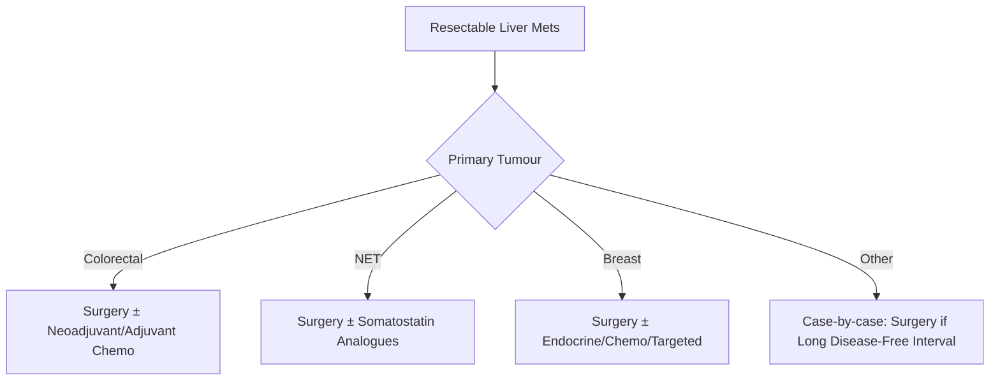

# Metastatic Liver Disease

## Learning Objectives
- [ ] Identify common primary cancers metastasizing to liver
- [ ] Apply diagnostic algorithms for suspected liver metastases
- [ ] Differentiate hepatic metastases from primary liver tumours
- [ ] Apply management algorithms based on primary tumour type
- [ ] Identify FCPS/MRCP high-yield points

---

## Epidemiology & Common Primaries

```mermaid
flowchart TD
    A[Liver Metastases] --> B[Most Common Primaries]
    B --> B1[Colorectal Cancer (50-70%)]
    B --> B2[Breast Cancer (15-20%)]
    B --> B3[Pancreatic Cancer (10-15%)]
    B --> B4[Lung Cancer (5-10%)]
    B --> B5[Neuroendocrine Tumours (5%)]
    B --> B6[Gastric, Ovarian, Melanoma, Renal]
```

| Primary Cancer | Frequency of Liver Mets | Typical Timing |
|----------------|------------------------|----------------|
| **Colorectal** | **50-70%** | Synchronous (20-25%) or Metachronous |
| **Breast** | 15-20% | Often late, multiple |
| **Pancreatic** | 10-15% | Often synchronous |
| **Lung** | 5-10% | Often multiple, late |
| **Neuroendocrine (NET)** | 5-10% | Often hypervascular, multiple |
| **Gastric/Ovarian/Melanoma/Renal** | <5% each | Variable |

> **FCPS/MRCP**: **Colorectal cancer = most common cause** of liver metastases in Western countries

---

## Clinical Presentation

| Feature | Detail |
|--------|--------|
| **Symptoms** | Often asymptomatic (incidental); RUQ pain, weight loss, hepatomegaly |
| **Signs** | Hepatomegaly, firm irregular liver, ascites (late), jaundice (late) |
| **Biochemical** | ↑ ALP/GGT (often disproportionate to AST/ALT); ↑ CEA (colorectal); ↑ CA19-9 (pancreatic/biliary); ↑ AFP (if HCC suspected) |

---

## Diagnostic Workup

```mermaid
flowchart TD
    A[Suspected Liver Mets] --> B[Imaging: CT Chest/Abd/Pelvis + MRI Liver]
    B --> C{Lesion Characterisation}
    C -->|Typical Mets| D[Biopsy Primary Tumour]
    C -->|Indeterminate| E[Liver Biopsy (if Primary Unknown)]
    C -->|Solitarity Lesion| F[Rule Out HCC (AFP, MRI)]
    D --> G[MDT Discussion]
    E --> G
    F --> G
```

### Imaging Characteristics

| Modality | Typical Appearance | Sensitivity |
|----------|-------------------|-------------|
| **US** | Hypoechoic/hyperechoic, "target" or "halo" sign | 70-80% (size/body habitus dependent) |
| **CT (Triphasic)** | **Rim enhancement** in arterial phase, washout in portal venous | 85-95% |
| **MRI (Liver-specific)** | **Eovist/Primovist**: hypointense on hepatobiliary phase | **>95%** (Gold Standard) |
| **PET-CT** | High metabolic activity (FDG-avid) | Staging, extrahepatic disease |

> **Key MRI Feature**: **Loss of hepatobiliary phase uptake** = Metastasis (vs HCC retains some uptake)

---

## Common Primary Tumours: Specific Features

### Colorectal Cancer Liver Mets (CRLM)
| Feature | Detail |
|---------|--------|
| **Appearance** | Hypovascular, rim-enhancing on CT |
| **Tumour Marker** | **CEA** (monitoring) |
| **Genetics** | KRAS, NRAS, BRAF mutation status (guides therapy) |
| **Resectability** | Based on FLR, number, location, extrahepatic disease |

### Neuroendocrine Tumours (NET)
| Feature | Detail |
|---------|--------|
| **Vascularity** | **Hypervascular** (intense arterial enhancement) |
| **Markers** | Chromogranin A, Synaptophysin, Ki-67 index |
| **Somatostatin Receptor** | **SSTR+** → Octreotide scan / Ga-68 DOTATATE PET |
| **Treatment** | Somatostatin analogues, PRRT, surgery if resectable |

### Breast Cancer
| Feature | Detail |
|---------|--------|
| **Pattern** | Often multiple, subcapsular |
| **Subtype** | ER/PR/HER2 status guides systemic therapy |
| **Bone Mets** | Often concurrent with liver mets |

---

## Management Algorithms

### Resectable Disease


### Unresectable / Borderline Resectable
| Strategy | Indication |
|----------|------------|
| **Conversion Therapy** | Systemic chemo → downsize → resection (CRLM) |
| **Portal Vein Embolization (PVE)** | FLR <20% (healthy) / <30% (cirrhosis) |
| **ALPPS** (Associating Liver Partition & Portal Vein Ligation) | Very small FLR, rapid hypertrophy needed |
| **Ablation (RFA/MWA)** | <3cm lesions, <3 lesions, unresectable location |
| **TARE (SIRT/Y-90)** | Unresectable, liver-dominant disease |
| **Systemic Therapy** | Primary if unresectable, not candidate for local therapy |

---

## Prognosis & Survival

| Scenario | Median Survival | 5-Year Survival |
|----------|----------------|-----------------|
| **CRLM - Resected** | 40-60 months | **40-50%** |
| **CRLM - Unresectable (Chemo)** | 20-30 months | 10-20% |
| **NET Liver Mets - Resected** | 100+ months | 60-80% |
| **NET Liver Mets - Unresected** | 40-60 months | 30-40% |
| **Breast - Liver Mets** | 24-48 months | Variable by subtype |
| **Pancreatic - Liver Mets** | 6-12 months | <5% |

> **Key**: **Complete R0 Resection** = Only chance for cure in CRLM; NETs have better prognosis

---

## Differentiation: Metastases vs HCC vs Benign

| Feature | Metastases | HCC | Benign (Haemangioma/FNH) |
|---------|-----------|-----|--------------------------|
| **Number** | Usually Multiple | Single/Multiple | Usually Single |
| **Enhancement** | Rim (arterial) → washout | Arterial hyperenhancement + washout | Haemangioma: peripheral nodular fill-in; FNH: central scar |
| **Hepatobiliary Phase (MRI)** | **Hypointense** (no hepatocytes) | **Hyper/Isointense** | **Hyperintense** (Haemangioma/FNH) |
| **Tumour Marker** | CEA, CA19-9, CA125 | **AFP ↑** | Normal |
| **Background Liver** | Normal / Cirrhosis | **Cirrhosis (80%)** | Normal |

---

## FCPS/MRCP High-Yield Summary

| Concept | Key Points |
|---------|------------|
| **Commonest Primary** | **Colorectal (50-70%)** |
| **Imaging Gold Standard** | **MRI with hepatobiliary contrast (Eovist/Primovist)** |
| **Key MRI Feature** | **Hypointense on hepatobiliary phase** = Metastasis |
| **Colorectal Mets** | CEA marker; KRAS/NRAS/BRAF for therapy; Liver Mets = Stage IV |
| **NET Mets** | Hypervascular; SSTR+ → Octreoscan/DOTATATE; Ki-67 grading |
| **Resectable CRLM** | Surgery ± chemo = Only curative chance (40-50% 5-yr OS) |
| **Unresectable CRLM** | Conversion chemo → surgery; TARE; Ablation; Systemic therapy |
| **NET Management** | Somatostatin analogues, PRRT, Surgery if low grade |
| **HCC vs Mets** | **HCC: AFP↑, arterial enhancement, HB phase retention**; **Mets: CEA/CA19-9, rim enhancement, HB phase loss** |

---

## Viva Questions

1. **What is the most common primary cancer causing liver metastases?**
2. **How do you differentiate liver metastases from HCC on MRI?**
3. **What is the management algorithm for resectable vs unresectable CRLM?**
3. **What is the role of conversion chemotherapy in CRLM?**
4. **How do neuroendocrine tumour liver metastases differ on imaging?**
5. **What is the role of portal vein embolization (PVE)?**
5. **What is ALPPS? When is it used?**
6. **What tumour markers are used for different primaries?**
6. **How do you differentiate haemangioma from metastasis on MRI?**
7. **What is the survival after resection of CRLM?**
8. **What is the role of TARE (SIRT) in liver metastases?**

---

## Confusions & Mnemonics

| Confusion | Clarification |
|-----------|---------------|
| Metastasis vs HCC on MRI | **Metastasis: HB phase hypointense**; **HCC: HB phase hyper/iso** |
| Haemangioma vs Mets | Haemangioma: **Peripheral nodular fill-in**, HB phase **hyperintense** |
| FNH vs Mets | FNH: **Central scar**, HB phase **hyperintense**, homogeneous arterial |
| CRLM vs HCC | CRLM: CEA↑, AFP normal; HCC: **AFP↑**, CEA normal |
| NET vs HCC | NET: **Hypervascular**, Ki-67, SSTR+; HCC: AFP↑, cirrhotic background |
| PVE vs ALPPS | PVE: Standard (4-6w hypertrophy); ALPPS: Rapid (1-2w), higher morbidity |
| TARE vs TACE | TARE: Radioembolization (Y-90), for larger/multifocal; TACE: Chemoembolization |

---

## Mind Map

```mermaid
mindmap
  root((Liver Metastases))
    Common Primaries
      Colorectal (50-70%)
      Breast (15-20%)
      Pancreatic (10-15%)
      Lung (5-10%)
      NET (5-10%)
    Imaging
      CT: Rim enhancement, washout
      MRI (HB contrast): HB phase HYPOINTENSE = Mets
      PET-CT: FDG avidity
    By Primary
      CRC: CEA, KRAS/NRAS/BRAF, Conversion chemo
      NET: Hypervascular, Ki-67, SSTR, PRRT
      Breast: ER/PR/HER2, Multiple, Subcapsular
      Pancreatic: CA19-9, Usually unresectable
    Management
      Resectable: Surgery ± Chemo
      Borderline: PVE / ALPPS / Conversion
      Unresectable: Chemo, TARE, Ablation, Systemic
    Differential
      vs HCC: HB phase loss, AFP vs CEA
      vs Haemangioma: HB hyperintense, fill-in
      vs FNH: Central scar, HB hyper
```

---

## One-Page Revision Card

| **Primary** | **Imaging** | **Markers** | **Key Management** |
|-------------|-------------|-------------|-------------------|
| **Colorectal** | Rim-enhancing, washout | **CEA**, KRAS/NRAS/BRAF | **Resection ± Chemo** (Curative) |
| **Neuroendocrine** | **Hypervascular**, HB phase loss | CgA, Ki-67, **SSTR+** | Somatostatin, PRRT, Surgery |
| **Breast** | Multiple, subcapsular | ER/PR/HER2 | Systemic ± Surgery |
| **Pancreatic** | Hypovascular | CA19-9 | Usually Unresectable |
| **NET** | **Hypervascular**, Ki-67 | CgA, Synaptophysin | PRRT, SSA |

| **Imaging Gold Standard** | **MRI with hepatobiliary contrast (Eovist/Primovist)** |
|---------------------------|--------------------------------------------------------|
| **Key MRI Sign** | **Hypointense on Hepatobiliary Phase** = Metastasis |
| **Haemangioma** | Peripheral fill-in, **HB phase HYPERINTENSE** |
| **FNH** | Central scar, HB phase **HYPERINTENSE** |

| **CRLM Resectability** | |
|------------------------|--|
| **Resectable** | FLR >20% (healthy), >30-40% (cirrhosis) |
| **Borderline** | PVE → Hypertrophy → Re-assess |
| **Unresectable** | Conversion chemo, TARE, Ablation, Systemic |

| **Survival** | **Median** |
|-------------|------------|
| Resected CRLM | 40-60 months (5-yr OS 40-50%) |
| Unresected CRLM | 20-30 months |
| Resected NET | 100+ months (5-yr 60-80%) |

---

## Spaced Repetition Tracker

| Day | 1 | 3 | 7 | 15 | 30 |
|-----|---|---|---|----|----|
| Commonest Primary | ☐ | ☐ | ☐ | ☐ | ☐ |
| MRI HB Phase Sign | ☐ | ☐ | ☐ | ☐ | ☐ |
| CRLM Management | ☐ | ☐ | ☐ | ☐ | ☐ |
| NET vs HCC | ☐ | ☐ | ☐ | ☐ | ☐ |
| Resectability Criteria | ☐ | ☐ | ☐ | ☐ | ☐ |

---

## Self-Test Scorecard

| Question | My Answer | Correct? |
|----------|-----------|----------|
| Most common primary |  |  |
| MRI HB phase sign |  |  |
| CRLM resectable criteria |  |  |
| NET imaging features |  |  |
| Haemangioma vs Mets MRI |  |  |

---

## Local Navigation

- [[Liver Tumours/HCC (Hepatocellular Carcinoma)|HCC]]
- [[Liver Tumours/Benign liver tumours|Benign Liver Tumours]]
- [[Liver Transplantation/Liver Transplantation|Liver Transplant]]
- [[Gastrointestinal Cancers|GI Cancers]]