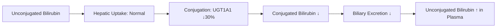

> [!tip] **FCPS/MRCP Priority: HIGH**
> **Gilbert Syndrome = Most common inherited cause of unconjugated hyperbilirubinaemia** — **UGT1A1*28 promoter polymorphism** → reduced bilirubin conjugation, **benign**, precipitated by fasting/stress/illness, **no treatment needed**, distinguish from Crigler-Najjar types.

---

## 1. Learning Objectives
By the end of this note you should be able to:
- [ ] Describe **genetics and pathophysiology** of Gilbert syndrome
- [ ] Recognise **clinical features** and **precipitating factors**
- [ ] Interpret **LFT pattern** (isolated unconjugated hyperbilirubinaemia)
- [ ] Distinguish from **Crigler-Najjar Type I/II**, **Dubin-Johnson**, **Rotor**
- [ ] Counsel patients on **benign nature** and **no treatment needed**

---

## 1. Definition & Epidemiology

| Feature | Detail |
|---------|--------|
| **Definition** | **Benign unconjugated hyperbilirubinaemia** due to reduced UDP-glucuronosyltransferase (UGT1A1) activity |
| **Inheritance** | **Autosomal recessive** (but heterozygotes may have mild elevation) — **UGT1A1*28** promoter polymorphism (TA repeat expansion) |
| **Prevalence** | **5-10%** of population (higher in males, usually diagnosed 2nd-3rd decade) |
| **Sex Ratio** | M > F (2:1) |
| **Bilirubin Levels** | Typically **<80 µmol/L** (usually 20-50 µmol/L), **fluctuates** |

---

## 2. Genetics & Pathophysiology

| Gene | Mutation | Effect |
|------|----------|--------|
| **UGT1A1** | **Promoter TA repeat (TA)₇ instead of (TA)₆** → **UGT1A1*28 allele** | **Reduced transcription** → ~30% normal enzyme activity |

> **Mechanism**: Reduced bilirubin **conjugation** → impaired excretion → **unconjugated hyperbilirubinaemia**
> **Penetrance**: Incomplete — homozygotes (TA)₇/(TA)₇ have phenotype; heterozygotes may have mild elevation

### Bilirubin Metabolism in Gilbert Syndrome


---

## 3. Clinical Features

| Feature | Detail |
|---------|--------|
| **Asymptomatic** | Most cases — **incidental finding** on routine LFTs |
| **Jaundice** | **Mild, intermittent** — scleral icterus only, worse with stress |
| **Precipitating Factors** | **Fasting (48-72h)**, **Stress**, **Illness**, **Surgery**, **Alcohol**, **Menstruation** |
| **No Pruritus** | **Unconjugated bilirubin** not excreted in bile → no bile salts in skin |
| **No Hepatosplenomegaly** | No liver disease |
| **Normal LFTs Otherwise** | ALT, AST, ALP, GGT, Albumin, PT **all normal** |

---

## 4. Diagnosis

### Diagnostic Criteria
| Criterion | Finding |
|-----------|---------|
| **Bilirubin** | **Unconjugated hyperbilirubinaemia** (indirect >80% of total) |
| **Bilirubin Level** | Usually <80 µmol/L (rarely >100 µmol/L) |
| **Other LFTs** | **ALT, AST, ALP, GGT, Albumin, PT — All Normal** |
| **Haemolysis Screen** | Normal Hb, Reticulocytes, LDH, Haptoglobin — **exclude haemolysis** |
| **Genetic Testing** | **UGT1A1*28 homozygosity** (TA)₇/(TA)₇ — confirmatory if needed |

### Exclusion Criteria (Rule Out)
| Condition | Key Distinction |
|-----------|-----------------|
| **Haemolysis** | ↑ LDH, ↓ Haptoglobin, ↑ Reticulocytes, ↑ urobilinogen |
| **Crigler-Najjar Type I** | Bilirubin >300 µmol/L, **no enzyme activity**, kernicterus risk |
| **Crigler-Najjar Type II** | Bilirubin 100-300 µmol/L, **phenobarbital responsive** |
| **Dubin-Johnson/Rotor** | **Conjugated** hyperbilirubinaemia |

---

## 5. Management

| Aspect | Recommendation |
|--------|----------------|
| **Treatment** | **None required** — **benign condition**, normal life expectancy |
| **Counselling** | **Reassurance** — benign, no liver damage, no treatment needed |
| **Precautions** | Avoid prolonged fasting, maintain hydration, inform anaesthetists |
| **Drugs** | **No drug restrictions** (unlike Crigler-Najjar); paracetamol safe at normal doses |
| **Monitoring** | **None required** — no follow-up LFTs needed if asymptomatic |

---

## 6. FCPS/MRCP High-Yield Summary

| Topic | Key Points |
|-------|------------|
| **Inheritance** | **Autosomal recessive** — UGT1A1*28 (TA)₇ promoter polymorphism |
| **Bilirubin** | **Unconjugated**, usually <80 µmol/L, **fluctuates** |
| **Precipitants** | **Fasting, stress, illness, alcohol, menstruation** |
| **LFTs** | **Isolated unconjugated hyperbilirubinaemia** — all else normal |
| **No Haemolysis** | Normal Hb, retics, LDH, haptoglobin |
| **Genetics** | **UGT1A1*28** (TA)₇/(TA)₇ homozygosity |
| **Treatment** | **None** — benign, reassure patient |
| **Prognosis** | **Normal life expectancy**, no liver disease |

---

## 7. Viva Questions (MRCP PACES / FCPS)

| Question | Expected Answer |
|----------|-----------------|
| **Gilbert Syndrome — Inheritance, Gene, Bilirubin Type?** | **Autosomal recessive**, **UGT1A1*28** promoter polymorphism, **unconjugated hyperbilirubinaemia** (<80 µmol/L). |
| **Gilbert vs Crigler-Najjar — Key Differences?** | **Gilbert**: Benign, bilirubin <80, UGT1A1 30%, no treatment; **CN-I**: 0% enzyme, fatal, phototherapy/transplant; **CN-II**: 10% enzyme, phenobarbital responsive. |
| **Gilbert — Precipitating Factors?** | **Fasting (48-72h), stress, illness, alcohol, menstruation, surgery**. |
| **Gilbert — LFT Pattern?** | **Isolated unconjugated hyperbilirubinaemia** (indirect >80%), all other LFTs normal. |
| **Gilbert — Treatment?** | **None** — benign, reassure patient, avoid fasting. |
| **Gilbert vs Haemolysis — How to Distinguish?** | **Gilbert**: Normal Hb, retics, LDH, haptoglobin; **Haemolysis**: ↓Hb, ↑retics, ↑LDH, ↓haptoglobin, ↑urobilinogen. |
| **UGT1A1*28 Polymorphism — What Is It?** | **TA repeat expansion** in promoter (TA)₇ instead of (TA)₆ → reduced transcription → 30% enzyme activity. |

---

## 8. Confusions & Mnemonics

| Confusion | Clarification |
|-----------|---------------|
| **Gilbert vs Crigler-Najjar II** | **Gilbert**: UGT1A1 30%, benign, no phenobarbital response; **CN-II**: 10% UGT, phenobarbital responsive |
| **Gilbert vs Dubin-Johnson/Rotor** | **Gilbert**: Unconjugated bilirubin; **Dub-John/Rotor**: Conjugated bilirubin |
| **Gilbert vs Haemolysis** | **Gilbert**: Normal Hb/retics/LDH/haptoglobin; **Haemolysis**: Abnormal all |
| **Gilbert — Drug Restrictions** | **None** (unlike CN-I/II); paracetamol safe at normal doses |

**Mnemonic: GILBERT-BENIGN**
- **G**enetics: **UGT1A1*28 (TA)₇ promoter polymorphism, AR**
- **I**solated: **Unconjugated bilirubin only**
- **L**ow Bilirubin: **<80 µmol/L, fluctuates**
- **B**enign: **No treatment, normal life expectancy**
- **E**xacerbating: **Fasting, Stress, Illness, Alcohol, Menstruation**
- **R**eassurance: **No treatment needed, normal lifespan**
- **T**reatment: **None — just reassurance**

---

## 9. Mind Map

```mermaid
mindmap
  root((Gilbert Syndrome))
    Genetics
      UGT1A1*28 (TA)7/TA)7
      AR inheritance
      30% enzyme activity
    Clinical
      Asymptomatic or mild jaundice
      Precipitants: Fasting, Stress, Illness
      No pruritus, no hepatosplenomegaly
    Labs
      Unconjugated bilirubin <80
      All other LFTs normal
      No haemolysis
    Diagnosis
      Exclude haemolysis
      UGT1A1*28 testing if needed
    Management
      No treatment
      Reassurance
      Avoid fasting
```

---

## 10. One-Page Revision Card

| Domain | Key Points |
|--------|------------|
| **Gene** | UGTA1A*28 (TA)₇ promoter polymorphism, AR |
| **Bilirubin** | Unconjugated, <80 µmol/L, fluctuates |
| **Precipitants** | Fasting, stress, illness, alcohol, menstruation |
| **LFTs** | Isolated unconjugated hyperbilirubinaemia; all else normal |
| **Haemolysis** | Excluded (normal Hb, retics, LDH, haptoglobin) |
| **Genetics** | UGT1A1*28 homozygosity (TA)₇/(TA)₇ |
| **Treatment** | **None** — benign, reassure |
| **Prognosis** | Normal life expectancy, no liver disease |

---

## 11. Spaced Repetition Trackers

| Review Interval | Date Completed | Confidence (1-5) | Notes |
|-----------------|----------------|------------------|-------|
| 24 hours | | | |
| 7 days | | | |
| 15 days | | | |
| 30 days | | | |
| 90 days | | | |

---

## 12. Self-Test Scorecard

| Section | Score /5 | Last Attempt |
|---------|----------|--------------|
| Genetics & Pathophysiology | | |
| Clinical Features & Precipitants | | |
| LFT Pattern & Diagnosis | | |
| Differential (CN-I/II, Haemolysis) | | |
| Management & Counselling | | |
| Viva Questions | | |

---

## 2. Local Navigation
- **Parent Heading**: [[../Hepatology|Hepatology]]
- **Chapter Map**: [[../Davidson Chapter 24 - Hepatology Hierarchy|Hepatology Hierarchy]]
- **Chapter MOC**: [[../Hepatology MOC|Hepatology MOC]]
- **Drug Reference**: [[../../Clinical Therapeutics and Good Prescribing|Drugs]]
- **Related**: [[Crigler-Najjar Syndrome]], [[Dubin-Johnson Syndrome]], [[Rotor Syndrome]], [[Inherited and Metabolic Liver Disease]], [[Jaundice and LFT Interpretation]]