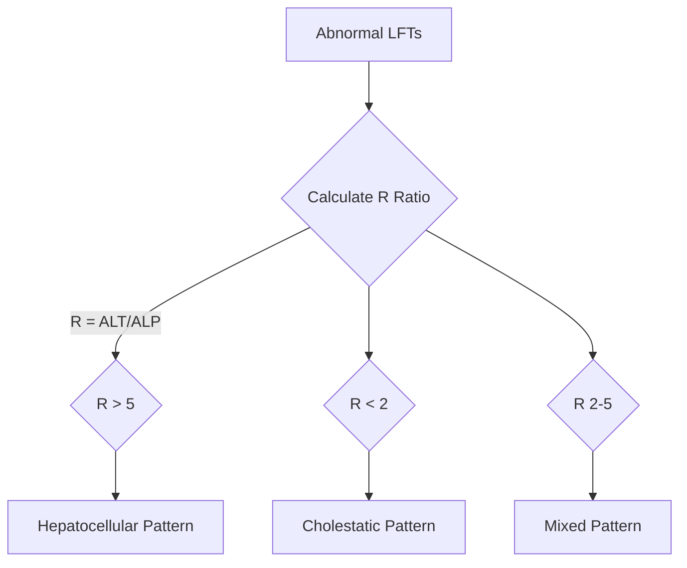
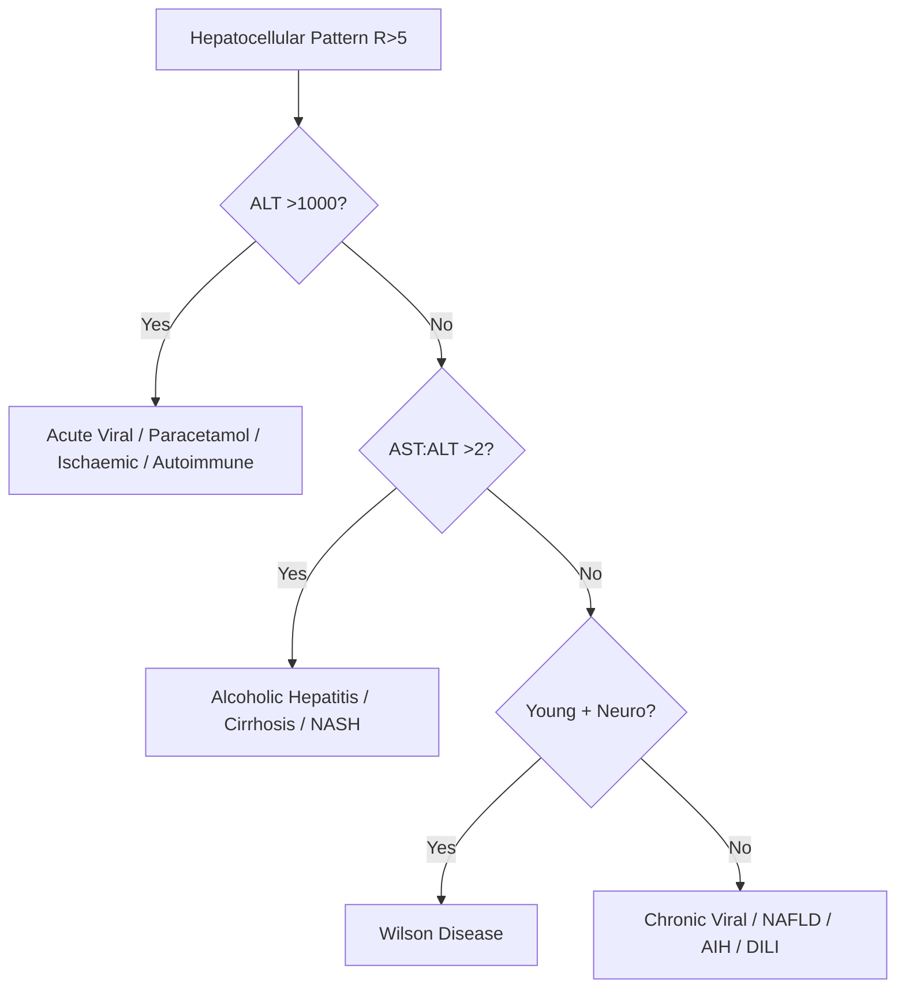
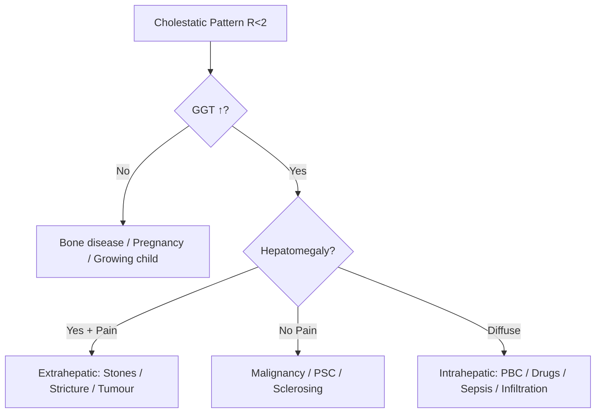
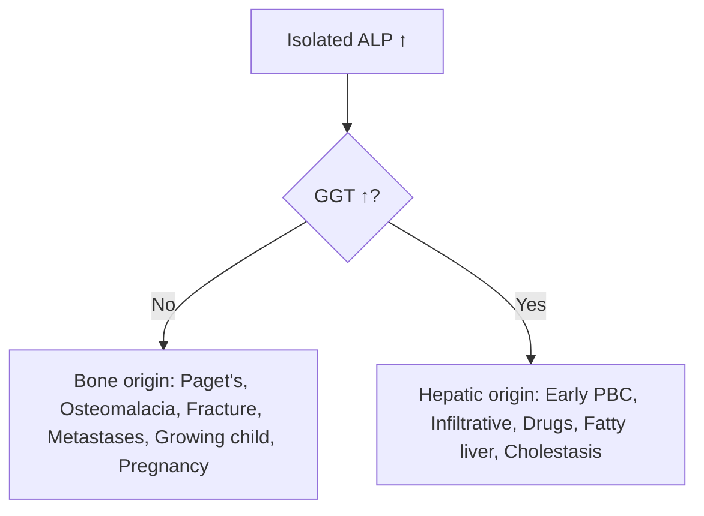
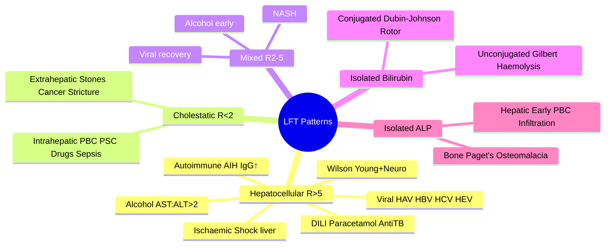

## 1. Learning Objectives
- [ ] Define hepatocellular vs cholestatic vs mixed LFT patterns
- [ ] Apply R ratio (ALT/ALP) for classification
- [ ] Interpret isolated hyperbilirubinaemia and isolated ALP elevation
- [ ] Recognize diagnostic clues for each pattern
- [ ] Know FCPS/MRCP high-yield associations

---

## 2. Definition & Classification (R Ratio)

**R Ratio Formula**: `R = (ALT / ULN_ALT) ÷ (ALP / ULN_ALP)`
- **R > 5**: Hepatocellular (ALT dominant)
- **R < 2**: Cholestatic (ALP dominant)  
- **R 2–5**: Mixed

> **FCPS/MRCP Pearl**: Always use ULN-corrected ratio, NOT raw ALT/ALP. ULN: ALT ~40, ALP ~120

---

## 3. Hepatocellular Pattern (R > 5)

| Feature | Typical Findings |
|---------|------------------|
| **ALT/AST** | ↑↑↑ (often 10–100× ULN) |
| **ALP** | Normal or mildly ↑ (<3× ULN) |
| **Bilirubin** | Variable |
| **GGT** | Normal or mildly ↑ |

### Major Causes

| Category | Key Examples | FCPS/MRCP Clues |
|----------|--------------|-----------------|
| **Viral Hepatitis** | HAV, HBV, HCV, HEV | Acute: ALT >1000; Chronic: ALT 2-5× ULN |
| **Drug-Induced (DILI)** | Paracetamol, anti-TB, antibiotics | Paracetamol: ALT >5000; Others: variable |
| **Alcoholic Hepatitis** | AST:ALT >2:1, usually <300 | AST rarely >300; GGT ↑↑ |
| **Autoimmune Hepatitis** | ALT/AST ↑↑, IgG ↑, autoantibodies | Young women; ANA/SMA/LKM-1 + |
| **Ischaemic Hepatitis** | Shock liver; ALT/AST >1000 | Post-hypotension; rapid fall |
| **Wilson Disease** | Young, neuro/psych, low ceruloplasmin | Coombs-negative haemolysis + ALF |

### Diagnostic Algorithm

---

## 4. Cholestatic Pattern (R < 2)

| Feature | Typical Findings |
|---------|------------------|
| **ALP** | ↑↑ (>3× ULN) |
| **ALT/AST** | Normal or mildly ↑ (<5× ULN) |
| **GGT** | ↑↑ (confirms hepatic origin) |
| **Bilirubin** | ↑↑ (conjugated) |

### Intrahepatic vs Extrahepatic

### Major Causes

| Category | Examples | Key Features |
|----------|----------|--------------|
| **Extrahepatic Obstruction** | Choledocholithiasis, Pancreatic Ca, Cholangiocarcinoma | Pain (stones), Painless (malignancy), Dilated ducts on US |
| **Primary Biliary Cholangitis** | Middle-aged women, AMA+, ALP ↑↑ | Pruritus, fatigue, osteopenia |
| **Primary Sclerosing Cholangitis** | Young men, IBD, beading on MRCP | Dominant strictures, cholangiocarcinoma risk |
| **Drug-Induced** | Amoxicillin-clavulanate, Flucloxacillin, OCP | Latency 1-4 weeks; resolves on withdrawal |
| **Infiltrative** | Sarcoidosis, TB, Amyloid, Lymphoma | Hepatosplenomegaly, systemic symptoms |
| **Sepsis/Cholangitis** | Fever, RUQ pain, Charcot's triad | Urgent ERCP if obstructed |

---

## 5. Mixed Pattern (R 2–5)

| Typical Causes | Notes |
|----------------|-------|
| **Alcoholic hepatitis** | Often mixed early |
| **Viral hepatitis (recovery)** | Transitioning pattern |
| **Drug-induced (mixed)** | Many antibiotics |
| **Early obstruction** | Before pure cholestatic |
| **NASH with fibrosis** | Overlap features |

---

## 6. Isolated Hyperbilirubinaemia

| Type | Pattern | Causes |
|------|---------|--------|
| **Unconjugated** | ↑ Indirect bilirubin, normal ALT/ALP | Gilbert (benign), Haemolysis, Crigler-Najjar |
| **Conjugated** | ↑ Direct bilirubin, normal ALT/ALP | Dubin-Johnson, Rotor, Early obstruction |

**Gilbert Syndrome**: 
- Benign, 5-10% population
- Unconjugated bilirubin <80 μmol/L (rises with fasting/stress)
- **No treatment needed** — key MRCP distinction

---

## 7. Isolated ALP Elevation

---

## 8. FCPS/MRCP High-Yield Summary Table

| Scenario | Most Likely Pattern | Key Discriminator |
|----------|---------------------|-------------------|
| Young woman, fatigue, pruritus, ALP ↑↑ | Cholestatic (PBC) | AMA +ve, IgM ↑ |
| Young man, IBD, ALP ↑↑ | Cholestatic (PSC) | MRCP beading, p-ANCA +ve |
| Paracetamol OD, ALT 5000 | Hepatocellular | NAC urgent |
| Alcoholic, AST:ALT 2:1, <300 | Hepatocellular | Maddrey DF >32 → steroids |
| Painless jaundice, ALP ↑↑, US: dilated ducts | Extrahepatic obstruction | Pancreatic Ca vs Cholangiocarcinoma |
| Shock + ALT/AST >2000 | Hepatocellular (Ischaemic) | Rapid normalization |
| Neonatal cholestasis | Cholestatic | Biliary atresia (surgical emergency) |

---

## 9. Viva Questions

1. **Define R ratio and classify LFT patterns.**
2. **How do you distinguish intrahepatic from extrahepatic cholestasis?**
3. **What is the significance of AST:ALT >2?**
4. **List 5 causes of isolated unconjugated hyperbilirubinaemia.**
5. **How do you confirm ALP is of hepatic origin?**
6. **Differentiate PBC vs PSC.**
7. **What is the LFT pattern in Gilbert syndrome?**
8. **Name 3 drugs causing cholestatic DILI.**
9. **How does ischaemic hepatitis LFT pattern evolve?**
10. **What is the R ratio in alcoholic hepatitis?**

---

## 10. Confusions & Mnemonics

| Confusion | Clarification | Mnemonic |
|-----------|---------------|----------|
| AST:ALT in alcoholic vs viral | Alcoholic >2 (AST>ALT); Viral <1 (ALT>AST) | **"ALcohol = AST > ALT"** |
| PBC vs PSC | PBC: female, AMA+, intrahepatic; PSC: male, IBD, MRCP beading | **"PBC = Primarily Biliary Cholangitis (AMA)"** |
| Gilbert vs Crigler-Najjar | Gilbert benign, intermittent; CN fatal, kernicterus | **"Gilbert = Gentle"** |
| Dubin-Johnson vs Rotor | DJ: black liver, conjugated; Rotor: normal liver, conjugated | **"Dubin = Dark liver"** |

---

## 11. Mind Map

---

## 12. One-Page Revision Card

| **Pattern** | **R Ratio** | **ALT/AST** | **ALP** | **Top Causes** |
|-------------|-------------|-------------|---------|----------------|
| Hepatocellular | >5 | ↑↑↑ (10-100×) | Normal/mild | Viral, DILI, Alcohol, AIH, Ischaemic |
| Cholestatic | <2 | Normal/mild | ↑↑ (>3×) | Obstruction, PBC, PSC, Drugs, Infiltration |
| Mixed | 2-5 | ↑↑ | ↑↑ | Alcoholic hepatitis, NASH, early obstruction |
| Isolated unconj. bilirubin | - | Normal | Normal | Gilbert, Haemolysis |
| Isolated ALP (GGT normal) | - | Normal | ↑ | Bone disease, Pregnancy |

---

## 13. Spaced Repetition Tracker

| Day | 1 | 3 | 7 | 15 | 30 |
|-----|---|---|---|----|----|
| R ratio classification | ☐ | ☐ | ☐ | ☐ | ☐ |
| Intra vs extrahepatic cholestasis | ☐ | ☐ | ☐ | ☐ | ☐ |
| PBC vs PSC | ☐ | ☐ | ☐ | ☐ | ☐ |
| Isolated bilirubin causes | ☐ | ☐ | ☐ | ☐ | ☐ |

---

## 14. Self-Test Scorecard

| Question | My Answer | Correct? |
|----------|-----------|----------|
| R ratio formula |  |  |
| 5 hepatocellular causes |  |  |
| PBC vs PSC table |  |  |
| Gilbert vs Crigler-Najjar |  |  |
| Isolated ALP differential |  |  |

---

## 15. Local Navigation

- [[Jaundice and LFT Interpretation/Detailed|Jaundice & LFT Detailed]]
- [[Drug-Induced Liver Injury|DILI]]
- [[Autoimmune Liver Disease/PBC|PBC]]
- [[Autoimmune Liver Disease/PSC|PSC]]
- [[Biliary Tract Disease/Choledocholithiasis|Choledocholithiasis]]
- [[Inherited and Metabolic Liver Disease/Gilbert Syndrome|Gilbert Syndrome]]
- [[Inherited and Metabolic Liver Disease/Dubin-Johnson vs Rotor Syndrome|Dubin-Johnson vs Rotor]]