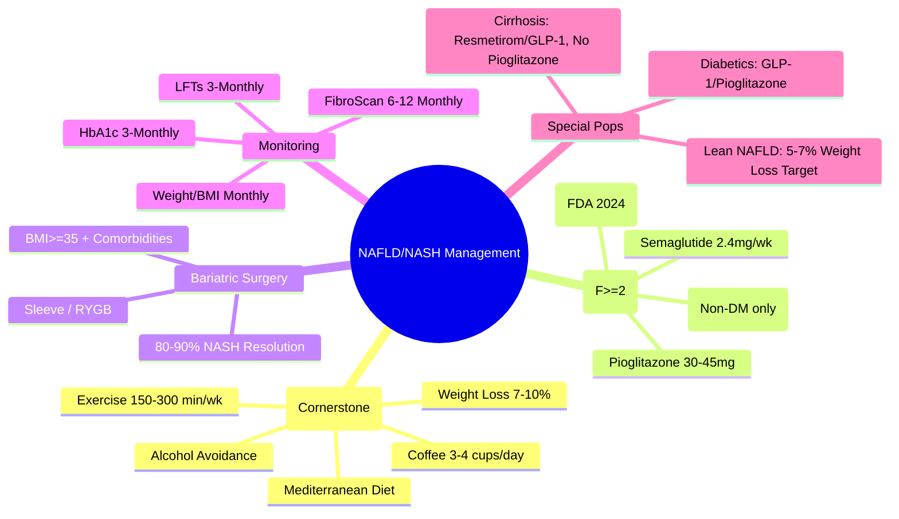

# NAFLD/NASH Management: Lifestyle, Pharmacotherapy & Bariatric Surgery

## Learning Objectives
- [ ] Apply lifestyle intervention targets (weight loss, exercise, diet)
- [ ] Select pharmacotherapy for NASH with fibrosis (pioglitazone, GLP-1 agonists, resmetirom)
- [ ] Know bariatric surgery indications and outcomes
- [ ] Monitor treatment response and endpoints
- [ ] Identify FCPS/MRCP high-yield management algorithms

---

## Management Algorithm

```mermaid
flowchart TD
    A[NAFLD/NASH Diagnosis] --> B{Fibrosis Stage}
    B -->|F0-F1 (NAFL/NASH No Fibrosis)| C[Lifestyle Intervention Only]
    B -->|F2 (Significant Fibrosis)| D[Lifestyle + Consider Pharmacotherapy]
    B -->|F3-F4 (Advanced Fibrosis/Cirrhosis)| E[Lifestyle + Pharmacotherapy + HCC Surveillance]
    C & D & E --> F[Monitor Response]
    F --> G{Response at 6-12 Months}
    G -->|Yes| H[Continue]
    G -->|No| I[Escalate Therapy / Referral]
```

> **FCPS/MRCP**: **Treatment Target = Fibrosis Stage** — F0-F1: Lifestyle; F2: Consider Drugs; F3-F4: Mandatory Drugs + Surveillance

---

## 1. Lifestyle Intervention (Cornerstone)

### Targets

| Target | Evidence-Based Goal |
|--------|---------------------|
| **Weight Loss** | **7-10%** for histologic improvement (NASH resolution, fibrosis regression) |
| **Exercise** | **150-300 min/week** moderate aerobic + resistance training |
| **Diet** | Mediterranean, Low Fructose, Low Saturated Fat, High Fibre |
| **Alcohol** | **Avoid** (Even modest worsens NASH) |
| **Coffee** | **3-4 cups/day** associated with ↓ Fibrosis progression |

### Weight Loss & Histologic Response

| Weight Loss | NASH Resolution | Fibrosis Regression |
|-------------|----------------|---------------------|
| **≥10%** | **90%** | **45%** |
| **7-10%** | **60-70%** | **25-35%** |
| **5-7%** | **30-40%** | **15-20%** |
| **<5%** | <10% | Minimal |

> **FCPS/MRCP**: **7-10% Weight Loss = Histologic Improvement Target** (NASH resolution + Fibrosis regression)

### Exercise Prescription

| Component | Frequency | Intensity |
|-----------|-----------|-----------|
| **Aerobic** | 5 days/week | Moderate (60-75% Max HR) |
| **Resistance** | 2-3 days/week | 8-12 reps × 2-3 sets |
| **Total** | **150-300 min/week** | |

---

## 2. Pharmacotherapy (For NASH with Fibrosis F≥2)

### Approved/Recommended Agents (EASL 2024 / AASLD 2024)

| Drug | Dose | Indication | Key Evidence | Status |
|------|------|------------|--------------|--------|
| **Pioglitazone** | 30-45 mg daily | NASH F≥2 | PIVENS: 47% vs 21% NASH resolution | **Recommended (AASLD/EASL)** |
| **GLP-1 Agonists** (Semaglutide, Liraglutide) | Semaglutide 2.4mg weekly | NASH F≥2 | Semaglutide: 59% vs 17% NASH resolution | **Semaglutide 2.4mg FDA-Approved for Obesity; NASH Indication Pending** |
| **Resmetirom** (THR-β agonist) | 80-100 mg daily | NASH F2-F3 | MAESTRO-NASH: NASH resolution + Fibrosis improvement | **FDA Approved 2024 for NASH F2-F3** |
| **Vitamin E** | 800 IU daily | NASH F≥2, **Non-Diabetic** | PIVENS: 43% vs 19% NASH resolution | **AASLD: Non-Diabetics Only** |
| **Obeticholic Acid** | 10-25 mg daily | NASH F≥2 | REGENERATE: Fibrosis improvement | **PBC Approved; NASH Trial Ongoing** |

> **FCPS/MRCP**: **First-Line = Lifestyle; Pharmacotherapy if F≥2: Pioglitazone / GLP-1 / Resmetirom / Vitamin E (Non-DM)**

### Agent-Specific Details

#### Pioglitazone (TZD)
| Aspect | Detail |
|--------|--------|
| **Dose** | 30-45 mg daily (Start 15mg, titrate) |
| **Mechanism** | PPAR-γ agonist → ↑ Insulin sensitivity, ↑ Adiponectin, ↓ Hepatic fat |
| **Benefits** | NASH resolution, Fibrosis improvement, ↑ Insulin sensitivity |
| **Side Effects** | **Weight Gain (3-5kg)**, Edema, Fracture Risk, Bladder Cancer Signal |
| **Contraindications** | Heart Failure, Active Bladder Cancer, Macular Edema |

#### GLP-1 Agonists (Semaglutide 2.4mg)
| Aspect | Detail |
|--------|--------|
| **Dose** | 0.25mg → 0.5mg → 1mg → 1.7mg → **2.4mg weekly** (Titrate Monthly) |
| **Mechanism** | GLP-1 receptor agonist → ↓ Appetite, ↑ Insulin, ↓ Glucagon, ↓ Hepatic fat |
| **Benefits** | **Weight Loss 15-20%**, NASH resolution, CV Benefit |
| **Side Effects** | Nausea, Vomiting, Diarrhoea, Pancreatitis (Rare) |
| **Key** | **Semaglutide 2.4mg Approved for Obesity**; NASH Indication Under Review |

#### Resmetirom (THR-β Agonist)
| Aspect | Detail |
|--------|--------|
| **Dose** | 80 mg daily (if <100kg) / 100 mg daily (if ≥100kg) |
| **Mechanism** | **THR-β Agonist** → Liver-selective → ↓ Lipogenesis, ↑ Mitochondrial β-oxidation |
| **Benefits** | **FDA Approved 2024 for NASH F2-F3**; NASH resolution + Fibrosis improvement |
| **Side Effects** | Diarrhoea, Nausea, Gallstones, ↑ ALT (Transient) |

#### Vitamin E
| Aspect | Detail |
|--------|--------|
| **Dose** | 800 IU daily |
| **Indication** | **Non-Diabetics Only** with NASH F≥2 |
| **Evidence** | PIVENS: 43% NASH resolution vs 19% Placebo |
| **Concerns** | Prostate Cancer Risk?, Hemorrhagic Stroke? |
| **Contraindication** | **Diabetics, Bleeding Disorders, Vitamin K Antagonists** |

---

## 3. Bariatric Surgery

### Indications

| Criteria | Details |
|----------|---------|
| **BMI ≥40** | Regardless of Comorbidities |
| **BMI ≥35** | With Obesity-Related Comorbidities (T2DM, HTN, NASH F≥2, OSA) |
| **BMI 30-34.9** | **T2DM Inadequately Controlled** (Select Cases) |

### Outcomes

| Outcome | Effect |
|---------|--------|
| **NASH Resolution** | **80-90%** at 1-5 Years |
| **Fibrosis Regression** | **40-60%** (Including F3-F4) |
| **Diabetes Remission** | 60-80% (Sleeve), 80-90% (Bypass) |
| **Weight Loss** | 25-35% Total Body Weight |

### Procedures

| Procedure | Mechanism | NASH Resolution |
|-----------|-----------|-----------------|
| **Sleeve Gastrectomy** | Restrictive | 70-80% |
| **Roux-en-Y Gastric Bypass** | Restrictive + Malabsorptive | 80-90% |
| **One Anastomosis Gastric Bypass** | Simplified Bypass | Similar to RYGB |

> **FCPS/MRCP**: **Bariatric Surgery = Most Effective NASH Treatment** (80-90% Resolution)

---

## Monitoring & Treatment Endpoints

### Response Assessment (6-12 Months)

| Endpoint | Target |
|----------|--------|
| **Lifestyle** | ≥7-10% Weight Loss |
| **Pharmacotherapy** | ↓ ALT >30%, ↓ FibroScan >20%, NASH Resolution (Biopsy if Needed) |
| **Bariatric** | ≥25% Weight Loss, NASH Resolution |

### Monitoring Schedule

| Parameter | Frequency |
|-----------|-----------|
| **LFTs (ALT, AST, GGT)** | 3-Monthly ×1 Year, Then 6-Monthly |
| **Weight/BMI** | Monthly ×6 Months, Then 3-Monthly |
| **HbA1c / Glucose** | 3-Monthly (If Diabetic) |
| **FibroScan / FIB-4** | 6-12 Monthly (If F≥2) |
| **Renal Function** | 6-Monthly (Pioglitazone/Resmetirom) |

---

## Special Populations

### Diabetics with NASH
- **First-Line**: **GLP-1 Agonists** (Semaglutide) or **Pioglitazone**
- **Avoid**: Vitamin E, High-Dose Obeticholic Acid (Limited Data)

### Lean NAFLD (BMI <25)
- **Same Targets**: 5-7% Weight Loss, Pharmacotherapy if F≥2
- **Genetic Risk**: Screen PNPLA3

### Cirrhosis (F4)
- **Pharmacotherapy**: **Caution** — Avoid Pioglitazone (Fluid Retention), **Resmetirom/GLP-1 Safer**
- **HCC Surveillance**: **Lifelong 6-Monthly US ± AFP**
- **Transplant Evaluation**: If Decompensated

---

## FCPS/MRCP High-Yield Summary

| Concept | Key Points |
|---------|------------|
| **Lifestyle First** | **7-10% Weight Loss** = Histologic Improvement Target |
| **Pharmacotherapy Indication** | **NASH F≥2** (F0-F1: Lifestyle Only) |
| **First-Line Drugs** | **Pioglitazone, GLP-1 (Semaglutide), Resmetirom** |
| **Vitamin E** | **Non-Diabetics Only** (800 IU daily) |
| **Resmetirom** | **FDA 2024 Approved** for NASH F2-F3 (THR-β Agonist) |
| **Pioglitazone** | 30-45mg; Weight Gain, Edema; Avoid in HF |
| **Semaglutide** | 2.4mg weekly; Weight Loss + NASH Resolution |
| **Bariatric Surgery** | **BMI ≥35 + Comorbidities**; 80-90% NASH Resolution |
| **Cirrhosis** | **HCC Surveillance Lifelong 6m US ± AFP** |

---

## Viva Questions

1. **What is the weight loss target for NASH histologic improvement?**
2. **What are the first-line pharmacotherapy options for NASH F≥2?**
2. **What is the dose and mechanism of resmetirom?**
3. **Why is vitamin E only for non-diabetics?**
3. **What are the bariatric surgery criteria for NAFLD?**
4. **How do you monitor treatment response in NASH?**
5. **What is the difference between pioglitazone and semaglutide for NASH?**
6. **What drugs are contraindicated in cirrhotic NASH?**
6. **What is the FDA approval status of resmetirom for NASH?**
7. **Can you use pioglitazone in heart failure?**
8. **What is the weight loss target for NASH resolution?**

---

## Confusions & Mnemonics

| Confusion | Clarification |
|-----------|---------------|
| F0-F1 vs F2 Management | **F0-F1: Lifestyle Only**; **F2: Lifestyle + Consider Drugs** |
| Pioglitazone in Heart Failure | **Contraindicated** (Fluid Retention) |
| Vitamin E in Diabetics | **Contraindicated** (Prostate Cancer, Stroke Risk) |
| Resmetirom vs OCA | **Resmetirom = THR-β Agonist (Liver-Selective)**; OCA = FXR Agonist |
| Semaglutide Dose | **Titrate Monthly** to 2.4mg Weekly (Not Fixed Start) |
| Bariatric vs Drugs | **Surgery > Drugs** for NASH Resolution (80-90% vs 40-60%) |
| Pioglitazone in Cirrhosis | **Avoid** (Fluid Retention Risk) — Use Resmetirom/GLP-1 Instead |
| F0-F1 No Drugs | **Lifestyle Only** — No Pharmacotherapy Indicated |

---

## Mind Map



---

## One-Page Revision Card

| **Management by Fibrosis** | **Strategy** |
|----------------------------|--------------|
| **F0-F1 (No/Significant)** | **Lifestyle Only** (7-10% Weight Loss) |
| **F2 (Significant Fibrosis)** | **Lifestyle + Consider Pharmacotherapy** |
| **F3-F4 (Advanced/Cirrhosis)** | **Lifestyle + Pharmacotherapy + HCC Surveillance** |

| **Pharmacotherapy (F≥2)** | **Dose** | **Key Point** |
|---------------------------|----------|---------------|
| **Pioglitazone** | 30-45mg daily | Avoid in HF, Weight Gain |
| **Semaglutide** | 2.4mg Weekly | Titrate Monthly, Weight Loss |
| **Resmetirom** | 80-100mg Daily | **FDA 2024 NASH F2-F3** |
| **Vitamin E** | 800 IU Daily | **Non-Diabetics Only** |

| **Bariatric Surgery** | |
|----------------------|--|
| **Indication** | BMI≥35 + Comorbidity OR BMI≥40 |
| **NASH Resolution** | **80-90%** |
| **Fibrosis Regression** | 40-60% |

| **Monitoring (6-12 Monthly)** | |
|------------------------------|--|
| Weight Loss Target | **≥7-10%** |
| LFTs | 3-Monthly |
| FibroScan/FIB-4 | 6-12 Monthly |
| HbA1c (If Diabetic) | 3-Monthly |

---

## Spaced Repetition Tracker

| Day | 1 | 3 | 7 | 15 | 30 |
|-----|---|---|---|----|----|
| Weight Loss Target 7-10% | ☐ | ☐ | ☐ | ☐ | ☐ |
| Pharmacotherapy F≥2 | ☐ | ☐ | ☐ | ☐ | ☐ |
| Drug Doses (Pio, Sema, Res) | ☐ | ☐ | ☐ | ☐ | ☐ |
| Vitamin E Non-DM Only | ☐ | ☐ | ☐ | ☐ | ☐ |
| Bariatric Criteria | ☐ | ☐ | ☐ | ☐ | ☐ |

---

## Self-Test Scorecard

| Question | My Answer | Correct? |
|----------|-----------|----------|
| Weight Loss Target |  |  |
| First-Line Drugs for F≥2 |  |  |
| Resmetirom FDA Status |  |  |
| Vitamin E Indication |  |  |
| Bariatric BMI Threshold |  |  |

---

## Local Navigation

- [[Non-Alcoholic Fatty Liver Disease/NAFLD Spectrum (NAFL vs NASH)|NAFLD Spectrum]]
- [[Non-Alcoholic Fatty Liver Disease/NAFLD Risk Factors and Pathophysiology|NAFLD Risk Factors]]
- [[Non-Alcoholic Fatty Liver Disease/NAFLD Diagnosis (FIB-4, NFS, ELF, FibroScan)|NAFLD Diagnosis]]
- [[Non-Alcoholic Fatty Liver Disease/NAFLD HCC Risk and Surveillance|NAFLD HCC Risk]]