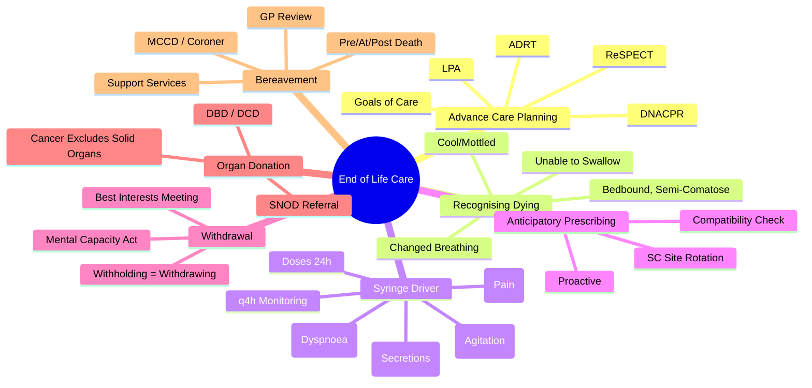

# Ethical & Legal Issues in Palliative Care

> [!tip] **FCPS/MRCP Priority: HIGH**
> **Ethical & Legal = Core Palliative Care Competency** — **Advance Care Planning (ACP), DNACPR, ReSPECT**; **Dying Patient Care (Last Days/Hours)**: Recognise Dying, Comfort Measures, Syringe Drivers, Anticipatory Prescribing; **Withdrawal of Treatment**; **Organ Donation**; **Bereavement Support**; **Mental Capacity Act, Best Interests, Deprivation of Liberty Safeguards (DoLS)**

---

## Learning Objectives
By the end of this note you should be able to:
- [ ] Conduct **Advance Care Planning (ACP)** conversations
- [ ] Complete **DNACPR** and **ReSPECT** forms appropriately
- [ ] **Recognise the dying patient** (last days/hours)
- [ ] Initiate **anticipatory prescribing** via **syringe driver**
- [ ] Manage **common symptoms in the last days**: pain, agitation, secretions, dyspnoea
- [ ] Apply **ethical framework** for withdrawal of treatment
- [ ] Discuss **organ donation** where appropriate
- [ ] Provide **bereavement support** for families

---

## 1. Advance Care Planning (ACP)

### Key Components

| Component | Description |
|-----------|-------------|
| **Goals of Care Discussion** | **Explore Values, Preferences, Priorities** — **What Matters Most?** |
| **Treatment Escalation Plan** | **DNACPR**, **ReSPECT**, **Ceiling of Care** |
| **Preferred Place of Care/Death** | **Home, Hospice, Hospital, Care Home** |
| **Nominated Decision-Maker** | **Lasting Power of Attorney (LPA) for Health & Welfare** |
| **Advance Decision to Refuse Treatment (ADRT)** | **Legally Binding** (If Valid & Applicable) |
| **Documentation** | **ACP Record**, **ReSPECT Form**, **DNACPR Form**, **ADRT** |

### Triggers for ACP Conversation

| Clinical Trigger | Example |
|------------------|---------|
| **New Diagnosis** | **Metastatic Cancer, Poor Prognosis** |
| **Deterioration** | **Functional Decline, Repeated Admissions** |
| **Treatment Decision** | **Chemo/Radio/Surgery Decision** |
| **Patient/Carer Request** | **Patient Asks "How Long?"** |
| **Routine Review** | **Annual for Frail/Long-Term Conditions** |

---

## 2. DNACPR & ReSPECT

| Aspect | **DNACPR** | **ReSPECT (Recommended Summary Plan for Emergency Care and Treatment)** |
|--------|------------|------------------------------------------------------------------------|
| **Purpose** | **Do Not Attempt CPR** | **Holistic Emergency Plan** (Including CPR Decision) |
| **Legal Status** | **Clinical Decision** (Not Legally Binding Alone) | **Clinical Recommendation** (Guiding, Not Binding) |
| **Scope** | **CPR Only** | **All Emergency Treatments** (CPR, ICU, Ventilation, Antibiotics, Fluids) |
| **Patient Involvement** | **Should Involve Patient/Family** | **Mandatory Shared Decision-Making** |
| **Review** | **Regular (Per Policy)** | **Regular (Per Policy)** |
| **Portability** | **Organisation-Specific** | **Cross-Organisational (NHS-Wide)** |

### DNACPR Decision-Making Framework

| Step | Action |
|------|--------|
| **1. Assess** | **Is CPR Likely to Succeed?** (Medical Futility) |
| **2. Discuss** | **With Patient (If Capacity) / Family (Best Interests if No Capacity)** |
| **3. Document** | **Form + Clinical Notes** (Reasoning, Discussion, Decision) |
| **4. Communicate** | **Handover, Electronic Record, Alert Systems** |
| **5. Review** | **Regular (Per Policy)** |

---

## 3. Recognising the Dying Patient

### Last Days of Life (Hours to Days)

| Domain | Signs |
|--------|-------|
| **Consciousness** | **Drowsy → Semi-Comatose → Unresponsive**, **Reduced Response to Stimuli** |
| **Functional** | **Bedbound**, **Unable to Swallow**, **Minimal/Oral Intake** |
| **Respiratory** | **Cheyne-Stokes**, **Apnoeic Pauses**, **Rattling Secretions (Death Rattle)**, **Agonal Gasps** |
| **Circulatory** | **Cool Peripheries**, **Mottling (Livedo Reticularis)**, **Weak/Thready Pulse**, **Hypotension** |
| **Renal** | **Oliguria/Anuria**, **Concentrated Urine** |
| **Skin** | **Pressure Areas**, **Dry Mouth** |

> **Key Principle**: **Diagnose Dying → Shift Focus to Comfort** — **Stop Non-Essential Interventions** (Bloods, Obs, Non-Essential Meds)

---

## 4. Anticipatory Prescribing (Syringe Driver)

### Standard Regimen (CSCI - Continuous Subcutaneous Infusion)

| Symptom | Drug | Typical Dose Range (24h) | Diluent |
|---------|------|--------------------------|---------|
| **Pain** | **Morphine** (or **Oxycodone** if Renal) | **Initial: 10-20mg/24h** (Titrate) | **Water for Injection** |
| | **Alternative: Alfentanil** (Renal Failure) | **500-2000mcg/24h** | **Water/Saline** |
| **Agitation / Distress** | **Midazolam** | **10-30mg/24h** (Titrate) | **Water** |
| | **Alternative: Levomepromazine** | **12.5-50mg/24h** | **Water** |
| **Respiratory Secretions** | **Glycopyrronium** | **0.6-1.2mg/24h** | **Water** |
| | **Alternative: Hyoscine Hydrobromide** | **0.4-1.2mg/24h** | **Water** |
| **Dyspnoea** | **Morphine** (If Not Already for Pain) | **5-10mg/24h** (Add to Pain Dose) | **Water** |
| | **Midazolam** (If Anxious) | **5-10mg/24h** (Add to Agitation Dose) | **Water** |
| **Nausea** | **Levomepromazine** | **12.5-25mg/24h** | **Water** |
| | **Alternative: Haloperidol** | **1-5mg/24h** | **Water** |

### Syringe Driver Setup

| Step | Action |
|------|--------|
| **1. Assess** | **Symptoms, Current Meds, Renal/Hepatic Function** |
| **2. Calculate** | **24h Dose = Current 24h Oral/SC Dose × Conversion Factor** |
| **3. Prescribe** | **Drug, Dose, Diluent (WFI), Rate (mL/h), Duration (24h)** |
| **4. Dilute** | **Total Volume 20-30ml (WFI)**, **Check Compatibility** |
| **5. Site** | **Subcutaneous (Abdomen, Thigh, Upper Arm)** — **Rotate Sites** |
| **6. Monitor** | **q4h** (Pain, Sedation, Respiration, Site, Pump) |

### Drug Compatibility (Common Combinations)

| Combination | Compatible? |
|-------------|-------------|
| **Morphine + Midazolam + Glycopyrronium** | **Yes** |
| **Morphine + Levomepromazine + Glycopyrronium** | **Yes** |
| **Oxycodone + Midazolam + Hyoscine** | **Yes** |
| **Alfentanil + Midazolam + Glycopyrronium** | **Yes** |
| **Check** | **Local Formulary / Palliative Care Formulary** |

---

## 5. Symptom Management in the Last Days

| Symptom | First-Line (SC) | Dose Range (24h) |
|---------|-----------------|------------------|
| **Pain** | **Morphine** (or **Oxycodone** if Renal) | **10-20mg/24h** (Titrate) |
| **Agitation / Terminal Restlessness** | **Midazolam** | **10-30mg/24h** |
| | **Levomepromazine** (2nd Line) | **12.5-50mg/24h** |
| **Respiratory Secretions** | **Glycopyrronium** | **0.6-1.2mg/24h** |
| | **Hyoscine Hydrobromide** (Alternative) | **0.4-1.2mg/24h** |
| **Dyspnoea** | **Morphine** (Add to Pain Dose) | **5-10mg/24h** |
| | **Midazolam** (If Anxious) | **5-10mg/24h** |
| **Nausea** | **Levomepromazine** | **12.5-25mg/24h** |
| | **Haloperidol** (Alternative) | **1-5mg/24h** |

### Key Principles

| Principle | Application |
|-----------|-------------|
| **Proactive** | **Prescribe Anticipatorily** — **Before Symptoms Escalate** |
| **Titrate** | **Review q4h**, **Increase Dose by 25-50%** if Symptom Persists |
| **Compatible** | **Check Drug Compatibility** (Local Formulary) |
| **Site** | **Subcutaneous (Abdomen/Thigh)** — **Rotate q24-48h** |
| **Monitor** | **q4h** (Pain, Sedation, Resp, Site, Pump) |
| **Stop Non-Essential** | **Oral Meds, Statins, Antihypertensives, Bloods, Obs** |

---

## 6. Withdrawal of Treatment

### Ethical Framework

| Principle | Application |
|-----------|-------------|
| **Beneficence** | **Act in Best Interests** |
| **Non-Maleficence** | **Avoid Harm** (Futile Treatment = Harm) |
| **Autonomy** | **Respect Patient Wishes** (Advance Directives, ReSPECT) |
| **Justice** | **Fair Resource Allocation** |

### Withholding vs Withdrawing

| | **Withholding** | **Withdrawing** |
|---|-----------------|-----------------|
| **Definition** | **Not Starting** a Treatment | **Stopping** an Ongoing Treatment |
| **Ethical Equivalence** | **Equivalent** — **No Moral Difference** | |
| **Examples** | **Not Starting Dialysis**, **Not Intubating** | **Stopping Ventilation**, **Stopping Vasopressors**, **Stopping Dialysis** |

### Decision-Making Process

| Step | Action |
|------|--------|
| **1. Assess Futility** | **No Realistic Chance of Meaningful Recovery** |
| **2. Best Interests Meeting** | **MDT + Family + Patient (If Possible)** |
| **3. Legal** | **Mental Capacity Act (If No Capacity)** — **Best Interests Decision** |
| **4. Document** | **ReSPECT, DNACPR, Clinical Notes, Meeting Minutes** |
| **5. Communicate** | **Clear, Compassionate, Allow Time for Questions** |
| **6. Implement** | **Phased Withdrawal** (Symptom Control Throughout) |

---

## 7. Organ Donation

| Aspect | Detail |
|--------|--------|
| **Eligibility** | **Brainstem Death (DBD)** OR **Circulatory Death (DCD)** after Planned Withdrawal |
| **Cancer** | **Most Active Cancers Exclude** (Except Some Primary Brain Tumours, Certain Skin Cancers) |
| **Corneas/Tissues** | **Often Possible** Even with Cancer |
| **Process** | **Specialist Nurse (SNOD) Referral** → **Assessment → Consent → Retrieval** |
| **Timing** | **DCD: Withdrawal in OT → 60-90min Observation → Retrieval** |

---

## 8. Bereavement Support

| Phase | Intervention |
|-------|--------------|
| **Pre-Death** | **Prepare Family** (What to Expect), **Support Children**, **Spiritual/Cultural Needs** |
| **At Death** | **Confirm Death**, **Allow Time**, **Privacy**, **Rituals** |
| **Immediate Post-Death** | **Verify Death**, **Issue MCCD (Medical Certificate of Cause of Death)**, **Refer to Coroner if Required** |
| **Early Bereavement (0-6 weeks)** | **Contact (Phone/Visit)**, **Practical Support (Funeral, Benefits)**, **Signpost to Services** |
| **Ongoing (6 weeks - 2 years)** | **Bereavement Counselling** (If Needed), **Anniversary Support**, **GP Review** |

---

## 9. FCPS/MRCP High-Yield Summary

| Topic | Key Points |
|-------|------------|
| **ACP** | **Goals of Care, DNACPR, ReSPECT, ADRT, LPA, Place of Care** |
| **DNACPR vs ReSPECT** | **DNACPR: CPR Only**; **ReSPECT: Holistic Emergency Plan** |
| **Recognising Dying** | **Bedbound, Semi-Comatose, Unable to Swallow, Changed Breathing, Cool/Mottled** |
| **Syringe Driver** | **Morphine (Pain), Midazolam (Agitation), Glycopyrronium (Secretions), Morphine/Midazolam (Dyspnoea)** |
| **Doses (24h)** | **Morphine 10-20mg, Midazolam 10-30mg, Glycopyrronium 0.6-1.2mg, Levomepromazine 12.5-25mg** |
| **Anticipatory Prescribing** | **Proactive, Before Crisis** |
| **Withdrawal** | **Futile Treatment = Harm**, **Withholding = Withdrawing**, **Best Interests Meeting** |
| **Organ Donation** | **DCD/DBD**, **SNOD Referral**, **Cancer Excludes Solid Organs** |
| **Bereavement** | **Pre/At/Post-Death**, **Signpost to Services**, **GP Review** |

---

## 10. Viva Questions (MRCP PACES / FCPS)

| Question | Expected Answer |
|----------|-----------------|
| **DNACPR vs ReSPECT — Difference?** | **DNACPR: CPR Decision Only**; **ReSPECT: Holistic Emergency Plan** (CPR + ICU + Ventilation + Antibiotics + Fluids). |
| **Recognising Dying — 5 Key Signs?** | **Bedbound, Semi-Comatose, Unable to Swallow, Changed Breathing, Cool/Mottled**. |
| **Syringe Driver — Standard 4-Drug Regimen?** | **Morphine (Pain), Midazolam (Agitation), Glycopyrronium (Secretions), Morphine/Midazolam (Dyspnoea)**. |
| **Syringe Driver Doses — Typical 24h Ranges?** | **Morphine 10-20mg, Midazolam 10-30mg, Glycopyrronium 0.6-1.2mg, Levomepromazine 12.5-25mg**. |
| **Anticipatory Prescribing — Why Important?** | **Proactive Symptom Control**, **Avoids Crisis**, **Allows Home/Hospice Death**. |
| **Withholding vs Withdrawing Treatment — Ethical Difference?** | **No Moral Difference** — **Both Based on Futility/Best Interests**. |
| **Best Interests Decision — Process?** | **Assess Capacity → If No Capacity: Best Interests Meeting (MDT+Family) → Consider Past Wishes, Beliefs, Values → Document → Implement**. |
| **Organ Donation — DCD vs DBD?** | **DCD: Donation After Circulatory Death (Planned Withdrawal → 60-90min Observation → Retrieval)**; **DBD: Donation After Brainstem Death**. |
| **Cancer & Organ Donation — Eligibility?** | **Active Solid Tumour Excludes Organ Donation**; **Primary Brain Tumours, Some Skin Cancers May Allow**; **Corneas/Tissues Often Possible**. |
| **Bereavement Support — GP Role?** | **Post-Death Contact, MCCD, Coroner Referral, Practical Support, Signpost to Counselling, Review at 6 Weeks & 1 Year**. |

---

## 10. Confusions & Mnemonics

| Confusion | Clarification |
|-----------|---------------|
| **DNACPR vs Allow Natural Death (AND)** | **Same Concept** — **AND is Preferred Terminology** (Positive Framing) |
| **Syringe Driver vs IV Infusion** | **SC Route**: Less Invasive, Home/Hospice Friendly, Lower Infection Risk |
| **Midazolam vs Morphine for Dyspnoea** | **Morphine: Reduces Respiratory Drive Sensitivity**; **Midazolam: Anxiolytic, Adjunct if Anxious** |
| **Glycopyrronium vs Hyoscine** | **Glycopyrronium: Less CNS Penetration (Less Sedation), Preferred**; **Hyoscine: More Central, Crosses BBB** |
| **Levomepromazine vs Midazolam for Agitation** | **Levomepromazine: Broad Antipsychotic/Antiemetic, More Sedating**; **Midazolam: Fast Onset, Anxiolytic** |
| **Withholding vs Withdrawing** | **Ethically Equivalent** — **Both Based on Futility/Best Interests** |
| **Best Interests vs Substituted Judgement** | **Best Interests: What Benefits Patient**; **Substituted Judgement: What Patient Would Choose** |
| **MCCD vs Cremation Forms** | **MCCD: Cause of Death**; **Cremation Forms: Separate, Require 2 Doctors** |

**Mnemonic: END-OF-LIFE-CARE**
- **E**nd of Life: **Recognise Dying** (Bedbound, Semi-Comatose, Unable to Swallow, Changed Breathing)
- **N**ear Death: **Anticipatory Prescribing** (Syringe Driver — Proactive)
- **D**rugs: **Morphine (Pain), Midazolam (Agitation), Glycopyrronium (Secretions), Morphine/Midazolam (Dyspnoea)**
- **O**bservations: **q4h Monitoring** (Pain, Sedation, Resp, Site, Pump)
- **F**utility: **Withhold/Withdraw = Equivalent** — **Best Interests Meeting**
- **L**egal: **Mental Capacity Act, Best Interests, ReSPECT, DNACPR, ADRT**
- **I**nvolvement: **Patient/Family in Decisions** (ACP, ReSPECT)
- **F**inal Days: **Recognise Dying → Stop Non-Essential → Comfort Focus**
- **E**nd of Life: **Bereavement Support** (Pre/At/Post-Death, GP Review)
- **C**ommunication: **Honest, Compassionate, Allow Time**
- **A**dvance Care Planning: **Goals, DNACPR, ReSPECT, ADRT, LPA**
- **R**espect: **ReSPECT Form (Holistic Emergency Plan)**
- **E**thics: **Beneficence, Non-Maleficence, Autonomy, Justice**

---

## 12. Mind Map

---

## 11. One-Page Revision Card

| Domain | Key Points |
|--------|------------|
| **ACP** | Goals, DNACPR, ReSPECT, ADRT, LPA |
| **Recognise Dying** | Bedbound, Semi-Comatose, No Swallow, Changed Breathing, Cool/Mottled |
| **Syringe Driver** | Morphine, Midazolam, Glycopyrronium, Levomepromazine |
| **Doses (24h)** | Morphine 10-20mg, Midazolam 10-30mg, Glycopyrronium 0.6-1.2mg, Levomepromazine 12.5-25mg |
| **Anticipatory** | Proactive, Before Crisis |
| **Withdrawal** | Futility = Best Interests, Withholding=Withdrawing |
| **Organ Donation** | DCD/DBD, SNOD, Cancer Excludes Solid Organs |
| **Bereavement** | Pre/At/Post, MCCD, Coroner, Support, GP Review |

---

## 12. Spaced Repetition Trackers

| Review Interval | Date Completed | Confidence (1-5) | Notes |
|-----------------|----------------|------------------|-------|
| 24 hours | | | |
| 7 days | | | |
| 15 days | | | |
| 30 days | | | |
| 90 days | | | |

---

## 13. Self-Test Scorecard

| Section | Score /5 | Last Attempt |
|---------|----------|--------------|
| ACP Components | | |
| DNACPR vs ReSPECT | | |
| Recognising Dying Signs | | |
| Syringe Driver Drugs/Doses | | |
| Anticipatory Prescribing | | |
| Withdrawal Ethics/Legal | | |
| Organ Donation Eligibility | | |
| Bereavement Timeline | | |

---

## Local Navigation
- **Parent Heading**: [[../Hepatology|Hepatology]]
- **Chapter Map": [[../Davidson Chapter 24 - Hepatology Hierarchy|Hepatology Hierarchy]]
- **Chapter MOC": [[../Hepatology MOC|Hepatology MOC]]
- **Drug Reference": [[../../Clinical Therapeutics and Good Prescribing|Drugs]]
- **Related": [[Advance Care Planning]], [[DNACPR]], [[ReSPECT]], [[Syringe Driver]], [[Anticipatory Prescribing]], [[Terminal Agitation]], [[Respiratory Secretions]], [[Bereavement Support]], [[Cancer Pain Management]], [[Symptom Control]], [[Mental Capacity Act]]