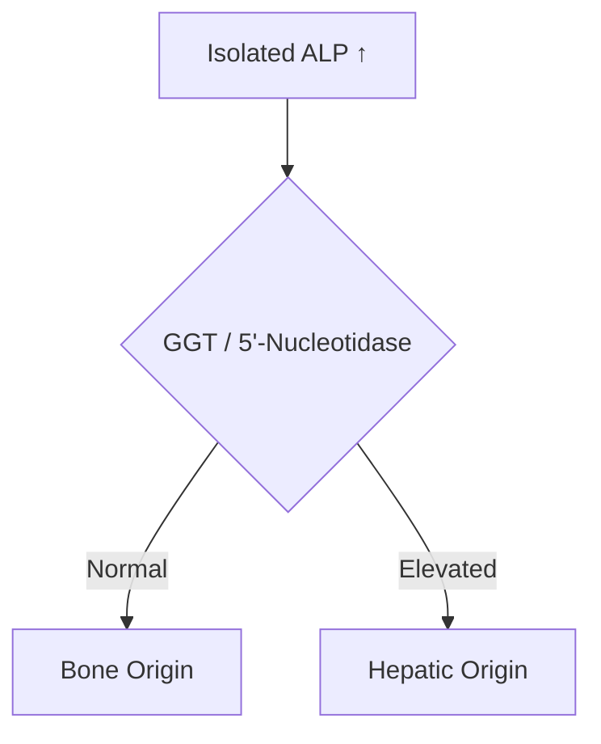
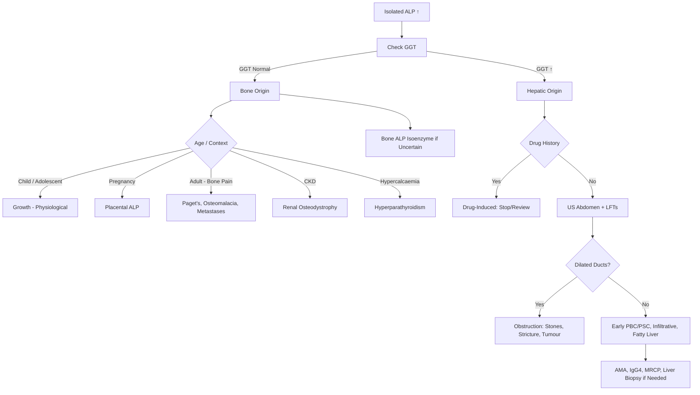

## 1. Learning Objectives
- [ ] Define isolated ALP elevation and its differential diagnosis
- [ ] Distinguish hepatic from bone origin using GGT/5'-nucleotidase
- [ ] Identify hepatic causes (cholestasis, infiltrative, drugs)
- [ ] Identify bone causes (Paget's, osteomalacia, metastases, growth)
- [ ] Apply diagnostic algorithm and know FCPS/MRCP high-yield associations

---

## 2. Definition

> **Isolated ALP Elevation** = **ALP ↑** with **normal AST, ALT, GGT, Bilirubin, Albumin, PT**



---

## 3. Hepatic vs Bone Origin

| Test | Hepatic Origin | Bone Origin |
|------|----------------|-------------|
| **ALP** | ↑ | ↑ |
| **GGT** | **↑** | **Normal** |
| **5'-Nucleotidase** | **↑** | **Normal** |
| **Bone ALP Isoenzyme** | Normal | **↑** |
| **Clinical Context** | Liver disease, drugs, cholestasis | Bone disease, growth, pregnancy |

> **FCPS/MRCP**: **GGT is the standard confirmatory test** — if GGT normal, think bone; if GGT ↑, think liver

---

## 4. Hepatic Causes of Isolated ALP Elevation

```mermaid
flowchart TD
    A[Hepatic Isolated ALP ↑ (GGT ↑)] --> B{Clinical Context}
    B -->|Early Cholestasis| C[Early PBC / PSC / Obstruction]
    B -->|Drug-Induced| D[Amox-Clav, Flucloxacillin, OCP, Carbamazepine, Allopurinol, Atorvastatin]
    B -->|Infiltrative| E[Sarcoidosis, TB, Amyloid, Lymphoma, Secondaries]
    B -->|Fatty Liver| F[NAFLD / Alcoholic - usually ALT also ↑]
    B -->|Post-Transplant| G[Biliary stricture, Rejection]
    B -->|Physiological| H[Pregnancy (3rd trimester), Growing Children]
```

### Key Hepatic Causes

| Cause | Features |
|-------|----------|
| **Early PBC** | Middle-aged women, **ALP ↑↑, GGT ↑**, AMA+, pruritus may be absent initially |
| **Early PSC** | Young men, IBD, **ALP ↑, GGT ↑**, MRCP beading (may be normal early) |
| **Drug-induced** | **Amox-Clav, Flucloxacillin, OCP, Carbamazepine, Allopurinol, Statins**; latency 1-4 weeks |
| **Infiltrative** | Sarcoidosis (ACE ↑, hilar lymphadenopathy), TB, Lymphoma, Amyloid, Metastases |
| **Post-Transplant** | Biliary stricture (anastomotic/ischaemic), Rejection, Recurrent PBC/PSC |
| **Pregnancy** | **3rd trimester** (placental ALP), resolves postpartum; also ICP (see AFLP note) |

---

## 5. Bone Causes of Isolated ALP Elevation

| Cause | Features |
|-------|----------|
| **Paget's Disease** | **ALP markedly ↑↑** (often >1000), bone pain, deformities, skull enlargement, "cotton wool" skull on X-ray |
| **Osteomalacia / Rickets** | Low Vitamin D, Low Calcium/Low Phosphate, **ALP ↑**, Looser's zones, pseudofractures |
| **Bone Metastases** | Prostate (blastic → ALP ↑↑), Breast, Lung, Thyroid; **PSA** for prostate |
| **Primary Bone Tumours** | Osteosarcoma (ALP ↑), Ewing's sarcoma |
| **Hyperparathyroidism** | Primary/Secondary/Renal; **High turnover → ALP ↑**; Calcium ↑, PTH ↑ |
| **Renal Osteodystrophy** | CKD, Secondary hyperparathyroidism, ALP ↑ (bone-specific) |
| **Fracture Healing** | Transient ALP ↑ during callus formation |
| **Growth / Children** | **Physiological** — high bone turnover |
| **Pregnancy** | Placental ALP (but usually hepatic fraction also ↑) |

---

## 6. Diagnostic Algorithm



---

## 7. Special Scenarios

### Pregnancy
- **3rd Trimester**: Physiological ALP ↑ (placental origin) — **Normal GGT**
- **Intrahepatic Cholestasis of Pregnancy (ICP)**: Pruritus, **ALP ↑, GGT ↑**, Bile acids ↑ >40 μmol/L, risk of stillbirth
- **AFLP/HELLP**: Usually have **ALT/AST ↑** as well (not isolated ALP)

### Children
- **Growth Spurt**: Physiological ALP ↑ (bone origin), **Normal GGT**
- **Rickets**: Nutritional/Vitamin D deficiency, ALP ↑↑, Low Ca/PO4, GGT normal

### Post-Liver Transplant
- **Biliary Stricture**: Isolated ALP ↑, GGT ↑, US/MRCP for anastomotic stricture
- **Rejection**: Usually ALT ↑ also, but can be ALP predominant
- **Recurrent PBC/PSC**: AMA/IgG4, MRCP

---

## 8. FCPS/MRCP High-Yield Summary

| Concept | Key Points |
|---------|------------|
| **Isolated ALP** | ALP ↑, **Normal AST, ALT, Bilirubin, GGT** (if bone) |
| **Hepatic vs Bone** | **GGT ↑ = Hepatic**; **GGT Normal = Bone** (confirm with 5'-nucleotidase) |
| **Hepatic Causes** | Early PBC/PSC, Drugs (Amox-clav, Fluclox, OCP, Statins), Infiltrative, Post-transplant |
| **Bone Causes** | **Paget's** (markedly ↑), Osteomalacia, Metastases (Prostate), Hyperparathyroidism, Renal osteodystrophy, Fracture, Growth |
| **Pregnancy** | **3rd trimester = Placental ALP (Normal GGT)**; **ICP = Pruritus + ALP↑ + GGT↑ + Bile acids↑** |
| **Children** | Physiological growth = Normal GGT; Rickets = Low Vit D + ALP↑ |

---

## 9. Viva Questions

1. **How do you differentiate hepatic from bone origin of isolated ALP elevation?**
2. **What are the hepatic causes of isolated ALP elevation?**
3. **What are the bone causes of isolated ALP elevation?**
3. **Why is ALP elevated in Paget's disease?**
4. **What is the ALP pattern in pregnancy?**
5. **How does ICP differ from physiological pregnancy ALP elevation?**
6. **Which drugs cause isolated ALP elevation?**
7. **What is the workup for isolated ALP elevation with normal GGT?**
8. **What causes markedly elevated ALP (>1000)?**
9. **ALP in renal osteodystrophy?**
10. **How do you confirm bone origin if GGT is equivocal?**

---

## 10. Confusions & Mnemonics

| Confusion | Clarification |
|-----------|---------------|
| GGT normal = Bone | **Standard teaching**: GGT is hepatocyte-specific; bone ALP doesn't raise GGT |
| Physiological pregnancy ALP | **3rd trimester, Normal GGT** — placental origin |
| ICP vs Pregnancy ALP | **ICP: Pruritus + GGT ↑ + Bile acids ↑**; Pregnancy: Asymptomatic, GGT normal |
| Paget's ALP | **Markedly elevated** (often >1000), bone pain, deformities |
| Drug-induced ALP | Amox-clav, Flucloxacillin, OCP, Carbamazepine, Allopurinol, Statins |
| ALP in Prostate Cancer | **Blastic metastases → ALP ↑↑**; PSA correlates |
| 5'-Nucleotidase | More specific than GGT for hepatic origin; used if GGT equivocal |

---

## 11. Mind Map

```mermaid
mindmap
  root((Isolated ALP Elevation))
    GGT Normal = Bone Origin
      Paget's: Markedly ↑, Bone pain
      Osteomalacia: Low Vit D, Low Ca/PO4
      Metastases: Prostate (blastic), Breast
      Hyperparathyroidism: High Ca, High PTH
      Renal Osteodystrophy: CKD, Sec HPTH
      Fracture Healing: Transient
      Growth (Children): Physiological
      Pregnancy (Placental): 3rd Trimester
    GGT ↑ = Hepatic Origin
      Early PBC/PSC
      Drug-Induced: Amox-Clav, Fluclox, OCP, Statins
      Infiltrative: Sarcoid, TB, Lymphoma, Mets
      Post-Transplant: Stricture, Rejection
      Fatty Liver (usually ALT also)
      Pregnancy ICP: Pruritus, Bile Acids ↑
```

---

## 12. One-Page Revision Card

| **Isolated ALP** | **Algorithm** |
|------------------|---------------|
| 1. Check GGT | |
| **GGT Normal** → **Bone Origin** | **GGT ↑** → **Hepatic Origin** |
| Bone Causes: | Hepatic Causes: |
| Paget's (↑↑↑) | Early PBC/PSC (AMA/MRCP) |
| Osteomalacia (Low Vit D) | Drugs (Amox-Clav, Fluclox, OCP, Statins) |
| Metastases (Prostate PSA) | Infiltrative (Sarcoid, TB, Lymphoma) |
| Hyperparathyroidism (High Ca, PTH) | Post-Transplant Stricture |
| Renal Osteodystrophy (CKD) | Pregnancy ICP (Pruritus, Bile Acids) |
| Fracture Healing | |
| Growth (Children) | |
| Pregnancy (Placental, 3rd Tri) | |

---

## 13. Spaced Repetition Tracker

| Day | 1 | 3 | 7 | 15 | 30 |
|-----|---|---|---|----|----|
| GGT differentiates hepatic vs bone | ☐ | ☐ | ☐ | ☐ | ☐ |
| Bone causes list | ☐ | ☐ | ☐ | ☐ | ☐ |
| Hepatic causes list | ☐ | ☐ | ☐ | ☐ | ☐ |
| Pregnancy ALP vs ICP | ☐ | ☐ | ☐ | ☐ | ☐ |
| Drug causes | ☐ | ☐ | ☐ | ☐ | ☐ |

---

## 14. Self-Test Scorecard

| Question | My Answer | Correct? |
|----------|-----------|----------|
| GGT in bone vs hepatic |  |  |
| 5 bone causes |  |  |
| 5 hepatic causes |  |  |
| Pregnancy physiological vs ICP |  |  |
| Drug causes ALP |  |  |

---

## 15. Local Navigation

- [[Jaundice and LFT Interpretation/Hepatocellular vs Cholestatic Pattern|LFT Patterns]]
- [[Jaundice and LFT Interpretation/Post-hepatic (obstructive) jaundice|Obstructive Jaundice]]
- [[Inherited and Metabolic Liver Disease/Paget's Disease|Paget's (if applicable)]]
- [[Portal Hypertension and Complications/Ascites|Ascites]]
- [[Hepatology in Special Situations/ICP|ICP]]