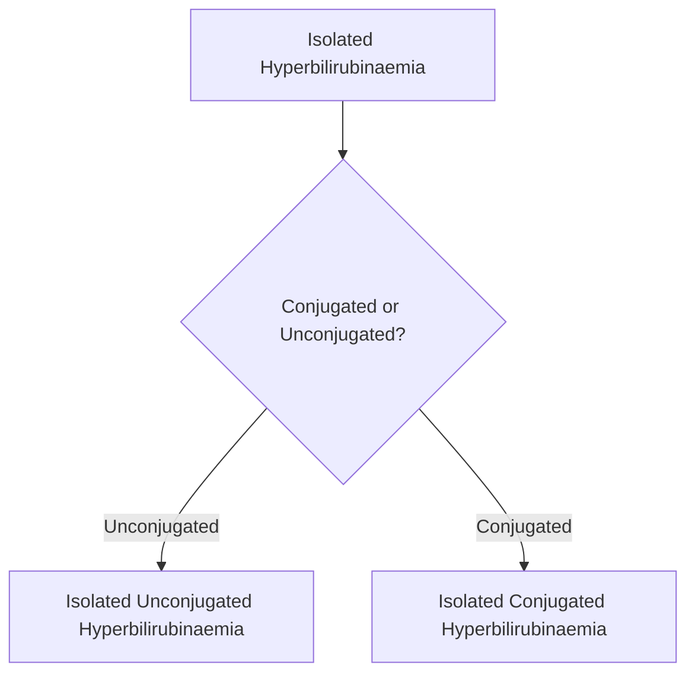
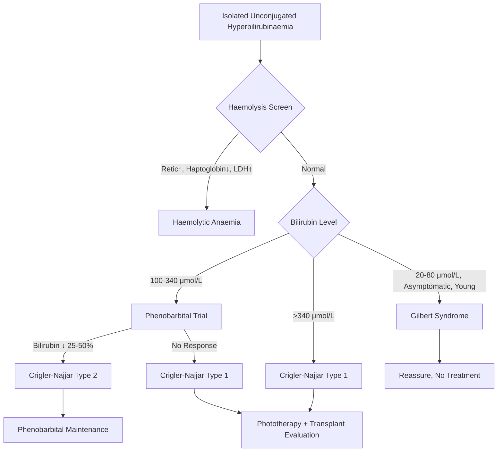
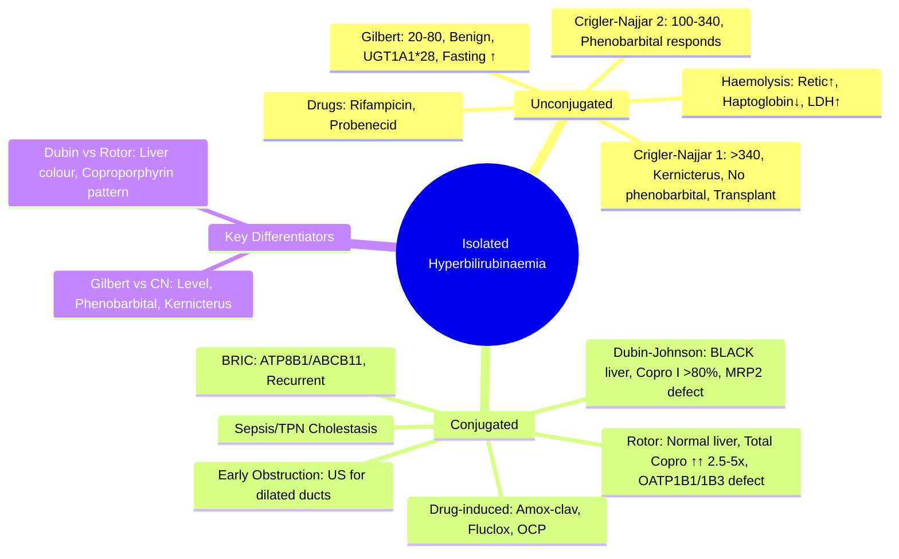

## 1. Learning Objectives
- [ ] Define isolated hyperbilirubinaemia (unconjugated vs conjugated)
- [ ] Differentiate benign from pathological causes
- [ ] Apply diagnostic algorithm for each type
- [ ] Know when to investigate vs reassure
- [ ] Identify FCPS/MRCP high-yield distinctions (Gilbert vs Crigler-Najjar, Dubin-Johnson vs Rotor)

---

## 2. Definition

> **Isolated hyperbilirubinaemia** = Elevated bilirubin with **otherwise normal LFTs** (AST, ALT, ALP, GGT, Albumin, PT normal)



---

## 3. Isolated Unconjugated Hyperbilirubinaemia

### Differential Diagnosis

| Condition | Bilirubin Level | Key Features | Genetics |
|-----------|-----------------|--------------|----------|
| **Gilbert Syndrome** | **20-80 μmol/L** (usually <5 mg/dL) | **Benign**, asymptomatic, **normal LFTs**, **no haemolysis**, triggered by fasting/stress | **UGT1A1*28** (Autosomal recessive) |
| **Crigler-Najjar Type 1** | **>340 μmol/L** (>20 mg/dL) | **Severe**, neonatal onset, **kernicterus risk**, **no response to phenobarbital**, fatal without transplant | **UGT1A1 null** (AR) |
| **Crigler-Najjar Type 2** | **100-340 μmol/L** (6-20 mg/dL) | Moderate, **responds to phenobarbital**, low kernicterus risk | **UGT1A1 missense** (AR) |
| **Haemolysis** | Variable (often <85 μmol/L) | **Reticulocytosis**, ↓ haptoglobin, ↑ LDH, ↑ urine urobilinogen | Various |
| **Drug-induced** | Variable | Temporal relationship (rifampicin, probenecid, novobiocin) | — |

### Diagnostic Algorithm



### Key Distinctions

| Feature | Gilbert | Crigler-Najjar Type 2 | Crigler-Najjar Type 1 |
|---------|---------|----------------------|----------------------|
| **Bilirubin** | <80 μmol/L | 100-340 μmol/L | >340 μmol/L |
| **UGT1A1 Activity** | ~30% | <10% | <1% (absent) |
| **Phenobarbital** | Not needed | **Responds** | **No response** |
| **Kernicterus** | **Never** | Rare | **High risk** |
| **Life Expectancy** | **Normal** | Near-normal | Short without transplant |

---

## 4. Isolated Conjugated Hyperbilirubinaemia

### Differential Diagnosis

| Condition | Key Features | Diagnostics |
|-----------|--------------|-------------|
| **Dubin-Johnson Syndrome** | **Black liver**, conjugated bilirubin ↑, **Coproporphyrin I >80%**, HIDA: no visualization at 24h | Liver colour, Urinary coproporphyrins, HIDA |
| **Rotor Syndrome** | **Normal liver**, conjugated bilirubin ↑, **Total coproporphyrins ↑↑ (2.5-5x), Copro I ~65%**, HIDA: rapid uptake/clearance | Urinary coproporphyrins, HIDA |
| **Early Obstruction** | May present with isolated conjugated bilirubin before ALP rises | US: dilated ducts |
| **Drug-induced Cholestasis** | Amox-clav, Flucloxacillin, OCP, Chlorpromazine | History, latency 1-4 weeks |
| **Sepsis/TPN Cholestasis** | ICU patients, multifactorial | Clinical context |
| **Benign Recurrent Intrahepatic Cholestasis (BRIC)** | Recurrent episodes, pruritus, **ATP8B1/ABCB11** mutations | Genetic, exclusion |

### Diagnostic Algorithm

```mermaid
flowchart TD
    A[Isolated Conjugated Hyperbilirubinaemia] --> B{Urinary Coproporphyrins}
    B -->|Copro I >80%, Total Normal| C[Dubin-Johnson Syndrome]
    B -->|Total ↑↑ (2.5-5x), Copro I 65%| D[Rotor Syndrome]
    B -->|Not Done / Atypical| E[HIDA Scan]
    E -->|No Visualization 24h| C
    E -->|Rapid Uptake/Clearance| D
    B -->|Other| F[Exclude: Early Obstruction, Drugs, Sepsis, BRIC]
    F --> G[US Abdomen: Dilated Ducts?]
    G -->|Yes| H[Obstruction]
    G -->|No| I[Drug History, Sepsis, TPN, BRIC]
```

---

## 5. FCPS/MRCP High-Yield Summary

| Concept | Key Points |
|---------|------------|
| **Isolated Unconjugated** | Think **Gilbert** (benign, 20-80), **Crigler-Najjar** (severe, >100), **Haemolysis** (retic↑) |
| **Gilbert** | Most common (5-10%), **benign**, **no treatment**, fasting ↑ bilirubin |
| **Crigler-Najjar Type 1** | Bilirubin >340, **kernicterus**, **no phenobarbital response**, transplant |
| **Crigler-Najjar Type 2** | Bilirubin 100-340, **phenobarbital responds** |
| **Isolated Conjugated** | **Dubin-Johnson** (Black liver, Copro I >80%), **Rotor** (Normal liver, Total copro ↑↑) |
| **Dubin-Johnson** | ABCC2/MRP2 defect, **black liver**, benign |
| **Rotor** | SLCO1B1/1B3 defect, **normal liver**, benign |
| **Early Obstruction** | Rule out with US if conjugated bilirubin isolated |

---

## 6. Viva Questions

1. **Define isolated hyperbilirubinaemia.**
2. **List causes of isolated unconjugated hyperbilirubinaemia.**
3. **Differentiate Gilbert from Crigler-Najjar Type 1 and 2.**
4. **What is the bilirubin level in each type?**
5. **How does phenobarbital differentiate CN Type 1 vs 2?**
6. **List causes of isolated conjugated hyperbilirubinaemia.**
7. **Differentiate Dubin-Johnson from Rotor syndrome.**
8. **What is the urinary coproporphyrin pattern in each?**
9. **Why is the liver black in Dubin-Johnson?**
10. **When do you suspect early obstruction?**

---

## 7. Confusions & Mnemonics

| Confusion | Clarification |
|-----------|---------------|
| Gilbert vs CN Type 2 | Gilbert: bilirubin <80, benign; CN2: bilirubin 100-340, phenobarbital responds |
| CN Type 1 vs Type 2 | CN1: >340, no phenobarbital response, fatal; CN2: 100-340, phenobarbital works |
| Dubin-Johnson vs Rotor | **Dubin = Dark (Black) liver, Copro I >80%**; **Rotor = Right (Normal) liver, Total Copro ↑↑** |
| Unconjugated vs Conjugated | Unconjugated = Gilbert/CN/Haemolysis; Conjugated = Dubin-Johnson/Rotor/Obstruction/Drugs |
| Haemolysis vs Gilbert | Haemolysis: Retic↑, Haptoglobin↓, LDH↑; Gilbert: All normal, no haemolysis |
| Kernicterus risk | CN1: **High**; CN2: **Low**; Gilbert: **None** |

---

## 8. Mind Map



---

## 9. One-Page Revision Card

| **Isolated Unconjugated** | **Bilirubin** | **Key Feature** | **Treatment** |
|---------------------------|---------------|-----------------|---------------|
| **Gilbert** | 20-80 μmol/L | Benign, fasting ↑ | **None** |
| **Crigler-Najjar 2** | 100-340 μmol/L | **Phenobarbital responds** | Phenobarbital |
| **Crigler-Najjar 1** | >340 μmol/L | **Kernicterus, No phenobarbital** | Phototherapy → Transplant |
| **Haemolysis** | Variable | Retic↑, Haptoglobin↓ | Treat cause |

| **Isolated Conjugated** | **Liver** | **Coproporphyrins** | **Gene** |
|-------------------------|-----------|---------------------|----------|
| **Dubin-Johnson** | **BLACK** | Copro I >80% (Total normal) | ABCC2 (MRP2) |
| **Rotor** | **Normal** | Total ↑↑ 2.5-5x, Copro I 65% | SLCO1B1 + SLCO1B3 |

---

## 10. Spaced Repetition Tracker

| Day | 1 | 3 | 7 | 15 | 30 |
|-----|---|---|---|----|----|
| Gilbert vs CN 1/2 | ☐ | ☐ | ☐ | ☐ | ☐ |
| Dubin vs Rotor | ☐ | ☐ | ☐ | ☐ | ☐ |
| Bilirubin thresholds | ☐ | ☐ | ☐ | ☐ | ☐ |
| Phenobarbital response | ☐ | ☐ | ☐ | ☐ | ☐ |
| Coproporphyrin patterns | ☐ | ☐ | ☐ | ☐ | ☐ |

---

## 11. Self-Test Scorecard

| Question | My Answer | Correct? |
|----------|-----------|----------|
| Gilbert bilirubin range |  |  |
| CN1 vs CN2 phenobarbital |  |  |
| Dubin vs Rotor liver colour |  |  |
| Coproporphyrin I % Dubin |  |  |
| Kernicterus risk CN1 |  |  |

---

## 12. Local Navigation

- [[Jaundice and LFT Interpretation/Pre-hepatic jaundice (Haemolytic jaundice)|Pre-hepatic Jaundice]]
- [[Jaundice and LFT Interpretation/Post-hepatic (obstructive) jaundice|Post-hepatic Jaundice]]
- [[Inherited and Metabolic Liver Disease/Gilbert Syndrome|Gilbert Syndrome]]
- [[Inherited and Metabolic Liver Disease/Crigler-Najjar Syndrome|Crigler-Najjar]]
- [[Inherited and Metabolic Liver Disease/Dubin-Johnson vs Rotor Syndrome|Dubin-Johnson vs Rotor]]
---

> Auto-generated study sections for "Jaundice and LFT Interpretation" — Ch 23: Hepatology.

## Flashcards (8 generated)

- Q: What is the definition of Jaundice and LFT Interpretation?
  A: | Condition | Bilirubin Level | Key Features | Genetics |
- Q: What is Isolated Unconjugated of Jaundice and LFT Interpretation?
  A: Think Gilbert (benign, 20-80), Crigler-Najjar (severe, >100), Haemolysis (retic↑)
- Q: What is Gilbert of Jaundice and LFT Interpretation?
  A: Most common (5-10%), benign, no treatment, fasting ↑ bilirubin
- Q: How is Jaundice and LFT Interpretation classified?
  A: Bilirubin >340, kernicterus, no phenobarbital response, transplant
- Q: What is Isolated Conjugated of Jaundice and LFT Interpretation?
  A: Dubin-Johnson (Black liver, Copro I >80%), Rotor (Normal liver, Total copro ↑↑)
- Q: What is Dubin-Johnson of Jaundice and LFT Interpretation?
  A: ABCC2/MRP2 defect, black liver, benign
- Q: What is Rotor of Jaundice and LFT Interpretation?
  A: SLCO1B1/1B3 defect, normal liver, benign
- Q: What is Early Obstruction of Jaundice and LFT Interpretation?
  A: Rule out with US if conjugated bilirubin isolated

## MCQs (1 generated)

1. **Which of the following best describes Jaundice and LFT Interpretation?**
   A. **| Condition | Bilirubin Level | Key Features | Genetics |**
   B. An unrelated condition not matching the clinical picture of Jaundice and LFT Interpretation
   C. A complication seen late in the disease course of Jaundice and LFT Interpretation
   D. A condition that mimics Jaundice and LFT Interpretation but has a different underlying cause

## SBA Questions (1 generated)

1. A patient with suspected Jaundice and LFT Interpretation presents with: Isolated hyperbilirubinaemia = Elevated bilirubin with otherwise normal LFTs (AST, ALT, ALP, GGT, Albumin, PT normal); A[Isolated Hyperbilirubinaemia] --> B{Conjugated or Unconjugated?}; B -->|Unconjugated| C[Isolated Unconjugated Hyperbilirubinaemia]. What is the most likely diagnosis?
   A. **Jaundice and LFT Interpretation**
   B. A condition that mimics Jaundice and LFT Interpretation but is not the same entity
   C. A complication of Jaundice and LFT Interpretation rather than the primary diagnosis
   D. An unrelated condition in the same clinical category as Jaundice and LFT Interpretation

