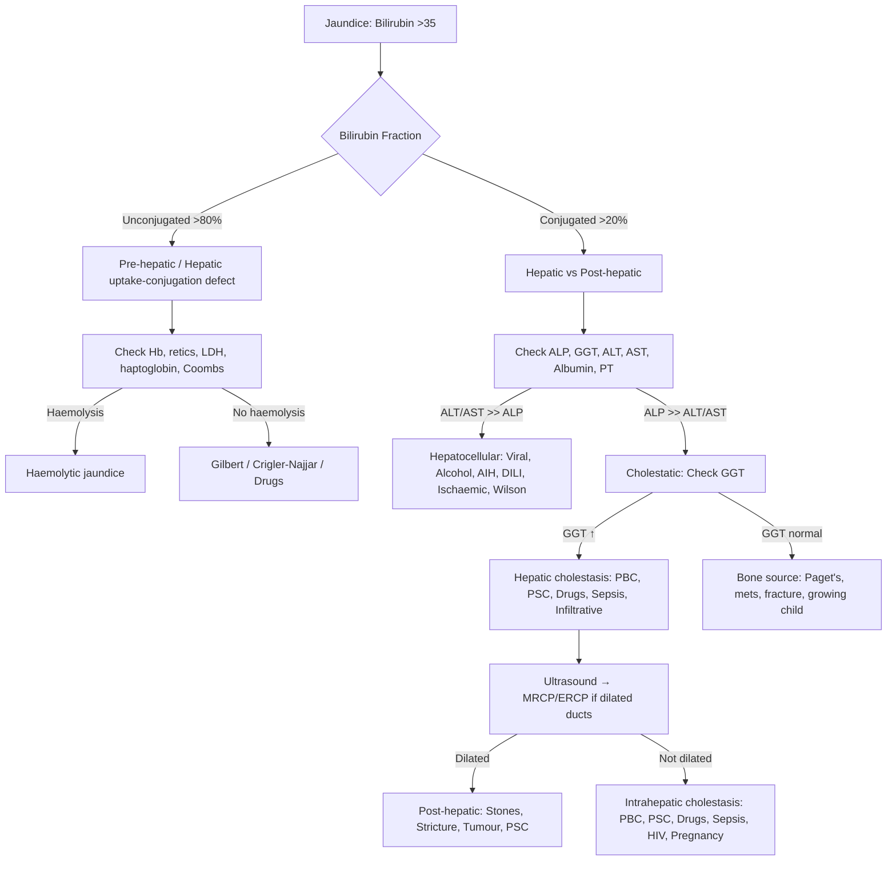

> [!tip] **FCPS/MRCP Priority: HIGH** — Core viva topic; pattern recognition is bread-and-butter hepatology.

## 1. Scope
This heading covers the **clinical approach to jaundice** and **LFT pattern interpretation** — the foundational diagnostic framework for all hepatology.

## 2. Topic Groups & Disease-Level Topics

| Topic Group | Disease-Level Topics | Status |
|-------------|---------------------|--------|
| **Pre-hepatic Jaundice** | Haemolytic jaundice, Gilbert syndrome | scaffold |
| **Hepatic Jaundice** | Acute viral hepatitis patterns, Alcoholic hepatitis, Autoimmune hepatitis patterns, DILI patterns | scaffold |
| **Post-hepatic (Obstructive) Jaundice** | Choledocholithiasis, Malignant biliary obstruction, Primary sclerosing cholangitis | scaffold |
| **LFT Interpretation Frameworks** | Hepatocellular vs cholestatic pattern, Isolated hyperbilirubinaemia, Isolated ALP elevation | scaffold |

## 3. High-Yield Viva Points

| Topic | Must-Know |
|-------|-----------|
| **Jaundice definition** | Serum bilirubin >35 µmol/L (visible >50 µmol/L) |
| **Pre-hepatic** | Unconjugated hyperbilirubinaemia, normal ALP/ALT, increased urobilinogen, no bilirubinuria |
| **Hepatic** | Mixed/conjugated bilirubin, elevated ALT/AST, reduced albumin/prolonged PT if severe |
| **Post-hepatic** | Conjugated hyperbilirubinaemia, **ALP ↑↑** (cholestatic), GGT ↑, pale stools, dark urine |
| **Gilbert syndrome** | Benign, unconjugated hyperbilirubinaemia, precipitated by fasting/stress, **UGTA1A** mutation |
| **Hepatocellular pattern** | ALT/AST ↑↑ > ALP (ALT:AST ratio clues: >2 viral/autoimmune, <1 alcoholic, ~1 cirrhosis) |
| **Cholestatic pattern** | ALP ↑↑ > ALT/AST, GGT ↑ confirms hepatic source, bilirubin may be normal initially |
| **Isolated hyperbilirubinaemia** | Think Gilbert, haemolysis, Dubin-Johnson/Rotor (conjugated) |
| **Isolated ALP elevation** | Bone vs liver source (check GGT/bone ALP), PBC, PSC, infiltrative disease, drugs |

## 4. Key Algorithms

### Jaundice Workup

### LFT Patterns Quick Reference

| Pattern | ALT/AST | ALP | GGT | Bilirubin | Typical Causes |
|---------|---------|-----|-----|-----------|----------------|
| **Hepatocellular** | ↑↑↑ | N/↑ | ↑ | ↑ (mixed) | Viral hepatitis, Alcohol, AIH, DILI, Ischaemic, Wilson |
| **Cholestatic** | N/↑ | ↑↑↑ | ↑↑ | ↑ (conjugated) | PBC, PSC, Obstruction, Drugs, Sepsis |
| **Mixed** | ↑↑ | ↑↑ | ↑↑ | ↑ | Many advanced diseases |
| **Isolated Bilirubin** | N | N | N | Unconj/Conj | Gilbert, Haemolysis, Dubin-Johnson/Rotor |
| **Isolated ALP** | N | ↑ | N/↑ | N | Bone (check bone ALP), PBC (early), Infiltrative |

## 5. FCPS/MRCP High-Yield Summary

| Topic | Key Points |
|-------|------------|
| **Bilirubin metabolism** | Unconj (indirect) → albumin-bound → hepatic uptake → conjugation (UGT1A1) → conjugated (direct) → biliary excretion → urobilinogen |
| **Gilbert** | 5-10% population, **UGT1A1** promoter polymorphism, benign, fasting/stress induced, **no treatment needed** |
| **Crigler-Najjar** | Type I: UGT1A1 absent → fatal kernicterus, **phototherapy/liver transplant**; Type II: partial deficiency → **phenobarbital responsive** |
| **Dubin-Johnson/Rotor** | Conjugated hyperbilirubinaemia, **Dubin-Johnson**: black liver (melanin-like), **Rotor**: normal liver, both benign |
| **ALT vs AST ratio** | >2: viral/autoimmune/DILI; <1: alcoholic; ~1: cirrhosis/NASH |
| **ALP sources** | Liver (GGT ↑ confirms), Bone (bone-specific ALP, Paget's, mets), Placenta (pregnancy), Intestine (post-prandial) |

## 6. Quick Reference Card

| Pattern | ALT/AST | ALP | GGT | Bilirubin | Think |
|---------|---------|-----|-----|-----------|-------|
| **Hepatocellular** | ↑↑↑ | N/↑ | ↑ | ↑ | Viral, Alcohol, AIH, DILI, Ischaemic |
| **Cholestatic** | N/↑ | ↑↑↑ | ↑↑ | ↑ (conj) | PBC, PSC, Obstruction, Drugs |
| **Pre-hepatic** | N | N | N | Unconj ↑ | Haemolysis, Gilbert |
| **Cholestatic + Dilated Ducts** | ↑ | ↑↑ | ↑↑ | ↑ | Stone, Stricture, Tumour |
| **Cholestatic + Non-Dilated** | ↑ | ↑↑ | ↑↑ | ↑ | PBC, PSC, Drugs, Sepsis, HIV, Pregnancy |

## 7. Local Navigation
- **Parent Heading**: [[../Hepatology|Hepatology]]
- **Chapter Map**: [[../Davidson Chapter 24 - Hepatology Hierarchy|Hepatology Hierarchy]]
- **Chapter MOC**: [[../Hepatology MOC|Hepatology MOC]]
- **Drug Reference**: [[../../Clinical Therapeutics and Good Prescribing|Drugs]]
- **Related**: [[Acute Liver Failure]], [[Viral Hepatitis]], [[Alcoholic Liver Disease]], [[Autoimmune Liver Disease]], [[Drug-Induced Liver Injury]], [[Biliary Tract Disease]], [[Inherited and Metabolic Liver Disease]]