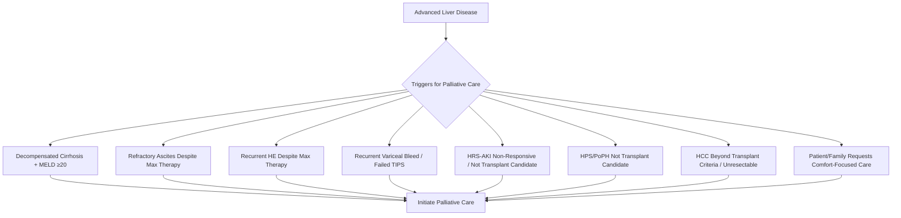
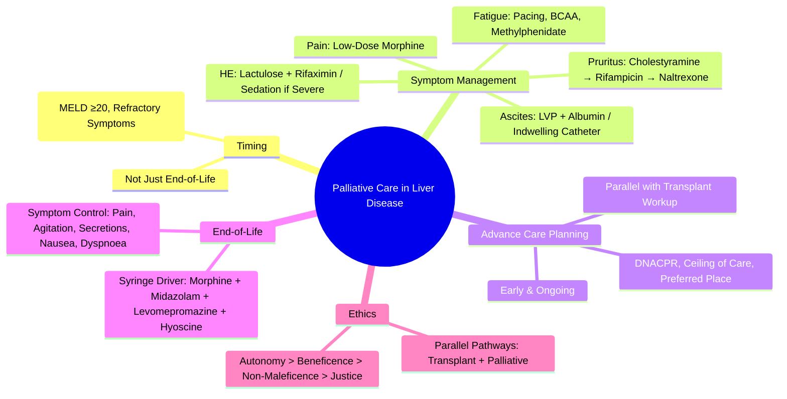

# Palliative Care in Advanced Liver Disease

## Learning Objectives
- [ ] Recognize when to initiate palliative care in advanced liver disease
- [ ] Manage refractory symptoms (ascites, pain, pruritus, encephalopathy, fatigue)
- [ ] Apply advance care planning and goals of care discussions
- [ ] Manage ethical dilemmas (transplant listing vs palliative care)
- [ ] Identify FCPS/MRCP high-yield palliative hepatology points

---

## When to Initiate Palliative Care

> **FCPS/MRCP**: **Early Palliative Care Integration** (Not Just End-of-Life) — Improves QoL, Reduces Hospitalizations

---

## Symptom Management

### 1. Refractory Ascites
| Symptom | Management (Palliative) |
|---------|------------------------|
| **Abdominal Distension** | **Serial LVP** (Albumin 8g/L if >5L; No Albumin if ≤5L) |
| **Dyspnoea** | Low-Dose Opioids (Morphine 2.5-5mg PO/SC q4h PRN), Oxygen, Fan |
| **Early Satiety/Nausea** | Small Frequent Meals, Prokinetics (Domperidone), Antiemetics |
| **Indwelling Catheter** | Tunneled Catheter (e.g., PleurX) for Home Drainage |

### 2. Pain Management
| Type | Approach |
|------|----------|
| **Visceral (Liver Capsule Stretch)** | **Low-Dose Opioids** (Morphine 2.5-5mg PO q4h PRN); Avoid NSAIDs |
| **Bone Pain (Metastases)** | NSAIDs (If No Contraindication), Bisphosphonates, Radiotherapy |
| **Neuropathic** | Gabapentin/Pregabalin, Tricyclics (Caution: Sedation) |
| **Pruritus** | Cholestyramine 4g QID → Rifampicin 150mg BD → Naltrexone 50mg → Sertraline |

> **Opioids in Cirrhosis**: **Start Low (Morphine 2.5mg), Go Slow**; ↑ Clearance in Cirrhosis → Accumulation Risk; Avoid Codeine/Tramadol (Unpredictable Metabolism)

### 3. Hepatic Encephalopathy (Palliative)
| Grade | Management |
|-------|------------|
| **Covert (G1)** | Lactulose 15-30ml BD PO → 2-3 Soft Stools/Day |
| **Overt (G2)** | Lactulose PR 300ml q4-6h + Rifaximin 550mg BD |
| **Severe (G3-4)** | **Comfort Measures**: Sedation (Midazolam SC), Avoid Aggressive Lactulose if Distressing, Focus on Comfort |

### 4. Fatigue & Weakness
| Approach | Detail |
|----------|--------|
| **Energy Conservation** | Pacing, Prioritisation, Assistive Devices |
| **Nutritional Support** | Small Frequent Meals, High Calorie/Protein, BCAA Supplements |
| **Exercise** | Gentle Resistance/Chair Exercises (If Tolerated) |
| **Medications** | Methylphenidate (Off-Label, Low Dose) for Severe Fatigue |

### 5. Pruritus (Cholestatic)
| Step | Treatment |
|------|-----------|
| **1st Line** | **Cholestyramine 4g QID** (Take 1h Before/4h After Other Meds) |
| **2nd Line** | Rifampicin 150mg BD (Monitor LFTs) |
| **3rd Line** | Naltrexone 50mg Daily |
| **4th Line** | Sertraline 50-100mg Daily / UVB Phototherapy |

---

## Advance Care Planning (ACP)

### Key Components
| Component | Detail |
|---------|--------|
| **Goals of Care Discussion** | Early, Ongoing, Documented (Values, Preferences, Trade-offs) |
| **DNACPR** | Discuss Early; Review Regularly; Document in Notes |
| **Ceiling of Care** | Define: Ward vs HDU vs ICU; Transplant vs Comfort |
| **Preferred Place of Care/Death** | Home, Hospice, Hospital — Patient Choice |
| **Power of Attorney / Advance Decision** | Legal Documentation (LPA, ADRT) |

### Timing
| Trigger | Action |
|-------|--------|
| **New Decompensation** | Revisit Goals of Care |
| **MELD ≥20 / Child C** | Urgent ACP if Not Done |
| **Transplant Ineligibility/Decline** | Immediate ACP |
| **Patient/Family Request** | Prioritise ACP |

---

## Ethical Dilemmas & Decision-Making

### Transplant Listing vs Palliative Care
| Scenario | Approach |
|----------|----------|
| **Transplant Candidate** | Pursue Transplant + Parallel Palliative Care |
| **Borderline/Declining** | MDT Discussion → Define Triggers for Shift to Palliative |
| **Ineligible/Declines** | Full Palliative Focus; Symptom Control + ACP |

### Withholding/Withdrawing Treatment
| Intervention | Considerations |
|--------------|----------------|
| **ICU Admission** | Likely Benefit vs Burden; Ceiling of Care |
| **Renal Replacement** | Futility if Multi-Organ Failure |
| **Mechanical Ventilation** | Futile in End-Stage Cirrhosis + ALF |
| **Artificial Nutrition** | No Benefit in Dying Patient; Comfort Feeding Only |

### Ethical Principles
| Principle | Application |
|-----------|-------------|
| **Autonomy** | Respect Patient Choices (Informed Consent) |
| **Beneficence** | Maximise Benefit (Symptom Relief) |
| **Non-Maleficence** | Avoid Harm (Avoid Futile Interventions) |
| **Justice** | Equitable Access to Palliative Resources |

---

## End-of-Life Care (Last Days)

### Recognising Dying
| Sign | Typical Timeline |
|------|------------------|
| **Deteriorating Performance Status** | Days-Weeks |
| **Reduced Oral Intake** | Days |
| **Decreased Consciousness** | Hours-Days |
| **Changes in Breathing** | Hours |
| **Cool Extremities, Mottling** | Hours |

### Symptom Control in Last 48 Hours
| Symptom | Medication (SC/IV) |
|-------|-------------------|
| **Pain** | Morphine 2.5-5mg SC q1h PRN; CSCI Morphine 10-30mg/24h |
| **Agitation/Delirium** | Midazolam 2.5-5mg SC q1h PRN; CSCI Midazolam 10-60mg/24h |
| **Respiratory Secretions** | Hyoscine Butylbromide 20mg SC q4h PRN; CSCI |
| **Nausea** | Levomepromazine 6.25mg SC q4h PRN; CSCI |
| **Breathlessness** | Morphine 2.5mg SC + O2; Fan |

> **CSCI = Continuous Subcutaneous Infusion (Syringe Driver)**

---

## FCPS/MRCP High-Yield Summary

| Concept | Key Points |
|---------|------------|
| **Palliative Care ≠ End-of-Life** | Early Integration Improves QoL, Reduces Admissions |
| **Ascites** | LVP + Albumin; Indwelling Catheter for Home; Avoid Repeated Hospital Admissions |
| **Pain** | **Low-Dose Morphine** (2.5-5mg); Avoid NSAIDs/Codeine |
| **HE** | Lactulose + Rifaximin; Comfort Focus in Severe |
| **Pruritus** | Cholestyramine → Rifampicin → Naltrexone → Sertraline |
| **Opioids** | **Morphine 2.5-5mg SC q4h PRN**; Avoid Codeine/Tramadol |
| **ACP** | Early, Ongoing; Document DNACPR, Ceiling of Care, Preferred Place |
| **End-of-Life** | Syringe Driver (Morphine + Midazolam + Levomepromazine + Hyoscine) |
| **Ethics** | Autonomy, Beneficence, Non-Maleficence, Justice |

---

## Viva Questions

1. **When should palliative care be initiated in advanced liver disease?**
2. **How do you manage refractory ascites palliatively?**
2. **What is the opioid of choice in cirrhosis? Dose?**
3. **How do you manage pruritus in cholestatic liver disease?**
4. **What are the key components of advance care planning?**
4. **How do you manage end-of-life symptoms in liver disease?**
5. **What is the role of palliative care in transplant candidates?**
5. **How do you manage hepatic encephalopathy at end-of-life?**
6. **What ethical principles guide decision-making in advanced liver disease?**
6. **What is the syringe driver regimen for end-of-life care?**
7. **How do you manage refractory pruritus?**
8. **What is the approach to withdrawing treatment in end-stage liver disease?**

---

## Confusions & Mnemonics

| Confusion | Clarification |
|-----------|---------------|
| Palliative vs End-of-Life | **Palliative = Early Integration**; End-of-Life = Last Days/Weeks |
| Opioids in Cirrhosis | **Start Low (Morphine 2.5mg), Go Slow**; Avoid Codeine/Tramadol |
| Lactulose in End-of-Life | **May Cause Distress** → Stop if Burdensome; Focus on Comfort |
| DNACPR | **Discuss Early**, Not Just at End; Not "Giving Up" |
| Transplant vs Palliative | **Not Mutually Exclusive** — Parallel Pathways |
| Withdrawing Nutrition | **No Benefit in Dying** — Comfort Feeding Only |
| Syringe Driver Drugs | **Morphine + Midazolam + Levomepromazine + Hyoscine** (Core 4) |
| CEC (Ceiling of Care) | Define **Before** Crisis; Ward vs HDU vs ICU |

---

## Mind Map

---

## One-Page Revision Card

| **Palliative Care Trigger** | **Action** |
|----------------------------|------------|
| MELD ≥20 / Child C | Initiate Palliative Care |
| Refractory Ascites/HE/Bleed | Parallel Palliative + Transplant Workup |
| Patient Requests Comfort Focus | Full Palliative Integration |

| **Symptom** | **Palliative Management** |
|-------------|--------------------------|
| **Ascites** | Serial LVP + Albumin 8g/L ; Indwelling Catheter |
| **Pain** | **Morphine 2.5-5mg SC q4h PRN** (Avoid NSAIDs/Codeine) |
| **HE** | Lactulose + Rifaximin; Sedation (Midazolam) if Severe |
| **Pruritus** | Cholestyramine → Rifampicin → Naltrexone → Sertraline |
| **Fatigue** | Pacing, BCAA, Methylphenidate (Off-Label) |

| **End-of-Life Syringe Driver** | |
|-------------------------------|--|
| Morphine | 10-30mg/24h |
| Midazolam | 10-60mg/24h |
| Levomepromazine | 25-100mg/24h |
| Hyoscine Butylbromide | 40-120mg/24h |

| **ACP Checklist** | |
|-------------------|--|
| DNACPR Discussed | ☐ |
| Ceiling of Care Defined | ☐ |
| Preferred Place of Care | ☐ |
| Power of Attorney | ☐ |
| Advance Decision (ADRT) | ☐ |

| **Ethical Principles** | |
|------------------------|--|
| Autonomy | Respect Choices |
| Beneficence | Maximise Wellbeing |
| Non-Maleficence | Avoid Harm |
| Justice | Equitable Access |

---

## Spaced Repetition Tracker

| Day | 1 | 3 | 7 | 15 | 30 |
|-----|---|---|---|----|----|
| Palliative Triggers | ☐ | ☐ | ☐ | ☐ | ☐ |
| Symptom Management | ☐ | ☐ | ☐ | ☐ | ☐ |
| ACP Components | ☐ | ☐ | ☐ | ☐ | ☐ |
| Syringe Driver Drugs | ☐ | ☐ | ☐ | ☐ | ☐ |
| Ethical Principles | ☐ | ☐ | ☐ | ☐ | ☐ |

---

## Self-Test Scorecard

| Question | My Answer | Correct? |
|----------|-----------|----------|
| Palliative Care Triggers |  |  |
| Morphine Dose in Cirrhosis |  |  |
| ACP Components |  |  |
| Syringe Driver Drugs |  |  |
| Ethical Principles |  |  |

---

## Local Navigation

- [[Chronic Liver Disease and Cirrhosis/Complications|Cirrhosis Complications]]
- [[Portal Hypertension and Complications/Ascites|Ascites]]
- [[Portal Hypertension and Complications/Hepatic Encephalopathy|HE]]
- [[Liver Transplantation/Liver Transplantation|Liver Transplant]]
- [[Acute Liver Failure/ICU supportive care|ICU Supportive Care]]
---

> Auto-generated study sections for "Hepatology" — Ch 23: Hepatology.

## Flashcards (10 generated)

- Q: What is the definition of Hepatology?
  A: | Abdominal Distension | Serial LVP (Albumin 8g/L if >5L; No Albumin if ≤5L) |
- Q: What is Palliative Care ≠ End-of-Life of Hepatology?
  A: Early Integration Improves QoL, Reduces Admissions
- Q: What is Ascites of Hepatology?
  A: LVP + Albumin; Indwelling Catheter for Home; Avoid Repeated Hospital Admissions
- Q: What is Pain of Hepatology?
  A: Low-Dose Morphine (2.5-5mg); Avoid NSAIDs/Codeine
- Q: What is HE of Hepatology?
  A: Lactulose + Rifaximin; Comfort Focus in Severe
- Q: What is Pruritus of Hepatology?
  A: Cholestyramine → Rifampicin → Naltrexone → Sertraline
- Q: What is Opioids of Hepatology?
  A: Morphine 2.5-5mg SC q4h PRN; Avoid Codeine/Tramadol
- Q: What is ACP of Hepatology?
  A: Early, Ongoing; Document DNACPR, Ceiling of Care, Preferred Place
- Q: What is End-of-Life of Hepatology?
  A: Syringe Driver (Morphine + Midazolam + Levomepromazine + Hyoscine)
- Q: What is Ethics of Hepatology?
  A: Autonomy, Beneficence, Non-Maleficence, Justice

## MCQs (1 generated)

1. **Which of the following best describes Hepatology?**
   A. **| Abdominal Distension | Serial LVP (Albumin 8g/L if >5L; No Albumin if ≤5L) |**
   B. An unrelated condition not matching the clinical picture of Hepatology
   C. A complication seen late in the disease course of Hepatology
   D. A condition that mimics Hepatology but has a different underlying cause

## SBA Questions (1 generated)

1. A patient with suspected Hepatology presents with: Goals of Care Discussion — Early, Ongoing, Documented (Values, Preferences, Trade-offs); DNACPR — Discuss Early; Review Regularly; Document in Notes; Ceiling of Care — Define: Ward vs HDU vs ICU; Transplant vs Comfort. What is the most likely diagnosis?
   A. **Hepatology**
   B. A condition that mimics Hepatology but is not the same entity
   C. A complication of Hepatology rather than the primary diagnosis
   D. An unrelated condition in the same clinical category as Hepatology

## PasTest Scenario SBAs (Clinical Vignettes)

> **Auto-generated PasTest/Mediscope-style scenario SBAs** grounded in the authored source. Each scenario tests a real clinical fact (triad, specific sign, contraindication, trial, first-line Rx) extracted from the topic. *Source: Ch 23: Hepatology — Palliative Care in Advanced Liver Disease*

**Q1.** In the management of Palliative Care in Advanced Liver Disease, which of the following should be avoided or is contraindicated?

  - **A.** Aggressive Lactulose (avoid in Distressing)
  - **B.** Standard guideline-directed first-line therapy
  - **C.** Routine supportive care (fluids, oxygen, monitoring)
  - **D.** Symptom-directed treatment as needed

  > **Answer: A** — Aggressive Lactulose (avoid in Distressing)
  >
  > *Source:* l q4-6h + Rifaximin 550mg BD |
| **Severe (G3-4)** | **Comfort Measures**: Sedation (Midazolam SC), Avoid Aggressive Lactulose if Distressing, Focus on Comfort |

### 4

**Q2.** What is the most appropriate first-line therapy for Palliative Care in Advanced Liver Disease?

  - **A.** Indwelling Catheter
  - **B.** An advanced/surgical therapy reserved for refractory disease
  - **C.** Symptomatic treatment only, no disease-modifying therapy
  - **D.** Empiric broad-spectrum therapy without specific indication

  > **Answer: A** — Indwelling Catheter
  >
  > *Source:* **Indwelling Catheter**   Tunneled Catheter (e.g., PleurX) for Home Drainage  

### 2.

