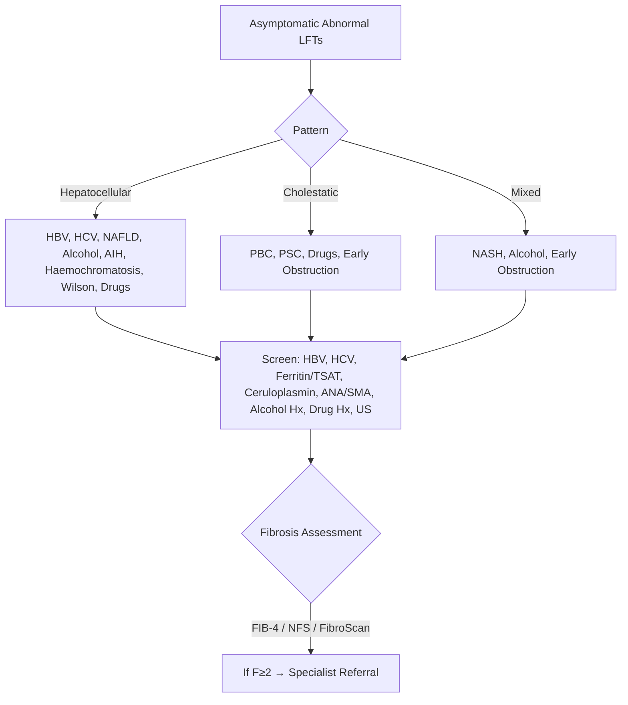
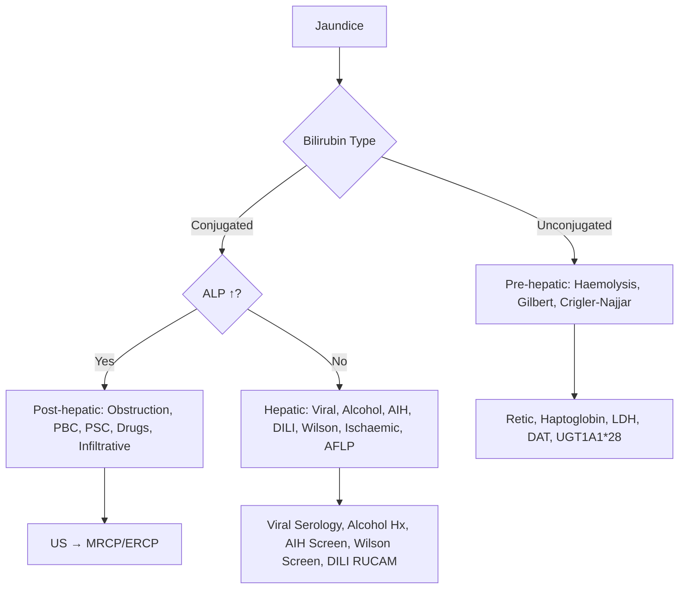
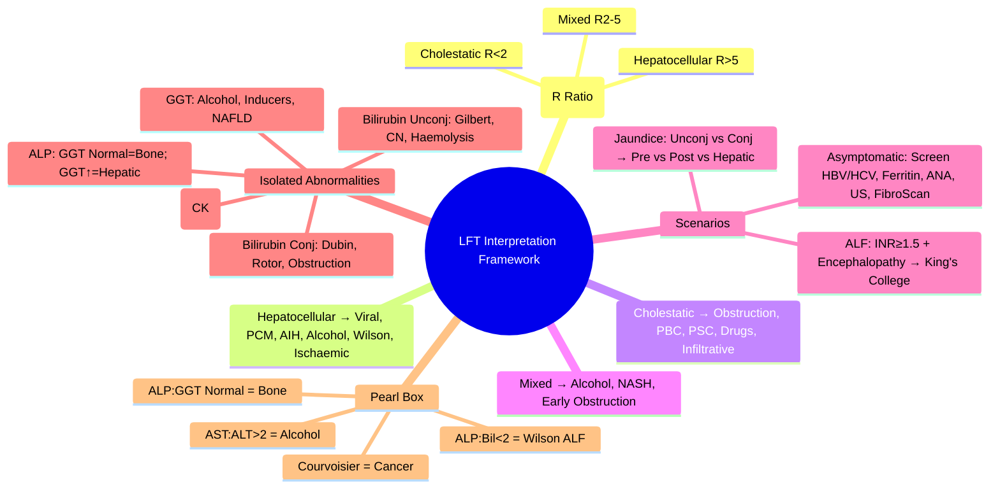

## 1. Learning Objectives
- [ ] Apply systematic framework for interpreting abnormal LFTs
- [ ] Calculate and interpret R ratio (ALT/ALP) for pattern classification
- [ ] Use algorithmic approach for each LFT pattern
- [ ] Recognize common clinical scenarios and their LFT signatures
- [ ] Identify FCPS/MRCP high-yield interpretation pearls

---

## 2. Systematic Approach to Abnormal LFTs

### Step 1: Identify the Pattern (R Ratio)

```mermaid
flowchart TD
    A[Abnormal LFTs] --> B[Calculate R Ratio]
    B --> C{R = (ALT/ULN_ALT) ÷ (ALP/ULN_ALP)}
    C -->|R > 5| D[Hepatocellular Pattern]
    C -->|R < 2| E[Cholestatic Pattern]
    C -->|R 2-5| F[Mixed Pattern]
    D --> G[Think: Viral, DILI, Alcohol, AIH, Ischaemic, Wilson]
    E --> H[Think: Obstruction, PBC, PSC, Drugs, Infiltrative]
    F --> I[Think: Early Obstruction, Alcoholic Hepatitis, NASH, Recovery Viral]
```

**R Ratio Formula**: `R = (ALT ÷ ULN_ALT) ÷ (ALP ÷ ULN_ALP)`  
- ULN: ALT ~40 U/L, ALP ~120 U/L

---

## 3. Pattern-Based Diagnostic Frameworks

### 1. Hepatocellular Pattern (R > 5)

| Clinical Scenario | Typical ALT | Key Discriminators |
|-------------------|-------------|-------------------|
| **Acute Viral Hepatitis** | >1000 | Viral serology +ve, prodrome |
| **Paracetamol Toxicity** | >5000 (often >10,000) | History of OD, NAC indicated |
| **Ischaemic Hepatitis** | >1000 (rapid rise/fall) | Shock/hypotension history, lactate ↑ |
| **Autoimmune Hepatitis** | 500-2000 | High IgG, ANA/SMA/LKM+, young women |
| **Alcoholic Hepatitis** | <300 (AST:ALT >2) | AST>ALT, GGT↑, Maddrey DF |
| **DILI (Non-paracetamol)** | Variable | Temporal drug relationship, RUCAM |
| **Wilson Disease (ALF)** | Variable | Young, low ceruloplasmin, Coombs-neg haemolysis |

**Algorithm**:
```
Hepatocellular (R>5)
├── ALT >1000? → Viral serology (HAV/HBV/HCV/HEV), Paracetamol level, Ischaemic history
├── AST:ALT >2? → Alcoholic hepatitis (Maddrey, GAHS, ABIC, Lille)
├── Young + Female + High IgG? → AIH (ANA/SMA/LKM, simplified criteria)
├── Young + Neuro? → Wilson (Ceruloplasmin, Urinary Cu, KF rings)
└── Drug History? → RUCAM, Stop offending drug
```

### 2. Cholestatic Pattern (R < 2)

| Clinical Scenario | ALP | Key Discriminators |
|-------------------|-----|-------------------|
| **Extrahepatic Obstruction** | ↑↑↑ | Dilated ducts on US, Pain (stones) vs Painless (cancer) |
| **Primary Biliary Cholangitis** | ↑↑ | AMA+, Middle-aged women, Pruritus, Osteopenia |
| **Primary Sclerosing Cholangitis** | ↑↑ | MRCP Beading, IBD (UC), Young men |
| **Drug-induced Cholestasis** | ↑↑ | Amox-clav, Flucloxacillin, OCP; Latency 1-6 weeks |
| **Infiltrative** | ↑ | Sarcoid, TB, Lymphoma, Amyloid; Systemic symptoms |
| **Sepsis/Cholangitis** | ↑ | Fever, RUQ pain, Charcot's triad |

**Algorithm**:
```
Cholestatic (R<2)
├── US: Dilated Ducts?
│   ├── Yes → Extrahepatic: Stones (Pain), Cancer (Painless), Stricture, Mirizzi
│   └── No → Intrahepatic:
│       ├── AMA+? → PBC
│       ├── MRCP Beading + IBD? → PSC
│       ├── Drug History? → DILI (Amox-clav, Fluclox, OCP)
│       ├── Systemic Symptoms? → Infiltrative (Sarcoid, TB, Lymphoma)
│       └── Fever + Pain? → Cholangitis (Antibiotics + ERCP)
```

### 3. Mixed Pattern (R 2-5)

| Common Causes | Typical Context |
|---------------|-----------------|
| **Alcoholic Hepatitis** | Often mixed early; AST:ALT >2 |
| **Viral Hepatitis (Recovery)** | Transitioning from hepatocellular |
| **NASH with Fibrosis** | Overlap hepatocellular + cholestatic |
| **Early Obstruction** | Before pure cholestatic |
| **Drug-induced (Mixed)** | Many antibiotics, TB drugs |

---

## 4. Clinical Scenario Frameworks

### Scenario 1: Asymptomatic Elevated LFTs (Incidental Finding)



### Scenario 2: Jaundiced Patient



### Scenario 3: Acute Liver Failure (ALF)

```
See: Acute Liver Failure/Definition and Aetiology
Key: INR ≥1.5 + Encephalopathy + No Prior Liver Disease
Aetiology: Paracetamol, Viral, DILI, AIH, Wilson, AFLP, Budd-Chiari
Scores: King's College, CLIF-C ACLF
```

---

## 5. Common LFT Signatures (FCPS/MRCP Quick Reference)

| Clinical Condition | ALT/AST | ALP | GGT | Bilirubin | Key Feature |
|--------------------|---------|-----|-----|-----------|-------------|
| **Acute Viral Hepatitis** | ↑↑↑ (1000-5000) | Normal/Mild ↑ | Normal/Mild ↑ | ↑↑ | Viral serology +ve |
| **Paracetamol OD** | ↑↑↑ (>5000) | Normal | Normal | ↑↑ | NAC urgent |
| **Alcoholic Hepatitis** | <300 (AST:ALT>2) | Mild ↑ | ↑↑ | ↑ | Maddrey DF >32 |
| **Autoimmune Hepatitis** | ↑↑ | Normal/Mild ↑ | Normal/↑ | ↑ | High IgG, ANA/SMA+ |
| **PBC** | Normal/Mild ↑ | ↑↑↑ | ↑↑ | Late ↑ | AMA+, Middle-aged women |
| **PSC** | Normal/Mild ↑ | ↑↑ | ↑↑ | Variable | MRCP Beading, IBD, Young men |
| **Choledocholithiasis** | Variable | ↑↑ | ↑↑ | ↑↑ | Pain, Dilated CBD on US |
| **Pancreatic Cancer** | Mild ↑ | ↑↑ | ↑↑ | ↑↑ | Painless, Courvoisier's, Weight loss |
| **Cholangitis** | Variable | ↑↑ | ↑↑ | ↑↑ | Charcot's Triad |
| **NASH** | Mild ↑ (2-5x) | Normal/Mild ↑ | Normal/↑ | Normal | Metabolic Syndrome, FIB-4 |
| **Haemochromatosis** | Mild ↑ | Normal | Normal | Normal | Ferritin↑, TSAT>45%, C282Y |
| **Wilson Disease** | Variable | Low/Normal | Normal | ↑ | Low Ceruloplasmin, KF Rings |
| **DILI** | Variable | Variable | Variable | Variable | Temporal Drug Relation |

---

## 6. Isolated Abnormalities Framework

| Isolated Abnormality | Differential | Key Test |
|----------------------|--------------|----------|
| **Isolated ↑ ALT** | NAFLD, Early Viral, Early AIH, Early DILI, Muscle Disease (CK) | CK, Viral Serology, US Liver |
| **Isolated ↑ ALP** | **GGT Normal → Bone (Paget's, Osteomalacia, Mets, Growth)**; **GGT ↑ → Hepatic (PBC, PSC, Drugs, Infiltrative)** | GGT, 5'-Nucleotidase |
| **Isolated ↑ GGT** | Alcohol, Enzyme Inducers (Phenytoin, Carbamazepine), NAFLD, Diabetes, Obesity | Alcohol Hx, Drug Hx |
| **Isolated ↑ Bilirubin (Unconjugated)** | Gilbert, Crigler-Najjar, Haemolysis | Retic, Haptoglobin, UGT1A1*28 |
| **Isolated ↑ Bilirubin (Conjugated)** | Dubin-Johnson, Rotor, Early Obstruction, Drugs | Coproporphyrins, HIDA, US |
| **Isolated ↓ Albumin** | Malnutrition, Nephrotic Syndrome, Protein-Losing Enteropathy, Severe Burns | Urine Protein, Malnutrition Screen |
| **Isolated ↑ PT/INR** | Vitamin K Deficiency, Warfarin, DIC, Early Liver Synthetic Failure | Vitamin K Challenge, Fibrinogen, D-Dimer |

---

## 7. FCPS/MRCP High-Yield Pearl Boxes

| Pearl | Detail |
|-------|--------|
| **R Ratio >5 = Hepatocellular** | Use ULN-corrected: (ALT/40) ÷ (ALP/120) |
| **AST:ALT >2 = Alcoholic** | AST rarely >300 in alcoholic hepatitis |
| **ALP↑ + GGT Normal = Bone** | Confirm with 5'-nucleotidase |
| **AMA+ + ALP↑ = PBC** | Middle-aged women, pruritus, osteopenia |
| **MRCP Beading + IBD = PSC** | Young men, dominant strictures, CCA risk |
| **Courvoisier's Law** | Palpable GB + Jaundice = Cancer (not stones) |
| **Gilbert = Benign** | Unconjugated 20-80, normal LFTs, no haemolysis |
| **Wilson ALF** | ALP:Bil <2, AST:ALT >2.2, Coombs-neg haemolysis |
| **Paracetamol ALF** | ALT >5000, NAC within 8h, King's College Criteria |
| **Drug-induced Cholestasis** | Amox-clav, Flucloxacillin, OCP; Latency 1-6 weeks |

---

## 8. Viva Questions

1. **How do you calculate the R ratio? What does it classify?**
2. **Describe your approach to asymptomatic elevated LFTs.**
3. **How do you investigate a jaundiced patient?**
4. **What does AST:ALT >2 signify?**
5. **How do you differentiate hepatic from bone ALP?**
6. **What is the LFT pattern in PBC vs PSC vs Choledocholithiasis?**
7. **Describe Courvoisier's law.**
8. **How do you diagnose Gilbert syndrome?**
9. **What is the LFT pattern in Wilson disease presenting as ALF?**
10. **List drugs causing cholestatic DILI.**

---

## 9. Confusions & Mnemonics

| Confusion | Clarification |
|-----------|---------------|
| R Ratio vs Raw ALT/ALP | **Must use ULN-corrected** ratio, not raw values |
| AST:ALT in Alcohol vs Viral | **Alcohol: AST>ALT (>2)**; **Viral: ALT>AST (<1)** |
| PBC vs PSC | PBC: Women, AMA+, intrahepatic; PSC: Men, IBD, MRCP beading, intra+extra |
| Isolated ALP + Normal GGT | **Bone origin** — Paget's, Osteomalacia, Mets, Growth |
| Gilbert vs Haemolysis | Gilbert: No haemolysis (normal retic/haptoglobin/LDH) |
| Wilson ALF Signature | ALP:Bil <2, AST:ALT >2.2, Coombs-neg haemolysis, Low uric acid |
| Drug Cholestasis | Amox-clav > Flucloxacillin; Both cholestatic, Amox-clav more common |

---

## 10. Mind Map



---

## 11. One-Page Revision Card

| **R Ratio** | **Pattern** | **Think** |
|-------------|------------|-----------|
| **>5** | Hepatocellular | Viral, PCM, AIH, Alcohol, Wilson |
| **<2** | Cholestatic | Obstruction, PBC, PSC, Drugs |
| **2-5** | Mixed | Alcohol, NASH, Early Obstruction |

| **Isolated Abnormality** | **Think** | **Confirm** |
|--------------------------|----------|-------------|
| ALT | NAFLD, Viral, AIH | CK to rule out muscle |
| ALP (GGT Normal) | Bone: Paget's, Mets, Osteomalacia | 5'-Nucleotidase |
| ALP (GGT ↑) | Hepatic: PBC, PSC, Drugs | AMA, MRCP, Drug Hx |
| GGT | Alcohol, Enzyme Inducers, NAFLD | Alcohol/Drug Hx |
| Unconj Bilirubin | Gilbert, CN, Haemolysis | Retic, Haptoglobin, UGT1A1*28 |
| Conj Bilirubin | Dubin, Rotor, Obstruction | Coproporphyrins, HIDA, US |

| **Key Signatures** | |
|--------------------|--|
| AST:ALT >2 | Alcoholic Hepatitis |
| ALP:Bil <2 | Wilson ALF |
| Courvoisier | Palpable GB = Cancer |
| AMA+ + ALP↑ | PBC |

---

## 12. Spaced Repetition Tracker

| Day | 1 | 3 | 7 | 15 | 30 |
|-----|---|---|---|----|----|
| R Ratio calculation | ☐ | ☐ | ☐ | ☐ | ☐ |
| Pattern → Differential | ☐ | ☐ | ☐ | ☐ | ☐ |
| Isolated abnormalities | ☐ | ☐ | ☐ | ☐ | ☐ |
| LFT Signatures table | ☐ | ☐ | ☐ | ☐ | ☐ |
| Pearl Box | ☐ | ☐ | ☐ | ☐ | ☐ |

---

## 13. Self-Test Scorecard

| Question | My Answer | Correct? |
|----------|-----------|----------|
| R Ratio formula |  |  |
| Hepatocellular differential |  |  |
| Cholestatic differential |  |  |
| Isolated ALP algorithm |  |  |
| AST:ALT >2 meaning |  |  |

---

## 14. Local Navigation

- [[Jaundice and LFT Interpretation/Hepatocellular vs Cholestatic Pattern|Hepatocellular vs Cholestatic]]
- [[Jaundice and LFT Interpretation/Pre-hepatic jaundice (Haemolytic jaundice)|Pre-hepatic]]
- [[Jaundice and LFT Interpretation/Post-hepatic (obstructive) jaundice|Post-hepatic]]
- [[Jaundice and LFT Interpretation/Isolated hyperbilirubinaemia|Isolated Hyperbilirubinaemia]]
- [[Jaundice and LFT Interpretation/Isolated alkaline phosphatase elevation|Isolated ALP]]
---

> Auto-generated study sections for "Jaundice and LFT Interpretation" — Ch 23: Hepatology.

## Flashcards (11 generated)

- Q: What is the definition of Jaundice and LFT Interpretation?
  A: | Clinical Scenario | Typical ALT | Key Discriminators |
- Q: What is Alcoholic Hepatitis of Jaundice and LFT Interpretation?
  A: Often mixed early; AST:ALT >2
- Q: What is Viral Hepatitis (Recovery) of Jaundice and LFT Interpretation?
  A: Transitioning from hepatocellular
- Q: What is NASH with Fibrosis of Jaundice and LFT Interpretation?
  A: Overlap hepatocellular + cholestatic
- Q: What is Early Obstruction of Jaundice and LFT Interpretation?
  A: Before pure cholestatic
- Q: What is Drug-induced (Mixed) of Jaundice and LFT Interpretation?
  A: Many antibiotics, TB drugs
- Q: What is Alcoholic Hepatitis of Jaundice and LFT Interpretation?
  A: Often mixed early; AST:ALT >2
- Q: What is Viral Hepatitis (Recovery) of Jaundice and LFT Interpretation?
  A: Transitioning from hepatocellular
- Q: What is NASH with Fibrosis of Jaundice and LFT Interpretation?
  A: Overlap hepatocellular + cholestatic
- Q: What is Early Obstruction of Jaundice and LFT Interpretation?
  A: Before pure cholestatic
- Q: What is Drug-induced (Mixed) of Jaundice and LFT Interpretation?
  A: Many antibiotics, TB drugs

## MCQs (1 generated)

1. **Which of the following best describes Jaundice and LFT Interpretation?**
   A. **| Clinical Scenario | Typical ALT | Key Discriminators |**
   B. An unrelated condition not matching the clinical picture of Jaundice and LFT Interpretation
   C. A complication seen late in the disease course of Jaundice and LFT Interpretation
   D. A condition that mimics Jaundice and LFT Interpretation but has a different underlying cause

## SBA Questions (1 generated)

1. A patient with suspected Jaundice and LFT Interpretation presents with: A[Asymptomatic Abnormal LFTs] --> B{Pattern}; B -->|Hepatocellular| C[HBV, HCV, NAFLD, Alcohol, AIH, Haemochromatosis, Wilson, Drugs]; B -->|Cholestatic| D[PBC, PSC, Drugs, Early Obstruction]. What is the most likely diagnosis?
   A. **Jaundice and LFT Interpretation**
   B. A condition that mimics Jaundice and LFT Interpretation but is not the same entity
   C. A complication of Jaundice and LFT Interpretation rather than the primary diagnosis
   D. An unrelated condition in the same clinical category as Jaundice and LFT Interpretation

