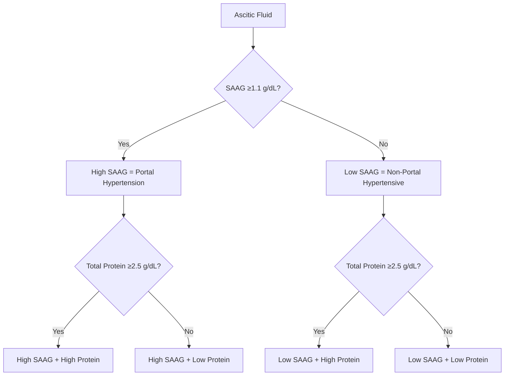
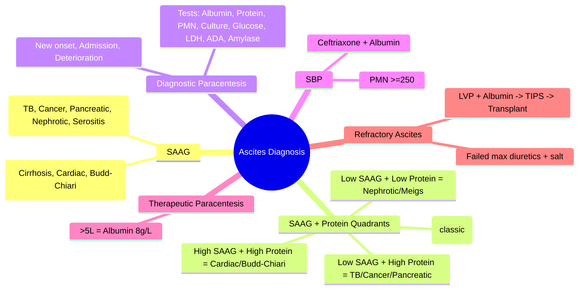

# Ascites: Diagnosis and SAAG

## Learning Objectives
- [ ] Apply SAAG (Serum-Ascites Albumin Gradient) for classification
- [ ] Perform diagnostic paracentesis with appropriate tests
- [ ] Differentiate transudative vs exudative ascites (SAAG vs protein-based)
- [ ] Know indications for therapeutic paracentesis
- [ ] Identify FCPS/MRCP high-yield diagnostic pitfalls

---

## Pathophysiology of Ascites in Cirrhosis

```mermaid
flowchart LR
    A[Portal Hypertension] --> B[Splanchnic Vasodilation]
    B --> C[Effective Arterial Hypovolemia]
    C --> D[Neurohormonal Activation<br/>RAAS, SNS, ADH]
    D --> E[Na+ & Water Retention]
    E --> F[Plasma Volume Expansion]
    F --> G[Overflow into Peritoneum<br/>(Ascites)]
    A --> H[Hypoalbuminemia]
    H --> I[Low Oncotic Pressure]
    I --> G
```

---

## SAAG: The Key Classifier

> **SAAG = Serum Albumin − Ascitic Fluid Albumin**

| SAAG | Classification | Pathophysiology | Causes |
|------|----------------|-----------------|--------|
| **≥1.1 g/dL (11 g/L)** | **High SAAG** (Portal Hypertensive) | **↑ Hydrostatic pressure** | Cirrhosis, Alcoholic hepatitis, Cardiac ascites, Budd-Chiari, Massive liver metastases, Portal vein thrombosis |
| **<1.1 g/dL (11 g/L)** | **Low SAAG** (Non-Portal Hypertensive) | **↑ Vascular permeability / ↓ Oncotic** | Peritoneal carcinomatosis, Tuberculous peritonitis, Pancreatic ascites, Nephrotic syndrome, Serositis (SLE), Biliary ascites |

> **FCPS/MRCP Pearl**: **SAAG ≥1.1 = Portal Hypertension** with 97% accuracy — **superior to old transudate/exudate (protein-based) classification**

---

## Diagnostic Paracentesis: Indications & Tests

### Indications (Mandatory)
- **New-onset ascites**
- **Hospitalized with ascites** (admission paracentesis)
- **Clinical deterioration** (fever, abdominal pain, worsening HE, renal impairment)
- **Suspected SBP**

### Tests to Send
| Test | Purpose |
|------|---------|
| **Albumin (serum + ascites)** | **Calculate SAAG** |
| **Total protein** | Secondary classification |
| **Cell count + differential (PMN)** | **Diagnose SBP (PMN ≥250)** |
| **Culture** | **Bedside inoculation in blood culture bottles** |
| **Glucose** | Low in secondary peritonitis/TB |
| **LDH** | High in secondary peritonitis |
| **Amylase** | High in pancreatic ascites |
| **Cytology** | If malignancy suspected (low yield, needs >100mL) |
| **ADA** | High in TB peritonitis |
| **Triglycerides** | High in chylous ascites |

---

## SAAG vs Total Protein: The 2×2 Table



| Quadrant | SAAG | Protein | Typical Causes |
|----------|------|---------|----------------|
| **1** | High (≥1.1) | High (≥2.5) | Cardiac ascites, Budd-Chiari, Early cirrhosis, Hepatic sinusoidal obstruction |
| **2** | **High (≥1.1)** | **Low (<2.5)** | **Cirrhosis (most common), Alcoholic hepatitis, Portal vein thrombosis** |
| **3** | Low (<1.1) | High (≥2.5) | **Peritoneal carcinomatosis, TB peritonitis, Pancreatic ascites, Serositis** |
| **4** | Low (<1.1) | Low (<2.5) | Nephrotic syndrome, Hypothyroidism, Meigs syndrome |

---

## Ascitic Fluid Analysis Quick Reference

| Parameter | Normal | Cirrhotic Ascites | SBP | TB Peritonitis | Carcinomatosis | Pancreatic |
|-----------|--------|-------------------|-----|----------------|----------------|------------|
| **SAAG** | — | **≥1.1** | **≥1.1** | <1.1 | <1.1 | <1.1 |
| **Total Protein** | — | Low (<2.5) | Low | High (>2.5) | High (>2.5) | High (>2.5) |
| **PMN** | <250 | <250 | **≥250** | ↑ (lymphocytic) | Variable | ↑ |
| **Glucose** | = Serum | Normal | Low/Normal | **Low (<50)** | **Low (<50)** | Low |
| **LDH** | <Serum ULN | <Serum ULN | <Serum ULN | **High (>Serum ULN)** | High | **Very High** |
| **ADA** | — | Low | Low | **High (>39)** | Variable | — |
| **Amylase** | = Serum | Normal | Normal | Normal | Normal | **High (>Serum)** |
| **Triglycerides** | — | <200 | — | — | — | — |
| **Cytology** | — | Negative | Negative | Negative | **Positive (30-50%)** | — |

---

## Therapeutic Paracentesis

### Indications
- **Tense ascites** causing respiratory compromise, abdominal pain, renal impairment
- **Refractory ascites** (see below)
- **Pre-TIPS / Pre-transplant** volume management

### Technique
- **Large-volume paracentesis (LVP)**: >5L removal
- **Albumin infusion**: **8 g per liter removed** (if >5L)
  - Example: 8L removed → 64g albumin (e.g., 200mL 20% or 400mL 5%)
- **No albumin needed** if ≤5L removed

### Complications
- **Paracentesis-induced circulatory dysfunction (PICD)**: Prevented by albumin
- **Bleeding**: Rare (correct coagulopathy if INR>2.5 or plt<50)
- **Infection**: Sterile technique
- **Bowel perforation**: Rare with ultrasound guidance

---

## Refractory Ascites: Definition (ICA)

> **Ascites unresponsive to sodium restriction (88 mmol/day) + high-dose diuretics (spironolactone 400mg + furosemide 160mg) OR diuretic-intolerant (renal, electrolytes, HE)**

| Type | Definition |
|------|------------|
| **Diuretic-resistant** | No response to max diuretics + salt restriction |
| **Diuretic-intractable** | Complications prevent diuretic use (AKI, hyponatremia, HE) |

---

## Management of Refractory Ascites

| Option | Indication | Details |
|--------|------------|---------|
| **Serial LVP + Albumin** | First-line | Every 2-4 weeks; albumin 8g/L removed |
| **TIPS** | Child-Pugh A/B, no severe HE, age<70, no cardiopulmonary disease | Reduces LVP frequency; ↑ HE risk (20-30%) |
| **Alfapump** | TIPS contraindicated | Subcutaneous pump moves ascites to bladder |
| **Liver Transplant** | **Definitive** | Refer all refractory ascites |

---

## FCPS/MRCP High-Yield Summary

| Concept | Key Points |
|---------|------------|
| **SAAG ≥1.1** | Portal hypertension (cirrhosis, cardiac, Budd-Chiari) |
| **SAAG <1.1** | Non-portal hypertensive (TB, carcinomatosis, pancreatic) |
| **PMN ≥250** | SBP (culture-negative = still SBP) |
| **Diagnostic paracentesis** | New onset, admission, deterioration |
| **Therapeutic LVP** | Albumin 8g/L if >5L removed |
| **Refractory ascites** | No response to spiro 400 + furo 160 + salt restriction |
| **TIPS for refractory** | Child A/B, no severe HE, age<70 |

---

## Viva Questions

1. **What is SAAG? How is it calculated? What is the cut-off?**
2. **Why is SAAG superior to protein-based transudate/exudate classification?**
3. **Interpret: SAAG 1.3, Protein 1.8, PMN 300.**
3. **Interpret: SAAG 0.8, Protein 3.5, PMN 150, ADA 60.**
4. **What tests on diagnostic paracentesis?**
5. **When do you give albumin after LVP? How much?**
6. **Define refractory ascites (ICA criteria).**
7. **Management options for refractory ascites?**
8. **Differentiate cirrhotic ascites from TB peritonitis.**
9. **What is chylous ascites? Triglyceride level?**
10. **What is the albumin dose after LVP?**

---

## Confusions & Mnemonics

| Confusion | Clarification |
|-----------|---------------|
| SAAG vs Protein | **SAAG classifies by pressure (hydrostatic); Protein classifies by permeability** — SAAG is more accurate |
| High SAAG + High Protein | Not cirrhosis — think Cardiac, Budd-Chiari, Massive mets |
| Low SAAG + High Protein | Think TB (high ADA, low glucose) or Cancer (cytology) |
| LVP albumin | **Only if >5L removed**; 8g per liter removed |
| Refractory ascites | Must have FAILED max diuretics (spiro 400 + furo 160) + salt restriction |
| TIPS for ascites | NOT for Child C, severe HE, pulmonary HTN, age>70 |

---

## Mind Map



---

## One-Page Revision Card

| **SAAG** | **Interpretation** | **Typical Causes** |
|----------|-------------------|-------------------|
| **≥1.1 g/dL** | Portal Hypertension | Cirrhosis, Alcoholic hepatitis, Cardiac, Budd-Chiari, PV thrombosis |
| **<1.1 g/dL** | Non-Portal Hypertensive | TB peritonitis, Carcinomatosis, Pancreatic, Nephrotic, Serositis |

| **Quadrant** | **SAAG** | **Protein** | **Causes** |
|--------------|----------|-------------|------------|
| 1 | High | High | Cardiac, Budd-Chiari |
| 2 | **High** | **Low** | **Cirrhosis (classic)** |
| 3 | Low | High | TB, Cancer, Pancreatic |
| 4 | Low | Low | Nephrotic, Meigs |

| **Test** | **Key Cut-off** |
|----------|-----------------|
| PMN | ≥250 = SBP |
| Glucose | <50 = Secondary/TB |
| LDH | >Serum ULN = Secondary |
| ADA | >39 = TB |
| Amylase | >Serum = Pancreatic |
| Triglycerides | >200 = Chylous |

---

## Spaced Repetition Tracker

| Day | 1 | 3 | 7 | 15 | 30 |
|-----|---|---|---|----|----|
| SAAG formula & cutoff | ☐ | ☐ | ☐ | ☐ | ☐ |
| 4 quadrants | ☐ | ☐ | ☐ | ☐ | ☐ |
| Diagnostic paracentesis tests | ☐ | ☐ | ☐ | ☐ | ☐ |
| LVP albumin rule | ☐ | ☐ | ☐ | ☐ | ☐ |
| Refractory ascites definition | ☐ | ☐ | ☐ | ☐ | ☐ |

---

## Self-Test Scorecard

| Question | My Answer | Correct? |
|----------|-----------|----------|
| SAAG formula |  |  |
| SAAG ≥1.1 means |  |  |
| Quadrant for cirrhosis |  |  |
| Albumin after LVP |  |  |
| Refractory ascites criteria |  |  |

---

## Local Navigation

- [[Portal Hypertension and Complications/Ascites management|Ascites Management]]
- [[Portal Hypertension and Complications/Spontaneous bacterial peritonitis (SBP)|SBP]]
- [[Portal Hypertension and Complications/Refractory ascites|Refractory Ascites]]
- [[Portal Hypertension and Complications/Hepatorenal Syndrome|HRS]]
- [[Portal Hypertension and Complications/Hepatic Encephalopathy|HE]]