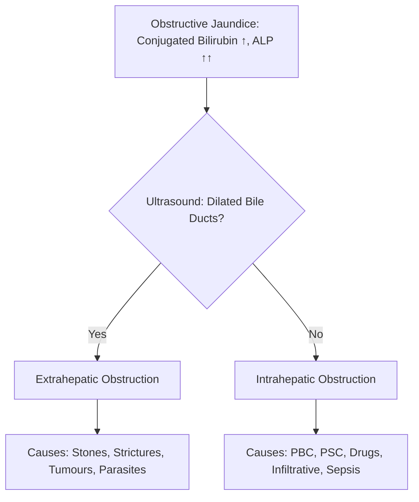
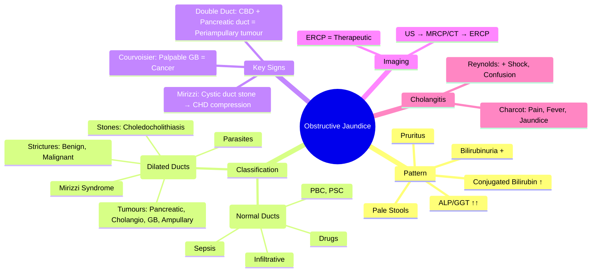

## 1. Learning Objectives
- [ ] Define obstructive jaundice and its pathophysiology
- [ ] Differentiate intrahepatic vs extrahepatic obstruction
- [ ] Apply diagnostic imaging algorithm (US → CT/MRCP/ERCP)
- [ ] Identify common causes (stones, strictures, tumours)
- [ ] Recognize FCPS/MRCP high-yield features (Courvoisier's law, Mirizzi syndrome)

---

## 2. Definition & Pathophysiology

```mermaid
flowchart LR
    A[Biliary Obstruction] --> B[Impaired Bile Flow]
    B --> C[↑ Conjugated Bilirubin in Blood]
    C --> D[Conjugated Bilirubinuria (Dark Urine)]
    B --> E[↓ Bile in Intestine]
    E --> F[Pale Stools (Acholic)]
    B --> G[↑ ALP, GGT (Cholestasis)]
    G --> H[Pruritus (Bile Salts)]
```

| Feature | Post-Hepatic (Obstructive) Jaundice |
|---------|-------------------------------------|
| **Bilirubin** | **Conjugated (Direct) ↑↑** |
| **Urine Bilirubin** | **Positive** (conjugated = water-soluble) |
| **Urine Urobilinogen** | **↓/Absent** (no bile → no urobilinogen) |
| **Stool Colour** | **Pale/Acholic** (no stercobilin) |
| **ALP / GGT** | **↑↑** (cholestatic pattern) |
| **ALT / AST** | Mild-moderate ↑ (if acute) |
| **Pruritus** | **Common** (bile salt deposition) |

---

## 3. Intrahepatic vs Extrahepatic Obstruction



### Extrahepatic Obstruction
| Cause | Features |
|-------|----------|
| **Choledocholithiasis** | **Most common**; Pain, intermittent jaundice, cholangitis risk |
| **Pancreatic Head Cancer** | Painless jaundice, weight loss, Courvoisier's sign, ≥60y |
| **Cholangiocarcinoma** | Hilar (Klatskin) → early jaundice; Distal → like pancreatic cancer |
| **Gallbladder Cancer** | Often incidental; porcelain GB, thickened wall |
| **Ampullary Carcinoma** | Early jaundice, GI bleed, better prognosis |
| **Mirizzi Syndrome** | Stone in cystic duct compressing CHD → obstruction |
| **Parasites** | Ascaris, Fasciola (endemic areas) |

### Intrahepatic Obstruction (Cholestasis)
| Cause | Features |
|-------|----------|
| **PBC** | Middle-aged women, AMA+, pruritus, ALP ↑↑ |
| **PSC** | Young men, IBD, beading on MRCP |
| **Drug-induced** | Amox-clav, flucloxacillin, OCP, chlorpromazine |
| **Infiltrative** | Sarcoidosis, TB, Amyloid, Lymphoma, Secondaries |
| **Sepsis/Cholangitis** | Fever, RUQ pain, cholestasis |
| **Benign Recurrent Intrahepatic Cholestasis (BRIC)** | Genetic, recurrent episodes, benign |

---

## 4. Diagnostic Algorithm

```mermaid
flowchart TD
    A[Obstructive Jaundice: Conjugated Bilirubin ↑, ALP ↑↑] --> B[Ultrasound Abdomen]
    B --> C{Common Bile Dilated?}
    C -->|Yes (>8mm)| D[Extrahepatic Obstruction]
    D --> E[CT Abdomen / MRCP]
    E --> F{Stone vs Stricture vs Tumour}
    F -->|Stone| G[ERCP + Sphincterotomy/Extraction]
    F -->|Stricture| H[ERCP + Stent/Biopsy]
    F -->|Tumour| I[CT Chest/Abdo/Pelvis + MDT]
    C -->|No (Normal ducts)| J[Intrahepatic Cholestasis]
    J --> K[LFT Pattern, AMA, IgG4, MRCP]
    K --> L{PBC: AMA+ / PSC: Beading / Drug: History}
    L --> M[Treat Underlying Cause]
```

---

## 5. Key Clinical Rules

### Courvoisier's Law
> **"In the presence of jaundice, a palpable gallbladder is unlikely to be due to stones"**
- **Palpable GB + Jaundice** → **Malignant obstruction** (Pancreatic cancer, Cholangiocarcinoma)
- **Stone obstruction** → Chronic inflammation → Fibrotic, contracted GB → Not palpable

### Mirizzi Syndrome
- **Stone impacted in cystic duct/Hartmann's pouch** → Extrinsic compression of CHD
- **Type I**: Compression only
- **Type II-IV**: Cholecystocholedochal fistula (erosion into CHD)
- **Diagnosis**: MRCP/ERCP; **Management**: Subtotal cholecystectomy + fistula repair

### Double Duct Sign
- **Simultaneous dilation of CBD and Pancreatic Duct** on imaging
- **Highly specific for Periampullary Tumour** (Pancreatic head, Ampullary, Distal CBD)

---

## 6. Imaging Modalities

| Modality | Role | Advantages | Limitations |
|----------|------|------------|-------------|
| **US** | **First-line** | Cheap, no radiation, detects dilation, GB stones | Operator dependent; misses distal CBD stones; obesity/gas limit |
| **MRCP** | **Best non-invasive** | Excellent ductal anatomy, no contrast, no radiation | Expensive; claustrophobia; no therapeutic |
| **CT** | **Staging tumours** | Good for mass, nodes, mets, vascular invasion | Contrast nephrotoxicity; radiation |
| **ERCP** | **Therapeutic** | Stone extraction, stenting, biopsy | **Invasive**; Pancreatitis risk (5-10%); Needs expertise |
| **EUS** | **Staging + FNA** | High resolution, FNA, no radiation | Operator dependent; invasive |
| **PTC** | **Proximal obstruction** | Access when ERCP fails | Invasive, radiation |

---

## 7. Management by Cause

| Cause | Management |
|-------|------------|
| **Choledocholithiasis** | **ERCP + Sphincterotomy + Stone Extraction** → Cholecystectomy (same admission or interval) |
| **Cholangitis** | **Antibiotics + Urgent ERCP** (within 24h if severe) |
| **Pancreatic Cancer** | **Resectable**: Whipple; **Borderline**: Neoadjuvant → Surgery; **Unresectable**: Stent + Chemo |
| **Cholangiocarcinoma** | **Resectable**: Hepatectomy ± Caudate; **Unresectable**: Stent + Chemo |
| **PBC** | UDCA 13-15mg/kg |
| **PSC** | Ursodeoxycholate (controversial); Dominant stricture dilatation; IBD control |
| **Drug-induced** | Stop offending drug |

---

## 8. FCPS/MRCP High-Yield Summary

| Concept | Key Points |
|---------|------------|
| **Obstructive jaundice** | Conjugated bilirubin ↑, **Bilirubinuria +**, **Pale stools**, **ALP/GGT ↑↑**, Pruritus |
| **Extrahepatic** | Dilated ducts on US → CT/MRCP/ERCP |
| **Intrahepatic** | Normal ducts on US → PBC, PSC, Drugs, Infiltrative |
| **Courvoisier's Law** | Palpable GB + Jaundice = **Malignancy** (not stones) |
| **Mirizzi Syndrome** | Cystic duct stone compressing CHD |
| **Double Duct Sign** | CBD + Pancreatic duct dilation = Periampullary tumour |
| **ERCP** | Therapeutic (stones, stents); Pancreatitis risk |
| **MRCP** | Best non-invasive diagnostic |
| **Cholangitis** | Charcot's triad (Pain, Fever, Jaundice) + Reynolds' pentad (Shock, Confusion) |

---

## 9. Viva Questions

1. **What is the bilirubin pattern in obstructive jaundice?**
2. **Differentiate intrahepatic from extrahepatic obstruction.**
3. **State Courvoisier's law and its clinical significance.**
4. **What is Mirizzi syndrome? Types?**
5. **What is the double duct sign?**
6. **Describe the imaging algorithm for obstructive jaundice.**
7. **When do you do ERCP vs MRCP vs PTC?**
8. **What is Charcot's triad? Reynolds' pentad?**
9. **Management of choledocholithiasis?**
10. **Differentiate pancreatic cancer from cholangiocarcinoma presentation.**

---

## 10. Confusions & Mnemonics

| Confusion | Clarification |
|-----------|---------------|
| Obstructive vs Hepatic | Obstructive: **Conjugated bilirubin**, **ALP↑↑**, pale stools, bilirubinuria; Hepatic: Mixed, normal stools |
| Courvoisier's: Palpable GB | Stone = contracted GB (fibrosis); Cancer = distended GB (no prior inflammation) |
| MRCP vs ERCP | **MRCP = Diagnostic**; **ERCP = Therapeutic** (but can diagnose too) |
| PBC vs PSC obstruction | PBC = Intrahepatic, AMA+; PSC = Intra+Extrahepatic, beading, IBD |
| Choledocholithiasis vs Cancer | Stone = Pain, intermittent; Cancer = Painless, progressive, weight loss |
| Cholangitis severity | Charcot's triad = Fever + RUQ pain + Jaundice; Reynolds' pentad = + Shock + Confusion |

---

## 11. Mind Map



---

## 12. One-Page Revision Card

| **Obstructive Jaundice** | **Details** |
|--------------------------|-------------|
| **Bilirubin** | Conjugated (Direct) ↑↑ |
| **Urine** | Bilirubin +, Urobilinogen - |
| **Stools** | Pale / Acholic |
| **LFTs** | ALP ↑↑, GGT ↑↑, ALT/AST mild ↑ |
| **Pruritus** | Common (bile salts) |

| **Extrahepatic** | **Intrahepatic** |
|------------------|------------------|
| Dilated ducts on US | Normal ducts on US |
| Stones, Tumours, Strictures | PBC, PSC, Drugs, Infiltrative |

| **Key Signs** | |
|---------------|--|
| Courvoisier's Law | Palpable GB + Jaundice = Cancer |
| Mirizzi Syndrome | Cystic duct stone → CHD compression |
| Double Duct Sign | CBD + Pancreatic duct dilation = Periampullary tumour |

| **Imaging Algorithm** | |
|-----------------------|--|
| 1. US (First-line) | Dilated? → MRCP/CT |
| 2. MRCP (Best diagnostic) | Plan ERCP |
| 3. ERCP (Therapeutic) | Stones, Stents, Biopsy |

---

## 13. Spaced Repetition Tracker

| Day | 1 | 3 | 7 | 15 | 30 |
|-----|---|---|---|----|----|
| Obstructive bilirubin pattern | ☐ | ☐ | ☐ | ☐ | ☐ |
| Intra vs Extrahepatic | ☐ | ☐ | ☐ | ☐ | ☐ |
| Courvoisier / Mirizzi / Double Duct | ☐ | ☐ | ☐ | ☐ | ☐ |
| Imaging algorithm | ☐ | ☐ | ☐ | ☐ | ☐ |
| Cholangitis triad/pentad | ☐ | ☐ | ☐ | ☐ | ☐ |

---

## 14. Self-Test Scorecard

| Question | My Answer | Correct? |
|----------|-----------|----------|
| Obstructive pattern |  |  |
| Courvoisier's law |  |  |
| Mirizzi syndrome |  |  |
| Double duct sign |  |  |
| ERCP vs MRCP vs PTC |  |  |

---

## 15. Local Navigation

- [[Jaundice and LFT Interpretation/Hepatocellular vs Cholestatic Pattern|LFT Patterns]]
- [[Biliary Tract Disease/Choledocholithiasis|Choledocholithiasis]]
- [[Biliary Tract Disease/Cholangitis|Cholangitis]]
- [[Liver Tumours/Cholangiocarcinoma|Cholangiocarcinoma]]
- [[Biliary Tract Disease/Gallbladder cancer|GB Cancer]]
- [[Autoimmune Liver Disease/PBC (Primary Biliary Cholangitis)|PBC]]
- [[Autoimmune Liver Disease/Primary sclerosing cholangitis (PSC)|PSC]]
---

> Auto-generated study sections for "Jaundice and LFT Interpretation" — Ch 23: Hepatology.

## Flashcards (42 generated)

- Q: What is the definition of Jaundice and LFT Interpretation?
  A: A[Obstructive Jaundice: Conjugated Bilirubin ↑, ALP ↑↑] --> B{Ultrasound: Dilated Bile Ducts?}
- Q: What is Bilirubin of Jaundice and LFT Interpretation?
  A: Conjugated (Direct) ↑↑
- Q: What is Urine Bilirubin of Jaundice and LFT Interpretation?
  A: Positive (conjugated = water-soluble)
- Q: What is Urine Urobilinogen of Jaundice and LFT Interpretation?
  A: ↓/Absent (no bile → no urobilinogen)
- Q: What is Stool Colour of Jaundice and LFT Interpretation?
  A: Pale/Acholic (no stercobilin)
- Q: What is ALP / GGT of Jaundice and LFT Interpretation?
  A: ↑↑ (cholestatic pattern)
- Q: What is ALT / AST of Jaundice and LFT Interpretation?
  A: Mild-moderate ↑ (if acute)
- Q: What is Pruritus of Jaundice and LFT Interpretation?
  A: Common (bile salt deposition)
- Q: What is Choledocholithiasis of Jaundice and LFT Interpretation?
  A: Most common; Pain, intermittent jaundice, cholangitis risk
- Q: What is Pancreatic Head Cancer of Jaundice and LFT Interpretation?
  A: Painless jaundice, weight loss, Courvoisier's sign, ≥60y
- Q: What is Cholangiocarcinoma of Jaundice and LFT Interpretation?
  A: Hilar (Klatskin) → early jaundice; Distal → like pancreatic cancer
- Q: What is Gallbladder Cancer of Jaundice and LFT Interpretation?
  A: Often incidental; porcelain GB, thickened wall
- Q: What is Ampullary Carcinoma of Jaundice and LFT Interpretation?
  A: Early jaundice, GI bleed, better prognosis
- Q: What is Mirizzi Syndrome of Jaundice and LFT Interpretation?
  A: Stone in cystic duct compressing CHD → obstruction
- Q: What is Parasites of Jaundice and LFT Interpretation?
  A: Ascaris, Fasciola (endemic areas)
- Q: What is PBC of Jaundice and LFT Interpretation?
  A: Middle-aged women, AMA+, pruritus, ALP ↑↑
- Q: What is PSC of Jaundice and LFT Interpretation?
  A: Young men, IBD, beading on MRCP
- Q: What is Drug-induced of Jaundice and LFT Interpretation?
  A: Amox-clav, flucloxacillin, OCP, chlorpromazine
- Q: What is Infiltrative of Jaundice and LFT Interpretation?
  A: Sarcoidosis, TB, Amyloid, Lymphoma, Secondaries
- Q: What is Sepsis/Cholangitis of Jaundice and LFT Interpretation?
  A: Fever, RUQ pain, cholestasis
- Q: What is Benign Recurrent Intrahepatic Cholestasis (BRIC) of Jaundice and LFT Interpretation?
  A: Genetic, recurrent episodes, benign
- Q: What is Choledocholithiasis of Jaundice and LFT Interpretation?
  A: Most common; Pain, intermittent jaundice, cholangitis risk
- Q: What is Pancreatic Head Cancer of Jaundice and LFT Interpretation?
  A: Painless jaundice, weight loss, Courvoisier's sign, ≥60y
- Q: What is Cholangiocarcinoma of Jaundice and LFT Interpretation?
  A: Hilar (Klatskin) → early jaundice; Distal → like pancreatic cancer
- Q: What is Gallbladder Cancer of Jaundice and LFT Interpretation?
  A: Often incidental; porcelain GB, thickened wall
- Q: What is Ampullary Carcinoma of Jaundice and LFT Interpretation?
  A: Early jaundice, GI bleed, better prognosis
- Q: What is Mirizzi Syndrome of Jaundice and LFT Interpretation?
  A: Stone in cystic duct compressing CHD → obstruction
- Q: What is PBC of Jaundice and LFT Interpretation?
  A: Middle-aged women, AMA+, pruritus, ALP ↑↑
- Q: What is PSC of Jaundice and LFT Interpretation?
  A: Young men, IBD, beading on MRCP
- Q: What is Drug-induced of Jaundice and LFT Interpretation?
  A: Amox-clav, flucloxacillin, OCP, chlorpromazine
- Q: What is Infiltrative of Jaundice and LFT Interpretation?
  A: Sarcoidosis, TB, Amyloid, Lymphoma, Secondaries
- Q: What is Sepsis/Cholangitis of Jaundice and LFT Interpretation?
  A: Fever, RUQ pain, cholestasis
- Q: What is Benign Recurrent Intrahepatic Cholestasis (BRIC) of Jaundice and LFT Interpretation?
  A: Genetic, recurrent episodes, benign
- Q: What is Obstructive jaundice of Jaundice and LFT Interpretation?
  A: Conjugated bilirubin ↑, Bilirubinuria +, Pale stools, ALP/GGT ↑↑, Pruritus
- Q: What is Extrahepatic of Jaundice and LFT Interpretation?
  A: Dilated ducts on US → CT/MRCP/ERCP
- Q: What is Intrahepatic of Jaundice and LFT Interpretation?
  A: Normal ducts on US → PBC, PSC, Drugs, Infiltrative
- Q: What is Courvoisier's Law of Jaundice and LFT Interpretation?
  A: Palpable GB + Jaundice = Malignancy (not stones)
- Q: What is Mirizzi Syndrome of Jaundice and LFT Interpretation?
  A: Cystic duct stone compressing CHD
- Q: What is Double Duct Sign of Jaundice and LFT Interpretation?
  A: CBD + Pancreatic duct dilation = Periampullary tumour
- Q: What is ERCP of Jaundice and LFT Interpretation?
  A: Therapeutic (stones, stents); Pancreatitis risk
- Q: What is MRCP of Jaundice and LFT Interpretation?
  A: Best non-invasive diagnostic
- Q: What is Cholangitis of Jaundice and LFT Interpretation?
  A: Charcot's triad (Pain, Fever, Jaundice) + Reynolds' pentad (Shock, Confusion)

## MCQs (1 generated)

1. **Which of the following best describes Jaundice and LFT Interpretation?**
   A. **A[Obstructive Jaundice: Conjugated Bilirubin ↑, ALP ↑↑] --> B{Ultrasound: Dilated Bile Ducts?}**
   B. An unrelated condition not matching the clinical picture of Jaundice and LFT Interpretation
   C. A complication seen late in the disease course of Jaundice and LFT Interpretation
   D. A condition that mimics Jaundice and LFT Interpretation but has a different underlying cause

## SBA Questions (1 generated)

1. A patient with suspected Jaundice and LFT Interpretation presents with: A[Biliary Obstruction] --> B[Impaired Bile Flow]; B --> C[↑ Conjugated Bilirubin in Blood]; C --> D[Conjugated Bilirubinuria (Dark Urine)]. What is the most likely diagnosis?
   A. **Jaundice and LFT Interpretation**
   B. A condition that mimics Jaundice and LFT Interpretation but is not the same entity
   C. A complication of Jaundice and LFT Interpretation rather than the primary diagnosis
   D. An unrelated condition in the same clinical category as Jaundice and LFT Interpretation

## PasTest Scenario SBAs (Clinical Vignettes)

> **Auto-generated PasTest/Mediscope-style scenario SBAs** grounded in the authored source. Each scenario tests a real clinical fact (triad, specific sign, contraindication, trial, first-line Rx) extracted from the topic. *Source: Ch 23: Hepatology — Post-hepatic (obstructive) jaundice*

**Q1.** Which of the following is characterised by the clinical triad: Pain, Fever, Jaundice?

  - **A.** Post-hepatic (obstructive) jaundice
  - **B.** NAFLD
  - **C.** ALD
  - **D.** Viral hepatitis

  > **Answer: A** — Post-hepatic (obstructive) jaundice
  >
  > *Source:* tones, stents); Pancreatitis risk |
| **MRCP** | Best non-invasive diagnostic |
| **Cholangitis** | Charcot's triad (Pain, Fever, Jaundice) + Reynolds' pentad (Shock, Confusion) |

---
## Viva Questio

