## 1. Learning Objectives
- [ ] Recognise and manage acute cellular rejection (ACR) and antibody-mediated rejection (AMR)
- [ ] Identify and manage biliary complications (leak, stricture)
- [ ] Identify and manage vascular complications (HAT, PVT, HVOT)
- [ ] Manage recurrent disease (HCV, HBV, AIH, PBC, PSC, HCC)
- [ ] Manage renal dysfunction, metabolic syndrome, de novo malignancy
- [ ] Identify FCPS/MRCP high-yield post-transplant management steps

---

## 2. Timeline of Post-Transplant Complications

```mermaid
gantt
    title Post-Liver Transplant Complications Timeline
    dateFormat  X
    axisFormat %d
    section Early (0-30 days)
    Primary Non-Function        :a1, 0, 5
    Hepatic Artery Thrombosis   :a2, 0, 14
    Biliary Leak                :a3, 5, 30
    Acute Cellular Rejection    :a4, 5, 30
    Infection (Bacterial/Fungal):a5, 0, 30
    section Intermediate (1-12 months)
    Biliary Stricture           :b1, 30, 365
    Chronic Rejection           :b2, 90, 365
    Recurrent HCV/HBV/HCC       :b3, 180, 1000
    Renal Dysfunction           :b4, 365, 2000
    section Late (>1 year)
    De Novo Malignancy          :c1, 365, 2000
    Metabolic Syndrome          :c2, 365, 2000
    Recurrent PSC/AIH/PBC       :c3, 365, 2000
```

---

## 1. Rejection

### Acute Cellular Rejection (ACR)
| Feature | Detail |
|---------|--------|
| **Timing** | **Days 5-30** (Peak 1-2 weeks); Can Occur Later |
| **Incidence** | **20-40%** (Higher if No Induction) |
| **Diagnosis** | **Liver Biopsy** (Banff Criteria): Portal Inflammation, **Endothelitis**, Bile Duct Injury |
| **Severity** | Mild / Moderate / Severe (Banff) |
| **Treatment** | **Pulse Methylprednisolone 500-1000mg IV ×3 Days** → Oral Taper |
| **Steroid-Refractory** | **Thymoglobulin (ATG)** or **Switch to mTOR** (Sirolimus/Everolimus) |

### Antibody-Mediated Rejection (AMR)
| Feature | Detail |
|---------|--------|
| **Timing** | Variable (Early or Late) |
| **Incidence** | <5% (Increasing with DSA Testing) |
| **Diagnosis** | **C4d+** on Biopsy + **Donor-Specific Antibodies (DSA)** + Histology |
| **Treatment** | **Plasmapheresis + IVIG + Rituximab ± Bortezomib** |
| **Prognosis** | Worse than ACR; Higher Graft Loss |

---

## 2. Biliary Complications

### Biliary Leak
| Feature | Detail |
|---------|--------|
| **Timing** | **Days 7-30** (Peak 2-3 weeks) |
| **Incidence** | 5-15% (DDLT > LDLT) |
| **Presentation** | Bile in Drain, Peritonitis, Fever, Rising Bilirubin/ALP |
| **Diagnosis** | **ERCP** (Gold Standard) / HIDA / CT |
| **Treatment** | **ERCP + Stent** (Primary); Percutaneous Drain; Surgery if Failed |

### Biliary Stricture
| Feature | Detail |
|---------|--------|
| **Timing** | **Months-Years** (Peak 3-12 months) |
| **Incidence** | 10-20% (Anastomotic > Non-Anastomotic) |
| **Types** | **Anastomotic** (Surgical); **Non-Anastomotic (Ischemic)** — More Difficult |
| **Diagnosis** | **MRCP** (Non-Invasive) → **ERCP** (Therapeutic) |
| **Treatment** | **ERCP + Dilatation ± Stent** (Multiple Sessions); Surgery (Hepaticojejunostomy) if Failed |

---

## 3. Vascular Complications

| Complication | Timing | Diagnosis | Management |
|--------------|--------|-----------|------------|
| **Hepatic Artery Thrombosis (HAT)** | **Days 1-30** (Peak 1-2 weeks) | **Doppler US** (Absent HA Flow), Rising AST/ALT, Biliary Ischaemia | **Urgent Re-Transplant** (If Early); Thrombectomy if <24h |
| **Portal Vein Thrombosis (PVT)** | Days-Weeks | **Doppler US** (Absent/Reduced Flow), Ascites, Varices | **Anticoagulation** (Heparin → Warfarin/DOAC); Thrombectomy if Acute |
| **Hepatic Venous Outflow Obstruction (HVOT)** | Days-Weeks | **Doppler US** (Absent/Reversed HWV Flow), Ascites, Hepatomegaly | **Anticoagulation**; Stent/Revision; Re-Transplant if Budd-Chiari |

> **HAT = Most Catastrophic Early Complication** — **Re-Transplant Often Required**

---

## 4. Recurrent Disease

| Disease | Recurrence Rate | Timing | Management |
|---------|----------------|--------|------------|
| **HCV** | **Near 100% Pre-DAA**; **<5% Post-DAA (SVR)** | 6-12 Months (Pre-DAA) | **DAA (SOF/VEL 12w)** >95% SVR |
| **HBV** | **High Without Prophylaxis**; **<5% With HBIG+NA** | Early (1-6 Months) | **NA (ETV/TDF) + HBIG** (High-Dose IV → Low-Dose IM) |
| **AIH** | 20-30% at 5 Years | Variable | Optimise IS (Tac/MMF); Add Steroids if Flare |
| **PBC** | 20-30% at 10 Years | Years | **UDCA 13-15mg/kg** |
| **PSC** | 20-30% at 5-10 Years | Years | Optimise IS; Treat Dominant Strictures; Monitor CCA |
| **HCC** | 10-20% (If Beyond Milan) | 6-24 Months | Resection/Ablation/Systemic/Re-Transplant (Rare) |

---

## 5. Renal Dysfunction

| Feature | Detail |
|---------|--------|
| **Incidence** | **20-30% CKD Stage 3-5 at 5 Years** |
| **Cause** | **CNI Nephrotoxicity** (Tacrolimus/Cyclosporine) |
| **Risk Factors** | Pre-Tx CKD, Diabetes, Hypertension, Older Age, HAT, Sepsis |
| **Management** | **CNI Minimisation** → **mTOR Conversion (Sirolimus/Everolimus)**; ACEi/ARB; Avoid Nephrotoxins |

---

## 6. De Novo Malignancy

| Cancer | Incidence | Risk Factors | Surveillance |
|--------|-----------|--------------|--------------|
| **Skin (SCC/BCC)** | **Most Common** (10-20x General) | Sun Exposure, Azathioprine, Fair Skin | **Annual Dermatology** |
| **PTLD (Post-Transplant Lymphoproliferative Disorder)** | 1-3% | **EBV Mismatch (D+/R-)**, High IS | Monitor EBV DNA; Reduce IS + Rituximab |
| **Lung, Colon, Cervix, Kaposi** | Increased | Smoking, HPV, HHV-8 | Age-Appropriate Screening |

> **CNI → mTOR Switch** Reduces De Novo Malignancy Risk (Anti-Proliferative)

---

## 7. Metabolic Syndrome

| Feature | Detail |
|---------|--------|
| **Incidence** | **50-60%** at 5 Years |
| **Components** | Obesity, Diabetes, Hypertension, Dyslipidaemia |
| **Causes** | Steroids, CNIs (Tac > CsA), mTOR, Lifestyle |
| **Management** | **Steroid Minimisation** → CNI Minimisation → **mTOR Switch**; Lifestyle; Metformin/Statin/ACEi |

---

## 8. Infection

| Period | Typical Pathogens |
|--------|-------------------|
| **0-1 Month** | **Bacterial** (Gram-Neg, Enterococcus), **Fungal** (Candida, Aspergillus), **CMV** (if D+/R-) |
| **1-6 Months** | **CMV** (Peak), **BK Virus**, **Herpesviruses**, **Community Pneumonia**, **UTI** |
| **>6 Months** | **Community-Acquired**, **Chronic Viral (HBV, HCV, HIV)**, **TB** (Endemic) |

| Prophylaxis | Regimen |
|-------------|---------|

*...continued (truncated for renderer performance)*
---

> Auto-generated study sections for "Liver Transplantation" — Ch 23: Hepatology.

## Flashcards (55 generated)

- Q: What is the definition of Liver Transplantation?
  A: | Timing | Days 5-30 (Peak 1-2 weeks); Can Occur Later |
- Q: What is Timing of Liver Transplantation?
  A: Days 5-30 (Peak 1-2 weeks); Can Occur Later
- Q: What is the epidemiology of Liver Transplantation?
  A: 20-40% (Higher if No Induction)
- Q: What is the investigation of choice for Liver Transplantation?
  A: Liver Biopsy (Banff Criteria): Portal Inflammation, Endothelitis, Bile Duct Injury
- Q: What is Severity of Liver Transplantation?
  A: Mild / Moderate / Severe (Banff)
- Q: How is Liver Transplantation managed?
  A: Pulse Methylprednisolone 500-1000mg IV ×3 Days → Oral Taper
- Q: What is Steroid-Refractory of Liver Transplantation?
  A: Thymoglobulin (ATG) or Switch to mTOR (Sirolimus/Everolimus)
- Q: What is Timing of Liver Transplantation?
  A: Variable (Early or Late)
- Q: What is the epidemiology of Liver Transplantation?
  A: <5% (Increasing with DSA Testing)
- Q: What is the investigation of choice for Liver Transplantation?
  A: C4d+ on Biopsy + Donor-Specific Antibodies (DSA) + Histology
- Q: How is Liver Transplantation managed?
  A: Plasmapheresis + IVIG + Rituximab ± Bortezomib
- Q: What is the prognosis of Liver Transplantation?
  A: Worse than ACR; Higher Graft Loss
- Q: What is Timing of Liver Transplantation?
  A: Days 7-30 (Peak 2-3 weeks)
- Q: What is the epidemiology of Liver Transplantation?
  A: 5-15% (DDLT > LDLT)
- Q: What are the clinical features of Liver Transplantation?
  A: Bile in Drain, Peritonitis, Fever, Rising Bilirubin/ALP
- Q: What is the investigation of choice for Liver Transplantation?
  A: ERCP (Gold Standard) / HIDA / CT
- Q: How is Liver Transplantation managed?
  A: ERCP + Stent (Primary); Percutaneous Drain; Surgery if Failed
- Q: What is Timing of Liver Transplantation?
  A: Months-Years (Peak 3-12 months)
- Q: What is the epidemiology of Liver Transplantation?
  A: 10-20% (Anastomotic > Non-Anastomotic)
- Q: How is Liver Transplantation classified?
  A: Anastomotic (Surgical); Non-Anastomotic (Ischemic) — More Difficult
- Q: What is the investigation of choice for Liver Transplantation?
  A: MRCP (Non-Invasive) → ERCP (Therapeutic)
- Q: How is Liver Transplantation managed?
  A: ERCP + Dilatation ± Stent (Multiple Sessions); Surgery (Hepaticojejunostomy) if Failed
- Q: What is the epidemiology of Liver Transplantation?
  A: 20-30% CKD Stage 3-5 at 5 Years
- Q: What causes Liver Transplantation?
  A: CNI Nephrotoxicity (Tacrolimus/Cyclosporine)
- Q: How is Liver Transplantation managed?
  A: CNI Minimisation → mTOR Conversion (Sirolimus/Everolimus); ACEi/ARB; Avoid Nephrotoxins
- Q: What is the epidemiology of Liver Transplantation?
  A: 50-60% at 5 Years
- Q: What is Components of Liver Transplantation?
  A: Obesity, Diabetes, Hypertension, Dyslipidaemia
- Q: What causes Liver Transplantation?
  A: Steroids, CNIs (Tac > CsA), mTOR, Lifestyle
- Q: How is Liver Transplantation managed?
  A: Steroid Minimisation → CNI Minimisation → mTOR Switch; Lifestyle; Metformin/Statin/ACEi
- Q: What is Timing of Liver Transplantation?
  A: Days 5-30 (Peak 1-2 weeks); Can Occur Later
- Q: What is the epidemiology of Liver Transplantation?
  A: 20-40% (Higher if No Induction)
- Q: What is the investigation of choice for Liver Transplantation?
  A: Liver Biopsy (Banff Criteria): Portal Inflammation, Endothelitis, Bile Duct Injury
- Q: What is Severity of Liver Transplantation?
  A: Mild / Moderate / Severe (Banff)
- Q: How is Liver Transplantation managed?
  A: Pulse Methylprednisolone 500-1000mg IV ×3 Days → Oral Taper
- Q: What is Timing of Liver Transplantation?
  A: Variable (Early or Late)
- Q: What is the epidemiology of Liver Transplantation?
  A: <5% (Increasing with DSA Testing)
- Q: What is the investigation of choice for Liver Transplantation?
  A: C4d+ on Biopsy + Donor-Specific Antibodies (DSA) + Histology
- Q: How is Liver Transplantation managed?
  A: Plasmapheresis + IVIG + Rituximab ± Bortezomib
- Q: What is the prognosis of Liver Transplantation?
  A: Worse than ACR; Higher Graft Loss
- Q: What is Timing of Liver Transplantation?
  A: Days 7-30 (Peak 2-3 weeks)
- Q: What is the epidemiology of Liver Transplantation?
  A: 5-15% (DDLT > LDLT)
- Q: What are the clinical features of Liver Transplantation?
  A: Bile in Drain, Peritonitis, Fever, Rising Bilirubin/ALP
- Q: What is the investigation of choice for Liver Transplantation?
  A: ERCP (Gold Standard) / HIDA / CT
- Q: What is Timing of Liver Transplantation?
  A: Months-Years (Peak 3-12 months)
- Q: What is the epidemiology of Liver Transplantation?
  A: 10-20% (Anastomotic > Non-Anastomotic)
- Q: How is Liver Transplantation classified?
  A: Anastomotic (Surgical); Non-Anastomotic (Ischemic) — More Difficult
- Q: What is the investigation of choice for Liver Transplantation?
  A: MRCP (Non-Invasive) → ERCP (Therapeutic)
- Q: How is Liver Transplantation managed?
  A: ERCP + Dilatation ± Stent (Multiple Sessions); Surgery (Hepaticojejunostomy) if Failed
- Q: What is the epidemiology of Liver Transplantation?
  A: 20-30% CKD Stage 3-5 at 5 Years
- Q: What causes Liver Transplantation?
  A: CNI Nephrotoxicity (Tacrolimus/Cyclosporine)
- Q: How is Liver Transplantation managed?
  A: CNI Minimisation → mTOR Conversion (Sirolimus/Everolimus); ACEi/ARB; Avoid Nephrotoxins
- Q: What is the epidemiology of Liver Transplantation?
  A: 50-60% at 5 Years
- Q: What is Components of Liver Transplantation?
  A: Obesity, Diabetes, Hypertension, Dyslipidaemia
- Q: What causes Liver Transplantation?
  A: Steroids, CNIs (Tac > CsA), mTOR, Lifestyle
- Q: How is Liver Transplantation managed?
  A: Steroid Minimisation → CNI Minimisation → mTOR Switch; Lifestyle; Metformin/Statin/ACEi

## MCQs (1 generated)

1. **Which of the following best describes Liver Transplantation?**
   A. **| Timing | Days 5-30 (Peak 1-2 weeks); Can Occur Later |**
   B. An unrelated condition not matching the clinical picture of Liver Transplantation
   C. A complication seen late in the disease course of Liver Transplantation
   D. A condition that mimics Liver Transplantation but has a different underlying cause

