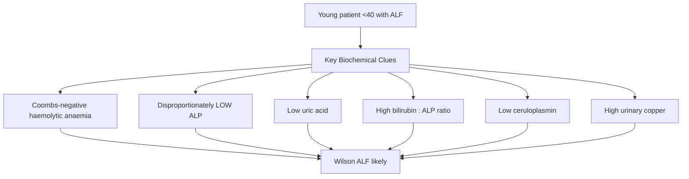
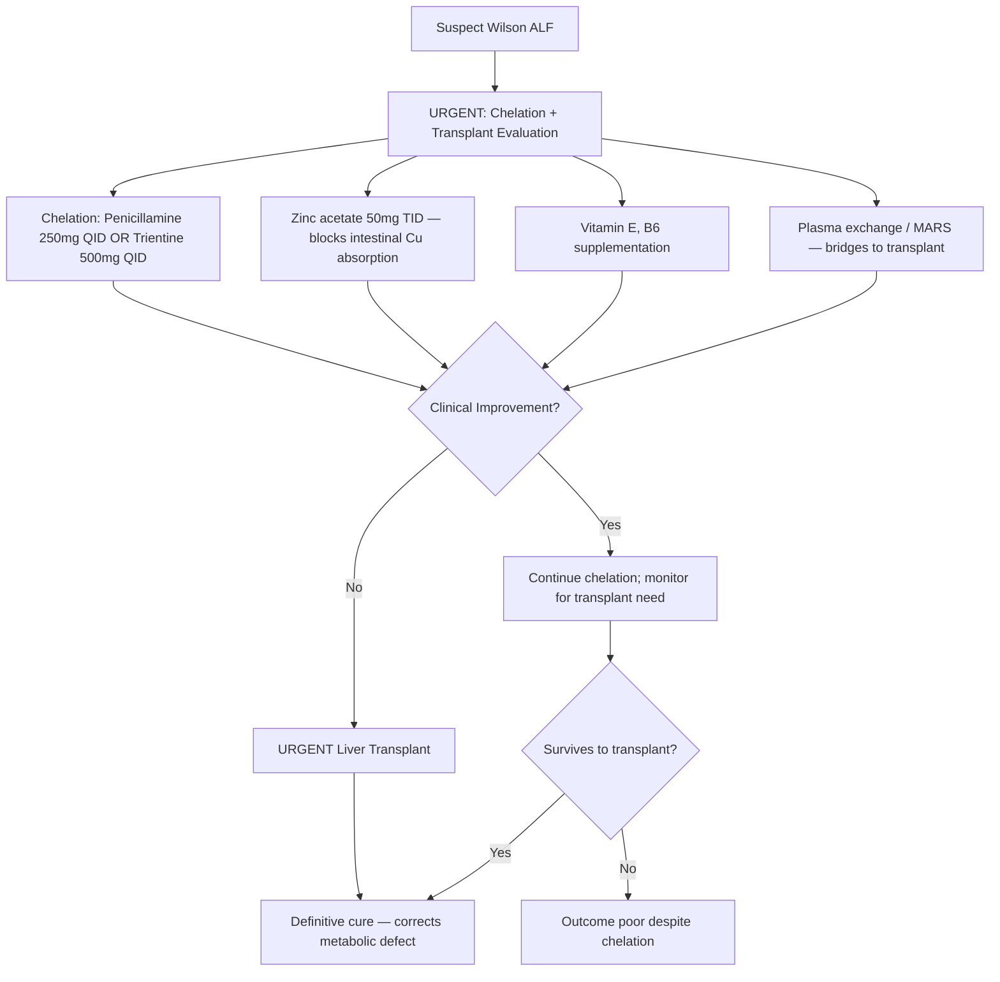
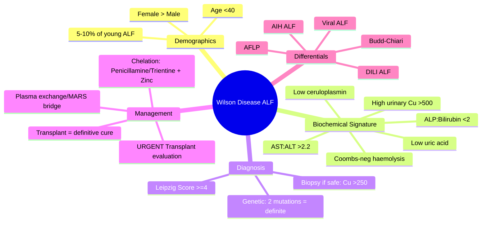

# Wilson Disease Presenting as Acute Liver Failure

## Learning Objectives
- [ ] Recognize Wilson disease as cause of ALF (5-10% of young ALF)
- [ ] Apply diagnostic criteria (Leipzig score, biochemical clues)
- [ ] Differentiate Wilson ALF from other causes
- [ ] Know urgent management including transplant criteria
- [ ] Identify FCPS/MRCP high-yield distinguishing features

---

## Epidemiology & Clinical Context

| Feature | Wilson ALF |
|---------|------------|
| **Age** | Typically 10-30 years (adolescents/young adults) |
| **Sex** | Female > Male (2:1) |
| **Setting** | Often precipitated by minor illness, pregnancy, surgery |
| **Prognosis without transplant** | **Near 100% mortality** |
| **% of ALF <40 years** | 5-10% (higher in Asia) |

> **FCPS/MRCP Pearl**: Any young person (<40) with ALF of unknown cause = Wilson until proven otherwise

---

## Diagnostic Clues: The "Wilson ALF Phenotype"

### Biochemical Signature (Highly Sensitive)

| Parameter | Wilson ALF | Typical ALF | Why? |
|-----------|------------|-------------|------|
| **ALP : Bilirubin ratio** | **<2 (ALP disproportionately low)** | >4 | Copper toxicity impairs ALP synthesis |
| **AST : ALT ratio** | **>2.2 (AST > ALT)** | Usually ALT > AST | Mitochondrial damage → AST release |
| **Ceruloplasmin** | **Low (<20 mg/dL)** | Normal/↑ (acute phase) | Synthesis defect |
| **Coombs-negative haemolysis** | **Present in 90%** | Rare | Copper release from RBCs |
| **Serum uric acid** | **Low (<3 mg/dL)** | Normal/↑ | Renal tubular copper toxicity → uricosuria |
| **Urinary copper (24h)** | **>100 μg/24h (often >500)** | Normal | Massive hepatic copper release |
| **Liver copper (biopsy)** | **>250 μg/g dry weight** | <50 | Gold standard (if safe) |

> **Key Ratio**: `(ALP IU/L) / (Bilirubin μmol/L)` — **If <2, think Wilson**
> - Alternative: `(ALP × 100) / Bilirubin` <4 (same concept)

---

## Diagnostic Criteria (Leipzig Score)

| Feature | Score |
|---------|-------|
| **Kayser-Fleischer rings** | +2 (present), 0 (absent) |
| **Neurological symptoms** | +2 (severe), +1 (mild), 0 (none) |
| **Ceruloplasmin (mg/dL)** | +2 (<10), +1 (10-20), 0 (>20) |
| **Coombs-neg haemolytic anaemia** | +1 |
| **Liver copper (μg/g)** | +2 (>250), +1 (50-250), -1 (<50) |
| **Urinary copper (μg/24h)** | +2 (>100), +1 (40-100), 0 (<40) |
| **Mutation analysis** | +4 (2 mutations), +1 (1 mutation), 0 (none) |

| Total Score | Interpretation |
|-------------|----------------|
| **≥4** | Wilson disease confirmed |
| **3** | Probable — needs more testing |
| **≤2** | Unlikely |

> **In ALF setting**: Often can't get liver biopsy or KF rings easily → rely on biochemical clues + genetics

---

## Acute vs Chronic Presentation

| Feature | Wilson ALF | Chronic Wilson |
|---------|------------|----------------|
| **Onset** | Acute (days-weeks) | Insidious (years) |
| **Age** | 10-30 | 5-35 |
| **Haemolysis** | Prominent (90%) | Often absent |
| **ALP** | Very low (<200) | Normal/mild ↑ |
| **Ceruloplasmin** | Low (acute phase may ↑ it) | Low |
| **Neuro symptoms** | May be absent | Common |
| **KF rings** | Often absent (acute) | Usually present |
| **Outcome without Tx** | Fatal | Progressive |

---

## Management of Wilson ALF

### Transplant Indications (Wilson ALF)
- **Any ALF with Wilson diagnosis** → transplant evaluation IMMEDIATELY
- King's College Criteria for non-paracetamol ALF apply
- **MELD >20** or **CLIF-C ACLF** grade 2-3
- **No contraindication to transplant** (active sepsis, extrahepatic malignancy)

> **Chelation alone in Wilson ALF has <20% survival** — transplant is definitive

---

## Differential Diagnosis: Wilson ALF Mimics

| Condition | Differentiating Feature |
|-----------|------------------------|
| **Autoimmune Hepatitis ALF** | IgG ↑↑, ANA/SMA/LKM+, ALP normal, NO haemolysis, ceruloplasmin normal/↑ |
| **Viral Hepatitis ALF** | Positive serology, ALP normal, NO haemolysis, ceruloplasmin normal |
| **Drug-Induced ALF** | Temporal drug relationship, RUCAM probable, no haemolysis |
| **Acute Fatty Liver of Pregnancy** | 3rd trimester pregnancy, hypoglycaemia, leucocytosis, NO haemolysis |
| **Budd-Chiari Syndrome** | Abdominal pain, hepatomegaly, ascites, IVC/hepatic vein thrombosis on Doppler |
| **Herpes Simplex Hepatitis** | Immunocompromised, fever, transaminitis >1000, no haemolysis |

---

## FCPS/MRCP High-Yield Summary

| Feature | Wilson ALF |
|---------|------------|
| **Age** | <40 years (peak 10-30) |
| **ALP : Bilirubin ratio** | **<2 (pathognomonic)** |
| **AST : ALT ratio** | **>2.2** |
| **Haemolysis** | Coombs-negative (90%) |
| **Ceruloplasmin** | Low (but acute phase may ↑) |
| **Urinary copper** | >500 μg/24h typical |
| **KF rings** | Often ABSENT in acute presentation |
| **Uric acid** | Low (<3 mg/dL) |
| **Management** | **Transplant = definitive; chelation bridges only** |

---

## Viva Questions

1. **What is the ALP:bilirubin ratio in Wilson ALF? Why is it low?**
2. **Why is ceruloplasmin unreliable in acute Wilson presentation?**
3. **Describe the haemolysis in Wilson ALF: mechanism and Coombs status.**
4. **What is the Leipzig score? How many points for diagnosis?**
4. **Why is chelation alone insufficient in Wilson ALF?**
5. **Differentiate Wilson ALF from AIH ALF.**
6. **What is the role of plasma exchange/MARS in Wilson ALF?**
7. **When do you suspect Wilson in a patient with ALF?**
8. **What is the significance of low uric acid in Wilson ALF?**
9. **Genetic testing: how many mutations needed for diagnosis?**
10. **Can Wilson ALF occur without Kayser-Fleischer rings?**

---

## Confusions & Mnemonics

| Confusion | Clarification |
|-----------|---------------|
| Wilson ALF vs AIH ALF | Wilson: low ALP, haemolysis, low ceruloplasmin, young; AIH: high IgG, autoantibodies, normal ALP, ceruloplasmin normal/↑ |
| Ceruloplasmin in ALF | Acute phase reactant — may be NORMAL in Wilson ALF despite copper overload |
| KF rings in acute | Often ABSENT — need time to develop (months) |
| Chelation vs transplant | Chelation = bridge; Transplant = cure. Survival with chelation alone <20% |
| ALP low = Wilson | ALP disproportionately low vs bilirubin → ratio <2 is key clue |

---

## Mind Map

---

## One-Page Revision Card

| **Wilson ALF Key Features** | **Value** |
|----------------------------|-----------|
| Age | <40 years |
| ALP : Bilirubin ratio | **<2 (pathognomonic)** |
| AST : ALT ratio | **>2.2** |
| Haemolysis | Coombs-negative (90%) |
| Ceruloplasmin | <20 mg/dL (may be normal in acute phase) |
| Urinary copper (24h) | >500 μg typically |
| Uric acid | <3 mg/dL |
| KF rings | Often absent (acute) |
| Survival without transplant | <20% |
| Treatment | **Transplant definitive; chelation bridge only** |

---

## Spaced Repetition Tracker

| Day | 1 | 3 | 7 | 15 | 30 |
|-----|---|---|---|----|----|
| ALP:Bilirubin ratio | ☐ | ☐ | ☐ | ☐ | ☐ |
| Haemolysis type | ☐ | ☐ | ☐ | ☐ | ☐ |
| Leipzig score components | ☐ | ☐ | ☐ | ☐ | ☐ |
| Chelation vs transplant | ☐ | ☐ | ☐ | ☐ | ☐ |
| Wilson vs AIH ALF | ☐ | ☐ | ☐ | ☐ | ☐ |

---

## Self-Test Scorecard

| Question | My Answer | Correct? |
|----------|-----------|----------|
| ALP:Bilirubin ratio in Wilson ALF |  |  |
| Haemolysis mechanism |  |  |
| Why ceruloplasmin unreliable in ALF |  |  |
| Leipzig score points |  |  |
| Management priority |  |  |

---

## Local Navigation

- [[Inherited and Metabolic Liver Disease/Wilson Disease|Wilson Disease]]
- [[Inherited and Metabolic Liver Disease/Wilson disease diagnosis|Wilson Diagnosis]]
- [[Acute Liver Failure/Definition and Aetiology|ALF Definition]]
- [[Acute Liver Failure/King's College Criteria|King's College Criteria]]
- [[Acute Liver Failure/Autoimmune hepatitis presenting as ALF|AIH ALF]]