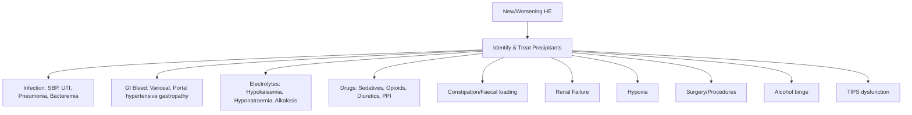
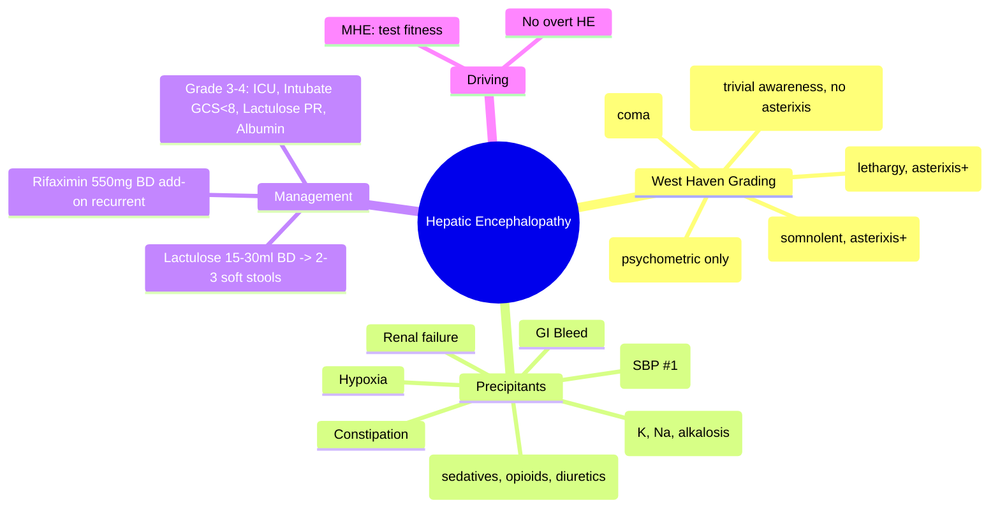

# Hepatic Encephalopathy: West Haven Grading & Management

## Learning Objectives
- [ ] Apply West Haven criteria for HE grading
- [ ] Identify and treat precipitating factors
- [ ] Implement stepwise management (lactulose, rifaximin, albumin)
- [ ] Know ICU management for Grade III-IV
- [ ] Recognize FCPS/MRCP high-yield scenarios

---

## West Haven Grading (Clinical)

| Grade | Consciousness | Intellectual | Behavior | Neurological |
|-------|---------------|--------------|----------|--------------|
| **Covert: Minimal (MHE)** | Normal | **Psychometric tests abnormal** | Normal | Normal |
| **Covert: Grade 1** | **Trivial lack of awareness** | Short attention, impaired arithmetic | Euphoria/anxiety, irritability | **Asterixis absent** |
| **Overt: Grade 2** | **Lethargy** | Disorientation (time), obvious personality change | Inappropriate behavior | **Asterixis PRESENT** |
| **Overt: Grade 3** | **Somnolent but rousable** | Confusion (place), gross disorientation | Bizarre behavior | Asterixis, hyperreflexia, rigidity |
| **Overt: Grade 4** | **Coma (unrousable)** | No response | No response | Decerebrate posturing, seizures |

> **FCPS/MRCP**: Covert (MHE + Grade 1) = no asterixis; Overt (Grade 2-4) = asterixis present

---

## Precipitating Factors (REVERSIBLE - Treat First!)



### Common Precipitants Frequency
| Precipitant | Frequency |
|-------------|-----------|
| Infection (esp. SBP) | 30-50% |
| GI Bleed | 20-30% |
| Diuretic-induced electrolytes | 15-20% |
| Constipation | 10-15% |
| Sedatives/opioids | 10% |
| Renal failure | 10% |

---

## Diagnostic Workup

| Test | Purpose |
|------|---------|
| **Clinical grading** | West Haven (essential) |
| **Ammonia** | Supportive (not diagnostic); arterial > venous |
| **CT/MRI Brain** | Exclude structural (ICH, stroke) if atypical |
| **EEG** | Triphasic waves (non-specific) |
| **Psychometric tests** | Number connection test, digit symbol (for MHE) |

> **Ammonia**: Correlates poorly with grade; useful if diagnostic doubt; arterial preferred

---

## Management Algorithm

```mermaid
flowchart TD
    A[Diagnose HE + Grade] --> B[Treat Precipitants]
    B --> C{Grade 1-2?}
    C -->|Yes| D[Lactulose 15-30ml BD PO/PR]
    D --> E[Target: 2-3 soft stools/day]
    E --> F{Response?}
    F -->|Yes| G[Continue; Add Rifaximin if recurrent]
    F -->|No| H[Increase lactulose; Add Rifaximin; Check adherence]
    C -->|Grade 3-4| I[ICU Admission]
    I --> J[Airway protection: Intubate if GCS<8]
    I --> K[Lactulose PR 300ml in 700ml water/NS q4-6h]
    I --> L[Rifaximin 550mg BD NG/PO if swallowing]
    I --> M[Albumin 20-40g/day if Cirrhosis + AKI/HE]
    I --> N[Treat precipitants aggressively]
    I --> O[Consider L-ornithine L-aspartate (LOLA)]
    I --> P[EEG if non-convulsive seizures suspected]
```

---

## Pharmacotherapy

### 1. Lactulose (First-Line)
| Route | Dose | Target |
|-------|------|--------|
| **Oral** | 15-30 mL BD (10-20g) | **2-3 soft stools/day** |
| **Rectal (Grade 3-4)** | 300 mL in 700 mL water/NS | Retain 30-60 min; q4-6h |

**Mechanism**: Acidifies colon → NH₄⁺ trapped → ↓ absorption; laxation → ↓ colonic bacteria

### 2. Rifaximin (Add-On for Recurrent/Refractory)
| Indication | Dose | Evidence |
|------------|------|----------|
| **Recurrent HE (≥2 episodes)** | 550 mg BD | **Reduces recurrence 50%** (RCT) |
| **Refractory to lactulose** | 550 mg BD | Add to lactulose |

**Mechanism**: Non-absorbable antibiotic → ↓ ammonia-producing bacteria

### 3. Other/Adjunctive
| Agent | Role | Evidence |
|-------|------|----------|
| **L-ornithine L-aspartate (LOLA)** | IV/PO; enhances urea cycle | Modest benefit; adjunct |
| **Albumin** | 20-40g/day in cirrhosis + AKI/HE | Binds toxins; improves hemodynamics |
| **Probiotics** | VSL#3, others | Limited evidence; not standard |
| **Zinc** | If deficient | Adjunct only |
| **Branched-chain amino acids (BCAA)** | Malnutrition + HE | Not routine |

---

## Grade-Specific Management

### Covert HE (MHE + Grade 1)
- **Lactulose** if symptomatic/impairs driving/work
- **Rifaximin** if recurrent
- **Assess fitness to drive** (legal requirement in many countries)
- **Psychometric testing** for diagnosis

### Overt HE Grade 2
- **Ward management**
- Lactulose PO/PR to target stools
- Identify/treat precipitants
- Rifaximin add-on if recurrent

### Overt HE Grade 3-4 (ICU)
| Intervention | Detail |
|--------------|--------|
| **Airway** | Intubate if GCS ≤8 (protect from aspiration) |
| **Lactulose PR** | 300mL in 700mL q4-6h (retain 30-60 min) |
| **Rifaximin** | 550mg BD NG/PO |
| **Albumin** | 20-40g/day if cirrhosis |
| **Precipitants** | Antibiotics, correct electrolytes, stop sedatives |
| **Monitoring** | q1-2h neuro checks, ICP if indicated |
| **EEG** | If non-convulsive status epilepticus suspected |

---

## Driving & Legal (FCPS/MRCP High-Yield)

| Grade | Driving Advice |
|-------|----------------|
| **MHE** | Assess with psychometric tests; restrict if impaired |
| **Grade 1** | **Do not drive** until resolved + specialist clearance |
| **Grade 2-4** | **Absolute prohibition** |

> **UK DVLA**: Must not drive with overt HE; may resume 3 months after last episode if controlled

---

## FCPS/MRCP High-Yield Summary

| Concept | Key Points |
|---------|------------|
| **West Haven** | Covert (MHE, G1): no asterixis; Overt (G2-4): asterixis present |
| **Precipitants** | Infection #1, Bleed #2, Electrolytes #3, Drugs #4, Constipation #5 |
| **Lactulose** | 15-30ml BD → 2-3 soft stools/day; PR for Grade 3-4 |
| **Rifaximin** | 550mg BD add-on for recurrent/refractory (not monotherapy) |
| **Grade 3-4** | ICU, intubate if GCS<8, lactulose PR, albumin, treat precipitants |
| **Ammonia** | Supportive only; poor correlation with grade |
| **Driving** | No driving with overt HE |

---

## Viva Questions

1. **Describe West Haven grades. How to distinguish covert vs overt?**
2. **List 5 precipitating factors for HE.**
3. **What is the lactulose dose and target?**
4. **When do you add rifaximin? Dose?**
5. **Management of Grade 3-4 HE in ICU?**
6. **Role of ammonia in diagnosis?**
7. **Driving restrictions for HE grades?**
8. **Differentiate HE from other causes of confusion in cirrhosis.**
9. **What is minimal HE? How to diagnose?**
10. **Albumin in HE: indications and dose?**

---

## Confusions & Mnemonics

| Confusion | Clarification |
|-----------|---------------|
| Covert vs Overt | Covert (MHE, G1): NO asterixis; Overt (G2-4): asterixis PRESENT |
| Lactulose PR vs PO | PR for Grade 3-4 (unconscious); PO for Grade 1-2 |
| Rifaximin monotherapy | **Not recommended** — always add to lactulose |
| Ammonia level | **Not diagnostic** — correlates poorly; use for support only |
| MHE diagnosis | Psychometric tests (number connection, digit symbol) — not clinical |
| Grade 1 asterixis | **Absent** — asterixis starts at Grade 2 |

---

## Mind Map



---

## One-Page Revision Card

| **Grade** | **Features** | **Asterixis** | **Management** |
|-----------|--------------|---------------|----------------|
| MHE | Psychometric abnormal only | - | Lactulose if symptomatic |
| 1 | Trivial awareness, irritability | **Absent** | Lactulose PO |
| 2 | Lethargy, disorientation(time), asterixis | **Present** | Lactulose PO/PR |
| 3 | Somnolent, confusion(place) | Present | ICU, Lactulose PR, Rifaximin |
| 4 | Coma | Present/untestable | ICU, Intubate, Lactulose PR, Albumin |

| **Drug** | **Dose** | **Target/Indication** |
|----------|----------|----------------------|
| Lactulose PO | 15-30ml BD | 2-3 soft stools/day |
| Lactulose PR | 300ml/700ml q4-6h | Grade 3-4 |
| Rifaximin | 550mg BD | Add-on recurrent/refractory |
| Albumin | 20-40g/day | Cirrhosis + AKI/HE |

---

## Spaced Repetition Tracker

| Day | 1 | 3 | 7 | 15 | 30 |
|-----|---|---|---|----|----|
| West Haven grades | ☐ | ☐ | ☐ | ☐ | ☐ |
| Precipitants list | ☐ | ☐ | ☐ | ☐ | ☐ |
| Lactulose dose/target | ☐ | ☐ | ☐ | ☐ | ☐ |
| Rifaximin indication | ☐ | ☐ | ☐ | ☐ | ☐ |
| Grade 3-4 ICU management | ☐ | ☐ | ☐ | ☐ | ☐ |

---

## Self-Test Scorecard

| Question | My Answer | Correct? |
|----------|-----------|----------|
| Grade 1 vs Grade 2 asterixis |  |  |
| 5 precipitants |  |  |
| Lactulose target stools |  |  |
| Rifaximin dose |  |  |
| Grade 4 management |  |  |

---

## Local Navigation

- [[Portal Hypertension and Complications/Precipitating factors|HE Precipitants]]
- [[Portal Hypertension and Complications/Management (lactulose, rifaximin)|HE Management]]
- [[Acute Liver Failure/Definition and Aetiology|ALF]]
- [[Acute Liver Failure/CLIF-C ACLF and ACLF grades|ACLF]]
- [[Portal Hypertension and Complications/Hepatorenal Syndrome|HRS]]