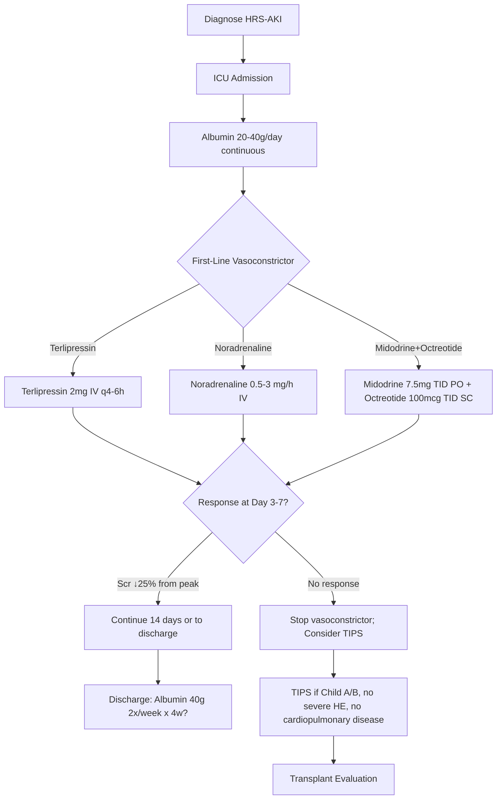

# Hepatorenal Syndrome (HRS-AKI vs HRS-CKD)

## Learning Objectives
- [ ] Apply ICA 2015 diagnostic criteria for HRS-AKI
- [ ] Differentiate HRS-AKI from other causes of AKI in cirrhosis
- [ ] Know terlipressin + albumin regimen and alternatives
- [ ] Understand TIPS and transplant role
- [ ] Identify FCPS/MRCP high-yield management steps

---

## Definition & Classification (ICA 2015)

### HRS-AKI (Acute Kidney Injury) — Replaces "Type 1 HRS"
> **AKI in cirrhosis meeting ICA criteria + no response to volume expansion + no other cause**

### HRS-CKD (Chronic Kidney Disease) — Replaces "Type 2 HRS"
> **Chronic kidney damage (eGFR <60) in cirrhosis with HRS pathophysiology**

| Feature | HRS-AKI | HRS-CKD |
|---------|---------|---------|
| **Onset** | Acute (hours-days) | Chronic (months) |
| **Creatinine rise** | ≥0.3 mg/dL in 48h OR ≥1.5× baseline | Persistent elevation |
| **Urine output** | Often oliguric (<500 mL/day) | Variable |
| **Prognosis** | **Median survival <2 weeks untreated** | Months |
| **Reversibility** | Potentially reversible | Less reversible |

---

## ICA 2015 Diagnostic Criteria for HRS-AKI (ALL Required)

```mermaid
flowchart TD
    A[Cirrhosis + AKI (KDIGO)] --> B{Criteria 1: Cirrhosis + Ascites}
    B --> C{Criteria 2: ICA-AKI Diagnosis}
    C -->|Scr ↑0.3mg/dL/48h OR ↑1.5x baseline| D{Criteria 3: No Response to Volume}
    D -->|Albumin 1g/kg x2 days, NO diuretics| E{Criteria 4: No Shock}
    E --> F{Criteria 5: No Nephrotoxins}
    F --> G{Criteria 6: No Parenchymal Renal Disease}
    G -->|Proteinuria <500mg/d, No hematuria, Normal US| H[Diagnose HRS-AKI]
```

| # | Criterion | Detail |
|---|-----------|--------|
| **1** | Cirrhosis + Ascites | Clinical/radiological |
| **2** | ICA-AKI | Scr ↑≥0.3 mg/dL/48h OR ≥1.5× baseline (within 7d) |
| **3** | No response to volume expansion | Albumin 1 g/kg/day × 48h (max 100g/day) + diuretic withdrawal |
| **4** | No shock | No septic, cardiogenic, hemorrhagic shock |
| **5** | No nephrotoxins | NSAIDs, aminoglycosides, contrast (within 1 week) |
| **6** | No structural kidney disease | Proteinuria <500 mg/d, no hematuria, normal renal US |

> **Urine indices (supportive, not diagnostic)**
- **Urine Na <10 mmol/L** (usually <5)
- **Urine osmolality > plasma osmolality**
- **FENa < 0.1%** (often <0.01%)
- **Urine sediment**: benign (no active sediment)

---

## Pathophysiology: Splanchnic Vasodilation → Renal Vasoconstriction

```mermaid
flowchart LR
    A[Portal Hypertension] --> B[Splanchnic Arterial Vasodilation<br/>(NO, prostaglandins)]
    B --> C[Effective Arterial Hypovolemia]
    C --> D[Neurohormonal Activation<br/>RAAS, SNS, ADH]
    D --> E[Renal Vasoconstriction<br/>(Endothelin, Angiotensin II)]
    E --> F[Reduced RPF & GFR → HRS]
    F --> G[Worsens Ascites, Hyponatremia]
```

---

## Differential Diagnosis: AKI in Cirrhosis

| Cause | Key Features | Differentiator |
|-------|--------------|----------------|
| **HRS-AKI** | Criteria met, urine Na <10, FENa<0.1%, benign sediment | **Diagnosis of exclusion** |
| **Pre-renal (Volume depletion)** | Responds to albumin, urine Na <10 | **Responds to volume** |
| **Acute Tubular Necrosis (ATN)** | Nephrotoxins, sepsis, hypotension, muddy brown casts, urine Na >40, FENa >1% | **Urinary indices + sediment** |
| **Obstructive** | Hydronephrosis on US | **US** |
| **Glomerulonephritis** | Proteinuria >500mg, hematuria, RBC casts | **Proteinuria + active sediment** |
| **Drug-induced** | Temporal relationship, eosinophilia, eosinophiluria | **History + eosinophilia** |

---

## Management Algorithm



---

## Vasoconstrictor Regimens

| Drug | Regimen | Advantages | Disadvantages |
|------|---------|------------|---------------|
| **Terlipressin** (Preferred) | 2 mg IV q4-6h (1 mg if <60kg) ± albumin 20-40g/day | **Best evidence (RCTs)**, IV, predictable | Ischemia risk (digital, gut, cardiac); not in UK/USA (approval varies) |
| **Noradrenaline** | 0.5-3 mg/h IV titration (MAP ↑10-15 mmHg) | ICU available, cheap, short half-life | Requires central line, ICU monitoring |
| **Midodrine + Octreotide** | Midodrine 7.5mg TID PO + Octreotide 100mcg TID SC | Oral/SC, no ICU needed | **Less effective** (mainly US where terlipressin unavailable) |

> **Albumin**: 20-40g/day continuous during vasoconstrictor therapy (total 1-2g/kg over course)

---

## Response Definitions

| Response Type | Criteria |
|---------------|----------|
| **Complete** | Scr ≤1.5 mg/dL (133 μmol/L) |
| **Partial** | Scr decrease ≥25% from peak but >1.5 mg/dL |
| **Non-response** | Scr decrease <25% from peak at Day 7 |

---

## TIPS in HRS

| Indication | Criteria |
|------------|----------|
| **Refractory HRS-AKI** | Failed vasoconstrictor therapy |
| **Child-Pugh** | A or B (Child C: high mortality) |
| **Exclusions** | Severe HE (G3-4), cardiopulmonary disease, sepsis, HCC beyond criteria |
| **Outcome** | Improves renal function in 50-70%; bridge to transplant |

---

## HRS-CKD Management

| Intervention | Role |
|--------------|------|
| **Albumin** | 40g IV 2x/week long-term (ATLANTIC trial: survival benefit) |
| **TIPS** | Selected Child A/B, preserved liver function |
| **Transplant** | **Definitive** — combined liver-kidney if eGFR <30 for >8 weeks |
| **Midodrine/Octreotide** | Symptomatic (no survival benefit) |

---

## FCPS/MRCP High-Yield Summary

| Concept | Key Points |
|---------|------------|
| **Diagnosis** | ICA 2015: Cirrhosis + AKI + no volume response + no shock + no nephrotoxins + no parenchymal disease |
| **Urine indices** | Na <10, FENa <0.1%, osmolality > plasma, benign sediment |
| **First-line** | **Terlipressin 2mg IV q4-6h + Alb 20-40g/day** |
| **Alternatives** | Noradrenaline (ICU), Midodrine+Octreotide (less effective) |
| **Response** | Scr ↓25% at Day 3-7; Continue 14 days |
| **Non-response** | TIPS (Child A/B) → Transplant evaluation |
| **HRS-CKD** | Albumin long-term; TIPS/Transplant |
| **Prognosis** | Untreated HRS-AKI: median survival <2 weeks |

---

## Viva Questions

1. **List the 6 ICA criteria for HRS-AKI diagnosis.**
2. **Differentiate HRS-AKI from ATN in cirrhosis.**
3. **What is the terlipressin dose? Albumin dose?**
4. **What defines response to terlipressin?**
5. **When do you consider TIPS for HRS?**
6. **How does HRS-AKI differ from HRS-CKD?**
7. **What is the pathophysiology of HRS?**
8. **Why is albumin given long-term in HRS-CKD?**
9. **Contraindications to terlipressin?**
10. **Midodrine+Octreotide vs Terlipressin efficacy?**

---

## Confusions & Mnemonics

| Confusion | Clarification |
|-----------|---------------|
| HRS-AKI vs Pre-renal | Both have low urine Na/FENa; **HRS = NO response to albumin volume expansion** |
| HRS-AKI vs ATN | ATN: high urine Na, FENa>1%, muddy casts, nephrotoxin/sepsis history |
| Type 1 vs Type 2 (old) | Type 1 = HRS-AKI (acute, severe); Type 2 = HRS-CKD (chronic, refractory ascites) |
| Terlipressin availability | Not approved in USA/UK; Noradrenaline used instead in ICU |
| Albumin dose in HRS-AKI | 20-40g/day (not 1g/kg/day — that's for DIAGNOSIS volume challenge) |

---

## Mind Map

```mermaid
mindmap
  root((Hepatorenal Syndrome))
    Classification
      HRS-AKI (ex-Type 1): Acute, Scr↑0.3mg/dL/48h, mortal<2wk
      HRS-CKD (ex-Type 2): Chronic, eGFR<60, refractory ascites
    Diagnosis (ICA 2015)
      Cirrhosis + Ascites
      AKI (KDIGO)
      No response to Alb 1g/kg x2d
      No shock
      No nephrotoxins
      No parenchymal disease
      Urine Na<10, FENa<0.1%
    Pathophysiology
      Portal HTN → Splanchnic vasodilation
      Effective hypovolemia → RAAS/SNS/ADH
      Renal vasoconstriction → ↓RPF, ↓GFR
    Management HRS-AKI
      Terlipressin 2mg IV q4-6h + Alb 20-40g/d
      Response: Scr↓25% at Day 3-7
      Continue 14 days
      Fail: TIPS (Child A/B) → Transplant
    Management HRS-CKD
      Alb 40g 2x/week long-term
      TIPS selected
      Transplant (combined LK if eGFR<30 >8wk)
```

---

## One-Page Revision Card

| **HRS-AKI** | **Details** |
|-------------|-------------|
| **ICA Criteria** | Cirrhosis+Ascites, AKI, No vol response, No shock, No nephrotoxins, No parenchymal dz |
| **Urine** | Na<10, FENa<0.1%, Osm>plasma, Benign sediment |
| **First-Line** | Terlipressin 2mg IV q4-6h + Alb 20-40g/day |
| **Response** | Scr↓25% at Day 3-7; Continue 14d |
| **Failure** | TIPS (Child A/B) → Transplant |
| **Mortality untreated** | <2 weeks median |

| **HRS-CKD** | **Details** |
|-------------|-------------|
| **Definition** | Chronic kidney damage in cirrhosis (eGFR<60) |
| **Management** | Alb 40g 2x/week; TIPS; Transplant |

---

## Spaced Repetition Tracker

| Day | 1 | 3 | 7 | 15 | 30 |
|-----|---|---|---|----|----|
| 6 ICA criteria | ☐ | ☐ | ☐ | ☐ | ☐ |
| HRS-AKI vs ATN | ☐ | ☐ | ☐ | ☐ | ☐ |
| Terlipressin regimen | ☐ | ☐ | ☐ | ☐ | ☐ |
| TIPS indications | ☐ | ☐ | ☐ | ☐ | ☐ |

---

## Self-Test Scorecard

| Question | My Answer | Correct? |
|----------|-----------|----------|
| ICA 6 criteria |  |  |
| Terlipressin dose + albumin |  |  |
| Response definition |  |  |
| HRS-AKI vs HRS-CKD |  |  |

---

## Local Navigation

- [[Portal Hypertension and Complications/Hepatorenal Syndrome|HRS Overview]]
- [[Portal Hypertension and Complications/HRS management (terlipressin, albumin, TIPS)|HRS Management]]
- [[Portal Hypertension and Complications/Ascites|Ascites]]
- [[Portal Hypertension and Complications/Spontaneous bacterial peritonitis (SBP)|SBP]]
- [[Acute Liver Failure/CLIF-C ACLF and ACLF grades|ACLF]]