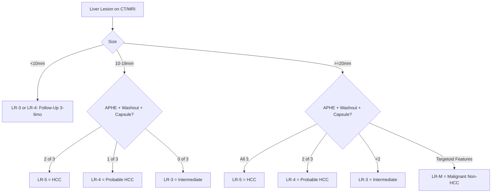
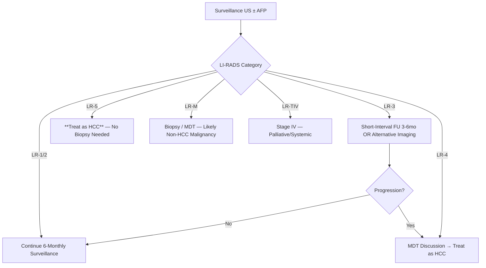
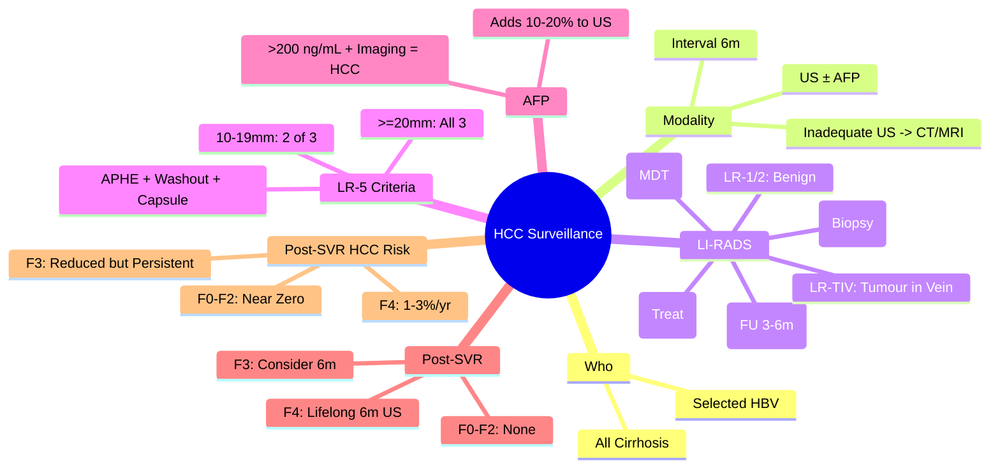

## 1. Learning Objectives
- [ ] Identify patients requiring HCC surveillance
- [ ] Apply LI-RADS categories for imaging diagnosis
- [ ] Know surveillance intervals and modalities
- [ ] Manage LI-RADS 3/4 findings
- [ ] Identify FCPS/MRCP high-yield surveillance criteria

---

## 2. Surveillance: Who and How

### Indications for Surveillance (All Cirrhosis + Selected Non-Cirrhotic)

| Population | Surveillance? |
|------------|---------------|
| **All Cirrhosis** (Child A/B/C) | **YES** |
| **Chronic HBV** (Asian/Male >40, Female >50, Family HCC, High DNA) | **YES** |
| **Chronic HBV** (African >20) | **YES** |
| **NAFLD Cirrhosis** | **YES** |
| **Other Cirrhosis Aetiologies** | **YES** |
| **Non-Cirrhotic HBV** (Low Risk) | No (But Consider if High Risk) |
| **Non-Cirrhotic HCV** (Post-SVR F3) | Consider |

> **FCPS/MRCP**: **All Cirrhosis = Surveillance** — No Exceptions

### Surveillance Protocol

| Modality | Interval | Sensitivity |
|----------|----------|-------------|
| **Ultrasound (US) ± AFP** | **6-Monthly** | US 60-80% (Operator Dependent); AFP Adds 10-20% |
| **CT/MRI** | If US Inadequate / High Risk | CT/MRI >90% |

**Inadequate US**: Obesity, Nodular Liver, Ascites Limiting Views → CT/MRI

---

## 3. LI-RADS (Liver Imaging Reporting and Data System) v2018

### Categories (CT/MRI with Contrast)

| Category | Definition | Management |
|----------|------------|------------|
| **LR-1** | Definitely Benign | Routine Surveillance |
| **LR-2** | Probably Benign | Routine Surveillance |
| **LR-3** | Intermediate Probability | **Short-Interval Follow-Up (3-6mo)** or Alternative Imaging |
| **LR-4** | Probably HCC | **Diagnostic Confidence High** — Treat as HCC (MDT) |
| **LR-5** | **Definitely HCC** | **Treat as HCC** — No Biopsy Needed |
| **LR-M** | **Probably Malignant, Not HCC-Specific** (e.g., CCA, Metastasis) | **Biopsy / MDT** |
| **LR-TIV** | Tumour in Vein | Stage IV |

### LR-5 Criteria (Definite HCC) — ≥10 mm

**Key Features:**
- **APHE** = Arterial Phase Hyperenhancement
- **Washout** = Portal Venous/Delayed Phase Hypoenhancement
- **Capsule** = Enhancing Rim on Portal Venous/Delayed Phase
- **LR-5**: ≥10mm, **Size-Dependent Criteria**:
  - 10-19mm: **2 of 3** (APHE + Washout + Capsule)
  - ≥20mm: **All 3** Required

---

## 4. AFP (Alpha-Fetoprotein)

| Use | Detail |
|-----|--------|
| **Surveillance Adjunct** | Adds 10-20% Sensitivity to US |
| **Diagnostic** | >200 ng/mL + Typical Imaging = HCC (in Cirrhosis) |
| **Monitoring** | Trends During Treatment (TACE, Systemic) |
| **Limitations** | False +ve: Active Hepatitis, Pregnancy, Germ Cell Tumours; False -ve: 30-40% HCC |

---

## 5. Management Algorithm for Surveillance Findings

---

## 6. Post-SVR HCV: Surveillance Continues

| Pre-Treatment Fibrosis | HCC Risk Post-SVR | Surveillance |
|------------------------|-------------------|--------------|
| **F0-F1 (No/Minimal Fibrosis)** | **Near Zero** | **No Routine HCC Surveillance** (unless other risk factors) |
| **F2 (Significant Fibrosis)** | Low | **Consider** US ± AFP 6-Monthly (Guideline Variation) |
| **F3 (Advanced Fibrosis)** | **Reduced but Persistent** | **Yes — 6-Monthly US ± AFP** (Some Guidelines) |
| **F4 (Cirrhosis)** | **Significant (1-3%/Year)** | **MANDATORY — Lifelong 6-Monthly US ± AFP** |

> **Key**: **Cirrhosis = Lifelong HCC Surveillance** Even After SVR12

---

## 7. HCC Diagnosis: Biopsy vs Imaging

| Scenario | Approach |
|----------|----------|
| **LR-5 on CT/MRI** | **No Biopsy Needed** — Treat as HCC |
| **LR-4** | MDT Discussion → Treat as HCC or Biopsy if Uncertain |
| **LR-M** | **Biopsy Required** (Likely CCA/Metastasis) |
| **Non-Cirrhotic** | Biopsy Often Needed for Diagnosis |
| **Pre-Treatment** | Biopsy if Downstaging/Locoregional Therapy Planned |

---

## 8. AFP in Surveillance

| AFP Level | Significance |
|-----------|--------------|
| **<20 ng/mL** | Normal |
| **20-200 ng/mL** | Indeterminate (HCC, Active Hepatitis, Regeneration) |
| **>200 ng/mL** | **Highly Suggestive of HCC** (with Typical Imaging) |
| **>400 ng/mL** | Very High Specificity for HCC |

> **AFP >200 + Typical Imaging = HCC Diagnosis** (in Cirrhosis)

---

## 9. FCPS/MRCP High-Yield Summary

| Concept | Key Points |
|---------|------------|
| **Surveillance** | **All Cirrhosis: US ± AFP 6-Monthly** |
| **Inadequate US** | → CT/MRI |
| **LI-RADS** | LR-5 = Definite HCC (Treat); LR-4 = Probable (MDT); LR-M = Malignant Non-HCC (Biopsy) |
| **LR-5 Criteria** | APHE + Washout + Capsule (Size-Dependent) |
| **AFP** | >200 ng/mL + Imaging = HCC; Adds 10-20% Sensitivity to US |
| **Post-SVR F4** | **Lifelong 6m US ± AFP** (Risk Persists) |
| **Post-SVR F3** | Consider 6m US (Guideline Variation) |
| **Biopsy** | Not Needed for LR-5; Needed for LR-M/Atypical |

---

## 10. Viva Questions

1. **Who needs HCC surveillance? Interval? Modalities?**
2. **What are LI-RADS categories? Which = definite HCC?**
3. **What are LR-5 criteria for 10-19mm vs ≥20mm lesions?**
4. **What is the role of AFP in HCC surveillance?**
5. **Does SVR eliminate HCC risk in cirrhosis?**
5. **What is LR-M? Management?**
6. **What are LR-5 criteria for 15mm lesion?**
7. **When is biopsy needed in HCC diagnosis?**
8. **What is the surveillance for F3 post-SVR?**
9. **What is the double duct sign?**
10. **Why does HCC risk persist in cirrhosis after SVR?**

---

## 11. Confusions & Mnemonics

| Confusion | Clarification |
|-----------|---------------|
| LI-RADS LR-4 vs LR-5 | LR-4 = Probable HCC (MDT); LR-5 = Definite HCC (Treat) |
| LR-M | Malignant but **Not HCC-Specific** (CCA, Metastasis) — Needs Biopsy |
| BCLC B vs C | B = Multinodular, PS0; C = Vascular Invasion/Extrahepatic/PS1-2 |
| Milan vs UCSF | Milan: Single ≤5cm or ≤3 ≤3cm; UCSF: Single ≤6.5cm or ≤3 ≤4.5cm, Total ≤8cm |
| Resection Criteria | Child A, Normal Bilirubin, No Portal Hypertension (HVPG<10) |
| Atezo-Bev | **1st Line for BCLC C** (Superior to Sorafenib) — Contraindicated if High Bleed Risk |
| LR-TIV | Tumour in Vein = Automatic Stage IV |
| F3 Post-SVR | Guidelines Vary — Many Recommend 6m US |
| Lipids Post-SVR | **Paradoxical Increase** (TC, LDL, TG) — Monitor CV Risk |
| Reinfection in PWID | **High** (5-20%/yr) — RNA q6-12mo |

---

## 12. Mind Map

---

## 13. One-Page Revision Card

| **Surveillance** | **Details** |
|------------------|-------------|
| **Who** | All Cirrhosis + Selected HBV |
| **Modality** | US ± AFP |
| **Interval** | **6-Monthly** |

| **LI-RADS** | **Action** |
|-------------|------------|
| LR-1/2 | Routine Surveillance |
| LR-3 | FU 3-6m |
| LR-4 | MDT (Probable HCC) |
| **LR-5** | **Treat as HCC (No Biopsy)** |
| LR-M | Biopsy (Malignant Non-HCC) |
| LR-TIV | Stage IV |

| **LR-5 Criteria** | **10-19mm** | **≥20mm** |
|-------------------|-------------|-----------|
| APHE + Washout + Capsule | **2 of 3** | **All 3** |

| **Post-SVR Surveillance** | |
|--------------------------|--|
| F4 (Cirrhosis) | **Lifelong 6m US ± AFP** |
| F3 | Consider 6m US |
| F0-F2 | None |

| **Milan Criteria** | |
|--------------------|--|
| Single ≤5cm OR ≤3 Nodules ≤3cm | No Vascular Invasion |

---

## 14. Spaced Repetition Tracker

| Day | 1 | 3 | 7 | 15 | 30 |
|-----|---|---|---|----|----|
| Surveillance Criteria | ☐ | ☐ | ☐ | ☐ | ☐ |
| LI-RADS Categories | ☐ | ☐ | ☐ | ☐ | ☐ |
| LR-5 Criteria | ☐ | ☐ | ☐ | ☐ | ☐ |
| AFP Role | ☐ | ☐ | ☐ | ☐ | ☐ |
| Post-SVR Surveillance | ☐ | ☐ | ☐ | ☐ | ☐ |

---

## 15. Self-Test Scorecard

| Question | My Answer | Correct? |
|----------|-----------|----------|
| Surveillance Who/Interval |  |  |
| LR-5 Criteria 10-19mm |  |  |
| LR-5 vs LR-4 |  |  |
| Post-SVR F4 Surveillance |  |  |
| AFP Diagnostic Threshold |  |  |

---

## 16. Local Navigation

- [[Liver Tumours/HCC (Hepatocellular Carcinoma)|HCC]]
- [[Liver Tumours/Metastatic liver disease|Metastatic Liver Disease]]
- [[Liver Tumours/Benign liver tumours|Benign Liver Tumours]]
- [[Liver Transplantation/Liver Transplantation|Liver Transplant]]
- [[Cirrhosis Complications/HCC surveillance|HCC Surveillance in Cirrhosis]]