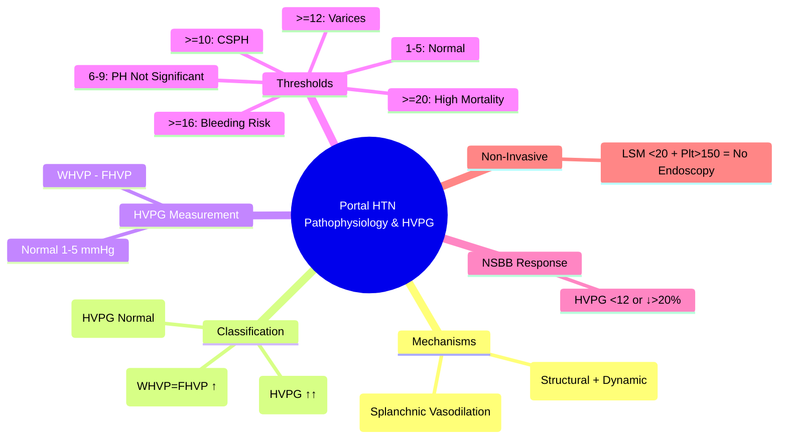

# Pathophysiology of Portal Hypertension & HVPG Measurement

## Learning Objectives
- [ ] Understand the pathophysiology of portal hypertension (increased resistance + increased flow)
- [ ] Apply HVPG measurement technique and interpretation
- [ ] Differentiate pre-sinusoidal, sinusoidal, post-sinusoidal causes
- [ ] Apply clinical significance of HVPG thresholds
- [ ] Identify FCPS/MRCP high-yield concepts

---

## Pathophysiology: The Dual Mechanism

```mermaid
flowchart LR
    A[Portal Hypertension] --> B[Increased Intrahepatic Resistance]
    A --> C[Increased Portal Venous Inflow]
    B --> B1[Structural: Fibrosis, Nodules, Vascular Obliteration]
    B --> B2[Dynamic: Stellate Cell Contraction, Endothelial Dysfunction]
    C --> C1[Splanchnic Vasodilation (NO, Prostaglandins)]
    C --> C2[Increased Cardiac Output]
    C --> C3[Neurohormonal Activation (RAAS, SNS, ADH)]
    B1 & B2 & C1 & C2 & C3 --> D[Portal Pressure ↑↑]
    D --> E[Portosystemic Collaterals]
    D --> F[Ascites]
    D --> G[Varices]
    D --> H[Hepatic Encephalopathy]
    D --> I[Hepatorenal Syndrome]
```

---

## Classification by Site of Resistance

```mermaid
flowchart TD
    A[Portal Hypertension] --> B{Site of Resistance}
    B -->|Pre-sinusoidal| C[Portal Vein Thrombosis]
    B -->|Pre-sinusoidal| D[Schistosomiasis]
    B -->|Pre-sinusoidal| E[Sarcoidosis]
    B -->|Pre-sinusoidal| F[Congenital Hepatic Fibrosis]
    B -->|Sinusoidal| G[Cirrhosis (Most Common)]
    B -->|Sinusoidal| H[Alcoholic Hepatitis]
    B -->|Sinusoidal| I[Venocclusive Disease/SOS]
    B -->|Post-sinusoidal| J[Budd-Chiari Syndrome (HVOT)]
    B -->|Post-sinusoidal| K[Constrictive Pericarditis]
    B -->|Post-sinusoidal| L[TRICUSPID Regurgitation]

    C & D & E & F --> M[HVPG: Normal / Mildly ↑]
    G & H & I --> N[HVPG: ↑↑]
    J & K & L --> O[HVPG: ↑↑↑ (WHVP ≈ FHVP)]
```

| Category | Examples | HVPG Pattern |
|----------|----------|--------------|
| **Pre-sinusoidal** | Portal vein thrombosis, Schistosomiasis, Sarcoidosis, Congenital hepatic fibrosis | **Normal or Mildly ↑** (WHVP = FHVP) |
| **Sinusoidal** | **Cirrhosis (Most Common)**, Alcoholic hepatitis, Veno-occlusive disease (SOS) | **Markedly ↑** (WHVP > FHVP) |
| **Post-sinusoidal** | **Budd-Chiari (HVOT)**, Constrictive pericarditis, Tricuspid regurgitation | **Markedly ↑** (WHVP = FHVP, Both ↑) |

---

## HVPG (Hepatic Venous Pressure Gradient) Measurement


### Technique
| Step | Detail |
|------|--------|
| **Access** | Right Internal Jugular (Preferred) or Femoral Vein |
| **Catheter** | Balloon-Tipped (7-8 Fr) |
| **Position** | Right Hepatic Vein (Under Fluoroscopy) |
| **FHVP** | Free Hepatic Venous Pressure (Balloon Deflated) |
| **WHVP** | Wedged Hepatic Venous Pressure (Balloon Inflated) |
| **HVPG** | **WHVP - FHVP** (Normal: **1-5 mmHg**) |
| **Reproducibility** | Mean of 3 Measurements |

---

## HVPG Thresholds & Clinical Significance

| HVPG (mmHg) | Clinical Significance |
|-------------|----------------------|
| **1-5** | **Normal** |
| **6-9** | **Portal Hypertension** (Not Clinically Significant) |
| **≥10** | **Clinically Significant Portal Hypertension (CSPH)** |
| **≥12** | **Variceal Development Risk** |
| **≥16** | **High Risk Variceal Bleeding** |
| **≥20** | **High Mortality** (Refractory Ascites, HCC, Death) |
| **<12 (Post-Treatment)** | **Goal for NSBB/EVL** (Primary/Secondary Prophylaxis) |
| **<12 or ↓>20% from Baseline** | **HVPG Response to NSBB** |

> **FCPS/MRCP**: **HVPG ≥10 = CSPH**; **HVPG ≥12 = Variceal Risk**; **HVPG ≥20 = Poor Prognosis**

---

## HVPG in Clinical Decision-Making

### 1. Diagnosis of CSPH
- **HVPG ≥10 mmHg** = **Gold Standard** for Clinically Significant Portal Hypertension

### 2. Variceal Risk Stratification
| HVPG | Variceal Risk |
|------|---------------|
| <10 | No Varices |
| 10-12 | Small Varices Possible |
| ≥12 | **High Risk for Large Varices / Bleeding** |

### 3. Primary Prophylaxis Response
- **NSBB Response**: **HVPG <12 mmHg** OR **↓>20% from Baseline**
- **Non-Responder**: Consider EVL

### 4. Acute Variceal Bleeding
- **HVPG ≥20 mmHg**: Predicts Failure to Control Bleeding, Early Rebleeding, Mortality
- **Early HVPG Measurement (≤24h)**: Guides TIPS Decision

### 5. Surgery Risk Assessment
| Surgery Type | HVPG Threshold | Risk |
|--------------|----------------|------|
| **Elective Abdominal** | **≥10** | ↑ Morbidity/Mortality |
| **Major Hepatic Resection** | **≥10** | ↑ Liver Failure Risk |
| **TIPS** | **≥12** | Indicated for Refractory Complications |

---

## Non-Invasive Surrogates for HVPG

| Surrogate | Correlation | Clinical Use |
|-----------|-------------|--------------|
| **Liver Stiffness (FibroScan/VCTE)** | **Good (r=0.7-0.8)** | **Baveno VII**: LSM <20 kPa + Platelets >150 → No Endoscopy |
| **Platelet Count** | Inverse | <150 = CSPH Likely |
| **Spleen Size** | Direct | >13-15 cm = CSPH |
| **Portal Vein Diameter** | Direct | >13 mm = CSPH |
| **Portal Vein Velocity** | Inverse | <16 cm/s = CSPH |

> **FCPS/MRCP**: **HVPG is Gold Standard** but Invasive; **FibroScan + Platelets** = Best Non-Invasive Rule-Out (Baveno VII)

---

## HVPG in Specific Conditions

| Condition | HVPG Pattern | Notes |
|-----------|--------------|-------|
| **Cirrhosis** | ↑↑ (Sinusoidal) | Most Common |
| **Alcoholic Hepatitis** | ↑↑ (Sinusoidal) | May Normalise with Abstinence |
| **Portal Vein Thrombosis** | Normal (Pre-sinusoidal) | Unless Chronic → Cavernous Transformation |
| **Schistosomiasis** | Normal/Mild ↑ (Pre-sinusoidal) | Periportal Fibrosis |
| **Budd-Chiari (HVOT)** | ↑↑↑ (Post-sinusoidal) | WHVP = FHVP, Both ↑ |
| **Congestive Heart Failure** | ↑ (Post-sinusoidal) | WHVP = FHVP |
| **Veno-occlusive Disease (SOS)** | ↑↑ (Sinusoidal) | Post-Transplant/Chemo |

---

## FCPS/MRCP High-Yield Summary

| Concept | Key Points |
|---------|------------|
| **HVPG Formula** | **WHVP - FHVP** |
| **Normal HVPG** | 1-5 mmHg |
| **CSPH** | **≥10 mmHg** |
| **Variceal Risk** | **≥12 mmHg** |
| **NSBB Response** | **HVPG <12 mmHg** OR **↓>20%** |
| **Bleeding Risk** | **≥16 mmHg** (High), **≥20 mmHg** (Very High) |
| **Pre-sinusoidal** | HVPG Normal (WHVP = FHVP) — PVT, Schisto |
| **Post-sinusoidal** | HVPG Normal BUT FHVP/WHVP High — Budd-Chiari |
| **Non-Invasive** | **Baveno VII: LSM <20 kPa + Platelets >150 = No Endoscopy** |

---

## Viva Questions

1. **How is HVPG measured? What does it represent?**
2. **What is the normal HVPG? What is CSPH threshold?**
3. **What HVPG indicates variceal risk? Bleeding risk?**
4. **Differentiate pre-sinusoidal, sinusoidal, post-sinusoidal PH by HVPG pattern.**
5. **What HVPG indicates NSBB response?**
5. **What is the significance of HVPG ≥20 mmHg?**
6. **What are the technical pitfalls in HVPG measurement?**
7. **How does HVPG guide management in acute variceal bleeding?**
8. **What is the Baveno VII criteria to avoid endoscopy?**
9. **How does HVPG differ in Budd-Chiari syndrome?**
10. **What HVPG threshold indicates high mortality?**

---

## Confusions & Mnemonics

| Confusion | Clarification |
|-----------|---------------|
| HVPG Formula | **WHVP - FHVP** |
| CSPH Threshold | **≥10 mmHg** |
| Variceal Risk | **≥12 mmHg** |
| Pre-sinusoidal PH | **HVPG Normal** (WHVP = FHVP) — PVT, Schisto |
| Sinusoidal PH | **HVPG ↑↑** (WHVP > FHVP) — Cirrhosis |
| Post-sinusoidal | **HVPG Normal** BUT **FHVP/WHVP Both High** — Budd-Chiari |
| Baveno VII | **LSM <20 kPa + Platelets >150 = No Endoscopy** |
| NSBB Response | **HVPG <12 OR ↓20%** |

---

## Mind Map



---

## One-Page Revision Card

| **HVPG** | **Formula** | WHVP - FHVP |
|----------|-------------|-------------|
| **Normal** | 1-5 mmHg | |
| **CSPH** | **≥10 mmHg** | |
| **Variceal Risk** | **≥12 mmHg** | |
| **Bleeding Risk** | **≥16 mmHg** | High |
| **Mortality** | **≥20 mmHg** | Very High |

| **Classification** | **HVPG Pattern** | **Examples** |
|--------------------|------------------|--------------|
| **Pre-sinusoidal** | **Normal (WHVP=FHVP)** | PVT, Schistosomiasis |
| **Sinusoidal** | **↑↑ (WHVP>FHVP)** | **Cirrhosis**, Alcoholic Hepatitis |
| **Post-sinusoidal** | **WHVP=FHVP (Both ↑)** | Budd-Chiari, CHF |

| **Clinical Thresholds** | **HVPG** | **Action** |
|-------------------------|----------|------------|
| CSPH | ≥10 | Diagnose CSPH |
| Variceal Risk | ≥12 | Screen/Prophylaxis |
| NSBB Response | <12 or ↓20% | Continue NSBB |
| Bleeding Risk | ≥16 | High Risk |
| TIPS Indication | ≥12 (Refractory) | Consider TIPS |

---

## Spaced Repetition Tracker

| Day | 1 | 3 | 7 | 15 | 30 |
|-----|---|---|---|----|----|
| HVPG Formula | ☐ | ☐ | ☐ | ☐ | ☐ |
| Normal/CSPH Thresholds | ☐ | ☐ | ☐ | ☐ | ☐ |
| Pre/Sinusoidal/Post Patterns | ☐ | ☐ | ☐ | ☐ | ☐ |
| Baveno VII Criteria | ☐ | ☐ | ☐ | ☐ | ☐ |
| NSBB Response HVPG | ☐ | ☐ | ☐ | ☐ | ☐ |

---

## Self-Test Scorecard

| Question | My Answer | Correct? |
|----------|-----------|----------|
| HVPG Formula |  |  |
| CSPH Threshold |  |  |
| Pre-sinusoidal HVPG |  |  |
| Sinusoidal HVPG |  |  |
| NSBB Response Target |  |  |

---

## Local Navigation

- [[Portal Hypertension and Complications/Ascites|Ascites]]
- [[Portal Hypertension and Complications/Varices|Varices]]
- [[Portal Hypertension and Complications/Screening endoscopy|Screening Endoscopy]]
- [[Portal Hypertension and Complications/Primary prophylaxis (NSBB vs EVL)|Primary Prophylaxis]]
- [[Portal Hypertension and Complications/Acute variceal bleeding management|Acute Variceal Bleed]]