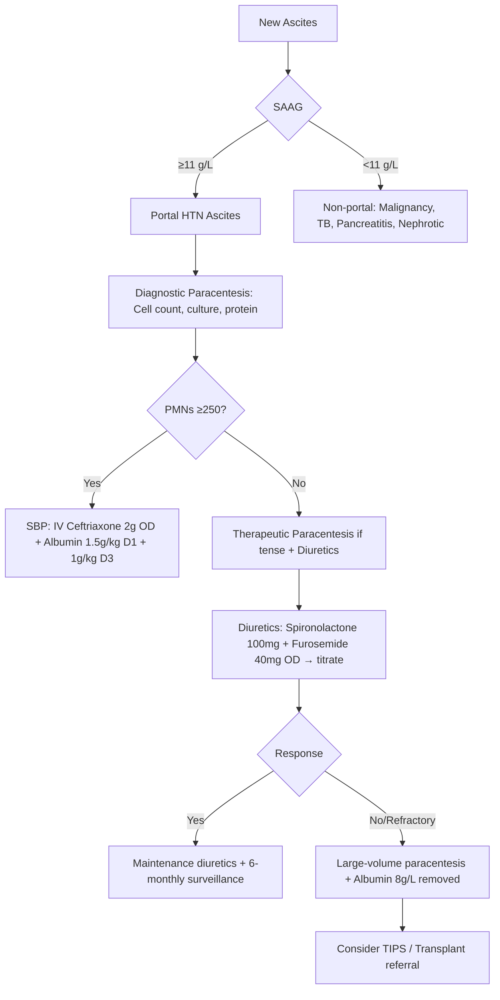
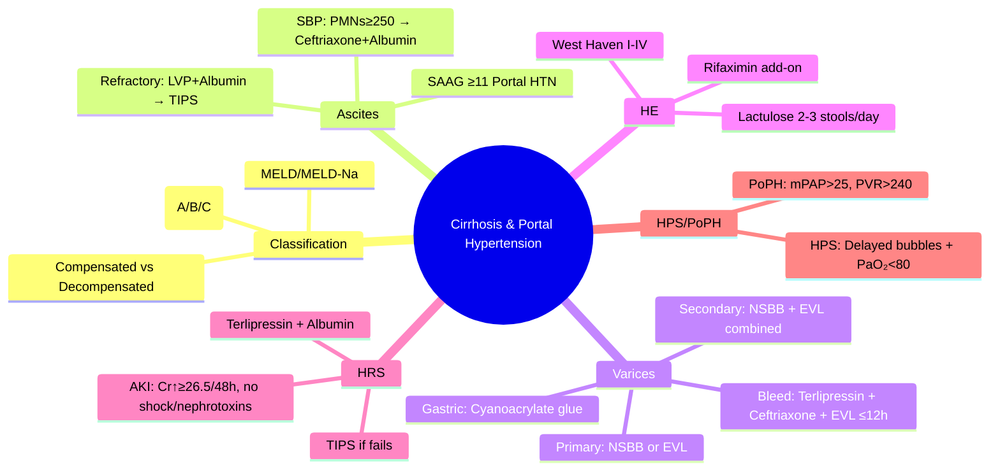

# Cirrhosis and Portal Hypertension

> [!tip] **FCPS/MRCP Priority: HIGH**
> **Cirrhosis & Portal Hypertension = Core hepatology** — Child-Pugh/MELD scoring, ascites (SAAG, SBP, refractory), variceal bleed protocol (vasoactives + antibiotics + endoscopy + TIPS), HE grading, HRS-AKI/CKD, HPS, beta-blocker vs EVL, TIPS indications.

---

## Learning Objectives
By the end of this note you should be able to:
- [ ] Classify cirrhosis (compensated vs decompensated) and apply **Child-Pugh** and **MELD/MELD-Na** scores
- [ ] Diagnose and manage **ascites** (SAAG, SBP prophylaxis/treatment, refractory ascites, TIPS)
- [ ] Apply **variceal bleed protocol**: vasoactives → antibiotics → endoscopy → TIPS
- [ ] Grade **hepatic encephalopathy** (West Haven) and manage (lactulose, rifaximin)
- [ ] Diagnose and manage **HRS-AKI vs HRS-CKD** (terlipressin + albumin, TIPS)
- [ ] Recognise **HPS** and **portopulmonary hypertension**
- [ ] Apply **primary/secondary prophylaxis** for varices (NSBB vs EVL)

---

## 1. Definition & Classification

| Category | Definition |
|----------|------------|
| **Compensated Cirrhosis** | No history of ascites, variceal bleed, hepatic encephalopathy, jaundice |
| **Decompensated Cirrhosis** | **Ascites** OR **variceal bleed** OR **hepatic encephalopathy** OR **jaundice** (bilirubin >35 µmol/L) |

### Child-Pugh Score

| Parameter | 1 Point | 2 Points | 3 Points |
|-----------|---------|----------|----------|
| **Bilirubin (µmol/L)** | <34 | 34-50 | >50 |
| **Albumin (g/L)** | >35 | 28-35 | <28 |
| **INR** | <1.7 | 1.7-2.3 | >2.3 |
| **Ascites** | None | Mild/controlled | Tense/refractory |
| **Hepatic Encephalopathy** | None | Grade I-II | Grade III-IV |

| Class | Score | 1-Year Survival | 2-Year Survival |
|-------|-------|-----------------|-----------------|
| **A** | 5-6 | 100% | 85% |
| **B** | 7-9 | 80% | 60% |
| **C** | 10-15 | 45% | 35% |

### MELD / MELD-Na Score

**MELD = 3.78 × ln(bilirubin mg/dL) + 11.2 × ln(INR) + 9.57 × ln(creatinine mg/dL) + 6.43**

**MELD-Na = MELD + 1.32 × (137 - Na) - [0.033 × MELD × (137 - Na)]** (Na capped 125-137)

| MELD Score | 3-Month Mortality | Transplant Priority |
|------------|-------------------|-------------------|
| <10 | <5% | Low |
| 10-19 | 6-20% | Moderate |
| 20-29 | 20-50% | High |
| 30-39 | 50-75% | Very high |
| ≥40 | >75% | Urgent |

> **Key**: MELD-Na used for transplant allocation (UK); creatinine capped at 4.0; dialysis = 4.0

---

## 2. Ascites

### Diagnosis & SAAG

| Test | Value | Interpretation |
|------|-------|----------------|
| **SAAG** (Serum-Ascites Albumin Gradient) | **≥11 g/L** | **Portal hypertension** (cirrhosis, cardiac, Budd-Chiari) |
| | **<11 g/L** | **Non-portal hypertension** (peritoneal carcinomatosis, TB, pancreatitis, nephrotic) |
| **Ascitic Protein** | **>25 g/L** | Exudate (in SBP context: <15 g/L = high SBP risk) |
| **Polymorphs (PMNs)** | **≥250 cells/mm³** | **SBP diagnosis** |

### Ascites Management Algorithm



### Diuretic Regimen (Standard)

| Drug | Starting Dose | Max Dose | Ratio | Monitoring |
|------|---------------|----------|-------|------------|
| **Spironolactone** | 100 mg OD | 400 mg OD | **100:40** (Spironolactone:Furosemide) | K+, Cr, Na, weight, urine output |
| **Furosemide** | 40 mg OD | 160 mg OD | | K+, Cr, Na, weight |

> **Refractory Ascites** = No response to 400mg spironolactone + 160mg furosemide OR early recurrence after paracentesis OR diuretic-induced complications

### SBP Prophylaxis

| Indication | Regimen |
|------------|---------|
| **Prior SBP** | **Norfloxacin 400mg OD** lifelong |
| **Ascitic protein <15 g/L + Child-Pugh ≥9 or renal impairment** | **Norfloxacin 400mg OD** (primary prophylaxis) |
| **Active GI bleed** | **Ceftriaxone 1g IV OD** (7 days) |

---

## 3. Variceal Bleeding

### Acute Variceal Bleed Protocol

```mermaid
flowchart TD
    A[Acute Variceal Bleed Suspected] --> B[Resuscitation: Airway, IV access, bloods, crossmatch]
    B --> C[**Vasoactive Drug ASAP**: Terlipressin 2mg IV q4h OR Octreotide 50mcg bolus + 50mcg/h]
    C --> D[**Antibiotic Prophylaxis**: Ceftriaxone 1g IV OD ×7 days]
    D --> E[**Endoscopy within 12h** (ideally <12h)]
    E --> F{Endoscopy Findings}
    F -->|Oesophageal Varices| G[**EVL (band ligation)** ± Sclerotherapy]
    F -->|Gastric Varices| H[**Cyanoacrylate glue injection**]
    F -->|No varices / Other source| I[Manage accordingly]
    G --> J{Bleeding Controlled?}
    J -->|Yes| K[**Secondary Prophylaxis**: NSBB + EVL]
    J -->|No/Rebleed| L[**Rescue TIPS** (early within 72h if Child B/C or HVPG >20)]
```

### Primary Prophylaxis (No prior bleed)

| Patient | Recommended | Evidence |
|---------|-------------|----------|
| **Medium/Large varices** (F2/F3) | **NSBB (propranolol/ nadolol) to reduce HR by 25% or to 55-60 bpm** OR **EVL q2wks** | NSBB = EVL for bleed prevention; NSBB also reduces ascites/HE |
| **Small varices (F1) + red wale signs / Child C** | **NSBB** | |
| **Small varices, no red signs, Child A/B** | **Surveillance endoscopy q2-3yrs** | |

### Secondary Prophylaxis (Post-bleed)

| Strategy | Regimen |
|----------|---------|
| **Combined (Preferred)** | **NSBB (propranolol/nadolol) + EVL q2-4wks until eradication** |
| **Alternative** | **EVL alone** (if NSBB contraindicated) |
| **HVPG-guided** (if available) | Target **HVPG <12 mmHg** or **≥20% reduction** from baseline |

---

## 4. Hepatic Encephalopathy (HE)

### West Haven Grading

| Grade | Clinical Features |
|-------|-------------------|
| **Covert (Minimal)** | No overt symptoms; psychometric testing abnormal |
| **Grade I** | Trivial lack of awareness, euphoria/anxiety, shortened attention, sleep reversal |
| **Grade II** | Lethargy, disorientation, asterixis, inappropriate behaviour |
| **Grade III** | Marked confusion, incoherent speech, sleeping but arousable |
| **Grade IV** | Coma (unarousable) |

### Management

| Step | Intervention | Dose/Details |
|------|--------------|--------------|
| **1. Identify & treat precipitant** | Infection, GI bleed, constipation, drugs (sedatives, diuretics), electrolyte imbalance | — |
| **2. Lactulose** | **15-30 mL BD** (titrate to **2-3 soft stools/day**) | Titrate to response |
| **3. Rifaximin (add-on)** | **550 mg BD** (if recurrent HE on lactulose) | NICE: add if ≥2 episodes/year |
| **3. Treat constipation** | Lactulose, enemas, avoid opioids | — |
| **4. Protein restriction** | **NO LONG-TERM RESTRICTION** (malnutrition risk); short-term only if Grade III/IV | — |
| **4. L-ornithine-L-aspartate (LOLA)** | IV/PO (adjunct, evidence limited) | — |

---

## 4. Hepatorenal Syndrome (HRS)

### Diagnostic Criteria (ICA 2015)

| Criterion | HRS-AKI | HRS-CKD |
|-----------|---------|---------|
| **Cirrhosis + Ascites** | Yes | Yes |
| **Renal criteria** | ↑ Cr ≥26.5 µmol/L in 48h OR 1.5x baseline in 7d | Cr >133 µmol/L for >3 months |
| **No shock** | Yes | Yes |
| **No nephrotoxins (NSAIDs, aminoglycosides)** | Yes | Yes |
| **No parenchymal disease** (proteinuria <500mg/d, normal US) | Yes | Yes |
| **No improvement after 48h volume expansion** (albumin 1g/kg) | Yes | Yes |

### Management

| Step | Intervention | Dose |
|------|--------------|------|
| **1. Stop nephrotoxins** | NSAIDs, aminoglycosides, ACEi/ARB, diuretics | — |
| **2. Volume expansion** | **Albumin 1g/kg/day ×2 days** (max 100g/day) | — |
| **3. Vasoconstrictor** | **Terlipressin 2mg IV q4-6h** (or IV infusion 0.5-2mg/h) + **Albumin 20-40g/day** | First-line |
| | **Noradrenaline** (if terlipressin unavailable) + albumin | ICU alternative |
| **4. TIPS** | If medical therapy fails + Child-Pugh <12 | 2nd-line |
| **5. Renal replacement** | If AKI severe + refractory | Bridge to transplant/TIPS |
| **6. Liver transplant** | **Definitive treatment** | Urgent referral |

---

## 5. Hepatopulmonary Syndrome (HPS) & Portopulmonary Hypertension (PoPH)

### HPS (Diagnosis = Liver disease + Hypoxaemia + Intrapulmonary vasodilation)

| Test | Finding |
|------|---------|
| **Contrast Echocardiography** | **Delayed bubbles** (3-6 cardiac cycles) in left atrium |
| **PaO₂** | **<80 mmHg** (or A-a gradient ≥15 mmHg, age-adjusted) |
| **Macroaggregated Albumin Scan** | **Brain uptake >6%** (quantitative) |

**Treatment**: Liver transplant (definitive); supplemental O₂; avoid TIPS (worsens shunting)

### PoPH (Diagnosis = Liver disease + mPAP >25 mmHg + PVR >240 dyn·s·cm⁻⁵ + PAWP ≤15 mmHg)

| Treatment | Role |
|--------|------|
| **Vasodilators** (epoprostenol, bosentan, sildenafil, tadalafil) | Bridge to transplant |
| **TIPS** | Contraindicated (worsens) |
| **Liver transplant** | Definitive if mPAP <35 mmHg with treatment |

---

## 5. FCPS/MRCP High-Yield Summary

| Topic | Key Points |
|-------|------------|
| **Compensated vs Decompensated** | Decompensated = ascites, variceal bleed, HE, jaundice |
| **Child-Pugh** | Bilirubin, Albumin, INR, Ascites, HE → A(5-6), B(7-9), C(10-15) |
| **MELD-Na** | Transplant allocation; 3-mo mortality prediction |
| **Ascites SAAG** | **≥11 g/L = portal HTN**; <11 = non-portal |
| **SBP** | PMNs ≥250/mm³ → **Ceftriaxone 2g IV + Albumin** (1.5g/kg D1, 1g/kg D3) |
| **Refractory Ascites** | Paracentesis + Albumin 8g/L removed → TIPS / Transplant |
| **Variceal Bleed** | **Terlipressin + Ceftriaxone + Endoscopy ≤12h → EVL** |
| **Primary Prophylaxis** | Medium/large varices → **NSBB or EVL** |
| **Secondary Prophylaxis** | **NSBB + EVL combined** (preferred) |
| **HE** | Lactulose 15-30ml BD → 2-3 soft stools; Rifaximin 550mg BD add-on |
| **HRS-AKI** | Terlipressin 2mg IV q4-6h + Albumin 20-40g/day; TIPS if fails |
| **HPS** | Contrast echo delayed bubbles + PaO₂<80 → Transplant |
| **PoPH** | RHC: mPAP>25, PVR>240 → Vasodilators bridge to transplant |

---

## 6. Viva Questions (MRCP PACES / FCPS)

| Question | Expected Answer |
|----------|-----------------|
| **Child-Pugh Score — Components, Class C criteria?** | Bilirubin, Albumin, INR, Ascites, HE; **Class C = 10-15 points**. |
| **MELD-Na — Components, use?** | Bilirubin, INR, Creatinine, Na; **Transplant allocation, 3-mo mortality**. |
| **SAAG — Cut-off, meaning?** | **≥11 g/L = Portal hypertension**; <11 = non-portal (malignancy, TB, pancreatitis). |
| **SBP — Diagnostic criteria, treatment?** | **PMNs ≥250/mm³**; **Ceftriaxone 2g IV + Albumin 1.5g/kg D1, 1g/kg D3**. |
| **Refractory Ascites — Definition, management?** | No response to max diuretics (400/160) or early recurrence; **LVP + Albumin 8g/L → TIPS / Transplant**. |
| **Variceal Bleed — Acute management algorithm?** | **Resuscitate → Terlipressin 2mg q4h + Ceftriaxone 1g OD → Endoscopy ≤12h → EVL → Secondary prophylaxis NSBB+EVL**. |
| **Primary vs Secondary Prophylaxis** | **Primary**: No prior bleed, medium/large varices → NSBB or EVL; **Secondary**: Post-bleed → **NSBB + EVL combined**. |
| **Hepatic Encephalopathy — West Haven Grade II vs III?** | **Grade II**: Lethargy, disorientation, asterixis; **Grade III**: Marked confusion, incoherent, sleeping but arousable. |
| **HE Management — Lactulose dose, Rifaximin add-on?** | **Lactulose 15-30ml BD** (2-3 soft stools/day); **Rifaximin 550mg BD** if ≥2 episodes/year on lactulose. |
| **HRS-AKI — Diagnostic criteria, terlipressin dose?** | Cr ↑≥26.5µmol/L/48h, no shock/nephrotoxins, no parenchymal, no response to albumin; **Terlipressin 2mg IV q4-6h + Albumin 20-40g/day**. |
| **HRS-AKI vs HRS-CKD** | AKI: acute Cr rise; CKD: Cr >133 for >3mo; both need ICA criteria. |
| **Hepatopulmonary Syndrome — Diagnosis?** | Liver disease + PaO₂<80mmHg + **Contrast echo delayed bubbles (3-6 cycles)** → Transplant. |
| **Portopulmonary Hypertension — RHC criteria?** | mPAP>25, PVR>240, PAWP≤15 → Vasodilators bridge to transplant. |

---

## 6. Confusions & Mnemonics

| Confusion | Clarification |
|-----------|---------------|
| **Ascites SAAG vs Protein** | **SAAG** differentiates portal vs non-portal; **Protein** differentiates exudate/transudate (but SAAG is primary for portal HTN) |
| **SBP vs Secondary Peritonitis** | **SBP**: PMNs ≥250, single organism, no surgical source; **Secondary**: Multiple organisms, surgical cause, high protein, low glucose |
| **Primary vs Secondary Prophylaxis** | **Primary**: No prior bleed, medium/large varices → NSBB/EVL; **Secondary**: Post-bleed → NSBB+EVL combined |
| **HRS-AKI vs ATN vs Pre-renal** | **HRS-AKI**: Functional, no parenchymal disease, albumin-responsive initially; **ATN**: Muddy brown casts, FeNa >1%; **Pre-renal**: FeNa <1%, albumin-responsive |
| **HPS vs PoPH** | **HPS**: Hypoxaemia (PaO₂<80), delayed bubbles, transplant curative; **PoPH**: mPAP>25, PVR>240, vasodilators bridge to transplant |
| **TIPS in Variceal Bleed** | **Rescue TIPS** (early ≤72h) for Child B/C or HVPG>20 with active bleed despite EVL/vasoactives |

**Mnemonic: CIRRHOSIS-COMPLICATIONS**
- **C**hild-Pugh: **Bilirubin, Albumin, INR, Ascites, HE**
- **I**NR / **R**enal = MELD
- **R**efractory Ascites: **LVP + Albumin 8g/L → TIPS**
- **R**efractory Varices: **Early TIPS (Child B/C, HVPG>20)**
- **H**epatic Encephalopathy: **West Haven I-IV, Lactulose, Rifaximin**
- **H**RS-AKI: **Terlipressin + Albumin → TIPS → Transplant**
- **H**PS: **Delayed bubbles + PaO₂<80 = Transplant**
- **O**esophageal Varices: **Primary NSBB/EVL, Secondary NSBB+EVL**
- **S**BP: **PMNs ≥250 → Ceftriaxone + Albumin**
- **I**schemic/HPS/PoPH: **HPS = Delayed bubbles, PoPH = RHC mPAP>25**
- **S**econdary Prophylaxis: **NSBB + EVL Combined**
- **S**urveillance: **q6mo US + AFP (cirrhosis)**

---

## 7. Mind Map



---

## 7. One-Page Revision Card

| Domain | Key Points |
|--------|------------|
| **Compensated vs Decomp** | Decomp = Ascites/Variceal bleed/HE/Jaundice |
| **Child-Pugh** | Bil, Alb, INR, Ascites, HE → A(5-6), B(7-9), C(10-15) |
| **MELD-Na** | Transplant allocation, 3-mo mortality |
| **Ascites** | SAAG≥11 portal HTN; SBP PMNs≥250 → Ceftriaxone+Albumin |
| **Refractory Ascites** | LVP + Albumin 8g/L → TIPS/Transplant |
| **Variceal Bleed** | Terlipressin + Ceftriaxone + EVL ≤12h |
| **Prophylaxis** | Primary: NSBB/EVL; Secondary: NSBB+EVL combined |
| **HE** | West Haven I-IV; Lactulose 2-3 soft stools; Rifaximin add-on |
| **HRS-AKI** | Terlipressin + Albumin; TIPS if fails; Transplant definitive |
| **HPS** | Contrast echo delayed bubbles + PaO₂<80 = Transplant |
| **PoPH** | mPAP>25, PVR>240 → Vasodilators bridge to transplant |

---

## 7. Spaced Repetition Trackers

| Review Interval | Date Completed | Confidence (1-5) | Notes |
|-----------------|----------------|------------------|-------|
| 24 hours | | | |
| 7 days | | | |
| 15 days | | | |
| 30 days | | | |
| 90 days | | | |

---

## 8. Self-Test Scorecard

| Section | Score /5 | Last Attempt |
|---------|----------|--------------|
| Child-Pugh / MELD | | |
| Ascites / SAAG / SBP | | |
| Variceal Bleed Algorithm | | |
| Prophylaxis (Primary/Secondary) | | |
| HE Grading / Management | | |
| HRS-AKI / HRS-CKD | | |
| HPS / PoPH | | |
| TIPS Indications | | |

---

## Local Navigation
- **Parent Heading**: [[../Hepatology|Hepatology]]
- **Chapter Map**: [[../Davidson Chapter 24 - Hepatology Hierarchy|Hepatology Hierarchy]]
- **Chapter MOC**: [[../Hepatology MOC|Hepatology MOC]]
- **Drug Reference**: [[../../Clinical Therapeutics and Good Prescribing|Drugs]]
- **Related**: [[Alcoholic Liver Disease]], [[NAFLD]], [[Viral Hepatitis]], [[Autoimmune Liver Disease]], [[Liver Transplantation]], [[HCC surveillance]], [[Hepatology in Special Situations]]