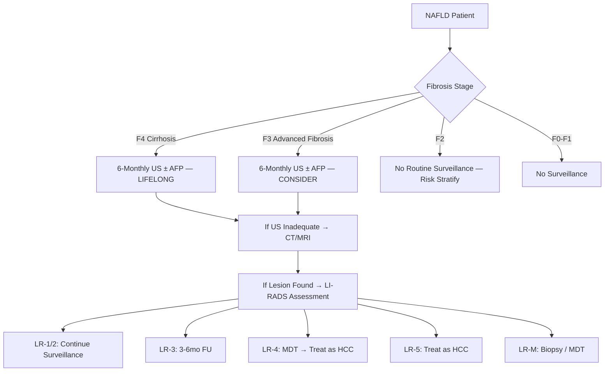
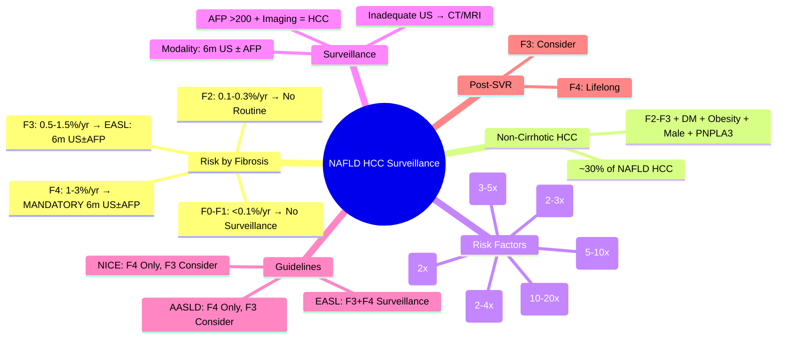

## 1. Learning Objectives
- [ ] Apply HCC surveillance criteria in NAFLD/NASH patients
- [ ] Understand HCC risk in non-cirrhotic NAFLD
- [ ] Identify risk factors for HCC development in NAFLD
- [ ] Apply surveillance protocols based on fibrosis stage
- [ ] Identify FCPS/MRCP high-yield emerging concepts

---

## 2. NAFLD-Related HCC: Key Concepts

```mermaid
flowchart TD
    A[NAFLD] --> B{Fibrosis Stage}
    B -->|F0-F2 (No/Minimal Fibrosis)| C[Very Low HCC Risk]
    B -->|F3 (Advanced Fibrosis)| D[Moderate HCC Risk]
    B -->|F4 (Cirrhosis)| E[High HCC Risk]
    B -->|Non-Cirrhotic NASH F3| F[**Significant Risk**]
```

> **FCPS/MRCP**: **NAFLD is now a leading cause of HCC** — **F3-F4 = Surveillance; F3 Non-Cirrhotic = Emerging Surveillance Indication**

---

## 3. HCC Risk by Fibrosis Stage

| Fibrosis Stage | Annual HCC Incidence | Surveillance Recommendation |
|----------------|----------------------|----------------------------|
| **F0-F1 (No/Minimal Fibrosis)** | **<0.1%/year** | **No Routine Surveillance** |
| **F2 (Significant Fibrosis)** | **0.1-0.3%/year** | **Consider** (Guideline Variation) |
| **F3 (Advanced Fibrosis)** | **0.5-1.5%/year** | **Yes — 6-Monthly US ± AFP** (Many Guidelines) |
| **F4 (Cirrhosis)** | **1-3%/year** | **MANDATORY — Lifelong 6-Monthly US ± AFP** |

> **Key Point**: **NAFLD-related HCC can occur in NON-CIRRHOTIC patients (F3)** — Unique to NAFLD

---

## 4. Non-Cirrhotic HCC in NAFLD: Emerging Concept

```mermaid
flowchart LR
    A[NAFLD] --> B[Non-Cirrhotic HCC]
    B --> C[Risk Factors]
    C --> C1[Advanced Fibrosis F3]
    C --> C2[Diabetes Mellitus]
    C --> C3[Obesity (BMI >30)]
    C --> C4[Age >60]
    C --> C5[Male Sex]
    C --> C6[PNPLA3 I148M]
    C --> C7[Metabolic Syndrome Components]
```

| Feature | Cirrhotic HCC | Non-Cirrhotic NAFLD HCC |
|---------|---------------|-------------------------|
| **Fibrosis Stage** | F4 (Cirrhosis) | **F2-F3 (No Cirrhosis)** |
| **Proportion** | ~70% of NAFLD HCC | **~30% of NAFLD HCC** |
| **Surveillance** | Standard (6m US±AFP) | **Controversial/Not Universal** |
| **Risk Factors** | Cirrhosis Itself | **F3, DM, Obesity, Age, Male, PNPLA3** |

> **FCPS/MRCP**: **~30% of NAFLD HCC occurs in NON-CIRRHOTIC patients** — F3 Fibrosis + Metabolic Risk Factors

---

## 5. HCC Risk Factors in NAFLD (Independent)

| Risk Factor | Relative Risk | Population Attributable Risk |
|-------------|---------------|-------------------------------|
| **Cirrhosis (F4)** | **10-20x** | Highest |
| **Advanced Fibrosis (F3)** | **5-10x** | High |
| **Type 2 Diabetes** | **2-4x** | High |
| **Obesity (BMI ≥30)** | **2-3x** | Moderate |
| **Age >60** | **2-3x** | Moderate |
| **Male Sex** | **2x** | Moderate |
| **PNPLA3 I148M (Homozygous)** | **3-5x** | High in Genetically Predisposed |
| **Metabolic Syndrome (≥3 Components)** | **2-3x** | Moderate |

---

## 6. Surveillance Protocols by Guidelines

| Guideline | Cirrhosis (F4) | Advanced Fibrosis (F3) | F2 | F0-F1 |
|-----------|----------------|------------------------|-----|-------|
| **AASLD 2023** | **6m US ± AFP** | **Consider 6m US ± AFP** | No Routine | No Routine |
| **EASL 2024** | **6m US ± AFP** | **6m US ± AFP** | Consider | No Routine |
| **APASL 2022** | **6m US ± AFP** | **6m US ± AFP** | No Routine | No Routine |
| **NICE 2023** | **6m US ± AFP** | **Consider** | No Routine | No Routine |

> **Consensus**: **F4 = Mandatory Surveillance**; **F3 = Increasingly Recommended** (EASL Strongest); **F0-F2 = No Routine Surveillance**

---

## 7. Surveillance Modality & Technique

| Modality | Interval | Sensitivity | Notes |
|----------|----------|-------------|-------|
| **Ultrasound (US)** | **6-Monthly** | 60-80% (Operator Dependent) | First-Line |
| **US + AFP** | 6-Monthly | US 60-80% + AFP 10-20% | Standard |
| **CT/MRI** | If US Inadequate | >90% | Obesity, Nodular Liver, Ascites |

### AFP in NAFLD Surveillance

| AFP Level | Significance |
|-----------|--------------|
| **<20 ng/mL** | Normal |
| **20-200 ng/mL** | Indeterminate (HCC, Active Hepatitis, Regeneration) |
| **>200 ng/mL** | **Highly Suggestive of HCC** (with Typical Imaging) |
| **>400 ng/mL** | Very High Specificity for HCC |

> **AFP >200 + Typical Imaging = HCC Diagnosis** (in Cirrhosis/High Risk)

---

## 8. HCC Surveillance Algorithm (NAFLD)



---

## 9. Post-SVR HCV with NAFLD Background

| Pre-Treatment Fibrosis | HCC Risk Post-SVR | Surveillance |
|------------------------|-------------------|--------------|
| **F4 (Cirrhosis)** | **Significant (1-3%/yr)** | **Lifelong 6m US ± AFP** |
| **F3** | Reduced but Persistent | **Consider 6m US ± AFP** |
| **F2** | Low | Consider (Guideline Variation) |
| **F0-F1** | Near Zero | No Routine Surveillance |

---

## 10. Risk Scores for HCC in NAFLD

| Score | Components | Use |
|-------|------------|-----|
| **aMAP** | Age, Sex, Albumin, Bilirubin, Platelets | Cirrhosis HCC Risk |
| **HCC-NAFLD Score** | Age, Sex, Diabetes, BMI, PNPLA3, Fibrosis Stage | NAFLD-Specific |
| **REACH-B** | Age, Sex, HBV DNA, ALT, HBeAg | HBV-HCC (Not NAFLD) |

> **aMAP Score** used for cirrhosis HCC risk stratification in NAFLD too

---

## 11. FCPS/MRCP High-Yield Summary

| Concept | Key Points |
|---------|------------|
| **NAFLD = Leading HCC Cause** | Now #1/#2 Indication for Transplant in West |
| **F4 (Cirrhosis)** | **Mandatory 6m US ± AFP** (Lifelong) |
| **F3 (Advanced Fibrosis)** | **Consider 6m US ± AFP** (EASL Strongest) |
| **Non-Cirrhotic HCC** | **~30% of NAFLD HCC** in F2-F3 (Diabetes, Obesity, Male, PNPLA3) |
| **F2 and Below** | No Routine Surveillance (Unless High Risk Factors) |
| **Key Risk Factors** | Cirrhosis, F3, T2DM, Obesity, Male, Age>60, PNPLA3 |
| **Surveillance Modality** | **6m US ± AFP**; CT/MRI if US Inadequate |
| **AFP >200 + Imaging** | = HCC Diagnosis (High Risk) |
| **Post-SVR HCV + NAFLD** | **F4 = Lifelong Surveillance**; F3 Consider |

---

## 12. Viva Questions

1. **What is the HCC incidence in NAFLD cirrhosis (F4)?**
2. **What proportion of NAFLD HCC occurs in non-cirrhotic patients?**
3. **Which guideline recommends surveillance for F3 fibrosis?**
3. **What are independent risk factors for HCC in NAFLD?**
4. **What is the surveillance interval and modality for NAFLD cirrhosis?**
5. **Does SVR eliminate HCC risk in cirrhosis?**
5. **What is the non-cirrhotic HCC risk in NAFLD F3?**
6. **What is the role of AFP in NAFLD HCC surveillance?**
6. **How does HCC risk differ between cirrhotic and non-cirrhotic NAFLD?**
7. **What is the recommended surveillance for F2 fibrosis?**
8. **Which guideline is most aggressive for F3 surveillance?**

---

## 13. Confusions & Mnemonics

| Confusion | Clarification |
|-----------|---------------|
| F3 Surveillance | **EASL: Yes**; AASLD: Consider; NICE: Consider — **EASL Most Aggressive** |
| Non-Cirrhotic HCC | **~30% of NAFLD HCC** occurs in F2-F3; Driven by DM, Obesity, PNPLA3 |
| HCC Incidence F4 | **1-3%/year** — Same as Other Cirrhosis Aetiologies |
| AFP Utility | **>200 ng/mL + Imaging = HCC**; Adds 10-20% Sensitivity to US |
| Post-SVR HCC Risk | **Persists if F4** (1-3%/yr); F3 Reduced but Present; F0-F2 Near Zero |
| F2 Surveillance | **No Routine** Unless High Risk (Diabetes + Obesity + Age + PNPLA3) |
| PNPLA3 Risk | **Homozygous I148M = 3-5x HCC Risk** (Both Cirrhotic & Non-Cirrhotic) |
| US Inadequacy | Obesity, Nodular Liver, Ascites → **Switch to CT/MRI** |

---

## 14. Mind Map



---

## 15. One-Page Revision Card

| **Fibrosis Stage** | **HCC Incidence** | **Surveillance** |
|--------------------|-------------------|------------------|
| **F0-F1** | <0.1%/yr | None |
| **F2** | 0.1-0.3%/yr | No Routine |
| **F3** | 0.5-1.5%/yr | **EASL: 6m US±AFP** |
| **F4 (Cirrhosis)** | **1-3%/yr** | **MANDATORY 6m US±AFP (Lifelong)** |

| **Non-Cirrhotic HCC** | **Details** |
|-----------------------|-------------|
| **Proportion** | **~30%** of NAFLD HCC |
| **Stage** | F2-F3 (No Cirrhosis) |
| **Risk Factors** | DM, Obesity, Male, Age>60, PNPLA3 |

| **Surveillance Protocol** | |
|--------------------------|--|
| **Modality** | **US ± AFP** |
| **Interval** | **6-Monthly** |
| **Inadequate US** | **CT/MRI** |
| **AFP >200 + Imaging** | **= HCC** |

| **Guidelines** | **F3 Surveillance** |
|----------------|---------------------|
| **EASL 2024** | **Yes (6m US±AFP)** |
| **AASLD 2023** | Consider |
| **NICE 2023** | Consider |

---

## 16. Spaced Repetition Tracker

| Day | 1 | 3 | 7 | 15 | 30 |
|-----|---|---|---|----|----|
| HCC Incidence by Stage | ☐ | ☐ | ☐ | ☐ | ☐ |
| F3 vs F4 Surveillance | ☐ | ☐ | ☐ | ☐ | ☐ |
| Non-Cirrhotic HCC % | ☐ | ☐ | ☐ | ☐ | ☐ |
| Guideline Differences | ☐ | ☐ | ☐ | ☐ | ☐ |
| Key Risk Factors | ☐ | ☐ | ☐ | ☐ | ☐ |

---

## 17. Self-Test Scorecard

| Question | My Answer | Correct? |
|----------|-----------|----------|
| F4 HCC Annual Incidence |  |  |
| Non-Cirrhotic HCC Proportion |  |  |
| EASL F3 Surveillance |  |  |
| Independent Risk Factors |  |  |
| Surveillance Modality |  |  |

---

## 18. Local Navigation

- [[Non-Alcoholic Fatty Liver Disease/NAFLD Spectrum (NAFL vs NASH)|NAFLD Spectrum]]
- [[Non-Alcoholic Fatty Liver Disease/NAFLD Risk Factors and Pathophysiology|NAFLD Risk Factors]]
- [[Non-Alcoholic Fatty Liver Disease/NAFLD Diagnosis (FIB-4, NFS, ELF, FibroScan)|NAFLD Diagnosis]]
- [[Non-Alcoholic Fatty Liver Disease/NAFLD Management (Lifestyle, Pharmacotherapy, Bariatric Surgery)|NAFLD Management]]
- [[Liver Tumours/HCC (Hepatocellular Carcinoma)|HCC Full Topic]]