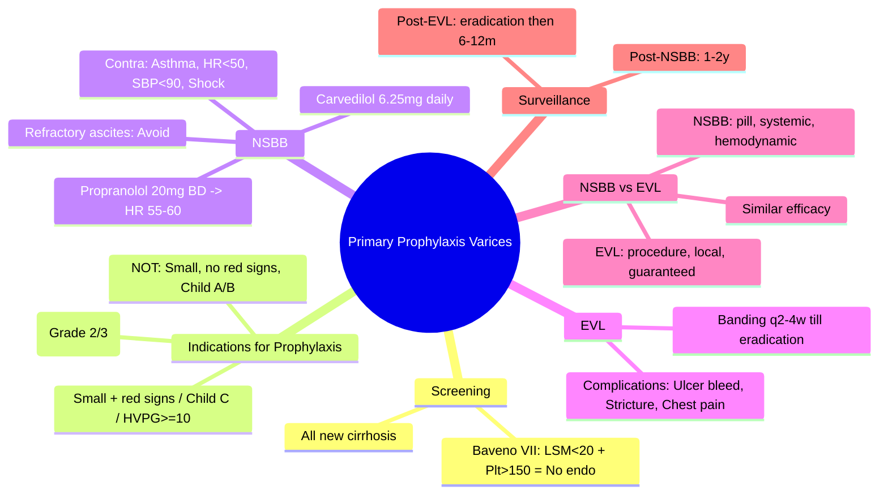

# Primary Prophylaxis of Variceal Bleeding: NSBB vs EVL

## Learning Objectives
- [ ] Identify patients needing primary prophylaxis (variceal size, red signs)
- [ ] Compare NSBB vs EVL efficacy, side effects, contraindications
- [ ] Apply Baveno VII criteria for non-invasive screening
- [ ] Know monitoring and dose titration for NSBB
- [ ] Identify FCPS/MRCP high-yield decision points

---

## Who Needs Primary Prophylaxis?

### Screening Endoscopy Indications
| Guideline | Indication |
|-----------|------------|
| **Baveno VII** | All **newly diagnosed cirrhosis** |
| **Baveno VII** | **Compensated cirrhosis**: If Liver Stiffness (LSM) <20 kPa + Platelets >150 → **No endoscopy needed** (low risk) |
| **Baveno VII** | **Cirrhosis + any decompensation** → Endoscopy |

### Varices Requiring Prophylaxis
| Finding on Endoscopy | Prophylaxis Indicated |
|----------------------|----------------------|
| **Small varices (Grade 1)** + **Red wale marks / Child C / HVPG ≥10** | **YES** |
| **Medium/Large varices (Grade 2/3)** | **YES** (regardless of red signs) |
| **Small varices WITHOUT red signs / Child A-B / HVPG <10** | **NO** (surveillance endoscopy 2-3 years) |

---

## NSBB (Non-Selective Beta-Blockers)

### Drugs & Dosing
| Drug | Start Dose | Target | Max Dose |
|------|------------|--------|----------|
| **Propranolol** | 20 mg BD | HR 55-60 / MAP >65 / ↓25% from baseline | 80-160 mg BD |
| **Carvedilol** | 6.25 mg daily | HVPG ↓>20% or to <12 mmHg | 12.5-25 mg daily |
| **Nadolol** | 20 mg daily | HR 55-60 | 80-160 mg daily |

> **Carvedilol**: Additional α1-blockade → greater HVPG reduction; use if propranolol fails/intolerant

### Monitoring on NSBB
| Parameter | Frequency | Action |
|-----------|-----------|--------|
| **Heart Rate** | Weekly ×4, then monthly | Target 55-60; <50 → reduce dose |
| **Blood Pressure** | Weekly ×4, then monthly | MAP <65 → reduce dose |
| **Renal Function** | Baseline, then 3-monthly | Cr ↑50% → reduce/stop |
| **Symptoms** | Each visit | Fatigue, dizziness, ED, bronchospasm |

### Contraindications to NSBB
| Absolute | Relative |
|----------|----------|
| Asthma / COPD (bronchospasm risk) | Heart block (PR >240ms) |
| Severe bradycardia (HR <50) | Peripheral vascular disease |
| Cardiogenic shock | Diabetes (masks hypoglycaemia) |
| Systolic BP <90 | Refractory ascites (controversial - "window hypothesis") |

---

## EVL (Endoscopic Variceal Ligation)

### Technique
- **Band 1-2 cm above** varix
- **2-4 bands** per session for oesophageal varices
- **Repeat sessions** every 2-4 weeks until eradication
- **Surveillance** 6-12 monthly after eradication

### Complications
| Complication | Frequency | Management |
|--------------|-----------|------------|
| **Post-banding ulcer bleeding** | 1-5% | Usually self-limited; PPI; repeat endoscopy if significant |
| **Oesophageal stricture** | 2-5% (after multiple sessions) | Dilatation |
| **Chest pain / odynophagia** | 10-20% | Analgesia, PPI; resolves in days |
| **Aspiration** | Rare | Positioning, sedation care |

---

## NSBB vs EVL: Head-to-Head

| Aspect | NSBB | EVL |
|--------|------|-----|
| **Efficacy (bleeding reduction)** | ~45-50% | ~45-50% |
| **Mortality reduction** | Yes (some data) | No clear mortality benefit |
| **Side effects** | Fatigue, hypotension, ED, bronchospasm | Chest pain, ulcer bleeding, stricture |
| **Contraindications** | Asthma, HR<50, SBP<90, shock | Few (oesophageal pathology) |
| **Adherence** | Daily pill (adherence issues) | Procedure-based (guaranteed delivery) |
| **Cost** | Low | Higher (endoscopy unit) |
| **Portal pressure** | Reduces HVPG (mechanistic) | Local eradication only |
| **Ascites** | May help (reduces portal pressure) | No effect |

> **Baveno VII Recommendation**: **Either NSBB or EVL** for medium/large varices — choice based on patient factors, preference, contraindications

---

## Special Situations

### Small Varices with Red Signs
- **NSBB preferred** (EVL technically difficult on small varices)
- **Or EVL** if NSBB contraindicated

### Refractory Ascites ("Window Hypothesis")
- **NSBB may worsen survival** in refractory ascites (↓ cardiac output → renal perfusion)
- **Consider holding NSBB** if refractory ascites + hypotension + renal impairment
- **EVL preferred** in this subgroup

### Pregnancy
- **Propranolol**: Category C (safe in 2nd/3rd trimester)
- **EVL**: Preferred if feasible; avoid radiation

### Post-TIPS
- **NSBB not routinely needed** (TIPS reduces portal pressure)
- **Consider if residual varices + high HVPG**

---

## Baveno VII: Non-Invasive Rule-Out of High-Risk Varices

| Criteria | Action |
|----------|--------|
| **LSM <20 kPa** AND **Platelets >150** | **No endoscopy needed** — very low risk of high-risk varices |
| **LSM ≥20 kPa** OR **Platelets ≤150** | **Endoscopy indicated** |

> **LSM = Liver Stiffness Measurement (FibroScan/VCTE)**

---

## Decision Algorithm

```mermaid
flowchart TD
    A[Cirrhosis - Need Primary Prophylaxis?] --> B{Endoscopy indicated?}
    B -->|LSM<20 + Plt>150| C[No endoscopy - Surveillance]
    B -->|Otherwise| D[Endoscopy]
    D --> E{Variceal Grade}
    E -->|Small, no red signs| F[No prophylaxis - Repeat endo 2-3y]
    E -->|Small + red signs OR Child C| G[Prophylaxis needed]
    E -->|Medium/Large (Grade 2/3)| G
    G --> H{Contraindication to NSBB?}
    H -->|Yes| I[EVL]
    H -->|No| J{Patient Preference / Refractory Ascites?}
    J -->|Refractory ascites + hypotension| I
    J -->|Prefers pill / No contraindication| K[NSBB]
    K --> L[Titrate to HR 55-60]
    I --> M[EVL q2-4w till eradication]
    L --> N[Surveillance endo 1-2y]
    M --> N
```

---

## FCPS/MRCP High-Yield Summary

| Concept | Key Points |
|---------|------------|
| **Screen all new cirrhosis** | Endoscopy (or Baveno VII rule-out) |
| **Prophylaxis if**: Medium/large varices OR Small + red signs/Child C | |
| **NSBB**: Propranolol 20mg BD → HR 55-60; Carvedilol 6.25mg daily | |
| **EVL**: Banding q2-4w until eradication | |
| **NSBB vs EVL**: Similar efficacy; choose by contraindications/preference | |
| **Contraindications NSBB**: Asthma, HR<50, SBP<90, shock | |
| **Refractory ascites**: Avoid NSBB; use EVL | |
| **Baveno VII**: LSM<20 + Plt>150 = No endoscopy | |

---

## Viva Questions

1. **Who needs screening endoscopy for varices?**
2. **What are Baveno VII criteria to avoid endoscopy?**
3. **Which varices need primary prophylaxis?**
4. **NSBB vs EVL: efficacy, side effects, contraindications?**
5. **How do you titrate propranolol? Target HR?**
6. **When is carvedilol preferred over propranolol?**
7. **What is the "window hypothesis" for NSBB in refractory ascites?**
8. **EVL complications and frequency?**
9. **Surveillance intervals after prophylaxis?**
10. **NSBB in pregnancy?**

---

## Confusions & Mnemonics

| Confusion | Clarification |
|-----------|---------------|
| NSBB vs EVL efficacy | **Similar bleeding reduction (~45-50%)** — NSBB may have mortality benefit |
| Small varices + red signs | **Need prophylaxis** (NSBB preferred) |
| Refractory ascites + NSBB | **Avoid NSBB** — may worsen renal perfusion ("window hypothesis") |
| Carvedilol vs Propranolol | Carvedilol: α+β blockade → greater HVPG reduction; use if propranolol fails |
| Baveno VII rule | **LSM<20 kPa + Platelets>150 = No endoscopy** (low risk varices) |
| Prophylaxis surveillance | NSBB: endo 1-2y; EVL: eradication then 6-12m |

---

## Mind Map



---

## One-Page Revision Card

| **Indication for Prophylaxis** | **Action** |
|-------------------------------|------------|
| Medium/Large varices | NSBB or EVL |
| Small + red signs / Child C | NSBB (preferred) or EVL |
| Small, no red signs, Child A/B | Surveillance endo 2-3y |

| **NSBB** | **Details** |
|----------|-------------|
| Propranolol | 20mg BD → titrate to HR 55-60 |
| Carvedilol | 6.25mg daily |
| Contraindications | Asthma, HR<50, SBP<90, Shock, Refractory ascites |
| Monitoring | HR, BP, Renal weekly→monthly |

| **EVL** | **Details** |
|---------|-------------|
| Technique | Band 1-2cm above varix, 2-4 bands/session |
| Frequency | q2-4 weeks till eradication |
| Complications | Ulcer bleed (1-5%), Stricture (2-5%), Chest pain (10-20%) |

| **Baveno VII** | **LSM <20 kPa + Platelets >150** = No endoscopy needed |

---

## Spaced Repetition Tracker

| Day | 1 | 3 | 7 | 15 | 30 |
|-----|---|---|---|----|----|
| Prophylaxis indications | ☐ | ☐ | ☐ | ☐ | ☐ |
| Baveno VII criteria | ☐ | ☐ | ☐ | ☐ | ☐ |
| NSBB titration | ☐ | ☐ | ☐ | ☐ | ☐ |
| EVL schedule | ☐ | ☐ | ☐ | ☐ | ☐ |
| Refractory ascites NSBB | ☐ | ☐ | ☐ | ☐ | ☐ |

---

## Self-Test Scorecard

| Question | My Answer | Correct? |
|----------|-----------|----------|
| Baveno VII rule |  |  |
| Prophylaxis indications |  |  |
| Propranolol target HR |  |  |
| EVL eradication schedule |  |  |
| NSBB in refractory ascites |  |  |

---

## Local Navigation

- [[Portal Hypertension and Complications/Varices|Varices Overview]]
- [[Portal Hypertension and Complications/Screening endoscopy|Screening Endoscopy]]
- [[Portal Hypertension and Complications/Acute variceal bleeding management|Acute Bleed]]
- [[Portal Hypertension and Complications/Secondary prophylaxis|Secondary Prophylaxis]]
- [[Portal Hypertension and Complications/Gastric varices (glue injection)|Gastric Varices]]