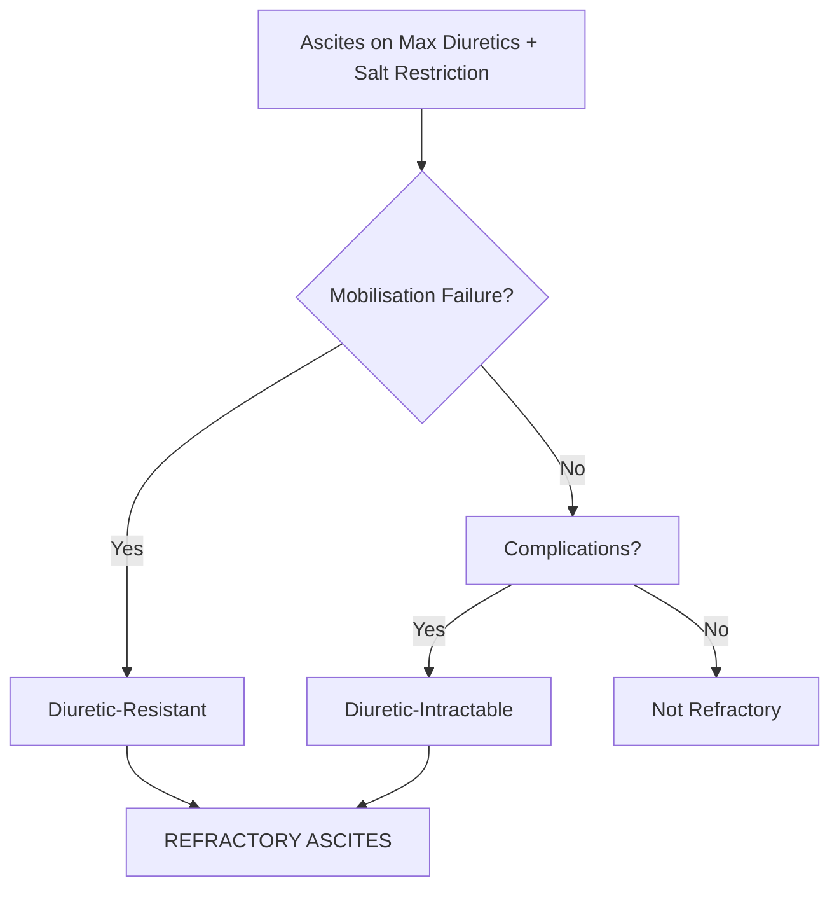
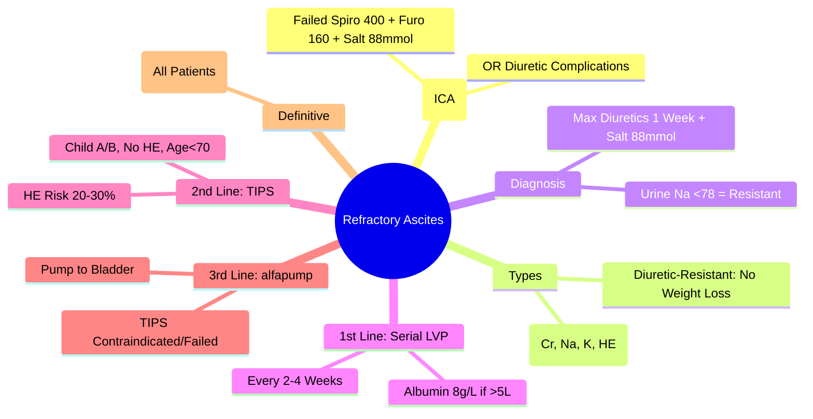

# Refractory Ascites

## Learning Objectives
- [ ] Apply ICA definition of refractory ascites
- [ ] Differentiate diuretic-resistant vs diuretic-intractable
- [ ] Apply management algorithm (Serial LVP → TIPS → Transplant)
- [ ] Know alfapump as emerging option
- [ ] Identify FCPS/MRCP high-yield management steps

---

## Definition (International Club of Ascites - ICA)

> **Refractory Ascites** = Ascites that **cannot be mobilised** or **early recurrence** despite:
> 1. **Sodium Restriction**: 88 mmol/day (2g NaCl = 5g salt)
> 2. **Maximum Diuretic Therapy**: Spironolactone 400mg + Furosemide 160mg daily
>    **OR** Diuretic-Induced Complications Preventing Use



---

## Types of Refractory Ascites

| Type | Definition | Key Features |
|------|------------|--------------|
| **Diuretic-Resistant** | **No response** to Max Diuretics (Spiro 400 + Furo 160) + Salt Restriction (88 mmol/day) for ≥1 week | Weight loss <0.5 kg/day; Urine Na <78 mmol/day |
| **Diuretic-Intractable** | **Diuretic-Induced Complications** Preventing Use of Max Doses | Renal Impairment (Cr↑), Hyponatraemia (Na<130), HE, Hyperkalaemia |

> **Key**: Both Require **Adequate Trial** of Max Doses (Spiro 400 + Furo 160) + Salt Restriction

---

## Diagnostic Criteria (ICA)

| Criterion | Must Be Met |
|-----------|-------------|
| **1. Cirrhosis with Ascites** | Confirmed |
| **2. Salt Restriction** | **88 mmol/day (2g NaCl)** for ≥1 week |
| **3. Diuretic Therapy** | **Spiro 400mg + Furo 160mg daily** for ≥1 week |
| **4. Treatment Failure** | **Either**: (a) No Weight Loss <0.5kg/day OR (b) Early Recurrence <4w Post-LVP |
| **4. Complications (Intractable)** | Renal Impairment, Hyponatraemia, HE, Hyperkalaemia Preventing Diuretic Use |

---

## Management Algorithm

```mermaid
flowchart TD
    A[Diagnose Refractory Ascites] --> B[Serial Large-Volume Paracentesis (LVP) + Albumin]
    B --> C{Good Candidate for TIPS?}
    C -->|Child A/B, No Severe HE, Age<70, No Cardiopulmonary Dz| D[TIPS]
    C -->|No| E[Continue Serial LVP + Albumin]
    D --> F[Monitor: HE, Shunt Dysfunction, Liver Function]
    F --> G{Complications?}
    G -->|HE / Shunt Failure| H[Reduce Shunt / Revision / Transplant]
    G -->|No| I[Continue Surveillance]
    E --> J[alfapump (If Available/Indicated)]
    J --> K[Transplant Evaluation — DEFINITIVE]
    I --> K
    H --> K
```

---

## 1. Serial Large-Volume Paracentesis (LVP) + Albumin

| Parameter | Detail |
|-----------|--------|
| **Frequency** | Every 2-4 Weeks (As Needed) |
| **Volume Removed** | All Ascitic Fluid (Complete Drainage) |
| **Albumin Replacement** | **8 g per Litre Removed** (If >5L Removed) |
| **Example** | 8L Removed → 64g Albumin (200ml 20% or 400ml 5%) |
| **No Albumin Needed** | If ≤5L Removed |

### Albumin Dosing
| Volume Removed | Albumin Dose |
|----------------|--------------|
| ≤5L | None |
| >5L | **8 g/L** (e.g., 8L → 64g = 200ml 20% or 400ml 5%) |

---

## 2. TIPS (Transjugular Intrahepatic Portosystemic Shunt)

### Indications
- **Refractory Ascites** (Failed/Intolerant to Serial LVP)
- **Child-Pugh A/B** (Child C: High Mortality)
- **Age <70** (Some Centres <65)
- **No Severe HE** (Prior Recurrent/Severe HE = Contraindication)
- **No Cardiopulmonary Disease** (PAH, Severe COPD)
- **No Active Infection/Sepsis**
- **No HCC Beyond Transplant Criteria**

### Contraindications
| Absolute | Relative |
|----------|----------|
| Severe HE (Recurrent G3-4) | Age >70 |
| Severe Cardiopulmonary Disease | Child-Pugh C |
| Active Sepsis | Portal Vein Thrombosis (Complete) |
| Uncontrolled Heart Failure | Mild HE (Controlled) |
| Severe Pulmonary Hypertension | Prior Hepatic Encephalopathy |

### Outcomes
| Outcome | Rate |
|---------|------|
| **Ascites Control** | 70-80% |
| **New/Worsening HE** | 20-30% |
| **Shunt Dysfunction** | 20-30% at 1 Year |
| **Survival Benefit** | Controversial (No Clear Mortality Benefit vs LVP) |

### Post-TIPS Surveillance
| Test | Interval |
|------|----------|
| **Doppler US** | 1 Month, 3 Months, 6 Months, Then 6-12 Monthly |
| **PSV in Stent** | **60-250 cm/s** (Stenosis if <60 or >250) |
| **LFTs/Renal** | 3-Monthly |

---

## 3. alfapump® (Automated Low-Flow Ascites Pump)

### Indications
- **Refractory Ascites** with **TIPS Contraindicated** or **Failed**
- **Child-Pugh B/C** (Where TIPS High Risk)
- **Bridge to Transplant**

### Technique
- **Subcutaneous Pump** Implanted in Abdominal Wall
- **Catheter** → Peritoneal Cavity → **Bladder** (Ascites Drained into Urine)
- **Programmable Flow** (Automatic, Low-Flow)

| Advantage | Disadvantage |
|-----------|--------------|
| No Shunt → No HE Risk | Infection Risk (Pump/Catheter) |
| Avoids TIPS | Battery Replacement (q6-12mo) |
| Quality of Life Improvement | Cost / Availability Limited |
| Bridge to Transplant | Not Definitive |

---

## 4. Liver Transplantation — Definitive Treatment

| Indication | Timing |
|------------|--------|
| **Refractory Ascites** | **All Patients** Should Be Referred for Transplant Evaluation |
| **Decompensated Cirrhosis** | MELD ≥15 (Or Lower if Complications) |
| **QoL Impairment** | Frequent LVP, Recurrent HE, HRS |

> **Transplant = Only Definitive Cure for Refractory Ascites**

---

## Monitoring & Follow-Up

| Parameter | Frequency | Action Threshold |
|-----------|-----------|------------------|
| **Weight** | Daily (Inpatient) / Weekly (Outpatient) | Rapid Gain → LVP Needed |
| **Renal Function (Cr, Na, K, Urea)** | Weekly (LVP) / Monthly (Stable) | Cr Rise → HRS Assessment |
| **Electrolytes (K, Na, Mg)** | Weekly → Monthly | K>5.5 / Na<130 → Diuretic Adjust |
| **LFTs / INR** | Monthly | Deterioration → Transplant Urgency |
| **HE Assessment** | Each Visit | New/Recurrent HE → Diuretic/TIPS Review |

---

## FCPS/MRCP High-Yield Summary

| Concept | Key Points |
|---------|------------|
| **Definition** | Failed Spiro 400 + Furo 160 + Salt 88mmol OR Diuretic Complications |
| **Types** | Diuretic-Resistant (No Response) vs Diuretic-Intractable (Complications) |
| **First-Line** | **Serial LVP + Albumin 8g/L (>5L)** |
| **Albumin** | 8g/L if >5L Removed (e.g., 8L → 64g) |
| **TIPS Indications** | Child A/B, No Severe HE, Age<70, Failed LVP |
| **TIPS Complications** | HE 20-30%, Shunt Dysfunction 20-30% |
| **alfapump** | TIPS Contraindicated/Failed → Subcutaneous Pump to Bladder |
| **Transplant** | **Definitive** — Refer All Refractory Ascites |
| **Diuretic Target** | Urine Na >78 mmol/day (If Not → Resistant) |

---

## Viva Questions

1. **What is the ICA definition of refractory ascites?**
2. **Differentiate diuretic-resistant vs diuretic-intractable ascites.**
3. **What is the albumin dose after LVP?**
4. **What are TIPS indications for refractory ascites?**
5. **What are TIPS contraindications?**
5. **What is the alfapump? When is it used?**
6. **What is the urine sodium target in diuretic therapy?**
7. **When is transplant indicated for refractory ascites?**
8. **What are the complications of TIPS?**
9. **Differentiate LVP vs TIPS for refractory ascites.**
10. **What is the ICA definition of salt restriction?**

---

## Confusions & Mnemonics

| Confusion | Clarification |
|-----------|---------------|
| Resistant vs Intractable | **Resistant**: No Response to Max Doses; **Intractable**: Complications Prevent Use |
| Urine Na Target | **>78 mmol/day** = Adequate Diuresis; <78 = Resistant |
| LVP Albumin | **Only if >5L Removed**; 8g/L Removed |
| TIPS for Ascites | **Child A/B + No Severe HE + Age<70** = Good Candidate |
| TIPS vs LVP | TIPS: ↓ LVP Frequency but ↑ HE Risk; LVP: Frequent, No HE Risk |
| alfapump vs TIPS | alfapump = No Shunt (No HE Risk), TIPS Contractraindicated |
| Transplant | **Definitive** — All Refractory Ascites Should Be Referred |
| Diuretic Target | Urine Na >78 mmol/day (If Not → Resistant) |

---

## Mind Map



---

## One-Page Revision Card

| **Refractory Ascites (ICA)** | **Criteria** |
|------------------------------|--------------|
| **Salt Restriction** | 88 mmol/day (2g NaCl) |
| **Max Diuretics** | Spironolactone 400mg + Furosemide 160mg |
| **Resistant** | No Response to Above |
| **Intractable** | Complications Prevent Use |

| **Management** | **Details** |
|----------------|-------------|
| **1. Serial LVP** | Every 2-4w; Albumin 8g/L if >5L |
| **2. TIPS** | Child A/B, No Severe HE, Age<70 |
| **3. alfapump** | TIPS Contraindicated/Failed |
| **4. Transplant** | **DEFINITIVE** — Refer All |

| **LVP Albumin** | **Dose** |
|-----------------|----------|
| ≤5L Removed | None |
| >5L Removed | 8g per liter removed |

| **TIPS** | **Criteria** |
|----------|--------------|
| Candidate | Child A/B, No Severe HE, Age<70 |
| HE Risk | 20-30% |
| Shunt Dysfunction | 20-30% at 1 Year |

| **Urine Sodium** | **Target** |
|------------------|------------|
| Adequate Diuresis | **>78 mmol/day** |
| Resistant | <78 mmol/day |

---

## Spaced Repetition Tracker

| Day | 1 | 3 | 7 | 15 | 30 |
|-----|---|---|---|----|----|
| ICA Definition | ☐ | ☐ | ☐ | ☐ | ☐ |
| Resistant vs Intractable | ☐ | ☐ | ☐ | ☐ | ☐ |
| LVP Albumin Dose | ☐ | ☐ | ☐ | ☐ | ☐ |
| TIPS Criteria | ☐ | ☐ | ☐ | ☐ | ☐ |
| Transplant Referral | ☐ | ☐ | ☐ | ☐ | ☐ |

---

## Self-Test Scorecard

| Question | My Answer | Correct? |
|----------|-----------|----------|
| ICA Definition |  |  |
| Resistant vs Intractable |  |  |
| LVP Albumin Dose |  |  |
| TIPS Indications |  |  |
| Transplant Referral |  |  |

---

## Local Navigation

- [[Portal Hypertension and Complications/Ascites|Ascites Overview]]
- [[Portal Hypertension and Complications/Ascites diagnosis and SAAG|Ascites Diagnosis]]
- [[Portal Hypertension and Complications/Ascites management|Ascites Management]]
- [[Portal Hypertension and Complications/Hepatorenal Syndrome|HRS]]
- [[Liver Transplantation/Liver Transplantation|Liver Transplant]]
---

> Auto-generated study sections for "Portal Hypertension and Complications" — Ch 23: Hepatology.

## Flashcards (20 generated)

- Q: What is Frequency of Portal Hypertension and Complications?
  A: Every 2-4 Weeks (As Needed)
- Q: What is Volume Removed of Portal Hypertension and Complications?
  A: All Ascitic Fluid (Complete Drainage)
- Q: What is Albumin Replacement of Portal Hypertension and Complications?
  A: 8 g per Litre Removed (If >5L Removed)
- Q: What is Example of Portal Hypertension and Complications?
  A: 8L Removed → 64g Albumin (200ml 20% or 400ml 5%)
- Q: What is No Albumin Needed of Portal Hypertension and Complications?
  A: If ≤5L Removed
- Q: What is Refractory Ascites of Portal Hypertension and Complications?
  A: All Patients Should Be Referred for Transplant Evaluation
- Q: What is Decompensated Cirrhosis of Portal Hypertension and Complications?
  A: MELD ≥15 (Or Lower if Complications)
- Q: What is QoL Impairment of Portal Hypertension and Complications?
  A: Frequent LVP, Recurrent HE, HRS
- Q: What is Refractory Ascites of Portal Hypertension and Complications?
  A: All Patients Should Be Referred for Transplant Evaluation
- Q: What is Decompensated Cirrhosis of Portal Hypertension and Complications?
  A: MELD ≥15 (Or Lower if Complications)
- Q: What is QoL Impairment of Portal Hypertension and Complications?
  A: Frequent LVP, Recurrent HE, HRS
- Q: What is the definition of Portal Hypertension and Complications?
  A: Failed Spiro 400 + Furo 160 + Salt 88mmol OR Diuretic Complications
- Q: How is Portal Hypertension and Complications classified?
  A: Diuretic-Resistant (No Response) vs Diuretic-Intractable (Complications)
- Q: What is the first-line treatment for Portal Hypertension and Complications?
  A: Serial LVP + Albumin 8g/L (>5L)
- Q: What is Albumin of Portal Hypertension and Complications?
  A: 8g/L if >5L Removed (e.g., 8L → 64g)
- Q: What is Portal Hypertension and Complications indicated for?
  A: Child A/B, No Severe HE, Age<70, Failed LVP
- Q: What are the complications of Portal Hypertension and Complications?
  A: HE 20-30%, Shunt Dysfunction 20-30%
- Q: What is alfapump of Portal Hypertension and Complications?
  A: TIPS Contraindicated/Failed → Subcutaneous Pump to Bladder
- Q: What is Transplant of Portal Hypertension and Complications?
  A: Definitive — Refer All Refractory Ascites
- Q: What is Diuretic Target of Portal Hypertension and Complications?
  A: Urine Na >78 mmol/day (If Not → Resistant)

## MCQs (1 generated)

1. **Which of the following best describes Portal Hypertension and Complications?**
   A. **| Type | Definition | Key Features |**
   B. An unrelated condition not matching the clinical picture of Portal Hypertension and Complications
   C. A complication seen late in the disease course of Portal Hypertension and Complications
   D. A condition that mimics Portal Hypertension and Complications but has a different underlying cause

## SBA Questions (1 generated)

1. A patient with suspected Portal Hypertension and Complications presents with: Refractory Ascites = Ascites that cannot be mobilised or early recurrence despite:; 1. Sodium Restriction: 88 mmol/day (2g NaCl = 5g salt); 2. Maximum Diuretic Therapy: Spironolactone 400mg + Furosemide 160mg daily. What is the most likely diagnosis?
   A. **Portal Hypertension and Complications**
   B. A condition that mimics Portal Hypertension and Complications but is not the same entity
   C. A complication of Portal Hypertension and Complications rather than the primary diagnosis
   D. An unrelated condition in the same clinical category as Portal Hypertension and Complications

