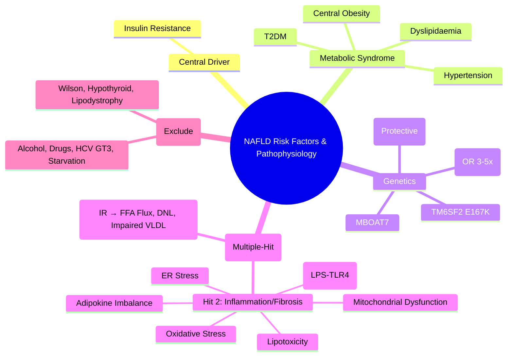

## 1. Learning Objectives
- [ ] Identify major risk factors for NAFLD/NASH
- [ ] Understand the pathophysiology of hepatic steatosis and progression to NASH
- [ ] Apply the "Two-Hit" and "Multiple-Hit" hypotheses
- [ ] Identify FCPS/MRCP high-yield genetic and metabolic associations

---

## 2. Major Risk Factors

```mermaid
flowchart TD
    A[NAFLD Risk Factors] --> B[Metabolic Syndrome]
    B --> B1[Obesity (BMI >30)]
    B --> B2[Type 2 Diabetes]
    B --> B3[Hypertension]
    B --> B4[Dyslipidaemia]
    A --> C[Genetic Factors]
    C --> C1[PNPLA3 I148M]
    C --> C2[TM6SF2]
    C --> C3[MBOAT7]
    A --> D[Lifestyle]
    D --> D1[Sedentary Lifestyle]
    D --> D2[High Fructose Diet]
    D --> D3[Saturated Fat Intake]
    A --> E[Other]
    E --> E1[Age >50]
    E --> E2[Male Sex]
    E --> E3[Hypothyroidism]
    E --> E4[PCOS]
    E --> E5[Obstructive Sleep Apnoea]
```

---

## 3. Metabolic Syndrome & NAFLD

| MetS Component | Prevalence in NAFLD | Pathogenic Role |
|----------------|---------------------|-----------------|
| **Obesity (Central)** | 70-90% | Adipose tissue lipolysis → FFA flux → Hepatic steatosis |
| **Type 2 Diabetes** | 50-70% | Insulin resistance → ↑ Lipolysis + DNL + Impaired VLDL export |
| **Hypertension** | 40-60% | Shared inflammatory pathways |
| **Dyslipidaemia** | 60-80% | High TG, Low HDL → Hepatic lipid accumulation |

> **FCPS/MRCP**: **T2DM + Obesity = Highest Risk for NASH with Fibrosis**

---

## 4. "Multiple-Hit" Hypothesis (Current Model)

```mermaid
flowchart LR
    A[Insulin Resistance] --> B[Adipose Tissue Dysfunction]
    B --> C[↑ FFA Flux to Liver]
    A --> D[↑ Hepatic DNL (De Novo Lipogenesis)]
    C & D --> E[Hepatic Steatosis (First Hit)]
    E --> F[Oxidative Stress]
    E --> G[Lipotoxicity]
    E --> H[ER Stress]
    E --> I[Mitochondrial Dysfunction]
    E --> J[Inflammasome Activation]
    F & G & H & I & J --> K[Inflammation, Ballooning, Fibrosis (Second Hit)]
    K --> L[NASH Progression]
```

---

## 5. Key Pathophysiological Mechanisms

| Mechanism | Description |
|-----------|-------------|
| **Insulin Resistance** | **Central Driver** → Unrestrained lipolysis → ↑ FFA delivery to liver |
| **De Novo Lipogenesis (DNL)** | ↑ ChREBP/SREBP-1c → Converts carbs → Fatty acids (contributes ~25% hepatic fat) |
| **Impaired VLDL Export** | MTP deficiency / ApoB100 degradation → Traps TG in hepatocytes |
| **β-Oxidation Impairment** | Mitochondrial dysfunction → Incomplete FA oxidation → ROS |
| **Adipokine Imbalance** | ↓ Adiponectin, ↑ Leptin, ↑ TNF-α, ↑ IL-6 → Pro-inflammatory state |
| **Gut-Liver Axis** | Dysbiosis → ↑ Portal endotoxin (LPS) → TLR4 activation → Kupffer cell activation |

---

## 6. Genetic Risk Factors

| Gene | Variant | Effect | Population Risk |
|------|---------|--------|-----------------|
| **PNPLA3** | **I148M (rs738409)** | **Strongest Genetic Risk** → Impaired lipid droplet hydrolysis | **OR 3-5x** for NASH/Fibrosis |
| **TM6SF2** | E167K | Impaired VLDL secretion → ↓ Lipid export | OR 2-3x |
| **MBOAT7** | rs641738 | Altered phospholipid remodeling | OR 1.5-2x |
| **HSD17B13** | Splice variant | **Protective** → ↓ NASH/Fibrosis risk | OR 0.7x |

> **FCPS/MRCP**: **PNPLA3 I148M = Strongest Genetic Risk Factor** for NASH and Fibrosis

---

## 7. Clinical Risk Stratification

| Risk Category | Criteria | Fibrosis Risk |
|---------------|----------|---------------|
| **Low** | Lean, No MetS, No T2DM, Normal LFTs | Very Low |
| **Intermediate** | Overweight/Obese OR 1 MetS Component | Moderate |
| **High** | **T2DM + Obesity** OR ≥2 MetS Components | **High (F2-F4)** |
| **Very High** | T2DM + Obesity + Age >50 + High PNPLA3 risk | **Very High (F3-F4)** |

---

## 8. Secondary Causes of Steatosis (Must Exclude)

| Cause | Mechanism | Key Clue |
|-------|-----------|----------|
| **Alcohol** | >30g/day M, >20g/day F | AST:ALT >2, GGT↑, CDT↑ |
| **Drugs** | Corticosteroids, Tamoxifen, Amiodarone, Methotrexate, Valproate, ARV | Temporal Relation |
| **Hepatitis C (GT3)** | Viral interference with VLDL | HCV RNA+, GT3 |
| **Starvation/Malnutrition** | Kwashiorkor, AN, Rapid Weight Loss | Clinical Context |
| **Lipodystrophy** | Impaired adipose storage | Generalised/Partial Fat Loss |
| **Wilson Disease** | Copper Toxicity | Low Ceruloplasmin, KF Rings |
| **Abetalipoproteinaemia** | Impaired VLDL Assembly | Acanthocytes, Retinitis Pigmentosa |
| **Hypothyroidism** | ↓ Lipolysis, ↓ VLDL Clearance | High TSH, High Cholesterol |

---

## 9. FCPS/MRCP High-Yield Summary

| Concept | Key Points |
|---------|------------|
| **Central Driver** | **Insulin Resistance** → ↑ Lipolysis, ↑ DNL, Impaired VLDL Export |
| **Metabolic Syndrome** | Central Obesity + T2DM + HTN + Dyslipidaemia → **Synergistic Risk** |
| **Genetics** | **PNPLA3 I148M** = Strongest Risk (OR 3-5x); **HSD17B13** = Protective |
| **Two-Hit → Multiple-Hit** | Steatosis → Oxidative Stress + Lipotoxicity + ER Stress + Inflammasome |
| **Gut-Liver Axis** | Dysbiosis → Endotoxin → TLR4 → Kupffer Activation → Inflammation |
| **T2DM + Obesity** | **Highest Clinical Risk** for NASH with Significant Fibrosis |

---

## 10. Viva Questions

1. **What is the central pathophysiological mechanism in NAFLD?**
2. **Describe the "Multiple-Hit" hypothesis.**
3. **What is the role of PNPLA3 I148M variant?**
4. **How does insulin resistance lead to hepatic steatosis?**
5. **What are the components of metabolic syndrome?**
5. **How does gut dysbiosis contribute to NAFLD progression?**
6. **What is the role of de novo lipogenesis in NAFLD?**
6. **Which secondary causes of steatosis must be excluded?**
7. **How does tamoxifen cause steatosis?**
8. **What is the role of adipokines in NAFLD?**

---

## 11. Confusions & Mnemonics

| Confusion | Clarification |
|-----------|---------------|
| Two-Hit vs Multiple-Hit | **Two-Hit**: Steatosis → Inflammation; **Multiple-Hit**: Parallel hits (IR, Oxidative Stress, Gut, Adipokines) |
| DNL vs FFA Flux | **FFA Flux** (~60%); **DNL** (~25%); **Dietary Fat** (~15%) → Hepatic TG Pool |
| PNPLA3 | **I148M = Risk**; **Not involved in alcohol liver disease** |
| HSD17B13 | **Protective Variant** — Loss of function → ↓ NASH Risk |
| MetS vs NAFLD | MetS is Clinical Diagnosis; NAFLD is Liver Manifestation — **Overlap >90%** |

---

## 12. Mind Map



---

## 13. One-Page Revision Card

| **Core Mechanism** | **Insulin Resistance → ↑ FFA Flux + ↑ DNL + Impaired VLDL Export** |
|--------------------|---------------------------------------------------------------------|
| **Metabolic Syndrome** | **Central Obesity + T2DM + HTN + Dyslipidaemia** |
| **Genetic Risk** | **PNPLA3 I148M** (OR 3-5x); **TM6SF2**; **HSD17B13 (Protective)** |
| **Two-Hit → Multiple-Hit** | Hit 1: Steatosis; Hit 2: Oxidative Stress, Lipotoxicity, ER Stress, Gut-Liver Axis |
| **DNL Contribution** | **~25%** of Hepatic TG Pool |
| **FFA Flux** | **~60%** of Hepatic TG Pool |
| **Highest Clinical Risk** | **T2DM + Obesity** |
| **Must Exclude** | Alcohol >30g/day, HCV GT3, Drugs, Starvation, Wilson, Hypothyroidism |

---

## 14. Spaced Repetition Tracker

| Day | 1 | 3 | 7 | 15 | 30 |
|-----|---|---|---|----|----|
| Insulin Resistance Central Role | ☐ | ☐ | ☐ | ☐ | ☐ |
| Multiple-Hit Hypothesis | ☐ | ☐ | ☐ | ☐ | ☐ |
| PNPLA3 I148M Significance | ☐ | ☐ | ☐ | ☐ | ☐ |
| DNL vs FFA Flux Contribution | ☐ | ☐ | ☐ | ☐ | ☐ |
| Secondary Causes to Exclude | ☐ | ☐ | ☐ | ☐ | ☐ |

---

## 15. Self-Test Scorecard

| Question | My Answer | Correct? |
|----------|-----------|----------|
| Central Driver of NAFLD |  |  |
| Multiple-Hit vs Two-Hit |  |  |
| PNPLA3 I148M Effect |  |  |
| DNL vs FFA Flux % |  |  |
| HSD17B13 Role |  |  |

---

## 16. Local Navigation

- [[Non-Alcoholic Fatty Liver Disease/NAFLD Spectrum (NAFL vs NASH)|NAFLD Spectrum]]
- [[Non-Alcoholic Fatty Liver Disease/NAFLD Diagnosis (FIB-4, NFS, ELF, FibroScan)|NAFLD Diagnosis]]
- [[Non-Alcoholic Fatty Liver Disease/NAFLD Management (Lifestyle, Pharmacotherapy, Bariatric Surgery)|NAFLD Management]]
- [[Non-Alcoholic Fatty Liver Disease/NAFLD HCC Risk and Surveillance|NAFLD HCC Risk]]
---

> Auto-generated study sections for "Non Alcoholic Fatty Liver Disease" — Ch 23: Hepatology.

## Flashcards (7 generated)

- Q: What is the definition of Non Alcoholic Fatty Liver Disease?
  A: | MetS Component | Prevalence in NAFLD | Pathogenic Role |
- Q: What is Insulin Resistance of Non Alcoholic Fatty Liver Disease?
  A: Central Driver → Unrestrained lipolysis → ↑ FFA delivery to liver
- Q: What is De Novo Lipogenesis (DNL) of Non Alcoholic Fatty Liver Disease?
  A: ↑ ChREBP/SREBP-1c → Converts carbs → Fatty acids (contributes ~25% hepatic fat)
- Q: What is Impaired VLDL Export of Non Alcoholic Fatty Liver Disease?
  A: MTP deficiency / ApoB100 degradation → Traps TG in hepatocytes
- Q: What is β-Oxidation Impairment of Non Alcoholic Fatty Liver Disease?
  A: Mitochondrial dysfunction → Incomplete FA oxidation → ROS
- Q: What is Adipokine Imbalance of Non Alcoholic Fatty Liver Disease?
  A: ↓ Adiponectin, ↑ Leptin, ↑ TNF-α, ↑ IL-6 → Pro-inflammatory state
- Q: What is Gut-Liver Axis of Non Alcoholic Fatty Liver Disease?
  A: Dysbiosis → ↑ Portal endotoxin (LPS) → TLR4 activation → Kupffer cell activation

## MCQs (1 generated)

1. **Which of the following best describes Non Alcoholic Fatty Liver Disease?**
   A. **| MetS Component | Prevalence in NAFLD | Pathogenic Role |**
   B. An unrelated condition not matching the clinical picture of Non Alcoholic Fatty Liver Disease
   C. A complication seen late in the disease course of Non Alcoholic Fatty Liver Disease
   D. A condition that mimics Non Alcoholic Fatty Liver Disease but has a different underlying cause

## SBA Questions (1 generated)

1. A patient with suspected Non Alcoholic Fatty Liver Disease presents with: Risk Category — Criteria; Low — Lean, No MetS, No T2DM, Normal LFTs; Intermediate — Overweight/Obese OR 1 MetS Component. What is the most likely diagnosis?
   A. **Non Alcoholic Fatty Liver Disease**
   B. A condition that mimics Non Alcoholic Fatty Liver Disease but is not the same entity
   C. A complication of Non Alcoholic Fatty Liver Disease rather than the primary diagnosis
   D. An unrelated condition in the same clinical category as Non Alcoholic Fatty Liver Disease

