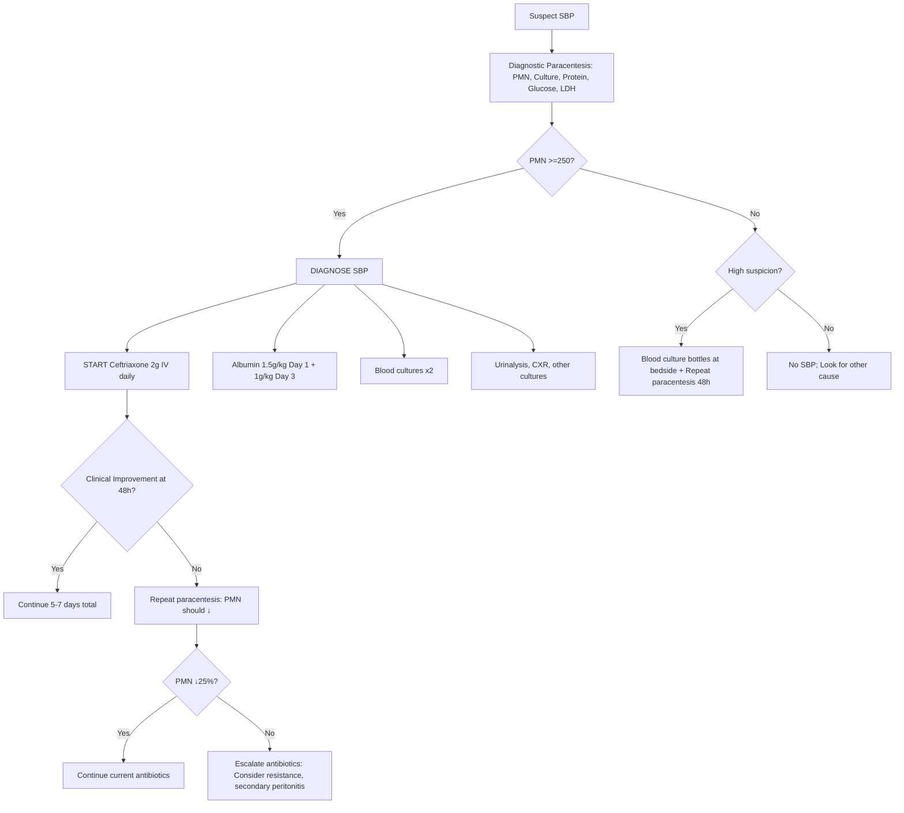
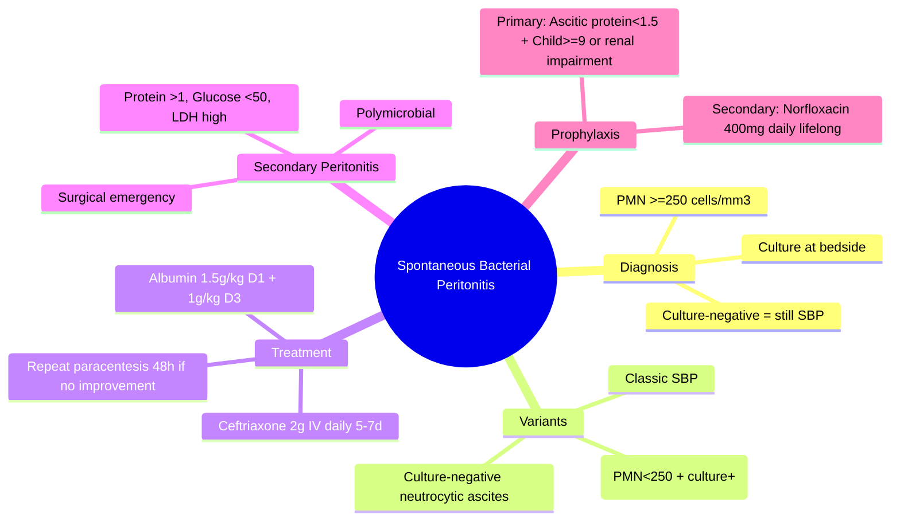

# Spontaneous Bacterial Peritonitis (SBP)

## Learning Objectives
- [ ] Apply diagnostic criteria (PMN count ≥250 cells/mm³)
- [ ] Differentiate SBP variants (culture-negative, bacterascites, secondary peritonitis)
- [ ] Initiate empirical antibiotics (ceftriaxone/cefotaxime) + albumin
- [ ] Know secondary prophylaxis indications
- [ ] Identify FCPS/MRCP high-yield management steps

---

## Definition & Epidemiology

| Feature | SBP |
|---------|-----|
| **Definition** | Infection of ascitic fluid **without** surgically treatable intra-abdominal source |
| **Incidence** | 10-30% of hospitalized cirrhotics with ascites |
| **Mortality** | 20-40% in-hospital (improved with albumin) |
| **Common organisms** | E. coli (40%), Klebsiella (20%), Strep pneumoniae (10%), Enterococci (10%) |
| **Culture-negative** | 40-60% (despite PMN ≥250) — "Culture-negative neutrocytic ascites" |

---

## Diagnostic Criteria

```mermaid
flowchart TD
    A[Clinical Suspicion: Fever, Abdo Pain, Worsening HE, Unexplained Deterioration] --> B[Diagnostic Paracentesis]
    B --> C[Ascitic Fluid Analysis]
    C --> D{PMN Count}
    D -->|≥250 cells/mm³| E[DIAGNOSE SBP]
    D -->|<250| F{Clinical suspicion HIGH?}
    F -->|Yes| G[Culture + Repeat in 48h]
    F -->|No| H[No SBP]
    E --> I[Send Culture (Blood culture bottles at bedside!)]
    E --> J[Start Empirical Antibiotics IMMEDIATELY]
    E --> K[Albumin 1.5g/kg Day 1 + 1g/kg Day 3]
```

### Ascitic Fluid Analysis: Key Values

| Parameter | SBP | Secondary Peritonitis | Notes |
|-----------|-----|----------------------|-------|
| **PMN count** | **≥250/mm³** | ≥250/mm³ | Main diagnostic criterion |
| **Culture** | Often negative | Usually positive | Inoculate at bedside |
| **Total protein** | Low (<1 g/dL) | High (>1 g/dL) | Low protein = risk factor |
| **Glucose** | Normal | **Low (<50 mg/dL)** | Low glucose = secondary |
| **LDH** | Normal | **High (>upper limit serum)** | High LDH = secondary |
| **Multiple organisms** | Rare | **Common** | Polymicrobial = secondary |

### Runyon's Criteria for Secondary Peritonitis (Any 2 of 3)
1. Ascitic fluid **total protein >1 g/dL**
2. Ascitic fluid **glucose <50 mg/dL**
3. Ascitic fluid **LDH >upper limit of normal serum**

> **If secondary peritonitis suspected**: Urgent surgical consultation + CT abdomen

---

## Variants of SBP

| Variant | Definition | Management |
|---------|------------|------------|
| **Classic SBP** | PMN ≥250 + positive culture | Antibiotics + Albumin |
| **Culture-negative neutrocytic ascites (CNNA)** | PMN ≥250 + negative culture | **Same as SBP** (treat empirically) |
| **Bacterascites** | PMN <250 + positive culture | If symptomatic → treat as SBP; If asymptomatic → repeat paracentesis, treat if PMN rises |
| **Monicrobial non-neutrocytic bacterascites** | Single organism, PMN <250 | Usually transient; monitor |

---

## Empirical Antibiotic Therapy

| Drug | Dose | Duration | Notes |
|------|------|----------|-------|
| **Ceftriaxone** (Preferred) | 2 g IV daily | **5-7 days** | Once daily; good Gram-neg coverage; no renal adjust |
| **Cefotaxime** | 2 g IV q6-8h | 5-7 days | Traditional; q6h dosing |
| **Alternative (allergy)** | Ciprofloxacin 400mg IV q12h | 5-7 days | If local resistance low |
| **Nosocomial/Recurrent** | Piperacillin-tazobactam 4.5g q6h OR Meropenem 1g q8h | 7-10 days | Cover ESBL, Enterococcus |

> **Start antibiotics BEFORE culture results** — delay increases mortality

---

## Albumin Adjunct Therapy

| Dose | Timing | Evidence |
|------|--------|----------|
| **1.5 g/kg** (max 100g) | **Day 1** (at diagnosis) | **Reduces HRS & mortality** (RCT: Sort et al.) |
| **1 g/kg** (max 100g) | **Day 3** | Completes course |

**Indication**: All SBP (especially if Cr >1, BUN >30, bilirubin >4)
**Mechanism**: Volume expansion → prevents renal vasoconstriction → prevents HRS

---

## Management Algorithm



---

## Secondary Prophylaxis (After SBP Episode)

| Indication | Regimen | Duration |
|------------|---------|----------|
| **All survivors of SBP** | **Norfloxacin 400 mg PO daily** | **Long-term** (until transplant/death) |
| **Alternative** | Ciprofloxacin 500 mg PO daily | Long-term |
| **Alternative** | TMP-SMX 1 DS daily | Long-term |

**Rationale**: Recurrence rate 40-70% at 1 year without prophylaxis

---

## Primary Prophylaxis (High-Risk Without Prior SBP)

| Indication | Regimen |
|------------|---------|
| **Ascitic fluid protein <1.5 g/dL** + **Child-Pugh ≥9** OR **Renal impairment (Cr≥1.5, BUN≥25, Na≤130)** | Norfloxacin 400 mg PO daily |
| **Acute variceal bleed** | Ceftriaxone 1g IV daily × 7 days (already covered) |

---

## FCPS/MRCP High-Yield Summary

| Concept | Key Points |
|---------|------------|
| **Diagnosis** | PMN ≥250 cells/mm³ ( cultura-negative = still SBP) |
| **Culture** | Inoculate **at bedside** into blood culture bottles |
| **Empirical antibiotics** | **Ceftriaxone 2g IV daily** × 5-7 days |
| **Albumin** | 1.5g/kg Day 1 + 1g/kg Day 3 — prevents HRS/mortality |
| **Secondary peritonitis** | Suspect if: protein >1, glucose <50, LDH high, polymicrobial |
| **Secondary prophylaxis** | Norfloxacin 400mg daily lifelong after SBP |
| **Primary prophylaxis** | Ascitic protein <1.5 + (Child≥9 or renal impairment) |

---

## Viva Questions

1. **What is the diagnostic criterion for SBP?**
2. **What is culture-negative neutrocytic ascites? How to manage?**
3. **What antibiotics for empirical SBP treatment? Dose? Duration?**
4. **When do you give albumin in SBP? Dose?**
5. **Differentiate SBP from secondary peritonitis.**
6. **What is bacterascites? Management?**
7. **Secondary prophylaxis after SBP: drug, dose, duration?**
8. **Primary prophylaxis indications?**
9. **Why inoculate culture at bedside?**
10. **SBP recurrence rate without prophylaxis?**

---

## Confusions & Mnemonics

| Confusion | Clarification |
|-----------|---------------|
| PMN vs total WCC | **PMN (polymorphonuclear) ≥250** — not total white count |
| Culture-negative SBP | **Still treat as SBP** — 40-60% culture-negative despite PMN≥250 |
| SBP vs Secondary peritonitis | Secondary: high protein, low glucose, high LDH, polymicrobial — needs surgery |
| Albumin timing | **Day 1 (1.5g/kg) + Day 3 (1g/kg)** — not single dose |
| Ceftriaxone vs Cefotaxime | Ceftriaxone preferred: once daily, no renal adjust, same efficacy |
| Primary vs Secondary prophylaxis | Primary: high-risk NO prior SBP; Secondary: ALL SBP survivors |

---

## Mind Map



---

## One-Page Revision Card

| **SBP** | **Details** |
|---------|-------------|
| **Diagnosis** | PMN ≥250/mm³ (culture-negative = still SBP) |
| **Culture** | Bedside inoculation in blood culture bottles |
| **Empirical Abx** | Ceftriaxone 2g IV daily × 5-7d (preferred) |
| **Albumin** | 1.5g/kg Day 1 + 1g/kg Day 3 |
| **Secondary Peritonitis** | Protein>1, Glucose<50, LDH high, polymicrobial → Surgery |
| **Secondary Prophylaxis** | Norfloxacin 400mg PO daily lifelong |
| **Primary Prophylaxis** | Ascitic protein<1.5 + (Child≥9 or Cr≥1.5/Na≤130) |

---

## Spaced Repetition Tracker

| Day | 1 | 3 | 7 | 15 | 30 |
|-----|---|---|---|----|----|
| PMN criterion | ☐ | ☐ | ☐ | ☐ | ☐ |
| Ceftriaxone dose | ☐ | ☐ | ☐ | ☐ | ☐ |
| Albumin doses | ☐ | ☐ | ☐ | ☐ | ☐ |
| SBP vs secondary peritonitis | ☐ | ☐ | ☐ | ☐ | ☐ |
| Prophylaxis indications | ☐ | ☐ | ☐ | ☐ | ☐ |

---

## Self-Test Scorecard

| Question | My Answer | Correct? |
|----------|-----------|----------|
| PMN cutoff |  |  |
| Ceftriaxone regimen |  |  |
| Albumin Day 1 + Day 3 |  |  |
| Runyon's criteria |  |  |
| Secondary prophylaxis |  |  |

---

## Local Navigation

- [[Portal Hypertension and Complications/Ascites|Ascites Overview]]
- [[Portal Hypertension and Complications/Ascites diagnosis and SAAG|Ascites Diagnosis]]
- [[Portal Hypertension and Complications/Ascites management|Ascites Management]]
- [[Portal Hypertension and Complications/Hepatic Encephalopathy|HE]]
- [[Portal Hypertension and Complications/Hepatorenal Syndrome|HRS]]
- [[Acute Liver Failure/CLIF-C ACLF and ACLF grades|ACLF]]