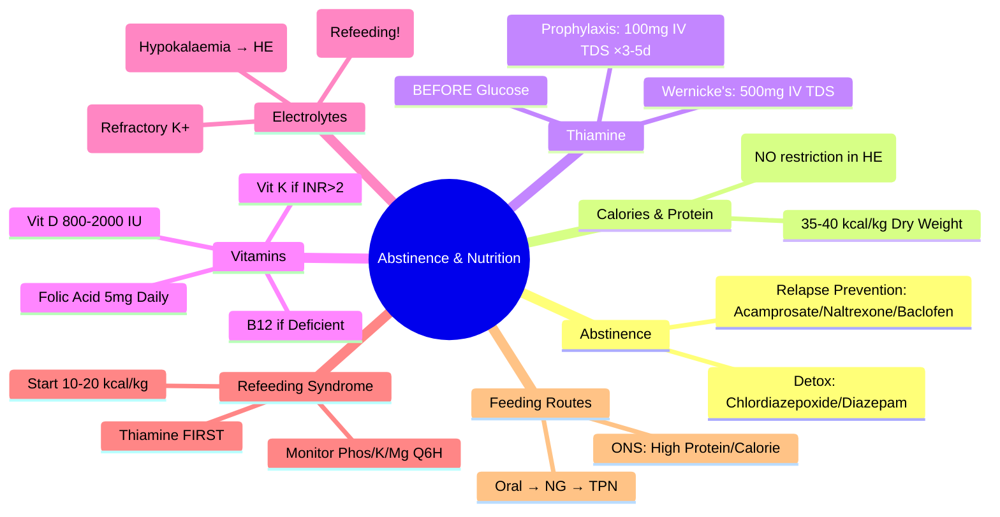

# Abstinence and Nutritional Support in Alcoholic Liver Disease

## Learning Objectives
- [ ] Implement alcohol cessation strategies (detoxification, relapse prevention medications)
- [ ] Prescribe nutritional support (calories, protein, micronutrients)
- [ ] Prevent and treat Wernicke's encephalopathy (Thiamine protocol)
- [ ] Manage electrolyte disturbances (hypophosphataemia, hypokalaemia, hypomagnesaemia)
- [ ] Identify FCPS/MRCP high-yield nutritional targets and protocols

---

## Alcohol Cessation: The Foundation

> **Abstinence is the single most effective intervention** in alcoholic liver disease — improves survival at all stages

### Detoxification (If Dependent)
| Setting | Indication | Regimen |
|---------|------------|---------|
| **Outpatient** | Mild dependence, No seizure history, Good support | **Chlordiazepoxide** 10-30mg Q6H ×3-5 days, Tapering |
| **Inpatient** | Severe dependence, Seizure history, Delirium, Poor support | **Diazepam/Chlordiazepoxide** Symptom-triggered (CIWA-Ar) |
| **Thiamine** | **ALL patients** before/during detox | **100mg IV TDS ×3-5 days** then 100mg PO daily |

> **Thiamine BEFORE Glucose** — Prevents Wernicke's Encephalopathy

---

## Nutritional Requirements

| Nutrient | Target (Cirrhosis/ALD) | Rationale |
|----------|------------------------|-----------|
| **Energy** | **35-40 kcal/kg/day** (dry weight) | Prevent Catabolism; Higher if Malnourished |
| **Protein** | **1.2-1.5 g/kg/day** (dry weight) | Positive Nitrogen Balance; **Do NOT Restrict** (Old myth) |
| **Carbohydrate** | 50-60% of Calories | Glucose Tolerance Often Impaired — Complex Carbs |
| **Fat** | 20-30% of Calories | MCT Oil Preferred (No Lymphatic Transport Needed) |
| **Fluid** | 25-30 mL/kg/day | Adjust for Ascites/Edema/Renal |
| **Sodium** | **88 mmol/day (2g NaCl)** if Ascites | Fluid Retention |

> **FCPS/MRCP**: **Do NOT Restrict Protein** in Hepatic Encephalopathy — Malnutrition Worsens Outcome

---

## Micronutrient Supplementation

### Thiamine (Vitamin B1) — **CRITICAL**

| Scenario | Dose | Route | Duration |
|----------|------|-------|----------|
| **Prophylaxis (All ALD)** | 100mg | PO Daily | Ongoing |
| **Acute Risk / Detox / HE** | 100mg | **IV TDS** | 3-5 days |
| **Wernicke's Encephalopathy** | 500mg | **IV TDS** | 3-5 days, then 100mg IV daily ×5d |

> **Wernicke's Triad**: **Confusion + Ophthalmoplegia + Ataxia** — **Medical Emergency**

### Other Vitamins
| Vitamin | Dose | Indication |
|---------|------|------------|
| **Folic Acid** | 5mg PO Daily | All ALD (Impaired Absorption, Increased Demand) |
| **Vitamin B12** | 1mg IM Monthly (if Deficient) | Macrocytosis, Neuropathy |
| **Vitamin K** | 10mg IV/PO (if INR >2) | Before Procedures / Bleeding |
| **Vitamin D** | 800-2000 IU Daily | Osteoporosis Prevention (Common in ALD) |
| **Zinc** | 200mg PO Daily (Zinc Sulphate) | HE Adjunct, Taste Improvement, Immune |
| **Magnesium** | Replace if Low | Hypomagnesaemia Common (↑ HE Risk) |

---

## Electrolyte Management

| Electrolyte | Target | Management |
|-------------|--------|------------|
| **Phosphate** | >0.8 mmol/L | **Hypophosphataemia = Refeeding Risk** — Replace IV (Phosphate 20-40mmol) |
| **Potassium** | 3.5-5.0 mmol/L | Replace IV/PO; **Hypokalaemia ↑ HE Risk** (Renal Ammonia Production) |
| **Magnesium** | >0.7 mmol/L | Replace IV/PO; Hypomagnesaemia → Refractory Hypokalaemia |
| **Sodium** | 135-145 mmol/L | Hyponatraemia <125 → Fluid Restrict 1L/day |

---

## Feeding Routes

```mermaid
flowchart TD
    A[Nutritional Support Needed] --> B{Oral Intake Adequate?}
    B -->|Yes (>75% needs)| C[Oral Diet + Supplements]
    B -->|No (<75% needs)| D{Nasogastric Safe?}
    D -->|Yes| E[NG Feeding (Polymeric/High Protein)]
    D -->|No (Ileus, Obstruction, High Aspiration Risk)| F[TPN (Central Line)]
    E --> G[Monitor: Glucose, Electrolytes, Volume]
    F --> G
    G --> H[Transition to Oral ASAP]
```

### Oral Nutritional Supplements (ONS)
- **High Protein, High Calorie** (1.5-2.4 kcal/mL, 15-20g Protein/bottle)
- **Frequency**: 2-3 bottles/day between meals
- **Special**: Hepatic formulations (BCAA-enriched) — Evidence Mixed

---

## Refeeding Syndrome Prevention

> **High Risk**: Starvation >5d, BMI <16, Weight Loss >15%, Alcohol Dependence, Nil by Mouth >10d

| Protocol | Action |
|----------|--------|
| **Start Low** | **10-20 kcal/kg/day** (Max 1000 kcal/day) |
| **Advance Slowly** | Increase by 250 kcal/day every 2-3 days |
| **Electrolytes** | **Check Q6H ×24h, then Daily** — Replace Phosphate, K, Mg Proactively |
| **Thiamine** | **100mg IV TDS** before/during feeding (Essential) |
| **Monitor** | Glucose Q6H, Phosphate/K/Mg Q6H ×24h, then Daily |

---

## FCPS/MRCP High-Yield Summary

| Concept | Key Points |
|---------|------------|
| **Abstinence** | **Most Effective** Intervention — Improves Survival at All Stages |
| **Calories** | **35-40 kcal/kg/day** (Dry Weight) |
| **Protein** | **1.2-1.5 g/kg/day** — **NO Restriction** (Even in HE) |
| **Thiamine** | **100mg IV TDS** — **Before Glucose** (Prevents Wernicke's) |
| **Wernicke's** | 500mg IV TDS — Medical Emergency (Confusion + Ophthalmoplegia + Ataxia) |
| **Folic Acid** | 5mg Daily — All ALD |
| **Refeeding Syndrome** | Start 10-20 kcal/kg; Thiamine First; Monitor Phosphate/K/Mg Q6H |
| **Protein in HE** | **Do NOT Restrict** — Malnutrition Worsens Outcome |
| **BCAA Supplements** | Limited Evidence; Not Routine |

---

## Viva Questions

1. **What are the calorie and protein targets for alcoholic liver disease?**
2. **Why is thiamine given before glucose?**
3. **What is Wernicke's encephalopathy? Treatment?**
3. **What is refeeding syndrome? How do you prevent it?**
4. **Should protein be restricted in hepatic encephalopathy?**
5. **What is the thiamine dose for Wernicke's? Prophylaxis?**
6. **What electrolytes are at risk in refeeding syndrome?**
6. **Is protein restriction indicated in hepatic encephalopathy?**
7. **What vitamins are routinely supplemented in ALD?**
8. **What is the role of zinc in alcoholic liver disease?**
9. **When do you use TPN vs NG feeding?**

---

## Confusions & Mnemonics

| Confusion | Clarification |
|-----------|---------------|
| Protein Restriction in HE | **Old Myth** — **Do NOT Restrict**; 1.2-1.5g/kg/day even in HE |
| Thiamine Timing | **Thiamine BEFORE Glucose** — Prevents Wernicke's |
| Wernicke's Dose | **500mg IV TDS** (Not 100mg) — Triad: Confusion + Ophthalmoplegia + Ataxia |
| Refeeding Phosphate | **Hypophosphataemia** = Hallmark; Replace IV Proactively |
| BCAA Supplements | **Not Routine** — Limited Evidence; Standard Protein Adequate |
| Thiamine Dose Prophylaxis | 100mg IV TDS ×3-5d (Detox/Risk) → 100mg PO Daily (Maintenance) |
| Calorie Target | **35-40 kcal/kg Dry Weight** — Not Actual Weight (Ascites) |
| MCT Oil | Preferred in Malabsorption/Chylous Ascites — No Lymphatic Transport |

---

## Mind Map



---

## One-Page Revision Card

| **Nutritional Target** | **Value** |
|------------------------|-----------|
| **Calories** | 35-40 kcal/kg (Dry Weight) |
| **Protein** | 1.2-1.5 g/kg/day (**NO restriction in HE**) |
| **Sodium** | 88 mmol/day (2g NaCl) if Ascites |

| **Thiamine** | **Dose** | **Indication** |
|--------------|----------|----------------|
| Prophylaxis | 100mg IV TDS ×3-5d | Detox / HE Risk |
| Wernicke's | **500mg IV TDS** | Confusion + Ophthalmoplegia + Ataxia |
| Maintenance | 100mg PO Daily | All ALD |

| **Refeeding Syndrome** | **Prevention** |
|------------------------|----------------|
| High Risk | Starvation >5d, BMI<16, Alcohol, NBM>10d |
| Start | 10-20 kcal/kg/day |
| Thiamine | **First (100mg IV TDS)** |
| Electrolytes | Phos/K/Mg Q6H ×24h |
| Advance | +250 kcal every 2-3d |

| **Wernicke's Triad** | **Confusion + Ophthalmoplegia + Ataxia** = **EMERGENCY** |

---

## Spaced Repetition Tracker

| Day | 1 | 3 | 7 | 15 | 30 |
|-----|---|---|---|----|----|
| Calorie/Protein Targets | ☐ | ☐ | ☐ | ☐ | ☐ |
| Thiamine Protocol | ☐ | ☐ | ☐ | ☐ | ☐ |
| Wernicke's Triad/Treatment | ☐ | ☐ | ☐ | ☐ | ☐ |
| Refeeding Prevention | ☐ | ☐ | ☐ | ☐ | ☐ |
| Protein in HE | ☐ | ☐ | ☐ | ☐ | ☐ |

---

## Self-Test Scorecard

| Question | My Answer | Correct? |
|----------|-----------|----------|
| Calorie/Protein targets |  |  |
| Thiamine before Glucose |  |  |
| Wernicke's dose/triad |  |  |
| Refeeding prevention |  |  |
| Protein restriction in HE |  |  |

---

## Local Navigation

- [[Alcoholic Liver Disease/Alcoholic Liver Disease|Alcoholic Liver Disease]]
- [[Alcoholic Liver Disease/Corticosteroid therapy (prednisolone)|Corticosteroid Therapy]]
- [[Alcoholic Liver Disease/Alcoholic hepatitis scoring (Maddrey DF, Glasgow, ABIC, Lille)|Scoring Systems]]
- [[Alcoholic Liver Disease/Alcohol relapse prevention|Relapse Prevention]]
---

> Auto-generated study sections for "Alcoholic Liver Disease" — Ch 23: Hepatology.

## Flashcards (10 generated)

- Q: What is the definition of Alcoholic Liver Disease?
  A: # Abstinence and Nutritional Support in Alcoholic Liver Disease
- Q: What is Abstinence of Alcoholic Liver Disease?
  A: Most Effective Intervention — Improves Survival at All Stages
- Q: What is Calories of Alcoholic Liver Disease?
  A: 35-40 kcal/kg/day (Dry Weight)
- Q: What is Protein of Alcoholic Liver Disease?
  A: 1.2-1.5 g/kg/day — NO Restriction (Even in HE)
- Q: What is Thiamine of Alcoholic Liver Disease?
  A: 100mg IV TDS — Before Glucose (Prevents Wernicke's)
- Q: What is Wernicke's of Alcoholic Liver Disease?
  A: 500mg IV TDS — Medical Emergency (Confusion + Ophthalmoplegia + Ataxia)
- Q: What is Folic Acid of Alcoholic Liver Disease?
  A: 5mg Daily — All ALD
- Q: What is Refeeding Syndrome of Alcoholic Liver Disease?
  A: Start 10-20 kcal/kg; Thiamine First; Monitor Phosphate/K/Mg Q6H
- Q: What is Protein in HE of Alcoholic Liver Disease?
  A: Do NOT Restrict — Malnutrition Worsens Outcome
- Q: What is BCAA Supplements of Alcoholic Liver Disease?
  A: Limited Evidence; Not Routine

## MCQs (1 generated)

1. **Which of the following best describes Alcoholic Liver Disease?**
   A. **# Abstinence and Nutritional Support in Alcoholic Liver Disease**
   B. An unrelated condition not matching the clinical picture of Alcoholic Liver Disease
   C. A complication seen late in the disease course of Alcoholic Liver Disease
   D. A condition that mimics Alcoholic Liver Disease but has a different underlying cause

## PasTest Scenario SBAs (Clinical Vignettes)

> **Auto-generated PasTest/Mediscope-style scenario SBAs** grounded in the authored source. Each scenario tests a real clinical fact (triad, specific sign, contraindication, trial, first-line Rx) extracted from the topic. *Source: Ch 23: Hepatology — Abstinence and nutritional support*

**Q1.** Which of the following features is most specific or characteristic of Abstinence and nutritional support?

  - **A.** Hypophosphataemia
  - **B.** A feature common to many acute inflammatory conditions
  - **C.** A non-specific sign that does not localise the diagnosis
  - **D.** An investigation finding rather than a clinical feature

  > **Answer: A** — Hypophosphataemia
  >
  > *Source:* *500mg IV TDS** (Not 100mg) — Triad: Confusion + Ophthalmoplegia + Ataxia |
| Refeeding Phosphate | **Hypophosphataemia** = Hallmark; Replace IV Proactively |
| BCAA Supplements | **Not Routine** — Li

