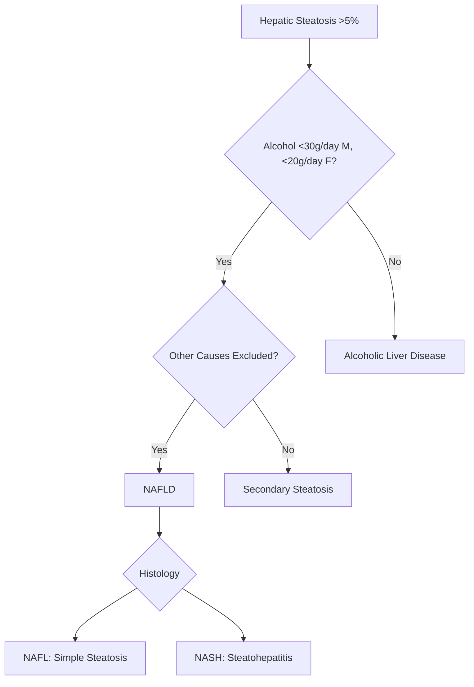
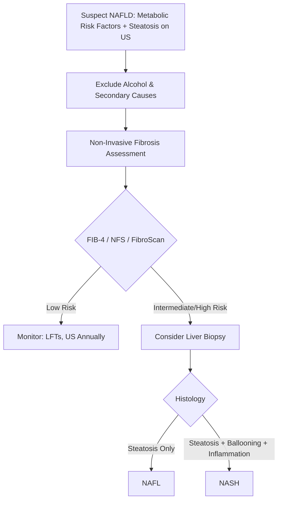
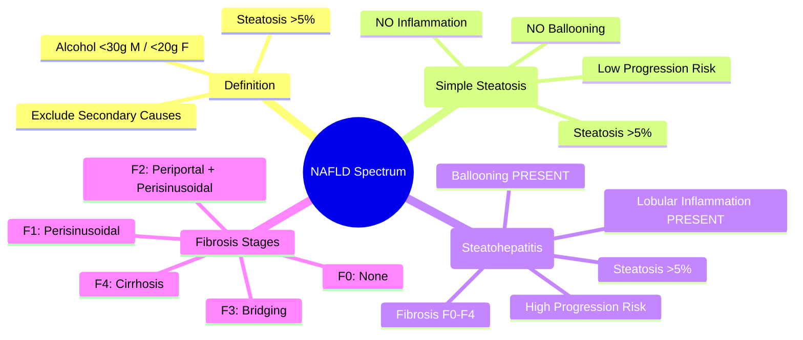

## 1. Learning Objectives
- [ ] Define NAFLD and differentiate NAFL from NASH
- [ ] Apply diagnostic criteria for NAFLD
- [ ] Understand the spectrum of disease progression
- [ ] Identify FCPS/MRCP high-yield differentiation points

---

## 2. Definition

> **NAFLD (Non-Alcoholic Fatty Liver Disease)** = **Hepatic steatosis >5%** in the absence of significant alcohol consumption (<30g/day men, <20g/day women) and other causes of steatosis

---

## 3. NAFLD Spectrum

| Stage | Definition | Histology | Progression Risk |
|-------|------------|-----------|------------------|
| **NAFL (Simple Steatosis)** | **Steatosis >5%** WITHOUT significant inflammation or ballooning | • Steatosis >5% • No ballooning • No/minimal lobular inflammation | **Low** (5-10% progress) |
| **NASH (Non-Alcoholic Steatohepatitis)** | **Steatosis >5% + Ballooning + Lobular Inflammation** ± Fibrosis | • Steatosis >5% • **Hepatocyte Ballooning** • **Lobular Inflammation** • ± Fibrosis | **High** (20-30% progress to cirrhosis) |

---

## 4. Histological Criteria (NASH CRN)

| Feature | NAFL | NASH |
|---------|------|------|
| **Steatosis** | >5% | >5% |
| **Ballooning** | **Absent** | **Present (Required)** |
| **Lobular Inflammation** | Absent/Minimal | **Present (Required)** |
| **Fibrosis** | None | Variable (F0-F4) |
| **Mallory-Denk Bodies** | Rare | Common |

> **FCPS/MRCP**: **Ballooning = KEY differentiator** between NAFL and NASH

---

## 5. NASH Fibrosis Stages (METAVIR/NASH CRN)

| Stage | Description | Clinical Significance |
|-------|-------------|----------------------|
| **F0** | No Fibrosis | NAFL/NASH without fibrosis |
| **F1** | Perisinusoidal/Periportal Fibrosis | Early fibrosis |
| **F2** | Perisinusoidal + Portal/Periportal Fibrosis | Significant fibrosis |
| **F3** | Bridging Fibrosis | Advanced fibrosis |
| **F4** | **Cirrhosis** | Decompensation risk, HCC surveillance |

---

## 6. NAFL vs NASH: Quick Comparison

| Feature | NAFL (Simple Steatosis) | NASH |
|---------|-------------------------|------|
| **Steatosis** | >5% | >5% |
| **Ballooning** | Absent | **Present** |
| **Lobular Inflammation** | Minimal/Absent | **Present** |
| **ALT/AST** | Mild ↑ or Normal | Moderate ↑ (2-5×ULN) |
| **Fibrosis** | None | Variable (F0-F4) |
| **Progression to Cirrhosis** | <10% | **20-30%** |
| **HCC Risk** | Very Low | **Significant (if F3-F4)** |
| **Metabolic Syndrome** | Common | **Universal** |

---

## 7. Diagnostic Approach

---

## 8. FCPS/MRCP High-Yield Summary

| Concept | Key Points |
|---------|------------|
| **NAFLD Definition** | Steatosis >5% + Alcohol <30g/day (M) / <20g/day (F) + No other cause |
| **NAFL vs NASH** | **Ballooning + Inflammation = NASH** (Key differentiator) |
| **NASH Fibrosis Stages** | F0-F4 (F3=Advanced, F4=Cirrhosis) |
| **Progression** | NAFL: <10% → Cirrhosis; NASH: 20-30% → Cirrhosis |
| **HCC Risk** | NASH F3-F4: Significant; NAFL: Very Low |
| **Key Histology** | Ballooning = Required for NASH diagnosis |

---

## 9. Viva Questions

1. **Define NAFLD. What alcohol thresholds exclude it?**
2. **Differentiate NAFL from NASH histologically.**
3. **What is the key histological feature required for NASH diagnosis?**
4. **What are the NASH fibrosis stages (F0-F4)?**
5. **What is the progression risk of NAFL vs NASH to cirrhosis?**
5. **What is the HCC risk in NAFL vs NASH?**
6. **How do you diagnose NAFLD? What must you exclude?**

---

## 10. Confusions & Mnemonics

| Confusion | Clarification |
|-----------|---------------|
| NAFL vs NASH | **Ballooning + Inflammation = NASH**; Steatosis alone = NAFL |
| NAFL Progression | Most NAFL **never progresses**; only 5-10% develop fibrosis |
| NASH Progression | **20-30%** progress to cirrhosis over 10-20 years |
| HCC Risk | **NASH F3-F4** have HCC risk; NAFL essentially none |
| Ballooning | **Swollen, pale hepatocytes** with rarefied cytoplasm — **Hallmark of NASH** |

---

## 11. Mind Map

---

## 12. One-Page Revision Card

| **NAFLD** | **Definition** |
|-----------|----------------|
| **Steatosis** | >5% Hepatocytes |
| **Alcohol** | <30g/day (M), <20g/day (F) |
| **Exclude** | Viral, Autoimmune, Drugs, Genetic, Alcohol |

| **NAFL vs NASH** | **NAFL** | **NASH** |
|------------------|----------|----------|
| **Ballooning** | Absent | **Present** |
| **Inflammation** | Absent/Minimal | **Present** |
| **Fibrosis** | None | F0-F4 |
| **Cirrhosis Risk** | <10% | **20-30%** |
| **HCC Risk** | Negligible | **F3-F4: Significant** |

| **NASH Fibrosis Stages** | |
|--------------------------|--|
| F0 | No Fibrosis |
| F1 | Perisinusoidal/Periportal |
| F2 | Perisinusoidal + Portal |
| F3 | Bridging |
| **F4** | **Cirrhosis** |

---

## 13. Spaced Repetition Tracker

| Day | 1 | 3 | 7 | 15 | 30 |
|-----|---|---|---|----|----|
| NAFLD Definition | ☐ | ☐ | ☐ | ☐ | ☐ |
| NAFL vs NASH | ☐ | ☐ | ☐ | ☐ | ☐ |
| Ballooning = NASH Key | ☐ | ☐ | ☐ | ☐ | ☐ |
| Fibrosis Stages F0-F4 | ☐ | ☐ | ☐ | ☐ | ☐ |
| Progression Risks | ☐ | ☐ | ☐ | ☐ | ☐ |

---

## 14. Self-Test Scorecard

| Question | My Answer | Correct? |
|----------|-----------|----------|
| NAFLD Alcohol Thresholds |  |  |
| NAFL vs NASH Histology |  |  |
| Ballooning Significance |  |  |
| NASH Fibrosis Stages |  |  |
| NAFL vs NASH Progression |  |  |

---

## 15. Local Navigation

- [[Non-Alcoholic Fatty Liver Disease/Non-Alcoholic Fatty Liver Disease|NAFLD Overview]]
- [[Non-Alcoholic Fatty Liver Disease/NAFLD Risk Factors and Pathophysiology|NAFLD Risk Factors]]
- [[Non-Alcoholic Fatty Liver Disease/NAFLD Diagnosis (FIB-4, NFS, ELF, FibroScan)|NAFLD Diagnosis]]
- [[Non-Alcoholic Fatty Liver Disease/NAFLD Management (Lifestyle, Pharmacotherapy, Bariatric Surgery)|NAFLD Management]]