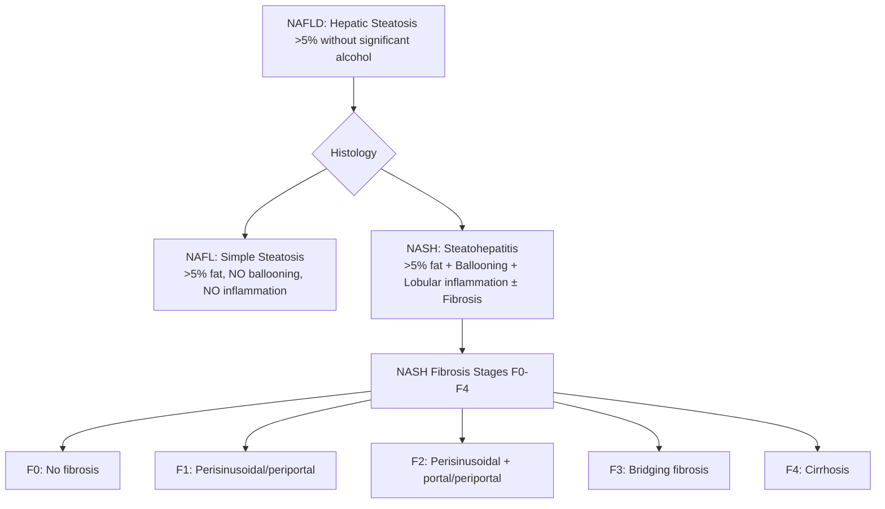
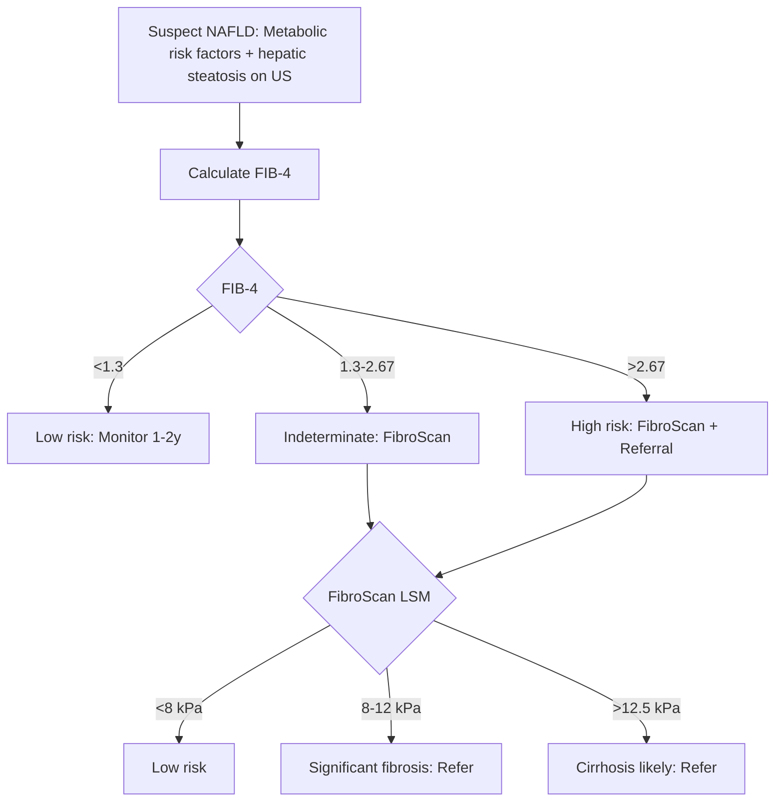

## 1. Learning Objectives
- [ ] Define NAFLD spectrum (NAFL vs NASH)
- [ ] Apply non-invasive fibrosis scores (FIB-4, NFS, APRI, ELF, FibroScan)
- [ ] Know biopsy indications
- [ ] Select pharmacotherapy (pioglitazone, GLP-1 agonists, resmetirom)
- [ ] Identify FCPS/MRCP high-yield management steps

---

## 2. Definition & Spectrum



| Feature | NAFL (Simple Steatosis) | NASH |
|---------|------------------------|------|
| **Steatosis** | >5% hepatocytes | >5% hepatocytes |
| **Ballooning** | Absent | **Present** |
| **Lobular Inflammation** | Absent/minimal | **Present** |
| **Fibrosis** | None | Variable (F0-F4) |
| **Progression** | Benign (rare fibrosis) | **20-30% progress to cirrhosis** |

---

## 3. Risk Factors & Pathophysiology

| Risk Factor | Association |
|-------------|-------------|
| **Obesity (BMI >30)** | 70-90% NAFLD |
| **Type 2 Diabetes** | 50-70% NAFLD; **independent risk for NASH/fibrosis** |
| **Metabolic Syndrome** | Central obesity, HTN, dysglycaemia, dyslipidaemia |
| **Insulin Resistance** | **Central driver** → lipolysis → FFA flux → hepatic steatosis |
| **Genetics** | **PNPLA3 (I148M)**, TM6SF2, MBOAT7 — PNPLA3 strongest |

> **FCPS/MRCP**: **T2DM + Obesity = highest risk for NASH with fibrosis**

---

## 4. Non-Invasive Fibrosis Assessment

### 1. FIB-4 (First-Line, Cheap, Widely Available)
```
FIB-4 = (Age × AST) / (Platelets × √ALT)
```
| Cut-off | Interpretation |
|---------|----------------|
| **<1.3** | **Low risk** advanced fibrosis (NPV >90%) |
| **1.3-2.67** | **Indeterminate** — need further testing |
| **>2.67** | **High risk** advanced fibrosis (PPV ~65%) |

> **Age-adjusted**: For >65y, use <2.0 / >3.0 cut-offs

### 2. NFS (NAFLD Fibrosis Score)
```
NFS = -1.675 + 0.037×Age + 0.094×BMI + 1.13×IFG/DM + 0.99×AST/ALT - 0.013×Platelets - 0.66×Albumin
```
| Cut-off | Interpretation |
|---------|----------------|
| **<-1.455** | Low risk advanced fibrosis |
| **-1.455 to 0.676** | Indeterminate |
| **>0.676** | High risk advanced fibrosis |

### 3. APRI (AST to Platelet Ratio Index)
```
APRI = (AST / ULN_AST) × 100 / Platelets (10⁹/L)
```
| Cut-off | Interpretation |
|---------|----------------|
| **<0.5** | No significant fibrosis |
| **0.5-1.5** | Indeterminate |
| **>1.5** | Significant fibrosis |
| **>2.0** | Cirrhosis |

### 4. ELF (Enhanced Liver Fibrosis) — Blood Test Panel
| Components | HA (Hyaluronic Acid), PIIINP, TIMP-1 |
|------------|--------------------------------------|
| **Cut-off** | **<7.7**: No advanced fibrosis; **7.7-9.7**: Indeterminate; **>9.7**: Advanced fibrosis |
| **Advantage** | Better accuracy than FIB-4/NFS; not widely available |

### 5. FibroScan (VCTE) — Gold Standard Non-Invasive
| Measurement | Cut-off (kPa) | Fibrosis Stage |
|-------------|---------------|----------------|
| **LSM** (Liver Stiffness) | **<8.0** | F0-F1 (No/mild) |
| | **8.0-9.5** | F2 (Significant) |
| | **9.5-12.5** | F3 (Advanced) |
| | **>12.5-15.0** | F4 (Cirrhosis) |
| **CAP** (Controlled Attenuation Parameter) | **>238 dB/m** | Steatosis ≥S1 |
| | **>260 dB/m** | Steatosis ≥S2 |
| | **>290 dB/m** | Steatosis ≥S3 |

> **FibroScan limitations**: Obesity (XL probe), ascites, acute inflammation, biliary obstruction

### Algorithm for Fibrosis Assessment



---

## 5. Liver Biopsy Indications

| Indication | Detail |
|------------|--------|
| **Indeterminate non-invasive tests** | FIB-4 1.3-2.67 + FibroScan discordant/unavailable |
| **Clinical trial enrollment** | Histologic endpoints |
| **Atypical features** | Suspected alternative diagnosis (AIH, DILI, Wilson) |
| **Before pharmacotherapy** | Optional (guidelines vary) |

**NASH CRN Histologic Scoring** (Biopsy):
- **Steatosis** (0-3), **Ballooning** (0-2), **Inflammation** (0-3) → **NAS Score** (0-8)
- **NAS ≥5**: NASH; **NAS 3-4**: Borderline; **NAS <3**: Not NASH
- **Fibrosis** (0-4)

---

## 6. Management

### Lifestyle Intervention (Cornerstone)
| Target | Evidence |
|--------|----------|
| **Weight loss 7-10%** | **Histologic improvement in NASH** (reduces ballooning, inflammation, fibrosis) |
| **Exercise** | 150-300 min/week moderate aerobic + resistance |
| **Diet** | Mediterranean, low fructose, low saturated fat |
| **Alcohol** | **Avoid** (even modest worsens NASH) |

### Pharmacotherapy (For NASH with Fibrosis F≥2)

| Drug | Dose | Evidence | Status |
|------|------|----------|--------|

*...continued (truncated for renderer performance)*