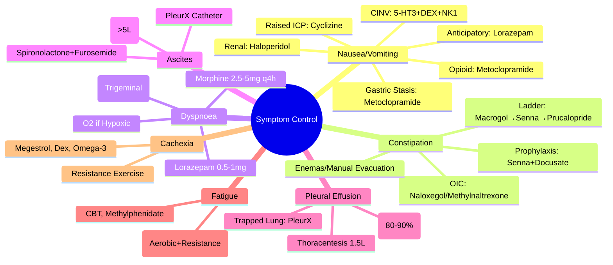

> [!tip] **FCPS/MRCP Priority: HIGH**
> **Ascites in Cirrhosis = Portal hypertension + hypoalbuminaemia** — **SAAG ≥11 g/L = portal hypertension**; **SBP = PMNs ≥250/mm³** → **ceftriaxone 2g IV + albumin**; **Refractory ascites** → **LVP + albumin 8g/L removed** → **TIPS/transplant**.

---

## 1. Learning Objectives
By the end of this note you should be able to:
- [ ] Apply **SAAG** to differentiate portal hypertensive vs non-portal hypertensive ascites
- [ ] Diagnose **SBP** (PMNs ≥250/mm³) and initiate **ceftriaxone + albumin**
- [ ] Manage **refractory ascites**: **LVP + albumin 8g/L removed** → **TIPS / transplant**
- [ ] Apply **SBP prophylaxis**: prior SBP, ascitic protein <15g/L + Child-Pugh ≥9, GI bleed

---

## 1. Pathophysiology

| Mechanism | Details |
|-----------|---------|
| **Portal Hypertension** | ↑ Hydrostatic pressure → transudation |
| **Hypoalbuminaemia** | ↓ Oncotic pressure → ↓ plasma colloid osmotic pressure |
| **Splanchnic Vasodilation** | NO-mediated → ↓ effective arterial volume → RAAS/SNS activation → Na/H₂O retention |

---

## 2. Diagnostic Approach

### SAAG (Serum-Ascites Albumin Gradient)
| SAAG | Interpretation | Causes |
|------|----------------|--------|
| **≥11 g/L** | **Portal Hypertension** | Cirrhosis, cardiac failure, Budd-Chiari, portal vein thrombosis |
| **<11 g/L** | **Non-Portal Hypertension** | Peritoneal carcinomatosis, TB, pancreatitis, nephrotic syndrome |

> **SAAG = Serum albumin – Ascitic albumin**; **≥11 g/L = Portal hypertension**

### Diagnostic Paracentesis (Always Perform)
| Test | Indication |
|------|------------|
| **Cell count + differential** | **PMNs ≥250/mm³ = SBP** |
| **Culture** | Aerobic/anaerobic (blood culture bottles) |
| **Total protein** | >25 g/L = exudate; <15 g/L = high SBP risk |
| **Albumin** | For SAAG calculation |
| **Glucose** | Low in TB, malignancy |
| **LDH** | High in malignancy, TB |
| **Cytology** | Malignancy |
| **Amylase** | Pancreatic ascites |

---

## 3. Spontaneous Bacterial Peritonitis (SBP)

### Diagnostic Criteria
| Parameter | SBP | Secondary Peritonitis |
|-----------|-----|----------------------|
| **Polymorphs (PMNs)** | **≥250/mm³** | >250 (often much higher) |
| **Culture** | **Single organism** (E. coli, Klebsiella, Strep) | **Multiple organisms** |
| **Protein** | **<15 g/L** | >15 g/L |
| **Glucose** | Normal | Low (<50 mg/dL) |
| **LDH** | Normal | High (>ULN) |

### SBP Management
| Step | Intervention | Dose/Details |
|------|--------------|--------------|
| **1. Antibiotics** | **Ceftriaxone 2g IV q12h** (or piperacillin-tazobactam 4.5g q6h) | 5-7 days |
| **2. Albumin** | **1.5 g/kg D1** + **1.0 g/kg D3** | Prevents renal dysfunction, reduces mortality |
| **3. Repeat Paracentesis** | **48h** — if PMNs not ↓25% → change antibiotics |

---

## 3. SBP Prophylaxis

| Indication | Regimen |
|------------|---------|
| **Prior SBP** | **Norfloxacin 400mg OD** lifelong |
| **Ascitic protein <15 g/L + Child-Pugh ≥9 or renal impairment** | **Norfloxacin 400mg OD** (primary prophylaxis) |
| **Active GI bleed** | **Ceftriaxone 1g IV OD ×7 days** |

---

## 4. Refractory Ascites

| Severity | Management |
|----------|------------|
| **Mild (Asymptomatic)** | **Observation, Diuretics (Spironolactone 100mg + Furosemide 40mg)** |
| **Moderate (Symptomatic)** | **Therapeutic Paracentesis (5-8L)**; **Albumin 8g/L Removed** (if >5L) |
| **Refractory / Recurrent** | **Repeated Paracentesis**, **Tunnelled Peritoneal Catheter (PleurX)**, **Peritoneovenous Shunt (Denver/LeVeen)**, **Catheperitoneal Shunt** |
| **Diuretic-Resistant** | **Large Volume Paracentesis + Albumin** |

### Paracentesis Protocol

| Step | Detail |
|------|--------|
| **Pre-Procedure** | **US-Guided**, **Empty Bladder**, **Consent**, **Group & Save** |
| **Volume** | **5-8L** (Large Volume), **Stop if Symptomatic (Dizziness, Hypotension)** |
| **Albumin Replacement** | **8g/L Ascites Removed** (If >5L Removed) — **Prevents Circulatory Dysfunction** |
| **Post-Procedure** | **Monitor BP, HR, Renal Function**, **Compression Bandage** |

---

## 4. Diuretic Therapy

### Stepped Approach

| Step | Intervention | Dose |
|------|--------------|------|
| **1. Lifestyle** | **Fluids 2-3L/d, Fibre, Mobilisation, Toilet Routine** | — |
| **2. Osmotic Laxative** | **Macrogol (Movicol) 1-2 sachets BD** | **First-Line** |
| **3. Stimulant Laxative** | **Senna 15mg ON** (or BD) | **Add if Osmotic Inadequate** |
| **4. Prokinetic** | **Prucalopride 1-2mg OD** (If Stimulant Fails) | **2nd-Line** |
| **4. Enemas/Suppositories** | **Micro-enema (Phosphate), Glycerol Suppository, Arachis Oil Enema** | **Rectal Loading / Impaction** |
| **5. Manual Evacuation** | **If Faecal Impaction** | **Last Resort** |

### Opioid-Induced Constipation (OIC) — Specific Management

| Step | Intervention |
|------|--------------|
| **1. Prophylaxis** | **Senna 15mg ON + Docusate 100mg BD** (Start with Opioid) |
| **2. If Constipated** | **Add Macrogol 1-2 sachets BD** |
| **3. If Refractory** | **Prucalopride 1-2mg OD** / **Naloxegol 25mg OD** (Peripheral Opioid Antagonist) / **Methylnaltrexone 0.15mg/kg SC** (SC Injection) |
| **4. Avoid** | **Bulk-Forming (Ispaghula) if Obstruction Risk** |

---

## 6. FCPS/MRCP High-Yield Summary

| Symptom | Key Management |
|---------|--------------|
| **Ascites** | **SAAG ≥11 g/L = Portal HTN**; **SBP: PMNs ≥250 → Ceftriaxone + Albumin**; **Refractory: LVP + Albumin 8g/L removed** → **TIPS/Transplant** |
| **Pleural Effusion** | **Thoracentesis 1-1.5L**, **Pleurodesis (Talc 4g Slurry 80-90%)**; **IPC for Trapped Lung/Failed Pleurodesis** |
| **Fatigue** | **Exercise (Aerobic+Resistance) = Best**, **CBT**, **Methylphenidate/Dexamethasone** |
| **Cachexia** | **Megestrol 160-800mg**, **Dexamethasone**, **Omega-3 (EPA 2g)**, **Resistance Exercise** |

---

## 7. FCPS/MRCP High-Yield Summary

| Symptom | Key Management |
|---------|--------------|
| **Nausea/Vomiting** | **Mechanism-Based**: CINV (5-HT3 + Dex ± NK1), Opioid (Metoclopramide), Raised ICP (Cyclizine), Gastric Stasis (Metoclopramide), Renal (Haloperidol) |
| **Constipation** | **Senna + Docusate Prophylaxis with Opioids**; **Macrogol → Senna → Prucalopride → Enemas** |
| **Dyspnoea** | **Morphine 2.5-5mg q4h**, **Lorazepam 0.5-1mg**, **Fan**, **O2 if Hypoxic**, **Dexamethasone if Lymphangitic** |
| **Ascites** | **Paracentesis 5-8L + Albumin 8g/L (>5L)**; **Spironolactone+Furosemide**; **PleurX Catheter if Refractory** |
| **Pleural Effusion** | **Thoracentesis 1-1.5L**, **Pleurodesis (Talc 4g Slurry 80-90%)**; **IPC for Trapped Lung/Failed Pleurodesis** |
| **Fatigue** | **Exercise (Aerobic+Resistance) = Best**, **CBT**, **Methylphenidate/Dexamethasone** |
| **Cachexia** | **Megestrol 160-800mg**, **Dexamethasone**, **Omega-3 (EPA 2g)**, **Resistance Exercise** |

---

## 7. Viva Questions (MRCP PACES / FCPS)

| Question | Expected Answer |
|----------|-----------------|
| **CINV — Highly Emetogenic Chemo Regimen?** | **5-HT3 Antagonist (Ondansetron 8mg) + Dexamethasone 12mg + NK1 Antagonist (Aprepitant 125mg D1, 80mg D2-3)**. |
| **Opioid-Induced Nausea — First-Line?** | **Metoclopramide 10mg q4-6h** OR **Domperidone 10mg q4-6h** (Prokinetic). |
| **Renal Failure Nausea — Safe Antiemetic?** | **Haloperidol 0.5-1mg q4-6h** (Renal Safe, No Active Metabolites). |
| **Constipation Prophylaxis with Opioids?** | **Senna 15mg ON + Docusate 100mg BD** (Start Day 1 of Opioid). |
| **Refractory OIC — Peripheral Opioid Antagonists?** | **Naloxegol 25mg OD** OR **Methylnaltrexone 0.15mg/kg SC** (Peripherally Restricted). |
| **Dyspnoea — Morphine Dose?** | **Morphine 2.5-5mg q4h** — **Low Dose, Titrate**. |
| **Fan Therapy — Mechanism?** | **Stimulates Trigeminal Nerve (V) → Reduces Dyspnoea Perception**. |
| **Ascites — Paracentesis Albumin Replacement?** | **Albumin 8g/L Ascites Removed** (If >5L Removed) — **Prevents Post-Paracentesis Circulatory Dysfunction**. |
| **Pleural Effusion — Pleurodesis Agent of Choice?** | **Talc 4g in 50mL Saline (Slurry via Chest Drain)** — **80-90% Success**. |
| **Trapped Lung — Pleurodesis?** | **Contraindicated** (Lung Cannot Expand) → **IPC (Indwelling Pleural Catheter)**. |
| **Cachexia — Megestrol Dose?** | **160-800mg OD** (Appetite Stimulant, Weight Gain mostly Fat). |
| **Fatigue — Non-Pharm First-Line?** | **Exercise (Aerobic + Resistance) 150min/week** — **Strongest Evidence**. |
| **Breakthrough Pain — Rapid-Onset Fentanyl?** | **OTFC/SL/Nasal 10-20% OME** — **Onset 5-15min, Duration 30-60min**. |

---

## 8. Confusions & Mnemonics

| Confusion | Clarification |
|-----------|---------------|
| **5-HT3 vs NK1 in CINV** | **5-HT3**: Acute Phase (0-24h); **NK1**: Delayed Phase (24-120h); **Both + Dex for Highly Emetogenic** |
| **Metoclopramide vs Domperidone** | **Metoclopramide**: CNS Penetration (Extrapyramidal SE); **Domperidone**: No CNS Penetration, QT Risk |
| **Prucalopride vs Naloxegol** | **Prucalopride**: 5-HT4 Agonist (Prokinetic, All Constipation); **Naloxegol**: Peripheral μ-Antagonist (OIC Only) |
| **Oxygen in Dyspnoea** | **Only if Hypoxic (SpO2<90%)**; **No Benefit if Normoxic** (RCT Evidence) |
| **Pleurodesis vs IPC** | **Pleurodesis**: Requires Expandable Lung, Inpatient; **IPC**: Trapped Lung, Outpatient, Symptom Control |
| **Megestrol vs Dexamethasone** | **Megestrol**: Appetite/Weight Gain (Fat), Thrombosis Risk; **Dexamethasone**: Short-Term, Euphoria, Myopathy Risk |
| **Cachexia vs Starvation** | **Cachexia**: Inflammation-Driven (Muscle+Fat Loss); **Starvation**: Fat Loss Only, Muscle Preserved |
| **CRF vs Normal Fatigue** | **CRF**: **Disproportionate to Activity**, **Not Relieved by Rest**, **Persistent (>6mo)** |
| **Insomnia vs Sleep Deprivation** | **Insomnia**: **Opportunity to Sleep but Can't**; **Deprivation: No Opportunity** |
| **Financial Toxicity vs Cost** | **Toxicity**: **Patient Harm (Non-Adherence, Bankruptcy, Distress)**; **Cost: Dollar Amount** |
| **RTW Phased vs Gradual** | **Phased**: Structured Plan (Hours/Duties); **Gradual: Informal** |

**Mnemonic: SYMPTOM-CONTROL**
- **S**ymptom Control: **Core of Palliative Care**
- **Y** nausea: **Mechanism-Based** (CINV=5HT3+DEX+NK1, Opioid=Metoclopramide)
- **M**anage Constipation: **Senna+Docusate Prophylaxis**, **Macrogol→Senna→Prucalopride**
- **P**ain/Dyspnoea: **Morphine 2.5-5mg q4h**, **Fan**, **Lorazepam**, **O2 if Hypoxic**
- **T**horacentesis: **1-1.5L**, **Pleurodesis Talc 4g (80-90%)**
- **O**bstruction/Ascites: **Paracentesis 5-8L + Albumin 8g/L**
- **M**alignant Effusions: **Exudate, pH<7.30**, **Trapped Lung → IPC**
- **C**achexia: **>5% Wt Loss + Anorexia**, **Megestrol 160-800mg, Dex, Omega-3**
- **A**ppetite: **Megestrol 160-800mg, Dex 4-8mg, Mirtazapine**
- **T**ired/Fatigue: **Exercise+CBT**, **Methylphenidate 5-10mg BD**
- **R**efractory: **Naloxegol/Methylnaltrexone (OIC)**
- **O**piod Nausea: **Metoclopramide/Domperidone**
- **L**axative Ladder: **Macrogol → Senna → Prucalopride → Enema**
- **S**ob/Dyspnoea: **Morphine, Lorazepam, Fan, O2 (Hypoxic Only)**
- **T**reatment Underlying: **Treat Cancer = Best Symptom Control**

---

## 9. Mind Map

---

## 8. One-Page Revision Card

| Symptom | First-Line | Second-Line / Add-On |
|--------|------------|---------------------|
| **CINV (High)** | Ondansetron 8mg + Dex 12mg + Aprepitant 125mg | Levomepromazine, Olanzapine, Nabilone |
| **Opioid Nausea** | Metoclopramide 10mg q4-6h / Domperidone | Haloperidol, Cyclizine |
| **Constipation** | Macrogol 1-2 sachets BD | Senna 15mg ON, Prucalopride, Naloxegol (OIC) |
| **Dyspnoea** | Morphine 2.5-5mg q4h | Lorazepam 0.5-1mg, Fan, O2 (Hypoxic) |
| **Ascites** | Paracentesis 5-8L + Albumin 8g/L (>5L) | Spironolactone+Furosemide, PleurX |
| **Pleural Effusion** | Thoracentesis 1.5L | Talc Pleurodesis 4g (80-90%), IPC if Trapped Lung |
| **Fatigue** | Exercise + CBT | Methylphenidate 5-10mg BD, Dex |
| **Cachexia** | Megestrol 160-800mg, Omega-3, Resistance Exercise | |

---

## 9. Spaced Repetition Trackers

| Review Interval | Date Completed | Confidence (1-5) | Notes |
|-----------------|----------------|------------------|-------|
| 24 hours | | | |
| 7 days | | | |
| 15 days | | | |
| 30 days | | | |
| 90 days | | | |

---

## 10. Self-Test Scorecard

| Section | Score /5 | Last Attempt |
|---------|----------|--------------|
| CINV Regimens | | |
| Mechanism-Based Antiemetics | | |
| Constipation Ladder | | |
| OIC Management | | |
| Dyspnoea Management | | |
| Ascites/Paracentesis | | |
| Pleural Effusion/Pleurodesis | | |
| Fatigue/Cachexia | | |
| Megestrol/Dexamethasone | | |
| Methylphenidate | | |

---

## 2. Local Navigation
- **Parent Heading**: [[../Hepatology|Hepatology]]
- **Chapter Map": [[../Davidson Chapter 24 - Hepatology Hierarchy|Hepatology Hierarchy]]
- **Chapter MOC": [[../Hepatology MOC|Hepatology MOC]]
- **Drug Reference": [[../../Clinical Therapeutics and Good Prescribing|Drugs]]
- **Related": [[Cancer Pain Management]], [[Nausea Vomiting]], [[Constipation]], [[Dyspnoea]], [[Malignant Ascites]], [[Pleural Effusion]], [[Fatigue]], [[Cachexia]], [[End of Life Care]]