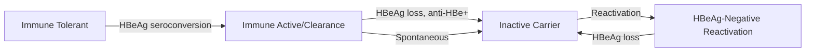
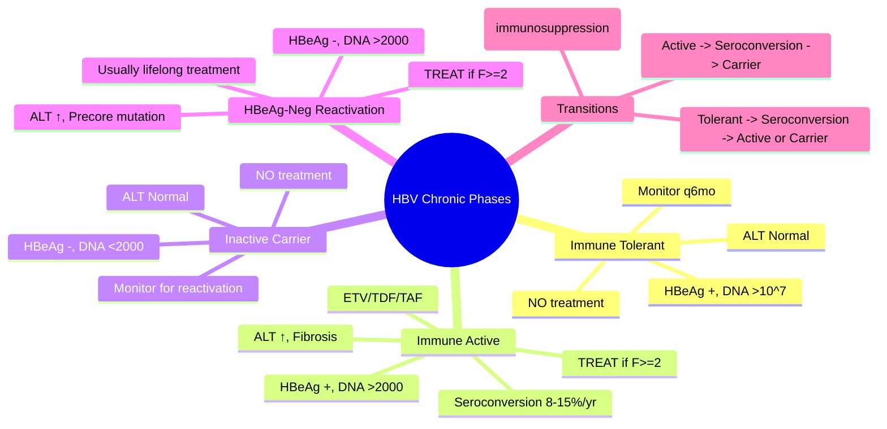

# Hepatitis B: Phases of Chronic Infection

## Learning Objectives
- [ ] Identify the 4 phases of chronic HBV infection
- [ ] Apply WHO/EASL/AASLD treatment criteria per phase
- [ ] Interpret serology, HBV DNA, ALT for phase assignment
- [ ] Know monitoring strategy for each phase
- [ ] Recognize FCPS/MRCP high-yield transitions and reactivation

---

## The 4 Phases of Chronic HBV (Dynamic, Not Static)

| Phase | HBeAg | HBV DNA | ALT | Histology | Infectivity | Treatment |
|-------|-------|---------|-----|-----------|-------------|-----------|
| **1. Immune Tolerant** | + | **>10⁷ IU/mL** (very high) | **Normal** | Minimal | **Very High** | **NO** |
| **2. Immune Active** | + | **>2×10³ IU/mL** | **↑** (>2×ULN) | **Active inflammation** | High | **YES** (if fibrosis) |
| **3. Inactive Carrier** | - | **<2×10³ IU/mL** | **Normal** | Minimal | Low | **NO** |
| **4. HBeAg-Negative Reactivation** | - | **>2×10³ IU/mL** | **↑** (>2×ULN) | **Active inflammation** | Moderate | **YES** (if fibrosis) |

> **FCPS/MRCP Pearl**: Phases are **dynamic** — patients move between phases. Serial monitoring is essential!

---

## Phase 1: Immune Tolerant

| Feature | Detail |
|---------|--------|
| **Typical age** | Children, young adults (perinatal acquisition) |
| **HBeAg** | Positive |
| **HBV DNA** | **>10⁷ IU/mL** (often 10⁸-10¹⁰) |
| **ALT** | **Persistently NORMAL** |
| **Histology** | Minimal inflammation, no fibrosis |
| **Infectivity** | **Highest** |
| **Natural history** | Decades in this phase; spontaneous HBeAg seroconversion ~8-15%/year |

### Management
- **NO antiviral treatment** (immune system not attacking virus → no benefit)
- **Monitor**: ALT q3-6mo, HBeAg/anti-HBe q12mo, HBV DNA q12mo
- **HCC surveillance**: If cirrhosis or family history (otherwise low risk)

> **Transition**: HBeAg seroconversion → moves to Immune Active or Inactive Carrier

---

## Phase 2: Immune Active (HBeAg-Positive Chronic Hepatitis)

| Feature | Detail |
|---------|--------|
| **HBeAg** | Positive |
| **HBV DNA** | **>2×10³ IU/mL** (usually 10⁴-10⁸) |
| **ALT** | **Elevated** (>2×ULN, often fluctuating) |
| **Histology** | **Active necroinflammation**, fibrosis progression |
| **Infectivity** | High |
| **Natural history** | Without treatment: spontaneous HBeAg seroconversion 8-15%/year; cirrhosis in 20-40% over decades |

### Treatment Indications (EASL 2017 / AASLD 2018 / WHO 2024)

| Guideline | Treatment Threshold |
|-----------|---------------------|
| **EASL** | HBV DNA >2,000 IU/mL + ALT >ULN + **fibrosis ≥F2** (or age >30) |
| **AASLD** | HBV DNA >20,000 IU/mL + ALT >2×ULN (+ fibrosis) |
| **WHO** | **Simplified**: HBV DNA >20,000 + ALT >ULN (or fibrosis/age >30) |
| **APASL** | HBV DNA >2,000 + ALT >2×ULN + histology/fibrosis |

> **FCPS/MRCP Practical Approach**: Treat if **fibrosis F≥2** OR **cirrhosis** OR **age >30 with active disease**

### Preferred First-Line Agents
| Drug | Dose | Barrier | Notes |
|------|------|---------|-------|
| **Entecavir (ETV)** | 0.5 mg daily | High | Preferred (potent, high barrier) |
| **Tenofovir disoproxil fumarate (TDF)** | 245 mg daily | High | Preferred; renal/bone monitoring |
| **Tenofovir alafenamide (TAF)** | 25 mg daily | High | Less renal/bone toxicity |

> **Lamivudine, Adefovir, Telbivudine**: **NOT first-line** (low barrier, resistance)

---

## Phase 3: Inactive Carrier (HBeAg-Negative, Anti-HBe Positive)

| Feature | Detail |
|---------|--------|
| **HBeAg** | Negative |
| **Anti-HBe** | Positive |
| **HBV DNA** | **<2,000 IU/mL** (often undetectable) |
| **ALT** | **Persistently NORMAL** |
| **Histology** | Minimal/no inflammation |
| **Infectivity** | Low |
| **Natural history** | Stable for years; reactivation 10-30% over lifetime |

### Management
- **NO treatment**
- **Monitor**: ALT q6mo, HBV DNA q12mo, HBeAg/anti-HBe q12mo
- **HCC surveillance**: If cirrhosis, age >40 (men), >50 (women), family HCC, Asian ethnicity

> **Reactivation Triggers**: Immunosuppression (chemo, biologics, steroids), HIV coinfection, spontaneous

---

## Phase 4: HBeAg-Negative Chronic Hepatitis (Reactivation)

| Feature | Detail |
|---------|--------|
| **HBeAg** | Negative |
| **Anti-HBe** | Positive |
| **HBV DNA** | **>2,000 IU/mL** (usually 10³-10⁷) |
| **ALT** | **Elevated** (>2×ULN, often fluctuating) |
| **Histology** | **Active inflammation**, fibrosis progression |
| **Infectivity** | Moderate |
| **Mechanism** | Precore/core promoter mutations → no HBeAg but active replication |

### Treatment Indications
| Guideline | Threshold |
|-----------|-----------|
| **EASL/AASLD/WHO** | HBV DNA >2,000 IU/mL + ALT >ULN + **fibrosis ≥F2** |

### Management
- **Treat same as Immune Active**: ETV/TDF/TAF
- **Duration**: **Long-term, often indefinite** (low HBeAg seroconversion rate)
- **Stopping rules**: Rarely stop — if HBsAg loss (functional cure)

---

## Monitoring Strategy Summary

| Phase | ALT | HBV DNA | HBeAg/anti-HBe | Fibrosis Assessment | HCC Surveillance |
|-------|-----|---------|----------------|---------------------|------------------|
| **Immune Tolerant** | q3-6mo | q12mo | q12mo | If >30yo or risk factors | If cirrhosis/family hx |
| **Immune Active** | q3mo | q3-6mo | q6-12mo | **Baseline + q1-2y** (TE/VCTE) | Yes (all) |
| **Inactive Carrier** | q6mo | q12mo | q12mo | If risk factors | If cirrhosis/age/risk |
| **HBeAg-Neg Reactivation** | q3mo | q3-6mo | q6-12mo | **Baseline + q1-2y** | Yes (all) |

---

## HBeAg Seroconversion: The Key Transition

| Before | After | Clinical Significance |
|--------|-------|----------------------|
| **HBeAg +** | **HBeAg -, Anti-HBe +** | Immune control established; moves to Inactive Carrier OR Reactivation |
| **HBV DNA >10⁷** | **HBV DNA <2,000** | Viral suppression |
| **ALT ↑** | **ALT Normal** | Inflammation resolved |

- **Spontaneous rate**: 8-15%/year in immune active phase
- **On treatment**: 20-30% at 5 years (ETV/TDF); higher with PEG-IFN

---

## FCPS/MRCP High-Yield Summary

| Phase | HBeAg | HBV DNA | ALT | Treat? | Key Action |
|-------|-------|---------|-----|--------|------------|
| Immune Tolerant | + | >10⁷ | Normal | **NO** | Monitor; wait for seroconversion |
| Immune Active | + | >2,000 | ↑ | **YES if F≥2** | ETV/TDF/TAF; assess fibrosis |
| Inactive Carrier | - | <2,000 | Normal | **NO** | Monitor for reactivation |
| HBeAg-Neg Reactivation | - | >2,000 | ↑ | **YES if F≥2** | ETV/TDF/TAF; long-term |

---

## Viva Questions

1. **List the 4 phases of chronic HBV with HBeAg, HBV DNA, ALT for each.**
2. **Why is immune tolerant phase NOT treated?**
3. **What are the treatment criteria for Immune Active phase per EASL?**
4. **What is HBeAg-negative reactivation? Mechanism?**
5. **What is the spontaneous HBeAg seroconversion rate per year?**
6. **What are first-line agents for chronic HBV? Barrier to resistance?**
7. **How do you monitor an inactive carrier?**
8. **When do you stop HBV treatment?**
9. **What is the risk of reactivation in inactive carriers on immunosuppression?**
10. **Differentiate Immune Active vs HBeAg-Neg Reactivation.**

---

## Confusions & Mnemonics

| Confusion | Clarification |
|-----------|---------------|
| Immune Tolerant vs Inactive Carrier | Both have normal ALT; Tolerant: HBeAg+, DNA >10⁷; Carrier: HBeAg-, DNA <2,000 |
| Immune Active vs Reactivation | Both have ↑ALT + ↑DNA; Active: HBeAg+; Reactivation: HBeAg-, precore mutation |
| When to treat | **Treat based on FIBROSIS (F≥2) or CIRRHOSIS** — not just DNA/ALT |
| Stopping treatment | HBeAg+ : Can stop after consolidation (12mo post HBeAg seroconversion); HBeAg- : Usually lifelong |
| PEG-IFN vs NUC | PEG-IFN: finite (48wk), chance of HBsAg loss, side effects; NUC: daily, high barrier, long-term |

---

## Mind Map

---

## One-Page Revision Card

| **Phase** | **HBeAg** | **HBV DNA** | **ALT** | **Treat?** | **Monitoring** |
|-----------|-----------|-------------|---------|------------|----------------|
| Immune Tolerant | + | >10⁷ | Normal | NO | q6mo ALT, q12mo DNA/serology |
| Immune Active | + | >2,000 | ↑ | YES if F≥2 | q3mo ALT, q3-6mo DNA, TE q1-2y |
| Inactive Carrier | - | <2,000 | Normal | NO | q6mo ALT, q12mo DNA/serology |
| HBeAg-Neg Reactivation | - | >2,000 | ↑ | YES if F≥2 | q3mo ALT, q3-6mo DNA, TE q1-2y |

---

## Spaced Repetition Tracker

| Day | 1 | 3 | 7 | 15 | 30 |
|-----|---|---|---|----|----|
| 4 phases table | ☐ | ☐ | ☐ | ☐ | ☐ |
| Treatment criteria per phase | ☐ | ☐ | ☐ | ☐ | ☐ |
| HBeAg seroconversion | ☐ | ☐ | ☐ | ☐ | ☐ |
| First-line agents | ☐ | ☐ | ☐ | ☐ | ☐ |

---

## Self-Test Scorecard

| Question | My Answer | Correct? |
|----------|-----------|----------|
| 4 phases with lab values |  |  |
| Treatment threshold EASL |  |  |
| Reactivation triggers |  |  |
| Stopping rules HBeAg+ vs HBeAg- |  |  |

---

## Local Navigation

- [[Viral Hepatitis/Hepatitis B|Hepatitis B Overview]]
- [[Viral Hepatitis/Hepatitis B serology interpretation|HBV Serology]]
- [[Viral Hepatitis/Hepatitis B treatment indications|HBV Treatment]]
- [[Viral Hepatitis/Hepatitis B HCC surveillance|HCC Surveillance]]
- [[Viral Hepatitis/Hepatitis B reactivation|HBV Reactivation]]
- [[Viral Hepatitis/Hepatitis B pregnancy and vertical transmission|HBV in Pregnancy]]