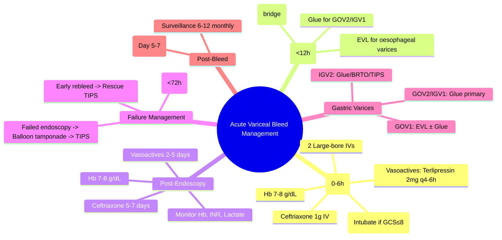

## 1. Learning Objectives
- [ ] Apply immediate resuscitation principles for acute variceal bleeding
- [ ] Initiate vasoactive drugs and antibiotic prophylaxis
- [ ] Perform and interpret emergency endoscopy
- [ ] Apply decision-making for rescue TIPS
- [ ] Identify FCPS/MRCP high-yield acute bleed management steps

---

## 2. Initial Resuscitation (First 6 Hours)

| Priority | Action |
|----------|--------|
| **1. Airway Protection** | Intubate if GCS ≤8 or active haematemesis with aspiration risk |
| **2. Vascular Access** | 2 Large-bore IVs; Central line if haemodynamically unstable |
| **3. Fluid Resuscitation** | Crystalloids; Target Hb **7-8 g/dL**; Avoid over-transfusion (↑ portal pressure) |
| **4. Blood Products** | FFP if INR >1.5; Platelets if <50×10⁹/L |
| **5. Vasoactive Drugs** | **Start IMMEDIATELY** (Terlipressin 2mg IV q4-6h or Octreotide 50mcg bolus then 50mcg/h) |
| **6. Antibiotic Prophylaxis** | **Ceftriaxone 1g IV daily ×7 days** (or 5 days if local protocol) |

> **FCPS/MRCP**: **Terlipressin reduces mortality** — Start at suspicion, not after endoscopy

---

## 3. Emergency Endoscopy (<12 Hours)

### Timing
- **Ideal**: **<12 hours** from presentation
- **Goal**: Diagnose source, achieve haemostasis, assess rebleeding risk

### Endoscopic Findings & Therapy

| Finding | Management |
|---------|------------|
| **Active spurting/oozing from varix** | **EVL** (1-2 bands per varix, 1-2 cm above) |
| **Non-bleeding visible vessel (NBVV)** | EVL |
| **Clean-based ulcer over varix** | EVL |
| **No varices / other source** | Treat accordingly (e.g., injection for ulcers) |

### Gastric Varices
| Type | Endoscopic Therapy |
|------|--------------------|
| **GOV1** | EVL (oesophageal component) ± Glue if gastric bleeding |
| **GOV2 / IGV1** | **Cyanoacrylate glue injection** (N-butyl-2-cyanoacrylate + Lipiodol 1:1) |
| **IGV2 (Ectopic)** | Glue / BRTO / PARTO / TIPS |

---

## 4. Post-Endoscopy Management

### Immediate (First 24-48 Hours)
| Intervention | Detail |
|-------------|--------|
| **Continue Vasoactives** | Terlipressin 2mg q4-6h / Octreotide 50µg/h for **2-5 days** |
| **Antibiotics** | Ceftriaxone 1g IV daily **×5-7 days** |
| **Monitor** | Hb, INR, bilirubin, creatinine, lactate q6-12h |
| **Restrict Transfusion** | Hb target **7-8 g/dL** (avoid portal pressure rise) |

### Failure to Control Bleeding / Early Rebleeding (<5 Days)
| Scenario | Action |
|----------|--------|
| **Failed endoscopy** | **Balloon tamponade** (Sengstaken-Blakemore) **as bridge** → TIPS |
| **Rebleeding despite EVL + vasoactives** | **Rescue TIPS** |
| **Child-Pugh B/C with active bleed** | **Early TIPS** (within 72h, ideally <72h) |

---

## 5. TIPS (Transjugular Intrahepatic Portosystemic Shunt)

### Indications for TIPS in Acute Bleeding
| Scenario | Timing |
|----------|--------|
| **Failed endoscopic control** | **Immediate** (rescue) |
| **Early rebleeding** (within 5 days) | **Urgent** (<24h) |
| **Child-Pugh B/C with active bleed** | **Early TIPS** (within 72h) — **Improves survival** |
| **HVPG ≥20 mmHg** | Strong predictor of failure → **Early TIPS** |

### Post-TIPS Management
- **Antibiotics**: Continue ceftriaxone ×7 days
- **Anticoagulation**: LMWH prophylaxis (no therapeutic anticoagulation routinely)
- **Monitor**: Doppler US at 24h, 1 week, 1 month, then 3-monthly
- **Stent surveillance**: PSV 60-250 cm/s

---

## 6. Gastric Variceal Bleeding

| Type | Endoscopic Therapy |
|------|--------------------|
| **GOV1** (Oesophageal extension) | EVL (oesophageal) ± Glue if gastric component bleeding |
| **GOV2** (Fundal + oesophageal) | **Glue injection** primary |
| **IGV1** (Isolated fundal) | **Glue injection** primary |
| **IGV2** (Ectopic) | Glue / BRTO / PARTO / TIPS |

### Glue Injection Technique
- **Agent**: N-butyl-2-cyanoacrylate (Histoacryl®) + Lipiodol® (1:1 to 1:3)
- **Dose**: 0.5-1 mL per injection site (multiple sites)
- **Antibiotics**: Ceftriaxone 1g IV single dose (prevent glue-related sepsis)
- **Complications**: Embolisation (pulmonary > splenic > portal > cerebral), ulcer/stricture

---

## 7. Post-Bleed Secondary Prophylaxis (Start Day 5-7)

| Component | Regimen |
|-----------|---------|
| **NSBB** | Propranolol 20mg BD → titrate to **HR 55-60** |
| **EVL** | q2-4 weeks until **complete eradication** |
| **Duration** | **Lifelong** (unless transplant) |
| **Surveillance** | 6-12 monthly after eradication |

---

## 8. FCPS/MRCP High-Yield Summary

| Step | Action | Timing |
|------|--------|--------|
| **1. Resuscitation** | IV access, bloods, Hb 7-8, Vasoactives, Ceftriaxone | **Immediate** |
| **2. Endoscopy** | EVL ± Glue | **<12 hours** |
| **3. Post-endoscopy** | Continue vasoactives 2-5d, Ceftriaxone 5-7d | Days 1-5 |
| **4. Failure** | Rescue TIPS / Balloon tamponade (bridge) | <24h if persistent |
| **5. Secondary prophylaxis** | NSBB + EVL, Day 5-7 | Lifelong |

---

## 9. Viva Questions

1. **What is the first-line vasoactive drug for variceal bleeding? Dose?**
2. **What is the target Hb for transfusion in variceal bleed?**
3. **When do you do emergency endoscopy?**
4. **What is the endoscopic therapy for oesophageal varices?**
4. **What is the endoscopic therapy for gastric varices (GOV2)?**
5. **When do you consider rescue TIPS?**
5. **What is the role of antibiotics in variceal bleed?**
6. **What is the secondary prophylaxis regimen after variceal bleed?**
6. **When do you consider early TIPS?**
7. **What is the endoscopic management of GOV2 varices?**
8. **What is the glue injection technique for gastric varices?**

---

## 10. Confusions & Mnemonics

| Confusion | Clarification |
|-----------|---------------|
| Terlipressin vs Octreotide | **Terlipressin preferred** (mortality benefit); Octreotide alternative |
| Hb target | **7-8 g/dL** — Higher Hb ↑ portal pressure → rebleeding |
| Endoscopy timing | **<12 hours** from admission |
| EVL vs Sclerotherapy | **EVL superior** — fewer complications, better eradication |
| Glue vs EVL for gastric | **Glue = primary for GOV2/IGV1**; EVL for GOV1 oesophageal component |
| Sengstaken-Blakemore | **Bridge only** (max 24h) → Definitive therapy (TIPS/Surgery) |
| Early TIPS | **Child B/C, active bleed** — within 72h improves survival |
| Antibiotic duration | **7 days** (Ceftriaxone 1g daily) |
| Post-bleed NSBB | Start Day 5-7; HR target 55-60 |

---

## 11. Mind Map

---

## 12. One-Page Revision Card

| **Resuscitation** | **Targets** |
|-------------------|-------------|
| Hb | 7-8 g/dL |
| Vasoactive | Terlipressin 2mg IV q4-6h |
| Antibiotic | Ceftriaxone 1g IV daily |

| **Endoscopy** | **Therapy** |
|---------------|-------------|
| Oesophageal varices | EVL (1-2 bands/varix) |
| GOV1 | EVL ± Glue |
| GOV2 / IGV1 | **Cyanoacrylate glue** |
| IGV2 | Glue / BRTO / TIPS |

| **Post-Endoscopy** | **Duration** |
|--------------------|--------------|
| Vasoactives | 2-5 days |
| Ceftriaxone | 5-7 days |
| Hb target | 7-8 g/dL |

| **Rebleeding / Failure** | **Action** |
|--------------------------|------------|
| Failed endoscopy | Balloon tamponade → TIPS |
| Early rebleed | Rescue TIPS |
| Child B/C + active bleed | Early TIPS <72h |

| **Gastric Varices** | **Primary Therapy** |
|---------------------|---------------------|
| GOV1 | EVL (oesophageal) ± Glue |
| GOV2 / IGV1 | **Glue injection** |
| IGV2 | Glue / BRTO / PARTO / TIPS |

| **Secondary Prophylaxis** | |
|--------------------------|--|
| NSBB + EVL | Lifelong |
| NSBB: Propranolol → HR 55-60 |
| EVL: q2-4w till eradication |
| Surveillance: 6-12 monthly |

---

## 13. Spaced Repetition Tracker

| Day | 1 | 3 | 7 | 15 | 30 |
|-----|---|---|---|----|----|
| Vasoactive drug/dose | ☐ | ☐ | ☐ | ☐ | ☐ |
| Endoscopy timing | ☐ | ☐ | ☐ | ☐ | ☐ |
| EVL technique | ☐ | ☐ | ☐ | ☐ | ☐ |
| Gastric varices management | ☐ | ☐ | ☐ | ☐ | ☐ |
| TIPS indications | ☐ | ☐ | ☐ | ☐ | ☐ |

---

## 14. Self-Test Scorecard

| Question | My Answer | Correct? |
|----------|-----------|----------|
| Terlipressin dose |  |  |
| Endoscopy window |  |  |
| Hb target |  |  |
| Antibiotic duration |  |  |
| Rescue TIPS criteria |  |  |

---

## 15. Local Navigation

- [[Portal Hypertension and Complications/Varices|Varices Overview]]
- [[Portal Hypertension and Complications/Primary prophylaxis (NSBB vs EVL)|Primary Prophylaxis]]
- [[Portal Hypertension and Complications/Secondary prophylaxis|Secondary Prophylaxis]]
- [[Portal Hypertension and Complications/Gastric varices (glue injection)|Gastric Varices]]
- [[Portal Hypertension and Complications/Screening endoscopy|Screening Endoscopy]]