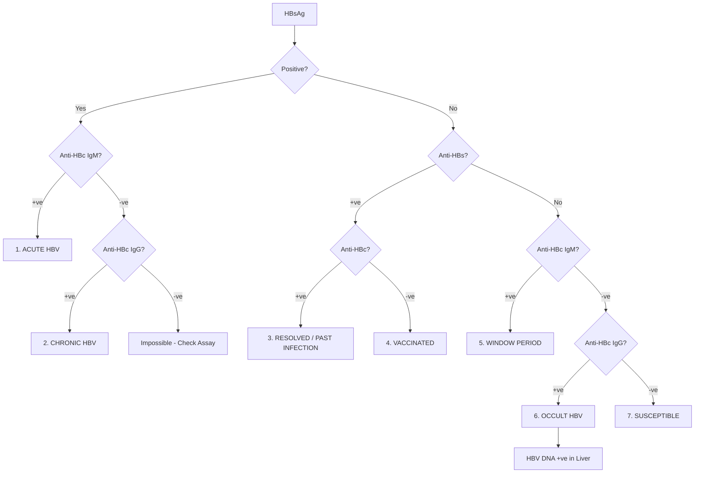
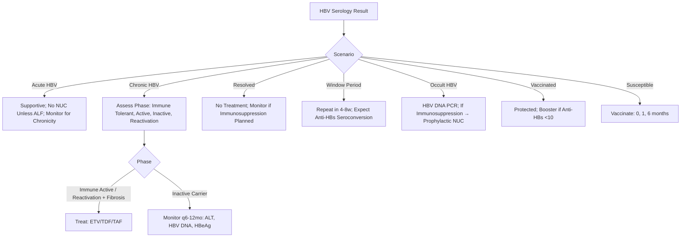

# Hepatitis B Serology Interpretation

## Learning Objectives
- [ ] Interpret all 8 HBV serology scenarios
- [ ] Understand window period and its diagnosis
- [ ] Diagnose occult HBV infection
- [ ] Apply serology to clinical decision-making (treatment, vaccination, prophylaxis)
- [ ] Identify FCPS/MRCP high-yield patterns and pitfalls

---

## HBV Serological Markers

| Marker | Full Name | Significance |
|--------|-----------|--------------|
| **HBsAg** | Hepatitis B Surface Antigen | **Active infection** (acute or chronic) |
| **Anti-HBs** | Antibody to HBsAg | **Immunity** (vaccination or past resolved infection) |
| **Anti-HBc Total** | Antibody to HBcAg (IgG + IgM) | **Past or current infection** (never in vaccine-only) |
| **Anti-HBc IgM** | IgM Antibody to HBcAg | **Acute infection** (within 6 months) |
| **HBeAg** | Hepatitis B e Antigen | **High infectivity**, active replication |
| **Anti-HBe** | Antibody to HBeAg | **Lower infectivity**, immune control |
| **HBV DNA** | Viral Load | **Quantifies replication**; guides treatment |

---

## The 8 Serology Scenarios



### Detailed Table

| # | Scenario | HBsAg | Anti-HBs | Anti-HBc Total | Anti-HBc IgM | HBeAg | Anti-HBe | HBV DNA | Clinical Meaning |
|---|----------|-------|----------|----------------|--------------|-------|----------|---------|------------------|
| **1** | **Acute HBV** | + | - | + | **+** | + | - | High | Acute infection |
| **2** | **Chronic HBV** | + | - | + | - | ± | ± | Variable | Chronic infection |
| **3** | **Resolved/Past** | - | **+** | **+** | - | - | + | - | Immune (natural) |
| **4** | **Vaccinated** | - | **+** | **-** | - | - | - | - | Immune (vaccine) |
| **5** | **Window Period** | - | - | **+** | **+** | - | - | + | Acute resolving (HBsAg cleared, Anti-HBs not yet) |
| **6** | **Occult HBV** | - | ± | **+** | - | - | - | **+ (Liver)** | HBsAg -, DNA + in liver; Reactivation risk |
| **7** | **Susceptible** | - | - | - | - | - | - | - | No immunity, no infection |
| **8** | **Immune Escape Mutant** | + | - | + | - | - | + | High | S-gene mutant, HBsAg detection may fail |

---

## Key Interpretations

### Acute vs Chronic HBV
| Feature | Acute | Chronic |
|---------|-------|---------|
| **Anti-HBc IgM** | **Positive** | Negative |
| **Anti-HBc IgG** | Negative/Early | Positive |
| **HBsAg** | Positive (clears in 6mo) | **Persistently Positive** |
| **Clinical** | Self-limited (90% adults) | Persists >6 months |

### Window Period
- **Definition**: HBsAg cleared, Anti-HBs not yet appeared
- **Serology**: **HBsAg -, Anti-HBc IgM +, Anti-HBs -**
- **Duration**: 2-8 weeks
- **Diagnosis**: **Anti-HBc IgM is the ONLY positive marker**
- **Clinical**: Patient recovering from acute HBV

### Occult HBV Infection
- **Definition**: **HBsAg negative, HBV DNA detectable in liver** (and sometimes serum)
- **Serology**: Anti-HBc + (usually), Anti-HBs ±, HBsAg -, HBV DNA +
- **Causes**: S-gene mutations, Low-level replication, Immune control
- **Reactivation Risk**: **High** with immunosuppression (rituximab, chemo, transplant)
- **Screening**: **Anti-HBc + before immunosuppression** → Check HBV DNA

---

## HBsAg Mutants (Diagnostic Pitfall)

| Type | Mechanism | Detection Issue |
|------|-----------|-----------------|
| **S-Gene Mutant** | Mutation in "a" determinant of HBsAg | **Standard HBsAg assay false negative** |
| **Clinical Clue** | Patient with HBV symptoms, PCR +, HBsAg - | Use **HBV DNA PCR**; Next-gen assays detect mutants |

---

## Serology-Guided Clinical Decisions



---

## Quantitative HBsAg (qHBsAg)

| Use | Interpretation |
|-----|----------------|
| **Predicts HBeAg Seroconversion** | qHBsAg <100 IU/mL + HBV DNA <2000 → High chance |
| **Predicts HBsAg Loss (Functional Cure)** | qHBsAg <100 IU/mL (genotype A), <1000 (genotype D) |
| **Monitoring on NUCs** | Declining qHBsAg → Good predictor of HBsAg loss |
| **Genotype Differences** | Genotype A: Higher qHBsAg; Genotype D: Lower |

---

## FCPS/MRCP High-Yield Summary

| Concept | Key Points |
|---------|------------|
| **8 Scenarios** | Acute, Chronic, Resolved, Vaccinated, Window, Occult, Susceptible, Immune Escape |
| **Acute vs Chronic** | **Anti-HBc IgM + = Acute**; Anti-HBc IgM - + HBsAg + = Chronic |
| **Resolved vs Vaccinated** | **Anti-HBc + = Resolved**; Anti-HBc - = Vaccinated |
| **Window Period** | **HBsAg -, Anti-HBc IgM +, Anti-HBs -**; Only IgM positive |
| **Occult HBV** | **HBsAg -, Anti-HBc +, HBV DNA + (liver)**; Reactivation risk with immunosuppression |
| **Immune Escape** | HBsAg false negative due to S-gene mutation; Check HBV DNA |
| **Reactivation Prophylaxis** | Anti-HBc + (resolved/occult) + Immunosuppression → Prophylactic NUC |

---

## Viva Questions

1. **Interpret: HBsAg +, Anti-HBc IgM +, Anti-HBs -**
2. **Interpret: HBsAg -, Anti-HBs +, Anti-HBc +**
3. **Interpret: HBsAg -, Anti-HBs -, Anti-HBc IgM +**
4. **Interpret: HBsAg -, Anti-HBs -, Anti-HBc +, HBV DNA + (liver)**
5. **What is the window period? Serology?**
5. **What is occult HBV? When do you suspect it?**
6. **How do you differentiate resolved from vaccinated?**
7. **What is the serology of HBeAg-negative chronic HBV?**
8. **What HBsAg mutant causes false negative?**
9. **Prophylaxis for occult HBV before rituximab?**
10. **Quantitative HBsAg: what does low level predict?**

---

## Confusions & Mnemonics

| Confusion | Clarification |
|-----------|---------------|
| Resolved vs Vaccinated | **Anti-HBc distinguishes**: Resolved = Anti-HBc +; Vaccinated = Anti-HBc - |
| Window Period vs Occult | Window: Anti-HBc IgM +, DNA +; Occult: Anti-HBc IgG +, DNA + (liver), HBsAg - |
| Chronic vs Acute | **Anti-HBc IgM**: + = Acute, - = Chronic (if HBsAg +) |
| Occult HBV Reactivation | **High risk with Rituximab, Stem Cell Transplant, Anti-TNF** → Prophylactic NUC |
| Immune Escape Mutant | **HBsAg false negative** — PCR confirms; New assays detect most mutants |
| Anti-HBc in Vaccinated | **Never positive** in vaccine-only (vaccine contains only HBsAg) |

---

## Mind Map

```mermaid
mindmap
  root((HBV Serology))
    8 Scenarios
      1. Acute: HBsAg+, IgM+, HBsAb-
      2. Chronic: HBsAg+, IgM-, HBcAb+
      3. Resolved: HBsAg-, HBsAb+, HBcAb+
      4. Vaccinated: HBsAg-, HBsAb+, HBcAb-
      5. Window: HBsAg-, IgM+, HBsAb-
      6. Occult: HBsAg-, HBcAb+, DNA+
      7. Susceptible: All Negative
      8. Mutant: HBsAg- (false neg), DNA+
    Key Differentiators
      Acute vs Chronic: Anti-HBc IgM
      Resolved vs Vaccinated: Anti-HBc
      Window: Only IgM+
      Occult: HBsAg-, DNA+ in liver
    Clinical Actions
      Acute: Monitor
      Chronic: Phase → Treat if Active
      Resolved: Monitor if Immunosuppression
      Window: Repeat 4-8w
      Occult: DNA PCR → Prophylaxis if Immunosuppression
```

---

## One-Page Revision Card

| **Scenario** | **HBsAg** | **Anti-HBs** | **Anti-HBc** | **Anti-HBc IgM** | **HBV DNA** |
|--------------|-----------|--------------|--------------|------------------|-------------|
| **1. Acute** | + | - | + | **+** | High |
| **2. Chronic** | + | - | + | - | Variable |
| **3. Resolved** | - | **+** | **+** | - | - |
| **4. Vaccinated** | - | **+** | **-** | - | - |
| **5. Window** | - | - | **+** | **+** | + |
| **6. Occult** | - | ± | **+** | - | **+ (Liver)** |
| **7. Susceptible** | - | - | - | - | - |

| **Key Rule** | **Interpretation** |
|--------------|-------------------|
| Anti-HBc IgM + | **Acute HBV** |
| HBsAg +, IgM - | **Chronic HBV** |
| Anti-HBs +, Anti-HBc + | **Resolved** |
| Anti-HBs +, Anti-HBc - | **Vaccinated** |
| HBsAg -, IgM + | **Window Period** |
| HBsAg -, Anti-HBc +, DNA + | **Occult HBV** |

---

## Spaced Repetition Tracker

| Day | 1 | 3 | 7 | 15 | 30 |
|-----|---|---|---|----|----|
| 8 Scenarios table | ☐ | ☐ | ☐ | ☐ | ☐ |
| Window period | ☐ | ☐ | ☐ | ☐ | ☐ |
| Occult HBV | ☐ | ☐ | ☐ | ☐ | ☐ |
| Resolved vs Vaccinated | ☐ | ☐ | ☐ | ☐ | ☐ |
| Reactivation prophylaxis | ☐ | ☐ | ☐ | ☐ | ☐ |

---

## Self-Test Scorecard

| Question | My Answer | Correct? |
|----------|-----------|----------|
| Window period serology |  |  |
| Occult HBV definition |  |  |
| Resolved vs Vaccinated |  |  |
| Acute vs Chronic |  |  |
| Reactivation prophylaxis |  |  |

---

## Local Navigation

- [[Viral Hepatitis/Hepatitis B|HBV Overview]]
- [[Viral Hepatitis/Hepatitis B phases of chronic infection|HBV Phases]]
- [[Viral Hepatitis/Hepatitis B treatment indications|HBV Treatment]]
- [[Viral Hepatitis/Hepatitis B reactivation|HBV Reactivation]]
- [[Viral Hepatitis/Hepatitis B pregnancy and vertical transmission|HBV Pregnancy]]
---

> Auto-generated study sections for "Viral Hepatitis" — Ch 23: Hepatology.

## Flashcards (8 generated)

- Q: What is the definition of Viral Hepatitis?
  A: | # | Scenario | HBsAg | Anti-HBs | Anti-HBc Total | Anti-HBc IgM | HBeAg | Anti-HBe | HBV DNA | Clinical Meaning |
- Q: What is 8 Scenarios of Viral Hepatitis?
  A: Acute, Chronic, Resolved, Vaccinated, Window, Occult, Susceptible, Immune Escape
- Q: What is Acute vs Chronic of Viral Hepatitis?
  A: Anti-HBc IgM + = Acute; Anti-HBc IgM - + HBsAg + = Chronic
- Q: What is Resolved vs Vaccinated of Viral Hepatitis?
  A: Anti-HBc + = Resolved; Anti-HBc - = Vaccinated
- Q: What is Window Period of Viral Hepatitis?
  A: HBsAg -, Anti-HBc IgM +, Anti-HBs -; Only IgM positive
- Q: What is Occult HBV of Viral Hepatitis?
  A: HBsAg -, Anti-HBc +, HBV DNA + (liver); Reactivation risk with immunosuppression
- Q: What is Immune Escape of Viral Hepatitis?
  A: HBsAg false negative due to S-gene mutation; Check HBV DNA
- Q: What is Reactivation Prophylaxis of Viral Hepatitis?
  A: Anti-HBc + (resolved/occult) + Immunosuppression → Prophylactic NUC

## MCQs (1 generated)

1. **Which of the following best describes Viral Hepatitis?**
   A. **| # | Scenario | HBsAg | Anti-HBs | Anti-HBc Total | Anti-HBc IgM | HBeAg | Anti-HBe | HBV DNA | Clinical Meaning |**
   B. An unrelated condition not matching the clinical picture of Viral Hepatitis
   C. A complication seen late in the disease course of Viral Hepatitis
   D. A condition that mimics Viral Hepatitis but has a different underlying cause

## SBA Questions (1 generated)

1. A patient with suspected Viral Hepatitis presents with: A[HBV Serology Result] --> B{Scenario}; B -->|Acute HBV| C[Supportive; No NUC Unless ALF; Monitor for Chronicity]; B -->|Chronic HBV| D[Assess Phase: Immune Tolerant, Active, Inactive, Reactivation]. What is the most likely diagnosis?
   A. **Viral Hepatitis**
   B. A condition that mimics Viral Hepatitis but is not the same entity
   C. A complication of Viral Hepatitis rather than the primary diagnosis
   D. An unrelated condition in the same clinical category as Viral Hepatitis

