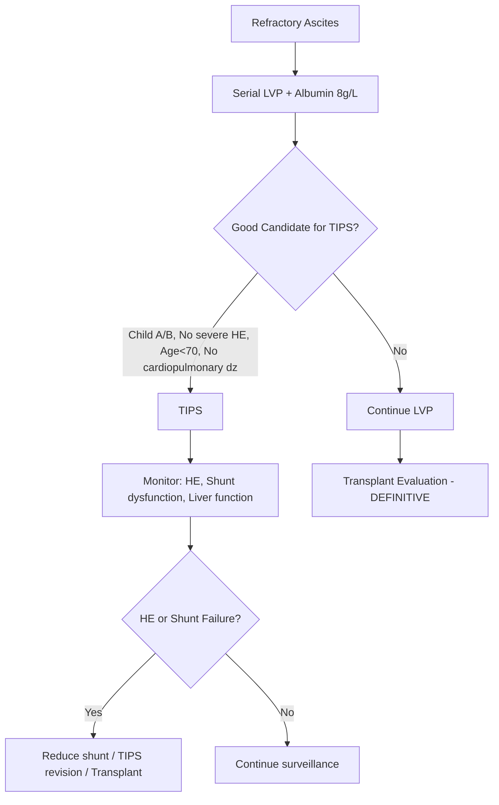
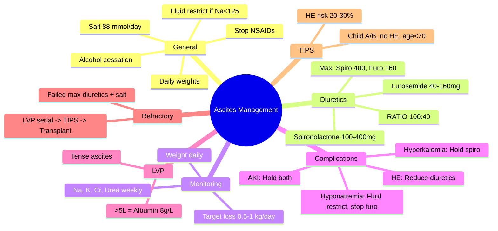

## 1. Learning Objectives
- [ ] Apply stepwise diuretic therapy (spironolactone + furosemide)
- [ ] Know maximum doses and monitoring parameters
- [ ] Manage complications (hyponatremia, AKI, HE, hyperkalemia)
- [ ] Identify indications for LVP and TIPS
- [ ] Recognize FCPS/MRCP high-yield management steps

---

## 2. General Measures

| Measure | Detail |
|---------|--------|
| **Salt restriction** | **88 mmol/day (2g NaCl = 5g salt)** — strict, no added salt |
| **Fluid restriction** | Only if **Na <125 mmol/L** (severe hyponatremia) |
| **Daily weights** | Target loss: **0.5 kg/day (no edema), 1 kg/day (with edema)** |
| **Alcohol cessation** | Mandatory |
| **Medication review** | Stop NSAIDs, reduce/stop ACEi/ARB, avoid sedatives |

---

## 3. Diuretic Therapy: Stepwise Approach

### First-Line: Spironolactone (Aldosterone Antagonist)
- **Mechanism**: Blocks aldosterone in collecting duct → Na⁺ excretion, K⁺ retention
- **Starting dose**: 100 mg daily
- **Titration**: Increase by 100 mg every 3-5 days
- **Maximum dose**: **400 mg daily**

### Add-On: Furosemide (Loop Diuretic)
- **Mechanism**: Blocks NKCC2 in thick ascending limb → Na⁺ excretion
- **Ratio**: **Spironolactone : Furosemide = 100 : 40** (e.g., 100mg spiro + 40mg furo)
- **Starting dose**: 40 mg daily (when spiro reaches 100mg)
- **Maximum dose**: **160 mg daily**

### Dose Escalation Table

| Step | Spironolactone | Furosemide | Ratio |
|------|----------------|------------|-------|
| 1 | 100 mg | — | — |
| 2 | 200 mg | 40 mg | 100:40 |
| 3 | 300 mg | 80 mg | 100:40 |
| 4 (MAX) | **400 mg** | **160 mg** | **100:40** |

> **FCPS/MRCP**: Fixed ratio 100:40 prevents hyponatremia (furo) and hyperkalemia (spiro)

---

## 4. Monitoring on Diuretics

| Parameter | Frequency | Action if Abnormal |
|-----------|-----------|-------------------|
| **Weight** | Daily | >1 kg/day loss → reduce diuretics |
| **Electrolytes (Na, K, Cr, Urea)** | Baseline, 3-5 days, then weekly | K >5.5 → hold spiro; Na <125 → hold furo; Cr ↑>50% → hold both |
| **Renal function** | Same as electrolytes | AKI → hold diuretics |
| **Urine output** | Daily | <500 mL/day → assess volume status |

---

## 5. Complications & Management

| Complication | Threshold | Management |
|--------------|-----------|------------|
| **Hyponatremia** | Na <130 mmol/L | Fluid restrict 1L/day; **reduce/stop furosemide**; consider vaptans (tolvaptan) if severe |
| **Hyperkalemia** | K >5.5 mmol/L | **Hold spironolactone**; dietary K restriction; kayexalate if >6.0 |
| **AKI / Renal impairment** | Cr ↑50% from baseline or >1.5 mg/dL | **Hold BOTH diuretics**; volume assess; albumin if HRS suspected |
| **Hepatic Encephalopathy** | New/worsening | Treat precipitants; lactulose; **reduce diuretics if volume depleted** |
| **Metabolic alkalosis** | HCO₃ >30 | Usually from furo; reduce furo; KCl replacement |

---

## 6. Therapeutic Paracentesis (LVP)

| Indication | Technique |
|------------|-----------|
| **Tense ascites** (resp compromise, pain, renal impairment) | Remove **all** ascites (large-volume) |
| **Refractory ascites** | Serial LVP every 2-4 weeks |
| **Albumin replacement** | **8 g per liter removed if >5L** (e.g., 8L → 64g = 200mL 20% or 400mL 5%) |
| **No albumin needed** | If ≤5L removed |

### LVP Complications
- **PICD (Paracentesis-induced circulatory dysfunction)**: Albumin prevents
- **Bleeding**: Correct coagulopathy if INR>2.5 or plt<50 (low risk)
- **Infection**: Sterile technique
- **Bowel injury**: Ultrasound-guided

---

## 7. Refractory Ascites (ICA Definition)

> **Failure to mobilize ascites despite:**  
> **1. Salt restriction 88 mmol/day**  
> **2. Maximum diuretics (Spironolactone 400mg + Furosemide 160mg) OR**  
> **3. Diuretic-intractable (complications: AKI, hyponatremia, HE, hyperkalemia)**

### Management Algorithm

---

## 8. TIPS for Refractory Ascites

| Indication | Contraindications |
|------------|------------------|
| **Child-Pugh A/B** | **Child-Pugh C (esp >12)** |
| **Age <70** | **Severe HE (recurrent, Grade 3-4)** |
| **No cardiopulmonary disease** | **Severe pulmonary hypertension** |
| **No active infection** | **Active sepsis** |
| **No HCC beyond Milan** | **Uncontrolled biliary sepsis** |
| **Failed/Intolerant to LVP** | **Portal vein thrombosis (complete)** |

### Post-TIPS Monitoring
- **HE risk**: 20-30% new/worsening HE
- **Shunt dysfunction**: US Doppler q3-6mo (PSV <60 cm/s or >250 cm/s in stent)
- **Liver function**: Monitor for deterioration

---

## 9. FCPS/MRCP High-Yield Summary

| Concept | Key Points |
|---------|------------|
| **Salt restriction** | 88 mmol/day (2g NaCl) |
| **Diuretic ratio** | **Spironolactone : Furosemide = 100 : 40** |
| **Max doses** | Spiro 400mg, Furo 160mg |
| **Weight loss target** | 0.5 kg/day (no edema), 1 kg/day (with edema) |
| **Monitoring** | Na, K, Cr, Urea weekly initially |
| **Hyponatremia** | Na<130 → fluid restrict, reduce/stop furo |
| **Hyperkalemia** | K>5.5 → hold spiro |
| **AKI** | Cr↑50% → hold both |
| **LVP albumin** | 8g/L if >5L removed |
| **Refractory ascites** | Failed max diuretics + salt restriction |
| **TIPS criteria** | Child A/B, no severe HE, age<70 |

---

## 10. Viva Questions

1. **What is the spironolactone:furosemide ratio and why?**
2. **Maximum doses of spironolactone and furosemide?**
3. **Target weight loss per day with/without edema?**
4. **How do you manage hyponatremia on diuretics?**
5. **How do you manage hyperkalemia on spironolactone?**
5. **When do you give albumin after LVP? How much?**
6. **Define refractory ascites (ICA criteria).**
6. **What are TIPS indications/contraindications for refractory ascites?**
7. **Why fixed 100:40 ratio prevents complications?**
8. **Diuretic-intractable vs diuretic-resistant?**
9. **What is the role of alfapump?**
10. **When is transplant indicated for refractory ascites?**

---

## 11. Confusions & Mnemonics

| Confusion | Clarification |
|-----------|---------------|
| Spiro:Furo ratio | **100:40** — spiro retains K, furo loses K + Na; ratio balances |
| Weight loss target | **No edema: 0.5 kg/day**; **With edema: 1 kg/day** (edema mobilizes faster) |
| Albumin after LVP | **Only if >5L removed**; 8g per liter removed |
| Refractory = failed max diuretics | Must have TRIED spiro 400 + furo 160 + salt restriction |
| TIPS contraindications | Child C, severe HE, pulmonary HTN, age>70, active infection |
| Hyponatremia management | **Fluid restrict + reduce/stop furo** — NOT increase spiro |

---

## 12. Mind Map

---

## 13. One-Page Revision Card

| **Diuretic** | **Start** | **Max** | **Ratio** | **Monitor** |
|--------------|-----------|---------|-----------|-------------|
| Spironolactone | 100 mg | 400 mg | 100 | K⁺, Cr |
| Furosemide | 40 mg | 160 mg | 40 | Na⁺, Cr |

| **Complication** | **Threshold** | **Action** |
|------------------|---------------|------------|
| Hyponatremia | Na <130 | Fluid restrict 1L, ↓/stop furo |
| Hyperkalemia | K >5.5 | Hold spiro |
| AKI | Cr ↑50% | Hold both |
| HE | New/worsening | Treat precipitants, ↓ diuretics |

| **LVP** | **Albumin** |
|---------|-------------|
| ≤5L removed | None |
| >5L removed | 8g per liter removed |

| **Refractory Ascites** | **TIPS Criteria** |
|------------------------|-------------------|
| Failed Spiro 400 + Furo 160 + Salt 88mmol | Child A/B, No severe HE, Age<70 |

---

## 14. Spaced Repetition Tracker

| Day | 1 | 3 | 7 | 15 | 30 |
|-----|---|---|---|----|----|
| Spiro:Furo ratio & max doses | ☐ | ☐ | ☐ | ☐ | ☐ |
| Weight loss targets | ☐ | ☐ | ☐ | ☐ | ☐ |
| Complication thresholds | ☐ | ☐ | ☐ | ☐ | ☐ |
| LVP albumin rule | ☐ | ☐ | ☐ | ☐ | ☐ |
| Refractory definition | ☐ | ☐ | ☐ | ☐ | ☐ |

---

## 15. Self-Test Scorecard

| Question | My Answer | Correct? |
|----------|-----------|----------|
| Spiro:Furo ratio |  |  |
| Max doses |  |  |
| Hyponatremia management |  |  |
| Refractory ascites criteria |  |  |
| TIPS contraindications |  |  |

---

## 16. Local Navigation

- [[Portal Hypertension and Complications/Ascites diagnosis and SAAG|Ascites Diagnosis]]
- [[Portal Hypertension and Complications/Refractory ascites|Refractory Ascites]]
- [[Portal Hypertension and Complications/Spontaneous bacterial peritonitis (SBP)|SBP]]
- [[Portal Hypertension and Complications/Hepatorenal Syndrome|HRS]]
- [[Portal Hypertension and Complications/Hepatic Encephalopathy|HE]]