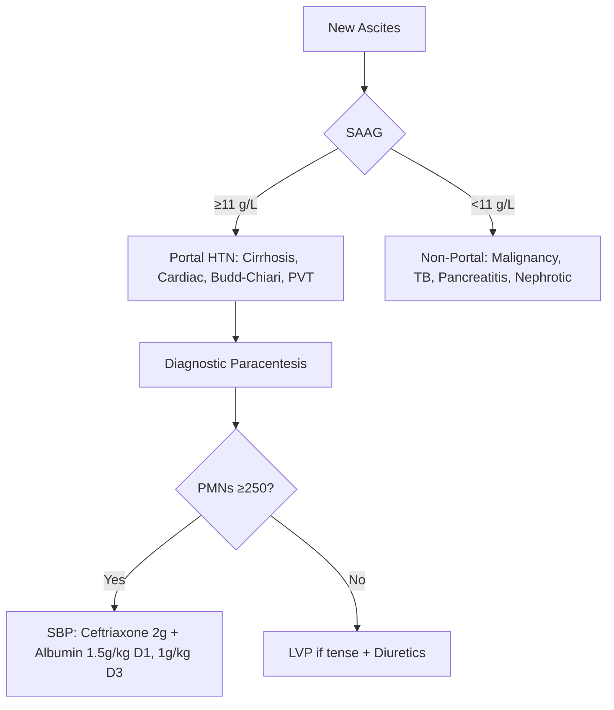
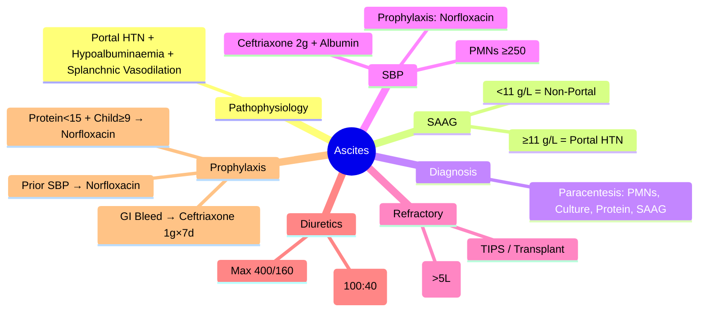

> [!tip] **FCPS/MRCP Priority: HIGH**
> **Ascites in Cirrhosis = Portal hypertension + hypoalbuminaemia** — **SAAG ≥11 g/L = portal hypertension**; **SBP = PMNs ≥250/mm³** → **ceftriaxone 2g IV + albumin**; **Refractory ascites** → **LVP + albumin 8g/L removed** → **TIPS/transplant**.

---

## 1. Learning Objectives
By the end of this note you should be able to:
- [ ] Apply **SAAG** to differentiate portal hypertensive vs non-portal hypertensive ascites
- [ ] Diagnose **SBP** (PMNs ≥250/mm³) and initiate **ceftriaxone + albumin**
- [ ] Manage **refractory ascites**: **LVP + albumin 8g/L (>5L)** → **TIPS / transplant**
- [ ] Apply **SBP prophylaxis**: prior SBP, ascitic protein <15g/L + Child-Pugh ≥9, GI bleed

---

## 1. Pathophysiology

| Mechanism | Details |
|-----------|---------|
| **Portal Hypertension** | ↑ Hydrostatic pressure → transudation |
| **Hypoalbuminaemia** | ↓ Oncotic pressure → ↓ plasma colloid osmotic pressure |
| **Splanchnic Vasodilation** | NO-mediated → ↓ effective arterial volume → RAAS/SNS activation → Na/H₂O retention |

---

## 2. Diagnostic Approach

### SAAG (Serum-Ascites Albumin Gradient)
| SAAG | Interpretation | Causes |
|------|----------------|--------|
| **≥11 g/L** | **Portal Hypertension** | Cirrhosis, cardiac failure, Budd-Chiari, portal vein thrombosis |
| **<11 g/L** | **Non-Portal Hypertension** | Peritoneal carcinomatosis, TB peritonitis, pancreatitis, nephrotic syndrome |

> **SAAG = Serum albumin – Ascitic albumin**; **≥11 g/L = Portal hypertension**

### Diagnostic Paracentesis (Always Perform)
| Test | Indication |
|------|------------|
| **Cell count + differential** | **PMNs ≥250/mm³ = SBP** |
| **Culture** | Aerobic/anaerobic (blood culture bottles) |
| **Total protein** | >25 g/L = exudate; <15 g/L = high SBP risk |
| **Albumin** | For SAAG calculation |
| **Glucose** | Low in TB, malignancy |
| **LDH** | High in malignancy, TB |
| **Cytology** | Malignancy |
| **Amylase** | Pancreatic ascites |

---

## 3. Spontaneous Bacterial Peritonitis (SBP)

### Diagnostic Criteria
| Parameter | SBP | Secondary Peritonitis |
|-----------|-----|----------------------|
| **Polymorphs (PMNs)** | **≥250/mm³** | >250 (often much higher) |
| **Culture** | **Single organism** (E. coli, Klebsiella, Strep) | **Multiple organisms** |
| **Protein** | Usually <15 g/L | >15 g/L |
| **Glucose** | Normal | Low (<50 mg/dL) |
| **LDH** | Normal | High (>ULN) |

### SBP Management
| Step | Intervention | Dose/Details |
|------|--------------|--------------|
| **1. Antibiotics** | **Ceftriaxone 2g IV q12h** (or piperacillin-tazobactam 4.5g q6h) | 5-7 days |
| **2. Albumin** | **1.5 g/kg D1** + **1.0 g/kg D3** | Prevents renal dysfunction, reduces mortality |
| **3. Repeat Paracentesis** | **48h** — if PMNs not ↓25% → change antibiotics |

---

## 3. SBP Prophylaxis

| Indication | Regimen |
|------------|---------|
| **Prior SBP** | **Norfloxacin 400mg OD** lifelong |
| **Ascitic protein <15 g/L + Child-Pugh ≥9 or renal impairment** | **Norfloxacin 400mg OD** (primary prophylaxis) |
| **Active GI bleed** (any cirrhosis) | **Ceftriaxone 1g IV OD ×7 days** |

---

## 4. Refractory Ascites

| Definition | Management |
|------------|------------|
| **No response** to 400mg spironolactone + 160mg furosemide OR early recurrence after LVP OR diuretic-induced complications | **1. Large Volume Paracentesis (LVP)** 5-8L + **Albumin 8g/L removed** (if >5L)   **2. TIPS** (if preserved liver function, no HE)   **3. Peritoneovenous Shunt** (Denver/LeVeen) — last resort   **4. Transplant evaluation** |

---

## 4. SAAG Interpretation Algorithm

---

## 5. Diuretic Therapy

| Drug | Starting Dose | Max Dose | Ratio | Monitoring |
|------|---------------|----------|-------|------------|
| **Spironolactone** | 100 mg OD | 400 mg OD | **100:40** | K+, Cr, Na, weight |
| **Furosemide** | 40 mg OD | 160 mg OD | | K+, Cr, Na, weight |

> **Refractory** = No response to 400mg spironolactone + 160mg furosemide OR early recurrence OR complications

---

## 4. FCPS/MRCP High-Yield Summary

| Topic | Key Points |
|-------|------------|
| **SAAG** | **≥11 g/L = Portal HTN** (cirrhosis, cardiac, Budd-Chiari); **<11 = Non-portal** (malignancy, TB) |
| **SBP** | **PMNs ≥250/mm³** → **Ceftriaxone 2g IV + Albumin 1.5g/kg D1 + 1g/kg D3** |
| **SBP Prophylaxis** | **Prior SBP**: Norfloxacin 400mg OD; **Protein <15 + Child≥9**: Norfloxacin 400mg OD; **GI bleed**: Ceftriaxone 1g OD ×7d |
| **Refractory Ascites** | **LVP 5-8L + Albumin 8g/L (>5L)** → **TIPS / Transplant** |
| **Diuretics** | **Spironolactone 100mg + Furosemide 40mg (100:40)**; max 400/160 |
| **Albumin Replacement** | **8g/L ascites removed** if >5L removed (prevents circulatory dysfunction) |
| **SBP Prophylaxis** | Prior SBP: Norfloxacin 400mg OD; Protein<15+Child≥9: Norfloxacin; GI bleed: Ceftriaxone 1g×7d |

---

## 5. Viva Questions (MRCP PACES / FCPS)

| Question | Expected Answer |
|----------|-----------------|
| **SAAG — Cut-off, Meaning?** | **≥11 g/L = Portal Hypertension** (cirrhosis, cardiac, Budd-Chiari); **<11 g/L = Non-portal** (malignancy, TB, pancreatitis, nephrotic). |
| **SBP — Diagnostic Criteria, Treatment?** | **PMNs ≥250/mm³**; **Ceftriaxone 2g IV q12h + Albumin 1.5g/kg D1, 1g/kg D3** (5-7 days). |
| **SBP vs Secondary Peritonitis** | **SBP**: PMNs≥250, single organism, protein<15; **Secondary**: Multiorganisms, protein>15, low glucose, high LDH. |
| **Albumin Replacement — When, How Much?** | **>5L removed** → **Albumin 8g/L removed**; prevents post-paracentesis circulatory dysfunction. |
| **Refractory Ascites — Definition, Management?** | **No response to max diuretics (400/160) or early recurrence** → **LVP+Albumin 8g/L → TIPS/Transplant**. |
| **Diuretic Regimen — Spironolactone:Furosemide Ratio?** | **100:40** (Spironolactone 100mg + Furosemide 40mg OD); max 400/160mg. |
| **SBP Prophylaxis — Indications?** | **Prior SBP**, **Ascitic protein <15 + Child-Pugh ≥9**, **Active GI bleed** (Ceftriaxone 1g OD ×7d). |
| **TIPS in Refractory Ascites** | **Indicated** if recurrent despite LVP, preserved liver function, no HE; avoid if severe HE, severe PH, heart failure. |

---

## 6. Confusions & Mnemonics

| Confusion | Clarification |
|-----------|---------------|
| **SAAG vs Protein** | **SAAG** differentiates portal vs non-portal; **Protein** differentiates exudate/transudate (SBP = protein <15) |
| **SBP vs Secondary Peritonitis** | **SBP**: PMNs≥250, single organism, protein<15, mono-microbial; **Secondary**: Polymicrobial, protein>15, low glucose |
| **Refractory vs Recurrent Ascites** | **Refractory**: No response to max diuretics; **Recurrent**: Returns after therapeutic paracentesis |
| **TIPS vs LVP** | **LVP**: First-line for refractory; **TIPS**: If recurrent/requires frequent LVP, preserved liver function, no HE |
| **Albumin in Paracentesis** | **Only if >5L removed**; **8g/L** replaced; prevents post-paracentesis circulatory dysfunction |
| **Spironolactone:Furosemide Ratio** | **100:40** (100mg spironolactone : 40mg furosemide) — maintains K+ balance |

**Mnemonic: ASCITES-SAAG**
- **A**scites: **SAAG ≥11 = Portal HTN**
- **S**BP: **PMNs ≥250 → Ceftriaxone + Albumin**
- **C**ulture: **Single organism (SBP) vs Polymicrobial (Secondary)**
- **I**nfected: **Neutrophils ≥250 = SBP**
- **T**reatment Refractory: **LVP 5-8L + Albumin 8g/L (>5L) → TIPS/Transplant**
- **E**xclusion: **SAAG <11 = Malignancy, TB, Pancreatitis, Nephrotic**
- **S**pironolactone:Furosemide = **100:40** (Induction: 100/40 → Max 400/160)
- **S**BP Prophylaxis: **Prior SBP + Protein<15+Child≥9 + GI Bleed**
- **A**lbumin Replacement: **8g/L removed if >5L**
- **G**radient: **SAAG = Serum Albumin - Ascitic Albumin**

---

## 9. Mind Map

---

## 10. One-Page Revision Card

| Domain | Key Points |
|--------|------------|
| **SAAG** | **≥11 g/L = Portal HTN**; <11 = Non-portal |
| **SBP** | **PMNs ≥250/mm³** → Ceftriaxone 2g + Albumin 1.5g/kg D1, 1g/kg D3 |
| **Refractory Ascites** | LVP 5-8L + Albumin 8g/L (>5L) → TIPS/Transplant |
| **Diuretics** | Spironolactone + Furosemide 100:40 (max 400/160) |
| **Albumin Replacement** | >5L removed → 8g/L |
| **SBP Prophylaxis** | Prior SBP, Protein<15+Child≥9, GI bleed |
| **TIPS** | Refractory ascites, preserved liver, no HE |
| **HEPATORENAL** | See HRS note |

---

## 9. Spaced Repetition Trackers

| Review Interval | Date Completed | Confidence (1-5) | Notes |
|-----------------|----------------|------------------|-------|
| 24 hours | | | |
| 7 days | | | |
| 15 days | | | |
| 30 days | | | |
| 90 days | | | |

---

## 10. Self-Test Scorecard

| Section | Score /5 | Last Attempt |
|---------|----------|--------------|
| SAAG Interpretation | | |
| SBP Diagnosis & Treatment | | |
| Refractory Ascites Management | | |
| Diuretic Regimen | | |
| SBP Prophylaxis | | |
| Albumin Replacement | | |

---

## 2. Local Navigation
- **Parent Heading**: [[../Hepatology|Hepatology]]
- **Chapter Map": [[../Davidson Chapter 24 - Hepatology Hierarchy|Hepatology Hierarchy]]
- **Chapter MOC": [[../Hepatology MOC|Hepatology MOC]]
- **Drug Reference": [[../../Clinical Therapeutics and Good Prescribing|Drugs]]
- **Related": [[Portal Hypertension and Complications]], [[Cirrhosis and Portal Hypertension]], [[Spontaneous Bacterial Peritonitis]], [[Hepatorenal Syndrome]], [[Hepatopulmonary Syndrome]]