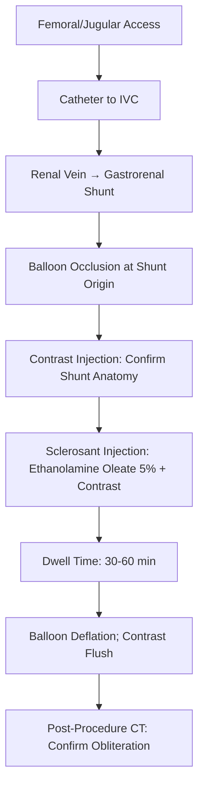
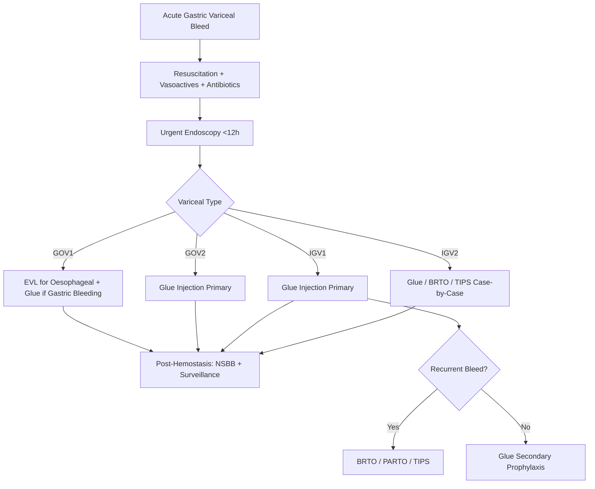

## 1. Learning Objectives
- [ ] Classify gastric varices (GOV1, GOV2, IGV1, IGV2) using Sarin classification
- [ ] Apply management algorithm for each type
- [ ] Perform cyanoacrylate glue injection technique and safety
- [ ] Understand BRTO/PARTO indications and technique
- [ ] Identify FCPS/MRCP high-yield management steps

---

## 2. Sarin Classification of Gastric Varices

```mermaid
flowchart TD
    A[Gastric Varices] --> B{Relationship to Oesophageal Varices}
    B -->|Continuous| C[GOV (Gastro-Oesophageal)]
    B -->|Separate| D[IGV (Isolated Gastric)]
    C --> E{Extension}
    E -->|Along Lesser Curve| F[GOV1]
    E -->|Fundus + Lesser Curve| G[GOV2]
    D --> H{Location}
    H -->|Fundus| I[IGV1]
    H -->|Elsewhere (Ant, Post, Duodenum)| J[IGV2]
```

| Type | Description | Prevalence | Bleeding Risk |
|------|-------------|------------|---------------|
| **GOV1** | Extension of oesophageal varices along **lesser curve** | ~70% | Moderate |
| **GOV2** | Extension to **fundus** + lesser curve | ~15% | High |
| **IGV1** | **Isolated fundal** varices (no oesophageal) | ~10% | **Highest** |
| **IGV2** | Ectopic (antrum, pylorus, duodenum, stoma) | ~5% | Variable |

---

## 3. Management by Type

### GOV1 (Oesophageal Extension)
| Situation | Management |
|-----------|------------|
| **Primary Prophylaxis** | **NSBB + EVL** (treat oesophageal component) |
| **Acute Bleed** | **EVL** (oesophageal) ± Glue if gastric component bleeding |
| **Secondary Prophylaxis** | **NSBB + EVL** (as for oesophageal) |

### GOV2 (Fundal + Oesophageal)
| Situation | Management |
|-----------|------------|
| **Primary Prophylaxis** | **Glue Injection** (primary); NSBB adjunct |
| **Acute Bleed** | **Glue Injection** (primary) |
| **Secondary Prophylaxis** | **Glue Injection**; NSBB adjunct |

### IGV1 (Isolated Fundal)
| Situation | Management |
|-----------|------------|
| **Primary Prophylaxis** | **Glue Injection** (if high-risk: large, red signs, Child C) |
| **Acute Bleed** | **Glue Injection** (primary) |
| **Secondary Prophylaxis** | **Glue Injection**; BRTO/PARTO if recurrent |

### IGV2 (Ectopic)
| Situation | Management |
|-----------|------------|
| **Any Bleed** | **Glue, BRTO, PARTO, TIPS** (case-by-case) |
| **Duodenal/Rectal** | Endoscopic glue, TIPS, Surgery |

---

## 4. Cyanoacrylate Glue Injection

### Technique
| Step | Detail |
|-------|--------|
| **Preparation** | **N-butyl-2-cyanoacrylate (Histoacryl®)** mixed with **Lipiodol®** (1:1 to 1:3 ratio) — radiopaque |
| **Needle** | 23-25G injection needle (long, 4-5mm exposed tip) |
| **Injection** | **Intravariceal** (not paravariceal); **0.5-1 mL per site**; multiple sites if large varix |
| **Post-Injection** | Flush with saline; **No contrast flush** (triggers polymerization) |
| **Prophylactic Antibiotics** | Ceftriaxone 1g IV single dose (prevent glue-related sepsis) |

### Complications
| Complication | Incidence | Management |
|--------------|-----------|------------|
| **Glue Embolisation** | 1-5% | Pulmonary (most common), Splenic, Portal, Cerebral; Supportive; Anticoagulation controversial |
| **Bleeding from Injection Site** | 5-10% | Usually self-limited; Repeat endoscopy if significant |
| **Ulceration/Stricture** | 5-15% | PPI; Dilatation if stricture |
| **Sepsis** | Rare | Prophylactic antibiotics reduce |

---

## 5. BRTO (Balloon-occluded Retrograde Transvenous Obliteration)

### Indications
| Indication | Detail |
|------------|--------|
| **IGV1 with Gastrorenal Shunt** | **Primary indication** |
| **Recurrent Bleed Post-Glue** | Salvage therapy |
| **Refractory Hepatic Encephalopathy** | Shunt occlusion improves HE (controversial) |

### Technique


### BRTO vs PARTO
| Feature | BRTO | PARTO (Plug-Assisted) |
|---------|------|----------------------|
| **Occlusion** | Balloon | **Vascular Plug (Amplatzer®)** |
| **Sclerosant Dwell** | 30-60 min (balloon inflated) | **Permanent** (plug stays) |
| **Radiation** | Higher (fluoroscopy) | Lower |
| **Shunt Patency** | Temporary occlusion | **Permanent occlusion** |
| **Complication** | Balloon rupture, Migration | Plug migration, Cost |

---

## 6. Clinical Algorithm for Gastric Variceal Bleed



---

## 7. FCPS/MRCP High-Yield Summary

| Concept | Key Points |
|---------|------------|
| **Classification** | GOV1 (Lesser curve), GOV2 (Fundal+Lesser), IGV1 (Fundal isolated), IGV2 (Ectopic) |
| **GOV1** | NSBB + EVL (primary/secondary prophylaxis) |
| **GOV2 / IGV1** | **Glue Injection Primary** (NSBB adjunct) |
| **IGV1 + Gastrorenal Shunt** | **BRTO/PARTO** option for secondary prophylaxis/HE |
| **Glue Technique** | Histoacryl:Lipiodol 1:1-1:3; Intravariceal; 0.5-1mL/site; Antibiotics |
| **Glue Complications** | Embolisation (lung > splenic > portal > brain); Ulcer/Stricture |
| **BRTO** | Balloon occlusion of gastrorenal shunt + Ethanolamine oleate |
| **PARTO** | Vascular plug instead of balloon — permanent, less radiation |

---

## 8. Viva Questions

1. **Classify gastric varices using Sarin classification.**
2. **What is the management of GOV1 vs GOV2 vs IGV1?**
3. **How do you perform cyanoacrylate glue injection? Preparation? Dose?**
4. **What are complications of glue injection?**
5. **What is BRTO? Indications? Technique?**
5. **Difference between BRTO and PARTO?**
6. **When do you use BRTO after glue?**
7. **What is the gastrorenal shunt significance?**
8. **Glue vs EVL for gastric varices?**
9. **How do you manage recurrent IGV1 bleed?**
10. **How do you manage recurrent IGV1 bleed?**

---

## 9. Confusions & Mnemonics

| Confusion | Clarification |
|-----------|---------------|
| GOV1 vs GOV2 | GOV1 = Lesser curve only; GOV2 = Fundal + Lesser curve |
| IGV1 vs IGV2 | IGV1 = Fundal isolated; IGV2 = Ectopic (antral, duodenal, rectal) |
| Glue vs EVL for Gastric | EVL **NOT** for gastric (risk of perforation); **Glue = Primary for gastric** |
| BRTO vs PARTO | BRTO = Balloon (temporary); PARTO = Plug (permanent) |
| Glue Embolisation | **Pulmonary most common**; Mix with Lipiodol for radiopacity |
| GOV1 Bleed Management | **EVL for oesophageal component**; Glue only if gastric actively bleeding |
| NSBB in Gastric Varices | Adjunct only; **Glue = Primary for GOV2/IGV1** |

---

## 10. Mind Map

```mermaid
mindmap
  root((Gastric Varices))
    Sarin Classification
      GOV1: Oesophageal → Lesser Curve
      GOV2: Oesophageal → Fundal + Lesser
      IGV1: Isolated Fundal
      IGV2: Ectopic (Ant/Duod/Rectal)
    Management
      GOV1: NSBB + EVL
      GOV2/IGV1: GLUE Primary
      IGV2: Glue / BRTO / TIPS
    Glue Injection
      Histoacryl:Lipiodol 1:1-1:3
      Intravariceal 0.5-1mL
      Antibiotics Prophylaxis
      Complications: Embolisation (Lung), Ulcer
    BRTO/PARTO
      BRTO: Balloon Occlusion + Ethanolamine Oleate
      PARTO: Vascular Plug
      Indication: IGV1 + Gastrorenal Shunt
      PARTO = Permanent, Less Radiation
```

---

## 11. One-Page Revision Card

| **Type** | **Description** | **Primary Prophylaxis** | **Acute Bleed** |
|----------|-----------------|-------------------------|-----------------|
| **GOV1** | Extension along Lesser Curve | NSBB + EVL | EVL ± Glue |
| **GOV2** | Fundal + Lesser Curve | **GLUE** | **GLUE** |
| **IGV1** | Isolated Fundal | **GLUE** (if high-risk) | **GLUE** |
| **IGV2** | Ectopic (Ant/Duod/Rectal) | Case-by-case | Glue / BRTO / TIPS |

| **Glue Injection** | **Details** |
|--------------------|-------------|
| Agent | N-butyl-2-cyanoacrylate (Histoacryl) |
| Mix | Histoacryl:Lipiodol 1:1 to 1:3 |
| Dose | 0.5-1 mL per site, Intravariceal |
| Antibiotics | Ceftriaxone 1g IV single dose |
| Embolisation | Pulmonary > Splenic > Portal > Cerebral |

| **BRTO vs PARTO** | |
|-------------------|--|
| BRTO | Balloon Occlusion, 30-60 min dwell, Ethanolamine Oleate |
| PARTO | Vascular Plug (Amplatzer), Permanent, Less Radiation |
| Indication | IGV1 + Gastrorenal Shunt; Recurrent bleed; Refractory HE |

---

## 12. Spaced Repetition Tracker

| Day | 1 | 3 | 7 | 15 | 30 |
|-----|---|---|---|----|----|
| Sarin Classification | ☐ | ☐ | ☐ | ☐ | ☐ |
| GOV1 vs GOV2 vs IGV1 mgmt | ☐ | ☐ | ☐ | ☐ | ☐ |
| Glue Preparation | ☐ | ☐ | ☐ | ☐ | ☐ |
| Glue Complications | ☐ | ☐ | ☐ | ☐ | ☐ |
| BRTO vs PARTO | ☐ | ☐ | ☐ | ☐ | ☐ |

---

## 13. Self-Test Scorecard

| Question | My Answer | Correct? |
|----------|-----------|----------|
| Sarin Classification 4 types |  |  |
| GOV2/IGV1 prophylaxis |  |  |
| Glue Preparation |  |  |
| Glue Complications |  |  |
| BRTO vs PARTO |  |  |

---

## 14. Local Navigation

- [[Portal Hypertension and Complications/Primary prophylaxis (NSBB vs EVL)|Primary Prophylaxis]]
- [[Portal Hypertension and Complications/Secondary prophylaxis|Secondary Prophylaxis]]
- [[Portal Hypertension and Complications/Acute variceal bleeding management|Acute Bleed]]
- [[Portal Hypertension and Complications/Varices|Varices Overview]]
- [[Portal Hypertension and Complications/Screening endoscopy|Screening Endoscopy]]