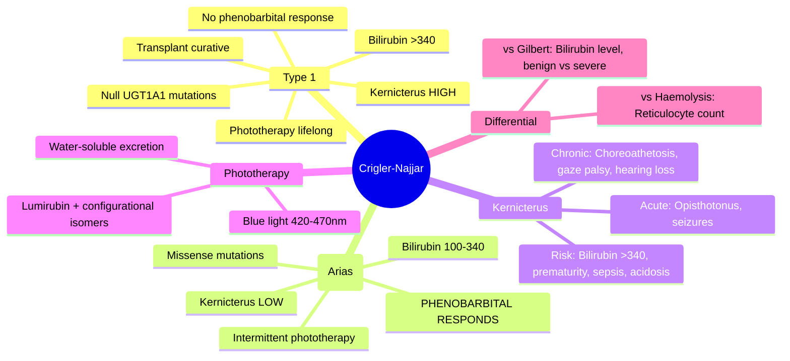

## 1. Learning Objectives
- [ ] Differentiate Type 1 vs Type 2 Crigler-Najjar
- [ ] Understand kernicterus risk and prevention
- [ ] Apply treatment (phototherapy, phenobarbital, liver transplant)
- [ ] Differentiate from Gilbert syndrome
- [ ] Identify FCPS/MRCP high-yield features (UGT1A1 mutations, bilirubin levels)

---

## 2. Definition & Genetics

| Feature | Crigler-Najjar Syndrome |
|---------|------------------------|
| **Definition** | **Severe congenital unconjugated hyperbilirubinaemia** due to **UGT1A1 deficiency** |
| **Inheritance** | **Autosomal recessive** |
| **Gene** | **UGT1A1** (same as Gilbert, but severe mutations) |
| **Prevalence** | **1:1,000,000** (very rare) |

---

## 3. Type 1 vs Type 2

```mermaid
flowchart TD
    A[Crigler-Najjar Syndrome] --> B{Residual UGT1A1 Activity}
    B -->|<1% (Absent)| C[Type 1 (Severe)]
    B -->|<10% (Markedly Reduced)| D[Type 2 (Arias)]
    C --> E[Bilirubin >340 μmol/L (>20 mg/dL)]
    C --> F[Kernicterus Risk: HIGH]
    C --> G[No Response to Phenobarbital]
    C --> H[Phototherapy Lifelong]
    C --> I[Liver Transplant Curative]
    D --> J[Bilirubin 100-340 μmol/L (6-20 mg/dL)]
    D --> K[Kernicterus Risk: LOW (but possible)]
    D --> L[**Responds to Phenobarbital**]
    D --> M[Phototherapy Intermittent]
    D --> N[Liver Transplant Optional]
```

| Feature | Type 1 | Type 2 (Arias) |
|---------|--------|----------------|
| **UGT1A1 Activity** | **Absent (<1%)** | **Markedly Reduced (<10%)** |
| **Bilirubin** | **>340 μmol/L (>20 mg/dL)** | **100-340 μmol/L (6-20 mg/dL)** |
| **Kernicterus** | **High risk (infancy)** | **Low risk (but possible)** |
| **Phenobarbital** | **No response** | **Responds (↓ bilirubin 25-50%)** |
| **Phototherapy** | **Lifelong, intensive** | Intermittent |
| **Liver Transplant** | **Only curative option** | Optional (if severe) |
| **Genetics** | Null mutations (premature stop, frameshift) | Missense mutations (some residual activity) |

---

## 4. Kernicterus (Bilirubin Encephalopathy)

### Pathophysiology
- **Unconjugated bilirubin** crosses blood-brain barrier (especially if disrupted by sepsis, acidosis, hypoalbuminaemia)
- **Deposits in basal ganglia, hippocampus, cerebellum** → neurotoxicity

### Clinical Phases
| Phase | Features |
|-------|----------|
| **Acute** | Lethargy, poor feeding, high-pitched cry, hypotonia → hypertonia (opisthotonus), seizures, fever |
| **Chronic (Kernicterus)** | **Choreoathetosis, dystonia, gaze palsy (upward), sensorineural hearing loss, dental enamel hypoplasia, intellectual disability** |

### Risk Factors for Kernicterus
- **Bilirubin >340 μmol/L** (Type 1)
- **Prematurity**
- **Sepsis / Acidosis**
- **Hypoalbuminaemia** (↓ binding)
- **Drugs displacing bilirubin** (sulfonamides, ceftriaxone)

---

## 5. Diagnosis

### Clinical Suspicion
- **Neonatal jaundice** persisting >2 weeks
- **Unconjugated hyperbilirubinaemia** (no haemolysis, normal LFTs otherwise)
- **Family history** (consanguinity, affected siblings)

### Investigations
| Test | Type 1 | Type 2 |
|------|--------|--------|
| **Bilirubin (Unconjugated)** | >340 μmol/L | 100-340 μmol/L |
| **LFTs (AST, ALT, ALP, GGT)** | Normal | Normal |
| **Haemolysis Screen** | Negative | Negative |
| **Phenobarbital Trial** | **No response** | **Bilirubin ↓ 25-50%** |
| **UGT1A1 Genetic Testing** | **Null mutations** (homozygous/compound het) | **Missense mutations** |
| **Bile Pigment Analysis** | **Absent bilirubin glucuronides** | **Reduced glucuronides** |

---

## 6. Treatment

### Type 1
| Modality | Details |
|----------|---------|
| **Phototherapy** | **Lifelong, intensive** (blue light 420-470 nm, 16-24h/day); converts bilirubin to water-soluble isomers (lumirubin, configurational isomers) |
| **Calcium Phosphate / Cholestyramine** | Adjunct — interrupts enterohepatic circulation |
| **Tin-Mesoporphyrin** | Experimental — inhibits heme oxygenase (↓ bilirubin production) |
| **Liver Transplant** | **Only curative option** — typically in childhood before kernicterus |

### Type 2
| Modality | Details |
|----------|---------|
| **Phenobarbital** | **5-8 mg/kg/day** — induces residual UGT1A1 → bilirubin ↓ 25-50% |
| **Phototherapy** | Intermittent (illness, stress) |
| **Liver Transplant** | Rarely needed |

---

## 7. Differential: Crigler-Najjar vs Gilbert

| Feature | Crigler-Najjar Type 1 | Crigler-Najjar Type 2 | Gilbert |
|---------|----------------------|----------------------|---------|
| **Bilirubin** | >340 μmol/L | 100-340 μmol/L | 20-80 μmol/L |
| **Kernicterus** | **High risk** | Low risk | **None** |
| **Phenobarbital** | No response | **Responds** | Not used |
| **UGT1A1 Activity** | <1% | <10% | ~30% |
| **Genetics** | Null mutations | Missense | UGT1A1*28 promoter |
| **Life Expectancy** | Short without transplant | Near-normal | **Normal** |

---

## 8. FCPS/MRCP High-Yield Summary

| Concept | Key Points |
|---------|------------|
| **Type 1** | Bilirubin >340, **no phenobarbital response**, kernicterus high, transplant curative |
| **Type 2** | Bilirubin 100-340, **phenobarbital responds**, kernicterus rare |
| **Gilbert** | Bilirubin 20-80, benign, no treatment |
| **Kernicterus** | Acute: opisthotonus, seizures; Chronic: choreoathetosis, gaze palsy, hearing loss |
| **Phototherapy** | Blue light 420-470 nm; converts bilirubin to water-soluble isomers |
| **Phenobarbital** | Induces UGT1A1 — works ONLY in Type 2 (and Gilbert, but not needed) |

---

## 9. Viva Questions

1. **Differentiate Crigler-Najjar Type 1 vs Type 2.**
2. **What is the bilirubin level in Type 1 vs Type 2?**
3. **Why does phenobarbital work in Type 2 but not Type 1?**
4. **What is kernicterus? Acute and chronic features?**
5. **What is the treatment for Type 1 Crigler-Najjar?**
5. **How does phototherapy work?**
6. **Differentiate Crigler-Najjar from Gilbert syndrome.**
6. **Genetics of Crigler-Najjar vs Gilbert?**
7. **Risk factors for kernicterus?**
8. **When is liver transplant indicated?**
9. **What is the phototherapy mechanism?**
10. **What is the phenobarbital response in Type 2?**

---

## 10. Confusions & Mnemonics

| Confusion | Clarification |
|-----------|---------------|
| Type 1 vs Type 2 phenobarbital | **Type 1: No enzyme to induce → no response**; **Type 2: Residual enzyme → induction works** |
| Bilirubin thresholds | **Type 1: >340 (20 mg/dL)**; **Type 2: 100-340 (6-20 mg/dL)**; **Gilbert: 20-80 (1.2-5 mg/dL)** |
| Kernicterus chronic signs | **Choreoathetosis, upward gaze palsy, hearing loss, enamel hypoplasia** |
| Phototherapy mechanism | **Blue light → configurational isomers + lumirubin** (water-soluble, excreted in bile/urine) |
| UGT1A1 mutations | **Type 1: Null** (stop codon, frameshift); **Type 2: Missense**; **Gilbert: Promoter (TA)7** |
| Life expectancy | Type 1: Short without transplant; Type 2: Near-normal; Gilbert: Normal |

---

## 11. Mind Map



---

## 12. One-Page Revision Card

| **Type** | **Bilirubin** | **Phenobarbital** | **Kernicterus** | **Treatment** |
|----------|---------------|-------------------|-----------------|---------------|
| **Type 1** | **>340 μmol/L** | **No response** | **High** | Phototherapy lifelong → Transplant |
| **Type 2** | **100-340 μmol/L** | **Responds ↓25-50%** | Low | Phenobarbital ± Phototherapy |

| **Kernicterus** | |
|-----------------|--|
| Acute | Lethargy, poor feeding, opisthotonus, seizures |
| Chronic | Choreoathetosis, upward gaze palsy, hearing loss, enamel hypoplasia |

| **Phototherapy** | Blue light 420-470nm → Lumirubin (excreted) |
| **Phenobarbital** | Induces UGT1A1 (works only if residual enzyme) |

| **Genetics** | |
|--------------|--|
| Type 1 | Null mutations (homo/compound het) |
| Type 2 | Missense mutations |
| Gilbert | UGT1A1*28 promoter |

---

## 13. Spaced Repetition Tracker

| Day | 1 | 3 | 7 | 15 | 30 |
|-----|---|---|---|----|----|
| Type 1 vs Type 2 | ☐ | ☐ | ☐ | ☐ | ☐ |
| Bilirubin thresholds | ☐ | ☐ | ☐ | ☐ | ☐ |
| Kernicterus features | ☐ | ☐ | ☐ | ☐ | ☐ |
| Phenobarbital response | ☐ | ☐ | ☐ | ☐ | ☐ |
| CN vs Gilbert | ☐ | ☐ | ☐ | ☐ | ☐ |

---

## 14. Self-Test Scorecard

| Question | My Answer | Correct? |
|----------|-----------|----------|
| Type 1 vs Type 2 bilirubin |  |  |
| Phenobarbital response |  |  |
| Kernicterus chronic signs |  |  |
| Phototherapy mechanism |  |  |
| CN vs Gilbert differential |  |  |

---

## 15. Local Navigation

- [[Inherited and Metabolic Liver Disease/Gilbert Syndrome|Gilbert Syndrome]]
- [[Inherited and Metabolic Liver Disease/Dubin-Johnson vs Rotor Syndrome|Dubin-Johnson vs Rotor]]
- [[Jaundice and LFT Interpretation/Isolated hyperbilirubinaemia|Isolated Hyperbilirubinaemia]]
---

> Auto-generated study sections for "Inherited and Metabolic Liver Disease" — Ch 23: Hepatology.

## Flashcards (6 generated)

- Q: What is the definition of Inherited and Metabolic Liver Disease?
  A: | Feature | Type 1 | Type 2 (Arias) |
- Q: How is Inherited and Metabolic Liver Disease classified?
  A: Bilirubin >340, no phenobarbital response, kernicterus high, transplant curative
- Q: What is Gilbert of Inherited and Metabolic Liver Disease?
  A: Bilirubin 20-80, benign, no treatment
- Q: What is Kernicterus of Inherited and Metabolic Liver Disease?
  A: Acute: opisthotonus, seizures; Chronic: choreoathetosis, gaze palsy, hearing loss
- Q: How is Inherited and Metabolic Liver Disease managed?
  A: Blue light 420-470 nm; converts bilirubin to water-soluble isomers
- Q: What is Phenobarbital of Inherited and Metabolic Liver Disease?
  A: Induces UGT1A1 — works ONLY in Type 2 (and Gilbert, but not needed)

## MCQs (1 generated)

1. **Which of the following best describes Inherited and Metabolic Liver Disease?**
   A. **| Feature | Type 1 | Type 2 (Arias) |**
   B. An unrelated condition not matching the clinical picture of Inherited and Metabolic Liver Disease
   C. A complication seen late in the disease course of Inherited and Metabolic Liver Disease
   D. A condition that mimics Inherited and Metabolic Liver Disease but has a different underlying cause

## SBA Questions (1 generated)

1. A patient with suspected Inherited and Metabolic Liver Disease presents with: Feature — Crigler-Najjar Syndrome; Definition — Severe congenital unconjugated hyperbilirubinaemia due to UGT1A1 deficiency; Inheritance — Autosomal recessive. What is the most likely diagnosis?
   A. **Inherited and Metabolic Liver Disease**
   B. A condition that mimics Inherited and Metabolic Liver Disease but is not the same entity
   C. A complication of Inherited and Metabolic Liver Disease rather than the primary diagnosis
   D. An unrelated condition in the same clinical category as Inherited and Metabolic Liver Disease

## PasTest Scenario SBAs (Clinical Vignettes)

> **Auto-generated PasTest/Mediscope-style scenario SBAs** grounded in the authored source. Each scenario tests a real clinical fact (triad, specific sign, contraindication, trial, first-line Rx) extracted from the topic. *Source: Ch 23: Hepatology — Crigler-Najjar Syndrome*

**Q1.** What is the most appropriate first-line therapy for Crigler-Najjar Syndrome?

  - **A.** Liver Transplant + Only curative option
  - **B.** An advanced/surgical therapy reserved for refractory disease
  - **C.** Symptomatic treatment only, no disease-modifying therapy
  - **D.** Empiric broad-spectrum therapy without specific indication

  > **Answer: A** — Liver Transplant + Only curative option
  >
  > *Source:* **Liver Transplant**   **Only curative option** — typically in childhood before kernicterus  

### Type 2

