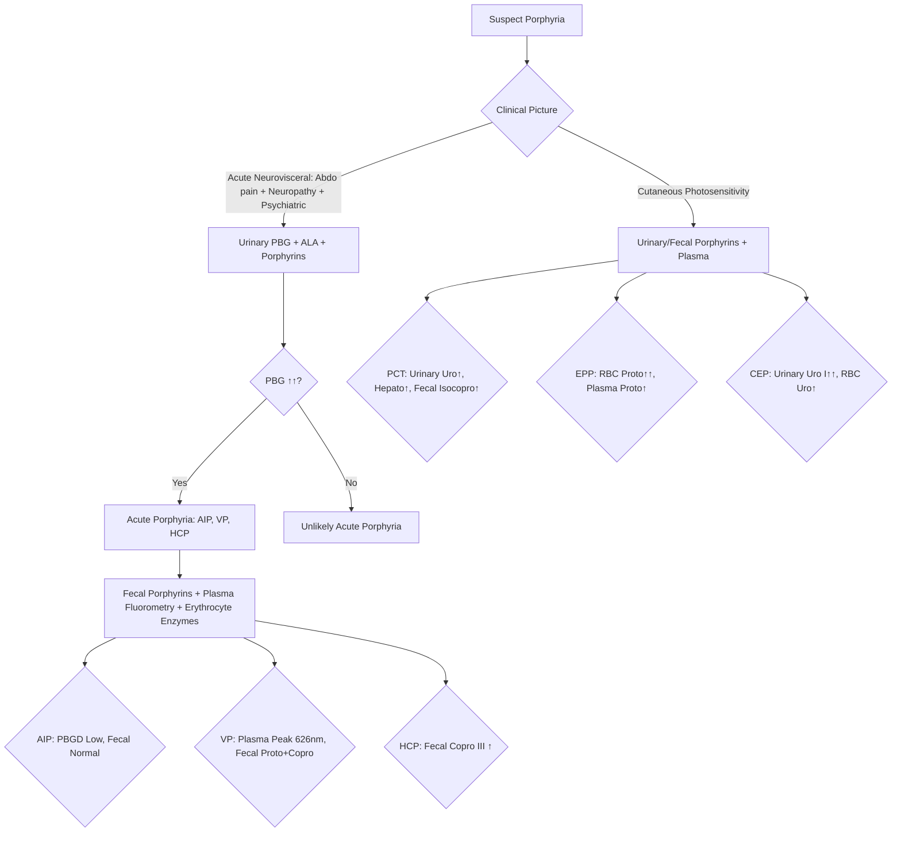
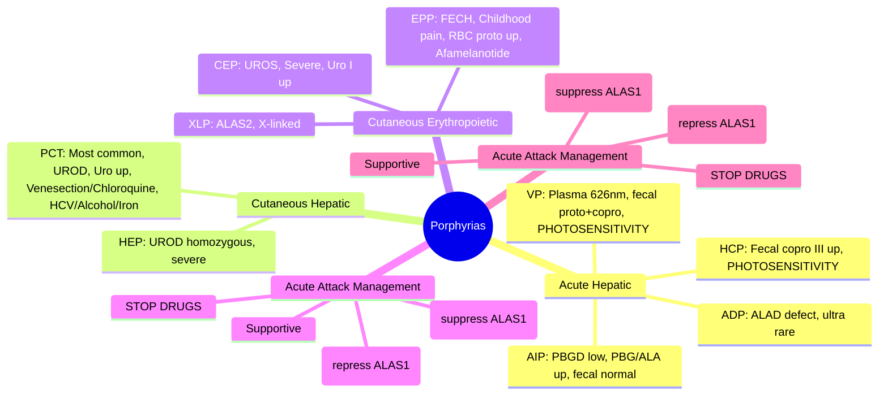

## 1. Learning Objectives
- [ ] Classify porphyrias (hepatic vs erythropoietic; acute vs cutaneous)
- [ ] Recognize acute porphyria presentation (neurovisceral)
- [ ] Apply diagnostic testing (PBG, ALA, porphyrins in urine/feces)
- [ ] Manage acute attacks (haemin, glucose, avoid precipitants)
- [ ] Identify FCPS/MRCP high-yield features (drug precipitation, hygiene hypothesis)

---

## 2. Classification

```mermaid
flowchart TD
    A[Porphyrias: Defects in Haem Biosynthesis] --> B{Hepatic (Liver)}
    A --> C{Erythropoietic (Bone Marrow)}
    B --> D[Acute Hepatic Porphyrias]
    D --> D1[Acute Intermittent Porphyria (AIP)]
    D --> D2[Variegate Porphyria (VP)]
    D --> D3[Hereditary Coproporphyria (HCP)]
    D --> D4[ALAD Porphyria (ADP) - Ultra rare]
    B --> E[Cutaneous Hepatic Porphyrias]
    E --> E1[Porphyria Cutanea Tarda (PCT)]
    E --> E2[Hepatoerythropoietic Porphyria (HEP)]
    C --> F[Cutaneous Erythropoietic Porphyrias]
    F --> F1[Erythropoietic Protoporphyria (EPP)]
    F --> F2[Congenital Erythropoietic Porphyria (CEP)]
    F --> F3[X-Linked Protoporphyria (XLP)]
```

| Category | Types | Main Features |
|----------|-------|---------------|
| **Acute Hepatic** | AIP, VP, HCP, ADP | **Neurovisceral attacks** (abdominal pain, neuropathy, psychiatric); **No photosensitivity** (except VP, HCP) |
| **Cutaneous Hepatic** | PCT, HEP | **Photosensitivity** (blistering, fragility); **No acute attacks** |
| **Cutaneous Erythropoietic** | EPP, CEP, XLP | **Photosensitivity** (pain, swelling); **Onset in childhood** |

---

## 3. Haem Biosynthesis Pathway (Key Enzymes)

| Enzyme | Gene | Porphyria | Accumulates |
|--------|------|-----------|-------------|
| **ALAS1** | ALAS1 | — | (Rate-limiting, induced in acute) |
| **ALAD** | ALAD | ADP | ALA |
| **PBGD (HMBS)** | HMBS | **AIP** | **PBG, ALA** |
| **UROS** | UROS | CEP | Uroporphyrin I |
| **UROD** | UROD | **PCT, HEP** | **Uroporphyrin, Heptacarboxyl** |
| **CPOX** | CPOX | **HCP** | **Coproporphyrin** |
| **PPOX** | PPOX | **VP** | **Protoporphyrin, Coproporphyrin** |
| **FECH** | FECH | **EPP, XLP** | **Protoporphyrin** |

---

## 4. Acute Porphyrias (AIP, VP, HCP)

### Clinical Presentation: Acute Neurovisceral Attack

| System | Features |
|--------|----------|
| **Abdominal** | **Severe, diffuse pain** (often out of proportion to exam), nausea, vomiting, constipation, ileus |
| **Neurological** | **Motor neuropathy** (proximal weakness → quadriparesis, respiratory failure), sensory changes, autonomic instability (HTN, tachycardia, hyponatraemia) |
| **Psychiatric** | Anxiety, agitation, confusion, hallucinations, seizures |
| **Cutaneous** | **VP, HCP only**: Photosensitivity (blistering, scarring) |

### Precipitating Factors (Induce ALAS1)
| Category | Examples |
|----------|----------|
| **Drugs** | Barbiturates, sulfonamides, rifampicin, phenytoin, carbamazepine, valproate, OCP, metoclopramide |
| **Hormonal** | Menstrual cycle (progesterone), pregnancy |
| **Metabolic** | **Fasting, low-carb diet**, alcohol, stress, infection |
| **Other** | Surgery, heavy metals |

> **FCPS/MRCP**: **Drugs + Fasting + Hormones = Classic precipitants** — always ask about drugs in acute abdominal pain + neuropathy

### Biochemical Diagnosis (During Attack)

| Test | AIP | VP | HCP |
|------|-----|----|-----|
| **Urinary PBG** | **↑↑↑** (hallmark) | ↑↑ | ↑↑ |
| **Urinary ALA** | **↑↑** | ↑↑ | ↑↑ |
| **Urinary Porphyrins** | ↑ (uroporphyrin, heptacarboxyl) | ↑↑ (coproporphyrin) | ↑↑ (coproporphyrin) |
| **Fecal Porphyrins** | Normal | **↑ Protoporphyrin, Coproporphyrin** | **↑ Coproporphyrin III** |
| **Plasma Fluorometry** | Normal | **Peak at 626 nm** | Normal/slight ↑ |
| **Erythrocyte PBGD** | **Low** | Normal | Normal |

**Key**: **Urinary PBG = SCREENING TEST** for acute porphyria (highly sensitive/specific during attack)

---

## 5. Cutaneous Porphyrias

### Porphyria Cutanea Tarda (PCT) — Most Common
| Feature | Detail |
|---------|--------|
| **Enzyme** | **UROD** (acquired inhibition ± genetic) |
| **Inheritance** | **Sporadic (80%)** — acquired (alcohol, HCV, HIV, estrogen, iron); **Familial (20%)** — autosomal dominant |
| **Presentation** | **Photosensitivity**: Blistering on sun-exposed areas (hands, face), skin fragility, hypertrichosis, hyperpigmentation |
| **Biochemistry** | **Urinary uroporphyrin ↑↑, heptacarboxyl ↑↑**; Fecal isocoproporphyrin ↑ |
| **Associations** | **HCV (50%), Alcohol, Estrogen, HFE mutations (iron overload), HIV** |
| **Treatment** | **Venesection** (target ferritin 50-100) **OR Low-dose chloroquine/hydroxychloroquine** |

### Erythropoietic Protoporphyria (EPP)
| Feature | Detail |
|---------|--------|
| **Enzyme** | **FECH** (Ferrochelatase) |
| **Inheritance** | Autosomal recessive (FECH) or X-linked (ALAS2) |
| **Presentation** | **Childhood onset**: Acute **pain, burning, swelling** on sun exposure (minutes-hours); **No blisters** |
| **Biochemistry** | **Erythrocyte protoporphyrin ↑↑**; Plasma protoporphyrin ↑; Fecal protoporphyrin ↑ |
| **Complications** | **Liver disease** (protoporphyrin hepatotoxicity) → cirrhosis, liver failure |
| **Treatment** | **Afamelanotide (SC implant)** — increases melanin; Beta-carotene; Avoid sun |

---

## 6. Diagnostic Algorithm



---

## 7. Management of Acute Attack

### Immediate (Life-Saving)
| Intervention | Details |
|--------------|---------|
| **Stop precipitating drugs** | **Immediately** — review all medications |
| **IV Glucose** | **10% dextrose 3-4 L/day** (high carbohydrate → suppresses ALAS1) |
| **Haemin (Heme Arginate)** | **3-4 mg/kg IV daily × 4 days** — **represses ALAS1**; first-line specific therapy |
| **Supportive** | Pain control (opioids OK), antiemetics, hyponatraemia correction, seizure prophylaxis, respiratory support if neuropathy progresses |

### Precautions
- **Avoid barbiturates, sulfonamides, rifampicin, phenytoin, valproate, OCP**
- **Safe drugs**: List available (e.g., porphyria drug databases)
- **Wear medical alert bracelet**

### Long-Term
- **Avoid precipitants** (drugs, fasting, alcohol, smoking)
- **High-carbohydrate diet**
- **Genetic counseling** (autosomal dominant for AIP, VP, HCP)
- **Screen family** (biochemical + genetic)

---

## 8. FCPS/MRCP High-Yield Summary

| Concept | Key Points |
|---------|------------|
| **Acute Porphyrias** | AIP, VP, HCP — **Neurovisceral attacks** (abdo pain, neuropathy, psychiatric) |
| **Cutaneous Porphyrias** | PCT, EPP, CEP — **Photosensitivity** |
| **Screening Test** | **Urinary PBG** (↑↑ in acute attack) |
| **AIP** | PBGD low; Urinary PBG/ALA ↑; Fecal normal |
| **VP** | Plasma fluorescence 626 nm; Fecal proto + copro ↑; Photosensitivity |
| **HCP** | Fecal coproporphyrin III ↑; Photosensitivity |
| **PCT** | Most common; Urinary uroporphyrin ↑; **Venesection or chloroquine**; HCV, alcohol, iron |
| **EPP** | Childhood pain on sun exposure; RBC protoporphyrin ↑; Afamelanotide |
| **Acute Attack Rx** | **Stop drugs, IV Glucose, Haemin 3-4 mg/kg ×4d** |
| **Precipitants** | Drugs (barbiturates, rifampicin, phenytoin, OCP), Fasting, Alcohol, Hormones |

---

## 9. Viva Questions

1. **Classify porphyrias into acute vs cutaneous, hepatic vs erythropoietic.**
2. **What is the screening test for acute porphyria?**
3. **Differentiate AIP, VP, HCP by biochemistry.**
4. **What are the clinical features of an acute porphyria attack?**
5. **How do you treat an acute porphyria attack?**
5. **What is the role of haemin?**
6. **Differentiate VP from HCP.**
6. **What is the most common porphyria? How is PCT treated?**
7. **What is EPP? How does it present?**
8. **List common drug precipitants for acute porphyria.**
9. **What is the role of glucose in acute porphyria attack?**
10. **What is the role of haemin in acute porphyria?**

---

## 10. Confusions & Mnemonics

| Confusion | Clarification |
|-----------|---------------|
| AIP vs VP vs HCP | **AIP**: PBGD low, no photosensitivity, fecal normal; **VP**: Plasma peak 626nm, photosensitivity; **HCP**: Fecal copro III ↑, photosensitivity |
| Acute vs Cutaneous | Acute = neurovisceral (pain, neuropathy); Cutaneous = photosensitivity (blisters/pain) |
| PCT treatment | **Venesection (target ferritin 50-100) OR Low-dose chloroquine** |
| EPP vs PCT | **EPP**: Childhood, pain/burning (min-hrs), no blisters, RBC proto ↑; **PCT**: Adult, blisters/fragility, urinary uro ↑ |
| Urinary PBG | **SCREENING for acute porphyria** — highly sensitive/specific during attack |
| Haemin mechanism | **Represses ALAS1** (rate-limiting enzyme) — stops overproduction of precursors |
| Drug precipitants | **Barbiturates, Sulfonamides, Rifampicin, Phenytoin, Valproate, OCP** — induce ALAS1 |

---

## 11. Mind Map



---

## 12. One-Page Revision Card

| **Porphyria** | **Enzyme/Defect** | **Key Biochemistry** | **Clinical** | **Treatment** |
|---------------|-------------------|----------------------|--------------|---------------|
| **AIP** | PBGD (HMBS) | Urinary PBG↑↑, ALA↑; PBGD low; Fecal normal | Acute attacks only | Haemin, Glucose |
| **VP** | PPOX | Plasma 626nm; Fecal Proto+Copro↑ | Acute + Photosensitivity | Haemin, Glucose |
| **HCP** | CPOX | Fecal Copro III↑ | Acute + Photosensitivity | Haemin, Glucose |
| **PCT** | UROD (acquired/genetic) | Urinary Uro↑, Hepato↑; Fecal Isocopro↑ | Photosensitivity (blisters) | Venesection / Chloroquine |
| **EPP** | FECH | RBC Proto↑↑ | Childhood pain on sun | Afamelanotide, Beta-carotene |

| **Acute Attack** | **Management** |
|------------------|----------------|
| 1. | **STOP PRECIPITATING DRUGS** |
| 2. | **IV Glucose** (10% dextrose 3-4L/d) |
| 3. | **Haemin 3-4 mg/kg IV × 4 days** |
| 4. | Supportive (pain, nausea, hyponatraemia, respiratory) |

| **Precipitants** | |
|------------------|--|
| Drugs | Barbiturates, Sulfonamides, Rifampicin, Phenytoin, Valproate, OCP |
| Metabolic | Fasting, Alcohol |
| Hormonal | Progesterone, Menstruation |

---

## 13. Spaced Repetition Tracker

| Day | 1 | 3 | 7 | 15 | 30 |
|-----|---|---|---|----|----|
| AIP vs VP vs HCP biochem | ☐ | ☐ | ☐ | ☐ | ☐ |
| Acute attack management | ☐ | ☐ | ☐ | ☐ | ☐ |
| PBG screening test | ☐ | ☐ | ☐ | ☐ | ☐ |
| PCT treatment | ☐ | ☐ | ☐ | ☐ | ☐ |
| Drug precipitants list | ☐ | ☐ | ☐ | ☐ | ☐ |

---

## 14. Self-Test Scorecard

| Question | My Answer | Correct? |
|----------|-----------|----------|
| AIP vs VP vs HCP differentiation |  |  |
| Acute attack drugs 1-2-3 |  |  |
| Haemin mechanism |  |  |
| PCT treatment options |  |  |
| EPP vs PCT features |  |  |

---

## 15. Local Navigation

- [[Inherited and Metabolic Liver Disease/Wilson Disease|Wilson Disease]]
- [[Inherited and Metabolic Liver Disease/Haemochromatosis|Haemochromatosis]]
- [[Inherited and Metabolic Liver Disease/Alpha-1 Antitrypsin Deficiency|Alpha-1 AT]]
- [[Acute Liver Failure/Definition and Aetiology|ALF Aetiology]]
---

> Auto-generated study sections for "Inherited and Metabolic Liver Disease" — Ch 23: Hepatology.

## Flashcards (22 generated)

- Q: What is the definition of Inherited and Metabolic Liver Disease?
  A: | Enzyme | Gene | Porphyria | Accumulates |
- Q: What is Enzyme of Inherited and Metabolic Liver Disease?
  A: UROD (acquired inhibition ± genetic)
- Q: What is Inheritance of Inherited and Metabolic Liver Disease?
  A: Sporadic (80%) — acquired (alcohol, HCV, HIV, estrogen, iron); Familial (20%) — autosomal dominant
- Q: What are the clinical features of Inherited and Metabolic Liver Disease?
  A: Photosensitivity: Blistering on sun-exposed areas (hands, face), skin fragility, hypertrichosis, hyperpigmentation
- Q: What is Biochemistry of Inherited and Metabolic Liver Disease?
  A: Urinary uroporphyrin ↑↑, heptacarboxyl ↑↑; Fecal isocoproporphyrin ↑
- Q: What is Associations of Inherited and Metabolic Liver Disease?
  A: HCV (50%), Alcohol, Estrogen, HFE mutations (iron overload), HIV
- Q: How is Inherited and Metabolic Liver Disease managed?
  A: Venesection (target ferritin 50-100) OR Low-dose chloroquine/hydroxychloroquine
- Q: What is Enzyme of Inherited and Metabolic Liver Disease?
  A: UROD (acquired inhibition ± genetic)
- Q: What is Inheritance of Inherited and Metabolic Liver Disease?
  A: Sporadic (80%) — acquired (alcohol, HCV, HIV, estrogen, iron); Familial (20%) — autosomal dominant
- Q: What are the clinical features of Inherited and Metabolic Liver Disease?
  A: Photosensitivity: Blistering on sun-exposed areas (hands, face), skin fragility, hypertrichosis, hyperpigmentation
- Q: What is Biochemistry of Inherited and Metabolic Liver Disease?
  A: Urinary uroporphyrin ↑↑, heptacarboxyl ↑↑; Fecal isocoproporphyrin ↑
- Q: What is Associations of Inherited and Metabolic Liver Disease?
  A: HCV (50%), Alcohol, Estrogen, HFE mutations (iron overload), HIV
- Q: What is Acute Porphyrias of Inherited and Metabolic Liver Disease?
  A: AIP, VP, HCP — Neurovisceral attacks (abdo pain, neuropathy, psychiatric)
- Q: What is Cutaneous Porphyrias of Inherited and Metabolic Liver Disease?
  A: PCT, EPP, CEP — Photosensitivity
- Q: What is the investigation of choice for Inherited and Metabolic Liver Disease?
  A: Urinary PBG (↑↑ in acute attack)
- Q: What is AIP of Inherited and Metabolic Liver Disease?
  A: PBGD low; Urinary PBG/ALA ↑; Fecal normal
- Q: What is VP of Inherited and Metabolic Liver Disease?
  A: Plasma fluorescence 626 nm; Fecal proto + copro ↑; Photosensitivity
- Q: What is HCP of Inherited and Metabolic Liver Disease?
  A: Fecal coproporphyrin III ↑; Photosensitivity
- Q: What is PCT of Inherited and Metabolic Liver Disease?
  A: Most common; Urinary uroporphyrin ↑; Venesection or chloroquine; HCV, alcohol, iron
- Q: What is EPP of Inherited and Metabolic Liver Disease?
  A: Childhood pain on sun exposure; RBC protoporphyrin ↑; Afamelanotide
- Q: What is Acute Attack Rx of Inherited and Metabolic Liver Disease?
  A: Stop drugs, IV Glucose, Haemin 3-4 mg/kg ×4d
- Q: What is Precipitants of Inherited and Metabolic Liver Disease?
  A: Drugs (barbiturates, rifampicin, phenytoin, OCP), Fasting, Alcohol, Hormones

## MCQs (1 generated)

1. **Which of the following best describes Inherited and Metabolic Liver Disease?**
   A. **| Enzyme | Gene | Porphyria | Accumulates |**
   B. An unrelated condition not matching the clinical picture of Inherited and Metabolic Liver Disease
   C. A complication seen late in the disease course of Inherited and Metabolic Liver Disease
   D. A condition that mimics Inherited and Metabolic Liver Disease but has a different underlying cause

## SBA Questions (1 generated)

1. A patient with suspected Inherited and Metabolic Liver Disease presents with: A[Porphyrias: Defects in Haem Biosynthesis] --> B{Hepatic (Liver)}; A --> C{Erythropoietic (Bone Marrow)}; B --> D[Acute Hepatic Porphyrias]. What is the most likely diagnosis?
   A. **Inherited and Metabolic Liver Disease**
   B. A condition that mimics Inherited and Metabolic Liver Disease but is not the same entity
   C. A complication of Inherited and Metabolic Liver Disease rather than the primary diagnosis
   D. An unrelated condition in the same clinical category as Inherited and Metabolic Liver Disease

