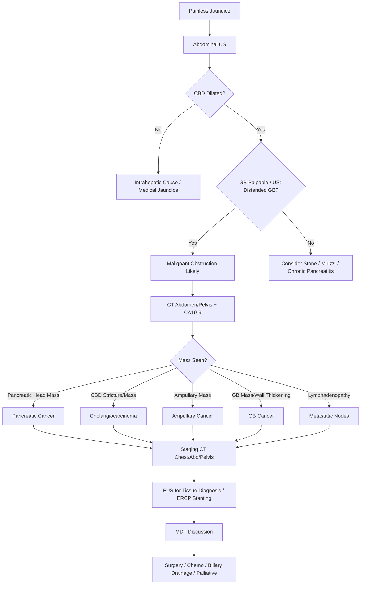

## 1. Learning Objectives
- [ ] Recognise malignant biliary obstruction as cause of painless jaundice
- [ ] Apply Courvoisier's law and differentiate from stone obstruction
- [ ] Differentiate pancreatic cancer, cholangiocarcinoma, ampullary carcinoma, gallbladder cancer
- [ ] Apply diagnostic algorithm (US → CT/MRCP → ERCP/EUS)
- [ ] Identify FCPS/MRCP high-yield management steps

---

## 2. Malignant vs Benign Obstruction

```mermaid
flowchart TD
    A[Obstructive Jaundice] --> B{Pain?}
    B -->|Yes (Colicky)| C[Choledocholithiasis]
    B -->|No (Painless)| D[Malignant Obstruction]
    D --> E{Courvoisier's Law}
    E -->|Palpable GB + Jaundice| F[Malignancy Likely]
    E -->|Non-palpable GB| G[Stone Still Possible]
```

> **Courvoisier's Law**: **Palpable gallbladder + jaundice = Malignancy** (not stone) — **Stone causes fibrosis → shrunken GB**

---

## 3. Major Causes of Malignant Biliary Obstruction

| Cancer | Location | Typical Presentation | Key Features |
|--------|----------|---------------------|--------------|
| **Pancreatic Adenocarcinoma** | Head of pancreas (70%) | **Painless jaundice**, Weight loss, Anorexia, New-onset diabetes | **Courvoisier's +**, CA19-9↑, "Double duct sign" |
| **Distal Cholangiocarcinoma** | Distal CBD | Painless jaundice, Pruritus | Similar to pancreatic, "Double duct" |
| **Perihilar (Klatskin)** | Biliary confluence | Jaundice, Pruritus, **No GB dilatation** | Bismuth classification, Atrophic lobe |
| **Intrahepatic Cholangiocarcinoma** | Intrahepatic ducts | Often asymptomatic, RUQ pain, Weight loss | **No extrahepatic dilatation**, Mass on imaging |
| **Ampullary Carcinoma** | Ampulla of Vater | **Intermittent jaundice**, GI bleed (melena) | **Best prognosis**, Endoscopic visible |
| **Gallbladder Cancer** | GB fundus/body | RUQ pain, Jaundice (late), Palpable mass | **Porcelain GB**, Direct liver invasion |
| **Metastatic Lymph Nodes** | Porta hepatis | Jaundice, Known primary (GI, Breast, Lung) | **Lymphadenopathy** on CT/US |

---

## 4. Courvoisier's Law & Clinical Signs

| Sign | Choledocholithiasis | Malignant Obstruction |
|------|---------------------|----------------------|
| **Pain** | **Yes** (Colicky) | **No** (Painless) |
| **Gallbladder** | **Non-palpable** (Fibrotic) | **Palpable** (Distended) |
| **Jaundice** | Intermittent | **Constant, Progressive** |
| **Weight Loss** | No | **Yes** (Common) |
| **CA19-9** | Normal | **Elevated** |

> **Exceptions to Courvoisier**: Stone in cystic duct (Mirizzi), Chronic pancreatitis, Periampullary diverticulum

---

## 5. Diagnostic Algorithm



---

## 6. ERCP vs PTC for Drainage

| Approach | Indication | Pros | Cons |
|----------|------------|------|------|
| **ERCP** | Distal/Mid CBD obstruction | **Preferred** (Internal drainage, Stent placement) | Failed if duodenal invasion |
| **PTC (Percutaneous)** | Proximal/Hilar obstruction, Failed ERCP | Access proximal ducts | External drain, Higher complication |
| **EUS-BD** | Failed ERCP, Expertise available | Internal drainage, High success | Expertise required |

---

## 7. Stenting in Malignant Obstruction

| Stent Type | Indication | Patency | Complications |
|------------|------------|---------|---------------|
| **Plastic (10Fr)** | Short life expectancy (<3-6mo) | 3-4 months | Occlusion, Migration, Cholangitis |
| **SEMS (Self-Expanding Metal Stent)** | Longer survival (>6mo) | 8-12 months | Higher cost, Occlusion (tumour ingrowth), Cholecystitis |
| **Covered SEMS** | Prevent tumour ingrowth | Similar | Migration risk higher |

> **FCPS/MRCP**: **SEMS preferred for survival >6 months** — Better patency, fewer re-interventions

---

## 8. Specific Cancers: Key Points

### Pancreatic Head Adenocarcinoma
- **Most common** cause of malignant obstructive jaundice
- **Double duct sign**: Dilated CBD + Dilated Pancreatic Duct
- **CA19-9** elevated (not specific)
- **Surgery**: Whipple's (Pancreaticoduodenectomy) if resectable

### Cholangiocarcinoma (Klatskin Tumour)
- **Bismuth Classification** (Type I-IV based on biliary confluence involvement)
- **Perihilar** = Most common; **No GB dilatation** (obstruction above cystic duct)
- **Surgery**: Hepatectomy + CBD excision + Hepaticojejunostomy

### Ampullary Carcinoma
- **Best prognosis** among periampullary cancers
- **Intermittent jaundice** (tumour bleeds → intermittent obstruction)
- **Endoscopically visible** — Biopsy accessible

---

## 9. FCPS/MRCP High-Yield Summary

| Concept | Key Points |
|---------|------------|
| **Painless Jaundice** | Think Malignancy until proven otherwise |
| **Courvoisier's Law** | Palpable GB + Jaundice = Malignancy (not stone) |
| **Weight Loss + Anorexia** | Common in malignancy |
| **CBD Dilatation on US** | First-line imaging |
| **CT + CA19-9** | Staging |
| **ERCP/Stenting** | Palliative drainage if unresectable |
| **SEMS vs Plastic** | SEMS if survival >6mo; Plastic if <3-6mo |
| **Double Duct Sign** | Pancreatic Head Cancer / Distal Cholangiocarcinoma |

---

## 10. Viva Questions

1. **What is Courvoisier's law? Exceptions?**
2. **Differentiate malignant vs stone obstruction clinically.**
3. **What is the double duct sign? Which cancers cause it?**
4. **How do you differentiate pancreatic head cancer from distal cholangiocarcinoma?**
4. **What is Klatskin tumour? Bismuth classification?**
5. **When do you use SEMS vs plastic stent?**
6. **What is the role of ERCP vs PTC in malignant obstruction?**
7. **What are the features of ampullary carcinoma?**
8. **Why is Courvoisier's law not 100% sensitive?**
9. **What is the management of unresectable malignant biliary obstruction?**
10. **How does gallbladder cancer present?**

---

## 11. Confusions & Mnemonics

| Confusion | Clarification |
|-----------|---------------|
| Courvoisier's Law | **Palpable GB + Jaundice = Malignancy**; Stone = Fibrotic GB = Non-palpable |
| Pancreatic vs Cholangiocarcinoma | Pancreatic: Double duct, Head mass; Cholangiocarcinoma: Stricture, No pancreatic duct dilatation (unless distal) |
| Klatskin Type | Perihilar (Bismuth I-IV); **No GB dilatation** (obstruction above cystic duct) |
| SEMS vs Plastic | **SEMS >6mo survival**; Plastic <3-6mo |
| ERCP vs PTC | ERCP for distal/mid; PTC for proximal/hilar/failed ERCP |
| Intermittent Jaundice | **Ampullary carcinoma** (tumour bleeds → intermittent obstruction) |
| Choledocholithiasis Pain | **Colicky**; Malignant = Painless (until late) |

---

## 12. Mind Map

```mermaid
mindmap
  root((Malignant Biliary Obstruction))
    Presentation
      Painless Jaundice
      Weight Loss, Anorexia
      Pruritus
    Courvoisier's
      Palpable GB + Jaundice = Malignancy
      Stone = Non-palpable GB
    Causes
      Pancreatic Head Ca (Double Duct)
      Distal Cholangiocarcinoma
      Klatskin (Perihilar) - Bismuth I-IV
      Ampullary Ca (Intermittent Jaundice)
      GB Cancer (Porcelain GB)
      Metastatic Nodes
    Diagnosis
      US → CT → CA19-9 → ERCP/EUS
    Stenting
      SEMS >6mo survival
      Plastic <3-6mo
    Surgery
      Whipple (Pancreatic)
      Hepatectomy + HJ (Klatskin)
      Ampullary resection
```

---

## 13. One-Page Revision Card

| **Painless Jaundice** | **Think Malignancy** |
|-----------------------|----------------------|
| **Courvoisier's** | Palpable GB + Jaundice = Cancer |
| **Weight Loss** | Common |
| **Pruritus** | Cholestasis |

| **Cancer** | **Location** | **Key Features** |
|------------|--------------|------------------|
| Pancreatic Head | Pancreas Head | Double Duct, Whipple |
| Distal Cholangiocarcinoma | Distal CBD | Stricture, Stent |
| Klatskin | Biliary Confluence | Bismuth I-IV, No GB Dilatation |
| Ampullary | Ampulla | Intermittent Jaundice, Best Prognosis |
| GB Cancer | GB Fossa | Porcelain GB, Invades Liver |

| **Stent** | **Indication** | **Patency** |
|-----------|----------------|-------------|
| Plastic | <3-6mo survival | 3-4 months |
| SEMS | >6mo survival | 8-12 months |

---

## 14. Spaced Repetition Tracker

| Day | 1 | 3 | 7 | 15 | 30 |
|-----|---|---|---|----|----|
| Courvoisier's Law | ☐ | ☐ | ☐ | ☐ | ☐ |
| Painless vs Painful Jaundice | ☐ | ☐ | ☐ | ☐ | ☐ |
| Double Duct Sign | ☐ | ☐ | ☐ | ☐ | ☐ |
| Klatskin Bismuth | ☐ | ☐ | ☐ | ☐ | ☐ |
| SEMS vs Plastic | ☐ | ☐ | ☐ | ☐ | ☐ |

---

## 15. Self-Test Scorecard

| Question | My Answer | Correct? |
|----------|-----------|----------|
| Courvoisier's Law |  |  |
| Pancreatic vs Cholangiocarcinoma |  |  |
| Klatskin Bismuth |  |  |
| Stent selection |  |  |
| Double duct sign |  |  |

---

## 16. Local Navigation

- [[Jaundice and LFT Interpretation/Post-hepatic (obstructive) jaundice|Post-hepatic Jaundice]]
- [[Biliary Tract Disease/Cholangiocarcinoma|Cholangiocarcinoma]]
- [[Biliary Tract Disease/Gallbladder cancer|Gallbladder Cancer]]
- [[Biliary Tract Disease/Ampullary carcinoma|Ampullary Carcinoma]]
- [[Liver Tumours/HCC (Hepatocellular Carcinoma)|HCC]]
---

> Auto-generated study sections for "Jaundice and LFT Interpretation" — Ch 23: Hepatology.

## Flashcards (1 generated)

- Q: What is the definition of Jaundice and LFT Interpretation?
  A: | Cancer | Location | Typical Presentation | Key Features |

## MCQs (1 generated)

1. **Which of the following best describes Jaundice and LFT Interpretation?**
   A. **| Cancer | Location | Typical Presentation | Key Features |**
   B. An unrelated condition not matching the clinical picture of Jaundice and LFT Interpretation
   C. A complication seen late in the disease course of Jaundice and LFT Interpretation
   D. A condition that mimics Jaundice and LFT Interpretation but has a different underlying cause

## SBA Questions (1 generated)

1. A patient with suspected Jaundice and LFT Interpretation presents with: Pain — Yes (Colicky); Gallbladder — Non-palpable (Fibrotic); Weight Loss — No. What is the most likely diagnosis?
   A. **Jaundice and LFT Interpretation**
   B. A condition that mimics Jaundice and LFT Interpretation but is not the same entity
   C. A complication of Jaundice and LFT Interpretation rather than the primary diagnosis
   D. An unrelated condition in the same clinical category as Jaundice and LFT Interpretation

## PasTest Scenario SBAs (Clinical Vignettes)

> **Auto-generated PasTest/Mediscope-style scenario SBAs** grounded in the authored source. Each scenario tests a real clinical fact (triad, specific sign, contraindication, trial, first-line Rx) extracted from the topic. *Source: Ch 23: Hepatology — Malignant biliary obstruction*

**Q1.** Which of the following features is most specific or characteristic of Malignant biliary obstruction?

  - **A.** CA19-9
  - **B.** A feature common to many acute inflammatory conditions
  - **C.** A non-specific sign that does not localise the diagnosis
  - **D.** An investigation finding rather than a clinical feature

  > **Answer: A** — CA19-9
  >
  > *Source:* e of malignant obstructive jaundice
- **Double duct sign**: Dilated CBD + Dilated Pancreatic Duct
- **CA19-9** elevated (not specific)
- **Surgery**: Whipple's (Pancreaticoduodenectomy) if resectable


