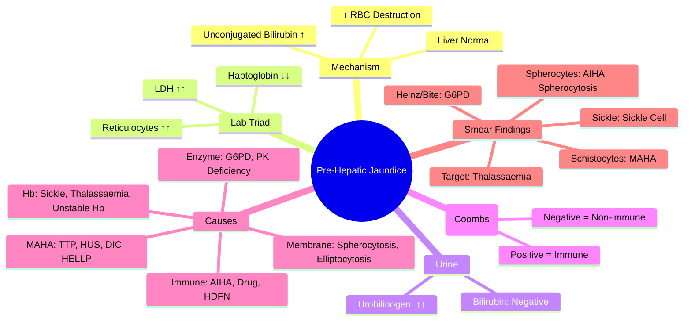

## 1. Learning Objectives
- [ ] Understand bilirubin metabolism and pre-hepatic jaundice mechanism
- [ ] Differentiate haemolytic from hepatic and post-hepatic jaundice
- [ ] Identify causes of haemolysis (immune, membrane, enzyme, haemoglobinopathies)
- [ ] Apply diagnostic workup (reticulocytes, haptoglobin, LDH, DAT, peripheral smear)
- [ ] Identify FCPS/MRCP high-yield associations

---

## 2. Bilirubin Metabolism Overview

```mermaid
flowchart LR
    A[Haemoglobin Breakdown] --> B[Unconjugated Bilirubin]
    B --> C[Albumin Binding → Liver]
    C --> D[Hepatocyte Uptake]
    D --> E[Conjugation (UGT1A1)]
    E --> F[Conjugated Bilirubin → Bile]
    F --> G[Intestine → Urobilinogen/Stercobilin]
    G --> H[Enterohepatic Circulation]
```

| Phase | Normal Process | Pre-Hepatic Jaundice |
|-------|---------------|----------------------|
| **Production** | ~250-350 mg/day | **↑↑ Increased** (haemolysis) |
| **Uptake** | Efficient | Overwhelmed |
| **Conjugation** | Normal UGT1A1 | **Normal** (liver intact) |
| **Excretion** | Normal | Normal |
| **Bilirubin Type** | Conjugated > Unconjugated | **Unconjugated Predominant** |

---

## 3. Pathophysiology

> **Pre-hepatic jaundice** = **Unconjugated hyperbilirubinaemia** due to **increased bilirubin production** exceeding hepatic conjugation capacity.

| Mechanism | Result |
|-----------|--------|
| **Increased RBC destruction** | ↑ Haemoglobin breakdown → ↑ Unconjugated bilirubin |
| **Liver conjugation capacity** | Normal (UGT1A1 intact) |
| **Bilirubin type** | **Predominantly unconjugated** (indirect) |
| **Urine bilirubin** | **Negative** (unconjugated not water-soluble) |
| **Urobilinogen** | **Increased** (more bilirubin reaching gut) |

---

## 4. Causes of Haemolytic Jaundice

### 1. Immune Haemolytic Anaemias
| Type | Mechanism | Key Features |
|------|-----------|--------------|
| **Autoimmune (AIHA)** | Warm IgG (most common), Cold IgM | DAT +ve (IgG, C3d); Spherocytes |
| **Drug-induced** | Hapten/Immune complex/Autoantibody | Penicillin, Cephalosporins, Methyldopa |
| **Alloimmune** | Transfusion reaction, HDFN | ABO/Rh mismatch |
| **PNH** | Complement-mediated (CD55/59 deficiency) | Intravascular haemolysis, Hburia, Thrombosis |

### 2. Membrane Defects (Hereditary)
| Disorder | Inheritance | Key Features |
|----------|-------------|--------------|
| **Hereditary Spherocytosis** | AD (75%) / AR | Spherocytes, ↑ MCHC, **Osmotic Fragility ↑**, Splenomegaly |
| **Hereditary Elliptocytosis** | AD | Elliptocytes, Usually asymptomatic |
| **Stomatocytosis** | AD | Stomatocytes, Pseudohyperkalaemia |

### 3. Enzyme Deficiencies
| Disorder | Inheritance | Key Features |
|----------|-------------|--------------|
| **G6PD Deficiency** | X-linked | Oxidative stress → Heinz bodies, Bite cells; **Malaria protection** |
| **Pyruvate Kinase Deficiency** | AR | Chronic haemolysis, **No Heinz bodies**, ↑ 2,3-DPG |
| **Other** | Rare | HK, GPI, PGK, etc. |

### 4. Haemoglobinopathies
| Disorder | Inheritance | Key Features |
|----------|-------------|--------------|
| **Sickle Cell Disease** | AR (HbSS) | HbS, Vaso-occlusion, **Chronic haemolysis**, Functional asplenia |
| **Thalassaemia Major** | AR | Ineffective erythropoiesis + Haemolysis, Transfusion-dependent |
| **HbC, HbE, Unstable Hb** | Various | Variable severity |

### 5. Microangiopathic (MAHA)
| Disorder | Mechanism | Key Features |
|----------|-----------|--------------|
| **TTP** | ADAMTS13 deficiency | MAHA + Thrombocytopenia + Neuro + Renal + Fever |
| **HUS** | Shiga toxin / Complement | MAHA + Thrombocytopenia + AKI |
| **DIC** | Thrombin generation | MAHA + Thrombocytopenia + Coagulopathy |
| **HELLP** | Pregnancy | MAHA + Elevated LFTs + Low Platelets |
| **Malignant HTN / Preeclampsia** | Vascular injury | MAHA + End-organ damage |

---

## 5. Diagnostic Workup

```mermaid
flowchart TD
    A[Suspect Haemolytic Jaundice] --> B[Initial Labs]
    B --> C[Reticulocyte Count ↑↑]
    B --> D[Haptoglobin ↓↓]
    B --> E[LDH ↑↑]
    B --> F[Unconjugated Bilirubin ↑]
    B --> G[Urine Bilirubin Negative]
    B --> H[Peripheral Smear]
    H --> I{Spherocytes?} --> J[AIHA / Spherocytosis]
    H --> K{Schistocytes?} --> L[MAHA: TTP/HUS/DIC]
    H --> M{Heinz/Bite Cells?} --> N[G6PD / Unstable Hb]
    H --> O{Sickle Cells?} --> P[Sickle Cell]
    H --> Q{Target Cells?} --> R[Thalassaemia / HbC]
    C & D & E & F --> S[Confirm Haemolysis]
    S --> T[Direct Antiglobulin Test (DAT/Coombs)]
    T --> U{DAT +ve?} --> V[Immune: AIHA, Drug, Alloimmune]
    T --> W{DAT -ve?} --> X[Non-Immune: Membrane, Enzyme, Hb, MAHA]
```

---

## 6. Key Lab Findings Summary

| Parameter | Haemolysis | Hepatic Jaundice | Gilbert Syndrome |
|-----------|------------|------------------|------------------|
| **Total Bilirubin** | ↑ (Usually <85 μmol/L) | ↑↑ | ↑ (20-80) |
| **Conjugated** | Normal | ↑ | Normal |
| **Unconjugated** | **↑↑** | ↑ | **↑** |
| **Reticulocytes** | **↑↑↑** | Normal/↓ | Normal |
| **Haptoglobin** | **↓↓↓** | Normal | Normal |
| **LDH** | **↑↑↑** | ↑ | Normal |
| **Urine Bilirubin** | **Negative** | Positive | Negative |
| **Urobilinogen** | **↑↑** | Variable | Normal |
| **DAT (Coombs)** | Variable | Negative | Negative |

---

## 7. FCPS/MRCP High-Yield Summary

| Concept | Key Points |
|---------|------------|
| **Pre-hepatic = Unconjugated** | Liver normal, production ↑ |
| **Urine bilirubin = Negative** | Unconjugated not water-soluble |
| **Urobilinogen = Increased** | More bilirubin to gut |
| **Key Triad** | Retic↑, Haptoglobin↓, LDH↑ |
| **DAT (Coombs)** | +ve = Immune; -ve = Non-immune |
| **Spherocytes** | AIHA, Hereditary Spherocytosis |
| **Schistocytes** | MAHA (TTP, HUS, DIC, HELLP) |
| **Heinz/Bite Cells** | G6PD, Unstable Hb |
| **Sickle Cells** | Sickle Cell Disease |
| **G6PD** | X-linked, Oxidative drugs, Malaria protection |

---

## 8. Viva Questions

1. **Why is urine bilirubin negative in pre-hepatic jaundice?**
2. **What are the three key lab markers of haemolysis?**
3. **Differentiate immune vs non-immune haemolysis.**
4. **What does DAT (Coombs) test detect?**
5. **List causes of MAHA (schistocytes).**
6. **What peripheral smear findings in G6PD deficiency?**
7. **Why is haptoglobin low in haemolysis?**
8. **Differentiate hereditary spherocytosis from AIHA.**
9. **What is the bilirubin level typically in haemolytic jaundice?**
10. **What causes increased urobilinogen in haemolysis?**

---

## 9. Confusions & Mnemonics

| Confusion | Clarification |
|-----------|---------------|
| Pre-hepatic vs Hepatic | Pre: Unconjugated+, Hepatic: Mixed (ALT/AST ↑) |
| Urine bilirubin | Pre-hepatic: **Negative** (unconjugated); Hepatic/Post: **Positive** (conjugated) |
| DAT +ve vs -ve | +ve = Immune (AIHA, drugs); -ve = Non-immune (membrane, enzyme, Hb, MAHA) |
| Schistocytes vs Spherocytes | Schistocytes = Fragmented (MAHA); Spherocytes = Round, dense (AIHA, Spherocytosis) |
| G6PD vs PK Deficiency | G6PD: Heinz bodies, X-linked; PK: No Heinz, AR, ↑ 2,3-DPG |
| Bilirubin in haemolysis | Usually <85 μmol/L (conjugation capacity ~300-400 mg/day) |

---

## 10. Mind Map



---

## 11. One-Page Revision Card

| **Pre-Hepatic Jaundice** | **Details** |
|--------------------------|-------------|
| **Mechanism** | ↑ Haemolysis → ↑ Unconjugated Bilirubin |
| **Bilirubin** | **Unconjugated** predominant |
| **Urine Bilirubin** | **Negative** |
| **Urobilinogen** | **Increased** |
| **Lab Triad** | Retic↑, Haptoglobin↓, LDH↑ |

| **DAT (Coombs)** | **Causes** |
|------------------|------------|
| **Positive** | AIHA, Drug-induced, HDFN, PNH |
| **Negative** | Membrane, Enzyme, Hb, MAHA |

| **Peripheral Smear** | **Diagnosis** |
|---------------------|---------------|
| Spherocytes | AIHA, Hereditary Spherocytosis |
| Schistocytes | TTP, HUS, DIC, HELLP |
| Heinz/Bite Cells | G6PD, Unstable Hb |
| Sickle Cells | Sickle Cell Disease |
| Target Cells | Thalassaemia, HbC |

---

## 12. Spaced Repetition Tracker

| Day | 1 | 3 | 7 | 15 | 30 |
|-----|---|---|---|----|----|
| Mechanism | ☐ | ☐ | ☐ | ☐ | ☐ |
| Lab Triad | ☐ | ☐ | ☐ | ☐ | ☐ |
| Urine findings | ☐ | ☐ | ☐ | ☐ | ☐ |
| DAT interpretation | ☐ | ☐ | ☐ | ☐ | ☐ |
| Smear findings | ☐ | ☐ | ☐ | ☐ | ☐ |

---

## 13. Self-Test Scorecard

| Question | My Answer | Correct? |
|----------|-----------|----------|
| Urine bilirubin in pre-hepatic |  |  |
| Haemolysis triad |  |  |
| DAT +ve causes |  |  |
| Schistocytes = ? |  |  |
| G6PD smear findings |  |  |

---

## 14. Local Navigation

- [[Jaundice and LFT Interpretation/Isolated hyperbilirubinaemia|Isolated Hyperbilirubinaemia]]
- [[Jaundice and LFT Interpretation/Hepatocellular vs Cholestatic Pattern|Hepatocellular vs Cholestatic]]
- [[Inherited and Metabolic Liver Disease/Gilbert Syndrome|Gilbert Syndrome]]
- [[Inherited and Metabolic Liver Disease/Crigler-Najjar Syndrome|Crigler-Najjar]]
- [[Portal Hypertension and Complications/HELLP Syndrome|HELLP]]
---

> Auto-generated study sections for "Jaundice and LFT Interpretation" — Ch 23: Hepatology.

## Flashcards (16 generated)

- Q: What is the definition of Jaundice and LFT Interpretation?
  A: Pre-hepatic jaundice = Unconjugated hyperbilirubinaemia due to increased bilirubin production exceeding hepatic conjugation capacity.
- Q: What is Increased RBC destruction of Jaundice and LFT Interpretation?
  A: ↑ Haemoglobin breakdown → ↑ Unconjugated bilirubin
- Q: What is Liver conjugation capacity of Jaundice and LFT Interpretation?
  A: Normal (UGT1A1 intact)
- Q: How is Jaundice and LFT Interpretation classified?
  A: Predominantly unconjugated (indirect)
- Q: What is Urine bilirubin of Jaundice and LFT Interpretation?
  A: Negative (unconjugated not water-soluble)
- Q: What is Urobilinogen of Jaundice and LFT Interpretation?
  A: Increased (more bilirubin reaching gut)
- Q: What is Pre-hepatic = Unconjugated of Jaundice and LFT Interpretation?
  A: Liver normal, production ↑
- Q: What is Urine bilirubin = Negative of Jaundice and LFT Interpretation?
  A: Unconjugated not water-soluble
- Q: What is Urobilinogen = Increased of Jaundice and LFT Interpretation?
  A: More bilirubin to gut
- Q: What is Key Triad of Jaundice and LFT Interpretation?
  A: Retic↑, Haptoglobin↓, LDH↑
- Q: What is DAT (Coombs) of Jaundice and LFT Interpretation?
  A: +ve = Immune; -ve = Non-immune
- Q: What is Spherocytes of Jaundice and LFT Interpretation?
  A: AIHA, Hereditary Spherocytosis
- Q: What is Schistocytes of Jaundice and LFT Interpretation?
  A: MAHA (TTP, HUS, DIC, HELLP)
- Q: What is Heinz/Bite Cells of Jaundice and LFT Interpretation?
  A: G6PD, Unstable Hb
- Q: What is Sickle Cells of Jaundice and LFT Interpretation?
  A: Sickle Cell Disease
- Q: What is G6PD of Jaundice and LFT Interpretation?
  A: X-linked, Oxidative drugs, Malaria protection

## MCQs (1 generated)

1. **Which of the following best describes Jaundice and LFT Interpretation?**
   A. **Pre-hepatic jaundice = Unconjugated hyperbilirubinaemia due to increased bilirubin production exceeding hepatic conjugation capacity.**
   B. An unrelated condition not matching the clinical picture of Jaundice and LFT Interpretation
   C. A complication seen late in the disease course of Jaundice and LFT Interpretation
   D. A condition that mimics Jaundice and LFT Interpretation but has a different underlying cause

