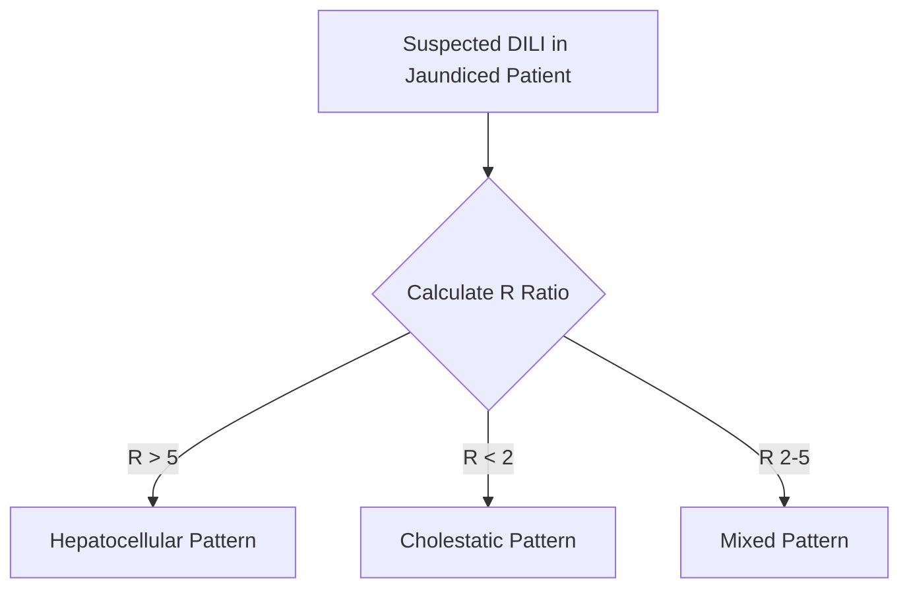
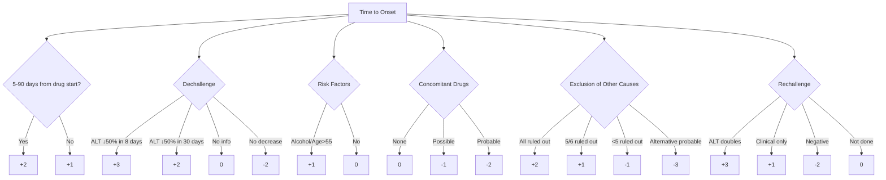
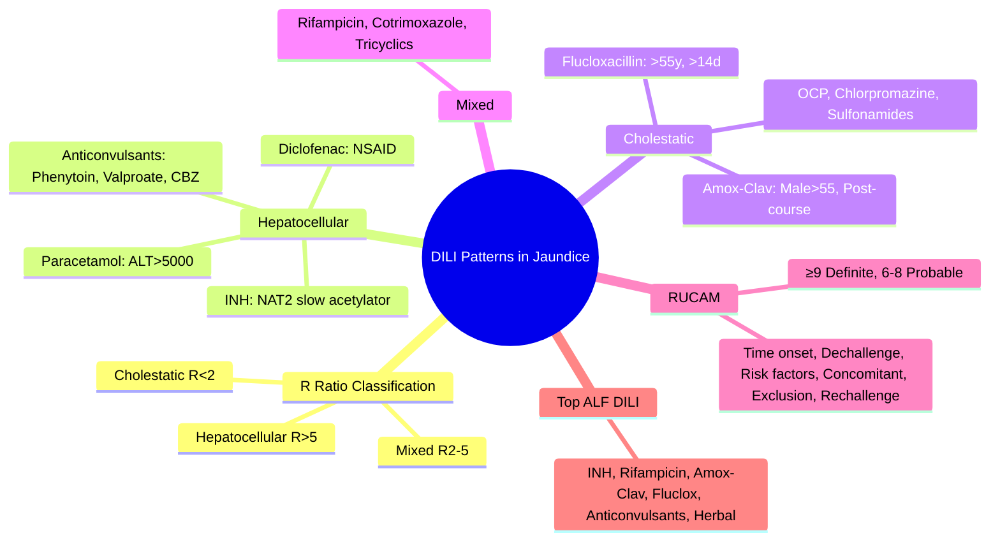

## 1. Learning Objectives
- [ ] Classify DILI patterns (hepatocellular, cholestatic, mixed)
- [ ] Apply RUCAM for causality assessment
- [ ] Identify common culprit drugs by pattern
- [ ] Differentiate DILI from viral, autoimmune, alcoholic, ischaemic
- [ ] Identify FCPS/MRCP high-yield drug associations

---

## 2. DILI Patterns in Jaundice

> **R Ratio** = (ALT/ULN_ALT) ÷ (ALP/ULN_ALP) — **Use ULN-corrected values**

---

## 3. DILI Pattern Classification

| Pattern | R Ratio | ALT/AST | ALP | Common Culprits |
|---------|---------|---------|-----|-----------------|
| **Hepatocellular** | **>5** | **↑↑↑** (often >10×ULN) | Normal/Mild ↑ | Paracetamol, Anti-TB (INH), Phenytoin, Valproate, AIH-mimics |
| **Cholestatic** | **<2** | Normal/Mild ↑ | **↑↑** (>3×ULN) | Amox-Clav, Flucloxacillin, OCP, Chlorpromazine, Sulfonamides |
| **Mixed** | **2-5** | ↑↑ | ↑↑ | Anti-TB (Rifampicin), Flucloxacillin, Cotrimoxazole, Tricyclics |

> **FCPS/MRCP**: **Paracetamol = Hepatocellular (ALT>5000)**; **Amox-Clav = Cholestatic (Male>55); Flucloxacillin = Cholestatic (>55, >14d)**

---

## 4. Hepatocellular Pattern DILI

| Drug | Pattern | Latency | Key Features |
|------|---------|---------|--------------|
| **Paracetamol** | Hepatocellular | Hours-Days | **ALT >5000**, Centrilobular necrosis, NAC |
| **Isoniazid** | Hepatocellular | 2-12 weeks | Most common DILI-ALF in TB areas; NAT2 slow acetylators |
| **Phenytoin/Carbamazepine** | Hepatocellular | 2-8 weeks | Aromatic anticonvulsants; HLA association |
| **Valproate** | Hepatocellular | 2-8 weeks | Children <3y, Polytherapy, **POLG mutation (Alpers)** |
| **Diclofenac** | Hepatocellular/Mixed | 1-4 weeks | Higher risk than other NSAIDs |
| **Herbal (Green tea, Kava)** | Variable | Variable | Ask specifically — patients don't volunteer |

---

## 5. Cholestatic Pattern DILI

| Drug | Pattern | Latency | Key Features |
|------|---------|---------|--------------|
| **Amoxicillin-Clavulanate** | **Cholestatic** | 1-6 weeks | **Male >55y**, Can occur **after stopping**, Prolonged |
| **Flucloxacillin** | Cholestatic | 2-4 weeks | **>55y, Male, >14 days use** |
| **OCP** | Cholestatic | Months | Women, Reversible on stopping |
| **Chlorpromazine** | Cholestatic | 2-4 weeks | Fever, Eosinophilia, Rash |
| **Sulfonamides** | Cholestatic/Mixed | 1-3 weeks | Hypersensitivity features |

---

## 6. Mixed Pattern DILI

| Drug | Pattern | Key Features |
|------|---------|--------------|
| **Rifampicin** | Cholestatic-Mixed | With INH often; Orange secretions |
| **Cotrimoxazole** | Mixed | HIV patients, Hypersensitivity |
| **Allopurinol** | Hypersensitivity/Mixed | **DRESS**: Rash, Eosinophilia, Fever, Renal |

---

## 7. RUCAM (Causality Assessment)

### RUCAM Score Interpretation

| Score | Causality |
|-------|-----------|
| **≥9** | Highly Probable |
| **6-8** | Probable |
| **3-5** | Possible |
| **1-2** | Unlikely |
| **≤0** | Excluded |

---

## 8. Top DILI Causing ALF (Non-Paracetamol)

| Drug | Frequency | Key Association |
|------|-----------|-----------------|
| **Anti-TB (Isoniazid)** | High in TB endemic | NAT2 slow acetylator |
| **Anti-TB (Rifampicin)** | Often with INH | Cholestatic, Orange fluids |
| **Amoxicillin-Clavulanate** | Commonest antibiotic DILI-ALF in West | Male >55y, Post-course |
| **Flucloxacillin** | Cholestatic ALF | >55y, Male, >14d |
| **Anticonvulsants** | Phenytoin, Valproate, Carbamazepine | HLA associations |
| **NSAIDs (Diclofenac)** | Hepatocellular | Higher risk than other NSAIDs |
| **Herbal/Alternative** | Variable | Green tea, Kava, Ayurvedic |
| **ICI (Ipilimumab)** | Hepatocellular | Colitis co-exists, Anti-CTLA4>PD1 |

---

## 9. FCPS/MRCP High-Yield Summary

| Concept | Key Points |
|---------|------------|
| **Hepatocellular** | R>5, ALT↑↑↑ — Paracetamol, INH, Anticonvulsants |
| **Cholestatic** | R<2, ALP↑↑ — Amox-Clav, Flucloxacillin, OCP, Chlorpromazine |
| **Mixed** | R 2-5 — Rifampicin, Cotrimoxazole, Tricyclics |
| **Paracetamol** | ALT >5000, NAC within 8h |
| **Amox-Clav** | Cholestatic, Male >55, Post-course onset |
| **Flucloxacillin** | Cholestatic, >55y, >14d use |
| **RUCAM** | ≥9 Definite, 6-8 Probable, 3-5 Possible |
| **Latency** | Paracetamol: hours; Others: weeks-months |

---

## 10. Viva Questions

1. **Classify DILI patterns with R ratio thresholds.**
2. **Which drug causes hepatocellular DILI with ALT >5000?**
3. **Describe Amoxicillin-Clavulanate DILI: demographic, pattern, latency.**
4. **What is RUCAM? Key components?**
5. **Differentiate DILI from AIH in jaundiced patient.**
6. **List 3 drugs causing cholestatic DILI.**
7. **What is the latency for Amox-Clav vs Flucloxacillin DILI?**
8. **Which anti-TB drug causes hepatocellular vs cholestatic DILI?**
9. **How can herbal DILI be identified?**
10. **What is DRESS syndrome and which drugs cause it?**

---

## 11. Confusions & Mnemonics

| Confusion | Clarification |
|-----------|---------------|
| DILI vs AIH | AIH: IgG↑, AutoAbs+, Responds to steroids; DILI: Temporal drug relation, RUCAM, No AutoAbs |
| DILI vs Viral | Viral: Serology+, No drug temporal relation; DILI: Drug temporal relation |
| Amox-Clav vs Flucloxacillin | Both cholestatic; Amox-Clav: Male>55, Post-course; Fluclox: >55, >14d use |
| INH vs Rifampicin | INH = Hepatocellular; Rifampicin = Cholestatic |
| RUCAM scoring | Time onset, Dechallenge, Risk factors, Concomitant drugs, Exclusion, Rechallenge |
| Paracetamol vs Other DILI | Paracetamol: ALT>5000, NAC urgent; Others: Variable ALT, Stop drug first |

---

## 12. Mind Map

---

## 13. One-Page Revision Card

| **Pattern** | **R Ratio** | **Typical Drugs** | **Key Feature** |
|-------------|-------------|-------------------|-----------------|
| **Hepatocellular** | >5 | Paracetamol, INH, Phenytoin, Valproate | ALT↑↑↑ |
| **Cholestatic** | <2 | **Amox-Clav, Flucloxacillin, OCP, Chlorpromazine** | ALP↑↑ |
| **Mixed** | 2-5 | Rifampicin, Cotrimoxazole, Tricyclics | Both ↑ |

| **Drug** | **Pattern** | **Key Feature** |
|----------|-------------|-----------------|
| Paracetamol | Hepatocellular | ALT>5000, NAC |
| INH | Hepatocellular | NAT2 slow acetylator |
| Amox-Clav | Cholestatic | Male>55, Post-course |
| Flucloxacillin | Cholestatic | >55y, >14d use |
| Rifampicin | Mixed | Orange fluids, With INH |

| **RUCAM** | **Score** |
|-----------|-----------|
| Definite | ≥9 |
| Probable | 6-8 |
| Possible | 3-5 |
| Unlikely | 1-2 |

---

## 14. Spaced Repetition Tracker

| Day | 1 | 3 | 7 | 15 | 30 |
|-----|---|---|---|----|----|
| R Ratio thresholds | ☐ | ☐ | ☐ | ☐ | ☐ |
| Pattern drug associations | ☐ | ☐ | ☐ | ☐ | ☐ |
| RUCAM components | ☐ | ☐ | ☐ | ☐ | ☐ |
| Amox-Clav vs Fluclox | ☐ | ☐ | ☐ | ☐ | ☐ |
| DILI vs AIH | ☐ | ☐ | ☐ | ☐ | ☐ |

---

## 15. Self-Test Scorecard

| Question | My Answer | Correct? |
|----------|-----------|----------|
| R ratio thresholds |  |  |
| Hepatocellular drugs (3) |  |  |
| Cholestatic drugs (3) |  |  |
| RUCAM ≥9 = ? |  |  |
| Amox-Clav vs Fluclox |  |  |

---

## 16. Local Navigation

- [[Drug-Induced Liver Injury/Classification and patterns|DILI Classification]]
- [[Drug-Induced Liver Injury/Common culprit drugs|DILI Culprit Drugs]]
- [[Acute Liver Failure/Non-paracetamol drug-induced liver injury|Non-PCM DILI ALF]]
- [[Jaundice and LFT Interpretation/Hepatocellular vs Cholestatic Pattern|LFT Patterns]]
- [[Acute Liver Failure/Paracetamol-induced hepatotoxicity|Paracetamol ALF]]
---

> Auto-generated study sections for "Jaundice and LFT Interpretation" — Ch 23: Hepatology.

## Flashcards (9 generated)

- Q: What is the definition of Jaundice and LFT Interpretation?
  A: | Pattern | R Ratio | ALT/AST | ALP | Common Culprits |
- Q: What is Hepatocellular of Jaundice and LFT Interpretation?
  A: R>5, ALT↑↑↑ — Paracetamol, INH, Anticonvulsants
- Q: What is Cholestatic of Jaundice and LFT Interpretation?
  A: R<2, ALP↑↑ — Amox-Clav, Flucloxacillin, OCP, Chlorpromazine
- Q: What is Mixed of Jaundice and LFT Interpretation?
  A: R 2-5 — Rifampicin, Cotrimoxazole, Tricyclics
- Q: What is Paracetamol of Jaundice and LFT Interpretation?
  A: ALT >5000, NAC within 8h
- Q: What is Amox-Clav of Jaundice and LFT Interpretation?
  A: Cholestatic, Male >55, Post-course onset
- Q: What is Flucloxacillin of Jaundice and LFT Interpretation?
  A: Cholestatic, >55y, >14d use
- Q: What is RUCAM of Jaundice and LFT Interpretation?
  A: ≥9 Definite, 6-8 Probable, 3-5 Possible
- Q: What is Latency of Jaundice and LFT Interpretation?
  A: Paracetamol: hours; Others: weeks-months

## MCQs (1 generated)

1. **Which of the following best describes Jaundice and LFT Interpretation?**
   A. **| Pattern | R Ratio | ALT/AST | ALP | Common Culprits |**
   B. An unrelated condition not matching the clinical picture of Jaundice and LFT Interpretation
   C. A complication seen late in the disease course of Jaundice and LFT Interpretation
   D. A condition that mimics Jaundice and LFT Interpretation but has a different underlying cause

## SBA Questions (1 generated)

1. A patient with suspected Jaundice and LFT Interpretation presents with: Pattern — R Ratio; FCPS/MRCP: Paracetamol = Hepatocellular (ALT>5000); Amox-Clav = Cholestatic (Male>55); Flucloxacillin = Cholestatic (>55, >14d). What is the most likely diagnosis?
   A. **Jaundice and LFT Interpretation**
   B. A condition that mimics Jaundice and LFT Interpretation but is not the same entity
   C. A complication of Jaundice and LFT Interpretation rather than the primary diagnosis
   D. An unrelated condition in the same clinical category as Jaundice and LFT Interpretation

