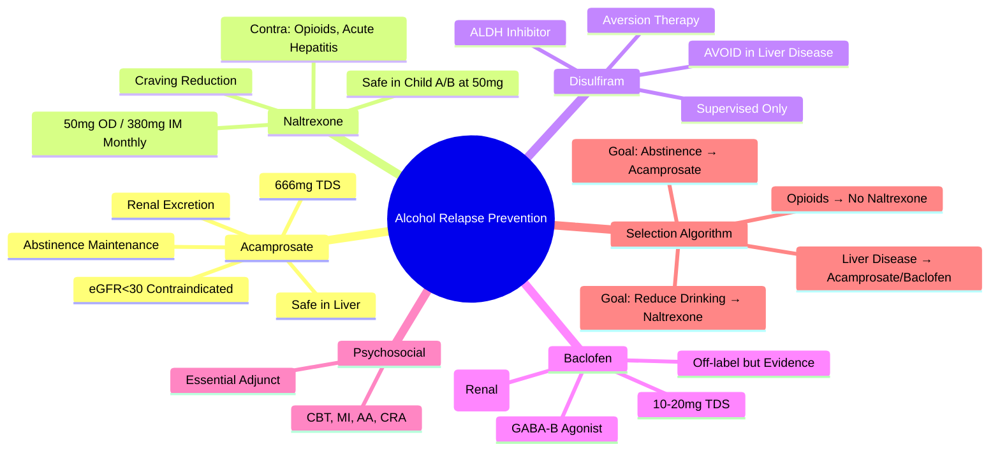

## 1. Learning Objectives
- [ ] Apply pharmacological agents for relapse prevention (Acamprosate, Naltrexone, Disulfiram, Baclofen)
- [ ] Select agent based on patient factors (liver disease severity, comorbidities, adherence)
- [ ] Integrate psychosocial interventions (CBT, Motivational Interviewing, AA)
- [ ] Monitor treatment response and manage side effects
- [ ] Identify FCPS/MRCP high-yield prescribing knowledge

---

## 2. Pharmacological Agents for Relapse Prevention

### 1. Acamprosate (First-Line for Abstinence Maintenance)

| Parameter | Detail |
|-----------|--------|
| **Mechanism** | Modulates NMDA/Glutamate + GABA receptors → Reduces post-acute withdrawal craving |
| **Dose** | **666 mg TDS** (1998 mg/day); Renal adjustment: eGFR 30-50 → 333 mg TDS; eGFR <30 → Contraindicated |
| **Indication** | **Maintain abstinence** in already detoxified patients |
| **Onset** | 5-7 days to full effect |
| **Duration** | **6-12 months** (evidence-based); Can continue longer |
| **Key Advantage** | **Safe in Liver Disease** (not hepatically metabolised) |
| **Contraindication** | Severe Renal Impairment (eGFR <30) |
| **Side Effects** | Diarrhoea (common, transient), Nausea, Pruritus |

### 2. Naltrexone (First-Line for Craving Reduction / Heavy Drinking Reduction)

| Parameter | Detail |
|-----------|--------|
| **Mechanism** | **Opioid Antagonist** (Mu receptor) → Blocks alcohol-induced endorphin reward |
| **Dose** | **50 mg OD** (oral); **380 mg IM monthly** (Vivitrol®) |
| **Indication** | **Reduce heavy drinking** / Prevent relapse; Can start while drinking |
| **Liver Safety** | **Hepatotoxic at HIGH doses (>300mg/day)**; **Safe at 50mg/day** in stable cirrhosis (Child A/B) |
| **Contraindications** | Acute Hepatitis, Liver Failure, Opioid Use (precipitates withdrawal), Pregnancy |
| **Side Effects** | Nausea (10%), Headache, Fatigue, Hepatotoxicity (rare at 50mg) |

### 3. Disulfiram (Aversion Therapy)

| Parameter | Detail |
|-----------|--------|
| **Mechanism** | **Aldehyde Dehydrogenase Inhibitor** → Acetaldehyde Accumulation → Flushing, Nausea, Palpitations, Hypotension |
| **Dose** | **200 mg OD** (start after 12-24h abstinence); Maintenance 200mg OD |
| **Indication** | **Highly motivated patients** with supervised administration |
| **Liver Safety** | **Hepatotoxic** (rare but serious); **Avoid in Significant Liver Disease** |
| **Contraindications** | **Severe Liver Disease**, Cardiovascular Disease, Psychosis, Pregnancy, Concurrent Alcohol |
| **Reaction Onset** | 10-30 min post-alcohol; Lasts 30-60 min |
| **Monitoring** | LFTs Baseline, 2w, Monthly ×3, Then 3-monthly |

### 4. Baclofen (GABA-B Agonist — Emerging/Off-Label)

| Parameter | Detail |
|-----------|--------|
| **Mechanism** | **GABA-B Receptor Agonist** → Reduces Dopamine Release in Reward Pathway |
| **Dose** | **10-20 mg TDS** (titrate from 5mg TDS); Max 30mg TDS |
| **Advantage** | **Safe in Cirrhosis** (Renal Excretion); Reduces Craving + Anxiety |
| **Evidence** | RCTs show benefit in Cirrhotic Alcohol Use Disorder |
| **Contraindications** | Epilepsy, Renal Impairment (dose adjust), Psychosis |
| **Side Effects** | Sedation, Dizziness, Weakness, Confusion (elderly) |

---

## 3. Comparison Table

| Agent | Best For | Liver Safety | Key Contraindication | Adherence |
|-------|----------|--------------|---------------------|-----------|
| **Acamprosate** | **Abstinence Maintenance** | **SAFE** (Renal excretion) | eGFR <30 | TDS dosing (adherence challenge) |
| **Naltrexone** | **Craving / Heavy Drinking** | **Safe at 50mg** (Child A/B) | Opioid Use, Acute Hepatitis | OD (oral) / Monthly (IM) |
| **Disulfiram** | **Motivated, Supervised** | **AVOID in Liver Disease** | CVD, Psychosis, Liver Disease | OD (but requires supervision) |
| **Baclofen** | **Cirrhosis + AUD** | **SAFE** (Renal excretion) | Epilepsy, Renal Impairment | TDS |

---

## 4. Psychosocial Interventions (Essential Adjunct)

| Intervention | Evidence | Key Components |
|--------------|----------|----------------|
| **Cognitive Behavioural Therapy (CBT)** | Strong | Coping skills, Trigger identification, Relapse prevention planning |
| **Motivational Interviewing (MI)** | Strong | Enhance intrinsic motivation, Resolve ambivalence |
| **Twelve-Step Facilitation (AA/NA)** | Moderate | Peer support, Spiritual framework, Sponsor |
| **Community Reinforcement Approach (CRA)** | Moderate | Environmental restructuring, Non-drinking rewards |
| **Brief Interventions** | Mild AUD | FRAMES: Feedback, Responsibility, Advice, Menu, Empathy, Self-efficacy |

> **FCPS/MRCP**: **Pharmacotherapy + Psychosocial = Best Outcomes** — Never prescribe medications alone

---

## 5. Algorithm for Agent Selection

```mermaid
flowchart TD
    A[Patient with AUD, Detoxified] --> B{Goal}
    B -->|Maintain Abstinence| C[Acamprosate 1st Line]
    B -->|Reduce Heavy Drinking / Craving| D[Naltrexone 1st Line]
    C --> E{Liver Disease?}
    D --> E
    E -->|Significant Liver Disease (Child B/C)| F[Acamprosate Preferred / Baclofen]
    E -->|Mild/No Liver Disease| G[Acamprosate or Naltrexone]
    E -->|Opioid Use| H[Naltrexone Contraindicated → Acamprosate/Baclofen]
    F --> I[Add Psychosocial: CBT/MI/AA]
    G --> I
    H --> I
```

---

## 6. Management in Special Populations

### Liver Cirrhosis (Child-Pugh A/B)
- **First-Line**: **Acamprosate** (safe, renal excretion)
- **Alternative**: **Baclofen** (renal excretion, reduces craving/anxiety)
- **Naltrexone**: Use with caution (50mg OD); Monitor LFTs monthly
- **Disulfiram**: **Contraindicated** in significant liver disease

### Opioid Use Disorder (Concurrent)
- **Naltrexone**: **CONTRAINDICATED** (precipitates withdrawal)
- **First-Line**: **Acamprosate** or **Baclofen**

### Pregnancy
- **All Pharmacotherapies**: **Contraindicated** (Category C/D)
- **Management**: Psychosocial only (CBT, MI, Counselling)

### Renal Impairment
- **Acamprosate**: eGFR 30-50 → 333mg TDS; eGFR <30 → Contraindicated
- **Naltrexone**: Safe (hepatic metabolism)
- **Baclofen**: Dose reduce (eGFR <30 → 5mg TDS)

---

## 7. Monitoring & Duration

| Agent | Monitoring | Duration |
|-------|------------|----------|
| **Acamprosate** | Renal Function (eGFR) | 6-12 months (continue if benefit) |
| **Naltrexone** | LFTs Monthly ×3, then 3-monthly | 6-12 months |
| **Disulfiram** | LFTs Baseline, 2w, Monthly ×3, Then 3-monthly | 6-12 months (while motivated) |
| **Baclofen** | Renal Function, Sedation | 6-12 months |

---

## 8. FCPS/MRCP High-Yield Summary

| Concept | Key Points |
|---------|------------|
| **Acamprosate** | 1st line for **abstinence maintenance**; **Safe in Liver Disease**; Renal excretion; Dose 666mg TDS |
| **Naltrexone** | 1st line for **craving/heavy drinking**; **50mg OD safe in Child A/B**; Contraindicated with Opioids |
| **Disulfiram** | **Avoid in Liver Disease**; Hepatotoxic; Supervised only |
| **Baclofen** | **Safe in Cirrhosis** (renal); Off-label; Emerging evidence |
| **Psychosocial** | **CBT, MI, AA** — Essential adjunct to pharmacotherapy |
| **Liver Disease** | Acamprosate > Baclofen > Naltrexone (caution) > Disulfiram (avoid) |
| **Opioid Use** | Naltrexone Contraindicated → Acamprosate/Baclofen |

---

## 9. Viva Questions

1. **Compare Acamprosate, Naltrexone, Disulfiram, Baclofen for relapse prevention.**
2. **Which agent is safe in cirrhosis? Which is contraindicated?**
3. **What is the mechanism of Naltrexone? Disulfiram?**
4. **How do you manage AUD in a patient on Opioid Substitution Therapy?**
5. **What is the dose of Acamprosate? Renal adjustment?**
6. **What are the psychosocial interventions for AUD?**
7. **How do you monitor Disulfiram?**
8. **When do you use Baclofen?**
9. **Compare oral vs IM Naltrexone.**
10. **What is the duration of pharmacological treatment?**

---

## 10. Confusions & Mnemonics

| Confusion | Clarification |
|-----------|---------------|
| Acamprosate vs Naltrexone | Acamprosate = **Abstinence maintenance** (already detoxed); Naltrexone = **Craving reduction** (can start while drinking) |
| Disulfiram in Liver Disease | **Contraindicated** — Hepatotoxic; Only in mild disease with strict supervision |
| Naltrexone + Opioids | **Contraindicated** — Precipitates severe withdrawal |
| Baclofen in Cirrhosis | **Safe** (Renal excretion); Reduces craving + Anxiety; Off-label but evidence-based |
| Acamprosate Renal | eGFR <30 = Contraindicated; 30-50 = 333mg TDS |
| Psychosocial Alone | **Insufficient for Moderate-Severe AUD** — Combine with Pharmacotherapy |
| Duration | **Minimum 6 months** — Longer if benefit; Relapse risk highest first year |

---

## 11. Mind Map



---

## 12. One-Page Revision Card

| **Agent** | **Indication** | **Dose** | **Liver Safety** | **Key Contraindication** |
|-----------|----------------|----------|------------------|--------------------------|
| **Acamprosate** | Abstinence Maintenance | 666mg TDS | **SAFE** | eGFR <30 |
| **Naltrexone** | Craving / Heavy Drinking | 50mg OD / 380mg IM Monthly | **Safe at 50mg** (Child A/B) | Opioids, Acute Hepatitis |
| **Disulfiram** | Motivated + Supervised | 200mg OD | **AVOID in Liver Disease** | CVD, Psychosis, Liver Disease |
| **Baclofen** | Cirrhosis + AUD | 10-20mg TDS | **SAFE (Renal)** | Epilepsy, Renal Impairment |

| **Selection** | **First-Line** |
|---------------|----------------|
| Goal: Abstinence | **Acamprosate** |
| Goal: Reduce Drinking | **Naltrexone** |
| Cirrhosis | **Acamprosate / Baclofen** |
| Opioid Use | **Acamprosate / Baclofen** |

| **Psychosocial (Essential)** | |
|------------------------------|--|
| CBT, MI, AA, CRA | Combine with ALL Pharmacotherapy |

---

## 13. Spaced Repetition Tracker

| Day | 1 | 3 | 7 | 15 | 30 |
|-----|---|---|---|----|----|
| Agent Comparison Table | ☐ | ☐ | ☐ | ☐ | ☐ |
| Liver Safety Ranking | ☐ | ☐ | ☐ | ☐ | ☐ |
| Acamprosate Dose/Renal | ☐ | ☐ | ☐ | ☐ | ☐ |
| Naltrexone Opioid Contra | ☐ | ☐ | ☐ | ☐ | ☐ |
| Baclofen in Cirrhosis | ☐ | ☐ | ☐ | ☐ | ☐ |

---

## 14. Self-Test Scorecard

| Question | My Answer | Correct? |
|----------|-----------|----------|
| Safe in Cirrhosis agents |  |  |
| Acamprosate vs Naltrexone indication |  |  |
| Naltrexone + Opioids |  |  |
| Disulfiram liver safety |  |  |
| Baclofen dose/route |  |  |

---

## 15. Local Navigation

- [[Alcoholic Liver Disease/Alcoholic Liver Disease|Alcoholic Liver Disease]]
- [[Alcoholic Liver Disease/Corticosteroid therapy (prednisolone)|Corticosteroid Therapy]]
- [[Alcoholic Liver Disease/Abstinence and nutritional support|Abstinence & Nutrition]]
- [[Alcoholic Liver Disease/Alcoholic hepatitis scoring (Maddrey DF, Glasgow, ABIC, Lille)|Scoring Systems]]
---

> Auto-generated study sections for "Alcoholic Liver Disease" — Ch 23: Hepatology.

## Flashcards (53 generated)

- Q: What is the definition of Alcoholic Liver Disease?
  A: | Agent | Best For | Liver Safety | Key Contraindication | Adherence |
- Q: What is the mechanism of Alcoholic Liver Disease?
  A: Modulates NMDA/Glutamate + GABA receptors → Reduces post-acute withdrawal craving
- Q: What is the dose of Alcoholic Liver Disease?
  A: 666 mg TDS (1998 mg/day); Renal adjustment: eGFR 30-50 → 333 mg TDS; eGFR <30 → Contraindicated
- Q: What is Alcoholic Liver Disease indicated for?
  A: Maintain abstinence in already detoxified patients
- Q: What is Onset of Alcoholic Liver Disease?
  A: 5-7 days to full effect
- Q: What is Duration of Alcoholic Liver Disease?
  A: 6-12 months (evidence-based); Can continue longer
- Q: What is Key Advantage of Alcoholic Liver Disease?
  A: Safe in Liver Disease (not hepatically metabolised)
- Q: What are the side effects of Alcoholic Liver Disease?
  A: Diarrhoea (common, transient), Nausea, Pruritus
- Q: What is the mechanism of Alcoholic Liver Disease?
  A: Opioid Antagonist (Mu receptor) → Blocks alcohol-induced endorphin reward
- Q: What is the dose of Alcoholic Liver Disease?
  A: 50 mg OD (oral); 380 mg IM monthly (Vivitrol®)
- Q: What is Alcoholic Liver Disease indicated for?
  A: Reduce heavy drinking / Prevent relapse; Can start while drinking
- Q: What is Liver Safety of Alcoholic Liver Disease?
  A: Hepatotoxic at HIGH doses (>300mg/day); Safe at 50mg/day in stable cirrhosis (Child A/B)
- Q: What are the side effects of Alcoholic Liver Disease?
  A: Nausea (10%), Headache, Fatigue, Hepatotoxicity (rare at 50mg)
- Q: What is the mechanism of Alcoholic Liver Disease?
  A: Aldehyde Dehydrogenase Inhibitor → Acetaldehyde Accumulation → Flushing, Nausea, Palpitations, Hypotension
- Q: What is the dose of Alcoholic Liver Disease?
  A: 200 mg OD (start after 12-24h abstinence); Maintenance 200mg OD
- Q: What is Alcoholic Liver Disease indicated for?
  A: Highly motivated patients with supervised administration
- Q: What is Liver Safety of Alcoholic Liver Disease?
  A: Hepatotoxic (rare but serious); Avoid in Significant Liver Disease
- Q: What is Reaction Onset of Alcoholic Liver Disease?
  A: 10-30 min post-alcohol; Lasts 30-60 min
- Q: How is Alcoholic Liver Disease monitored?
  A: LFTs Baseline, 2w, Monthly ×3, Then 3-monthly
- Q: What is the mechanism of Alcoholic Liver Disease?
  A: GABA-B Receptor Agonist → Reduces Dopamine Release in Reward Pathway
- Q: What is the dose of Alcoholic Liver Disease?
  A: 10-20 mg TDS (titrate from 5mg TDS); Max 30mg TDS
- Q: What is Advantage of Alcoholic Liver Disease?
  A: Safe in Cirrhosis (Renal Excretion); Reduces Craving + Anxiety
- Q: What is Evidence of Alcoholic Liver Disease?
  A: RCTs show benefit in Cirrhotic Alcohol Use Disorder
- Q: What is Alcoholic Liver Disease indicated for?
  A: Epilepsy, Renal Impairment (dose adjust), Psychosis
- Q: What are the side effects of Alcoholic Liver Disease?
  A: Sedation, Dizziness, Weakness, Confusion (elderly)
- Q: What is the mechanism of Alcoholic Liver Disease?
  A: Modulates NMDA/Glutamate + GABA receptors → Reduces post-acute withdrawal craving
- Q: What is the dose of Alcoholic Liver Disease?
  A: 666 mg TDS (1998 mg/day); Renal adjustment: eGFR 30-50 → 333 mg TDS; eGFR <30 → Contraindicated
- Q: What is Alcoholic Liver Disease indicated for?
  A: Maintain abstinence in already detoxified patients
- Q: What is Onset of Alcoholic Liver Disease?
  A: 5-7 days to full effect
- Q: What is Duration of Alcoholic Liver Disease?
  A: 6-12 months (evidence-based); Can continue longer
- Q: What is Key Advantage of Alcoholic Liver Disease?
  A: Safe in Liver Disease (not hepatically metabolised)
- Q: What is the mechanism of Alcoholic Liver Disease?
  A: Opioid Antagonist (Mu receptor) → Blocks alcohol-induced endorphin reward
- Q: What is the dose of Alcoholic Liver Disease?
  A: 50 mg OD (oral); 380 mg IM monthly (Vivitrol®)
- Q: What is Alcoholic Liver Disease indicated for?
  A: Reduce heavy drinking / Prevent relapse; Can start while drinking
- Q: What is Liver Safety of Alcoholic Liver Disease?
  A: Hepatotoxic at HIGH doses (>300mg/day); Safe at 50mg/day in stable cirrhosis (Child A/B)
- Q: What is the mechanism of Alcoholic Liver Disease?
  A: Aldehyde Dehydrogenase Inhibitor → Acetaldehyde Accumulation → Flushing, Nausea, Palpitations, Hypotension
- Q: What is the dose of Alcoholic Liver Disease?
  A: 200 mg OD (start after 12-24h abstinence); Maintenance 200mg OD
- Q: What is Alcoholic Liver Disease indicated for?
  A: Highly motivated patients with supervised administration
- Q: What is Liver Safety of Alcoholic Liver Disease?
  A: Hepatotoxic (rare but serious); Avoid in Significant Liver Disease
- Q: What is Reaction Onset of Alcoholic Liver Disease?
  A: 10-30 min post-alcohol; Lasts 30-60 min
- Q: What is the mechanism of Alcoholic Liver Disease?
  A: GABA-B Receptor Agonist → Reduces Dopamine Release in Reward Pathway
- Q: What is the dose of Alcoholic Liver Disease?
  A: 10-20 mg TDS (titrate from 5mg TDS); Max 30mg TDS
- Q: What is Advantage of Alcoholic Liver Disease?
  A: Safe in Cirrhosis (Renal Excretion); Reduces Craving + Anxiety
- Q: What is Evidence of Alcoholic Liver Disease?
  A: RCTs show benefit in Cirrhotic Alcohol Use Disorder
- Q: What is Alcoholic Liver Disease indicated for?
  A: Epilepsy, Renal Impairment (dose adjust), Psychosis
- Q: What are the side effects of Alcoholic Liver Disease?
  A: Sedation, Dizziness, Weakness, Confusion (elderly)
- Q: What is Acamprosate of Alcoholic Liver Disease?
  A: 1st line for abstinence maintenance; Safe in Liver Disease; Renal excretion; Dose 666mg TDS
- Q: What is Naltrexone of Alcoholic Liver Disease?
  A: 1st line for craving/heavy drinking; 50mg OD safe in Child A/B; Contraindicated with Opioids
- Q: What is Disulfiram of Alcoholic Liver Disease?
  A: Avoid in Liver Disease; Hepatotoxic; Supervised only
- Q: What is Baclofen of Alcoholic Liver Disease?
  A: Safe in Cirrhosis (renal); Off-label; Emerging evidence
- Q: What is Psychosocial of Alcoholic Liver Disease?
  A: CBT, MI, AA — Essential adjunct to pharmacotherapy
- Q: What is Liver Disease of Alcoholic Liver Disease?
  A: Acamprosate > Baclofen > Naltrexone (caution) > Disulfiram (avoid)
- Q: What is Opioid Use of Alcoholic Liver Disease?
  A: Naltrexone Contraindicated → Acamprosate/Baclofen

## MCQs (1 generated)

1. **Which of the following best describes Alcoholic Liver Disease?**
   A. **| Agent | Best For | Liver Safety | Key Contraindication | Adherence |**
   B. An unrelated condition not matching the clinical picture of Alcoholic Liver Disease
   C. A complication seen late in the disease course of Alcoholic Liver Disease
   D. A condition that mimics Alcoholic Liver Disease but has a different underlying cause

## PasTest Scenario SBAs (Clinical Vignettes)

> **Auto-generated PasTest/Mediscope-style scenario SBAs** grounded in the authored source. Each scenario tests a real clinical fact (triad, specific sign, contraindication, trial, first-line Rx) extracted from the topic. *Source: Ch 23: Hepatology — Alcohol relapse prevention*

**Q1.** What is the most appropriate first-line therapy for Alcohol relapse prevention?

  - **A.** Naltrexone
  - **B.** An advanced/surgical therapy reserved for refractory disease
  - **C.** Symptomatic treatment only, no disease-modifying therapy
  - **D.** Empiric broad-spectrum therapy without specific indication

  > **Answer: A** — Naltrexone
  >
  > *Source:* **Naltrexone**: Use with caution (50mg OD); Monitor LFTs monthly

