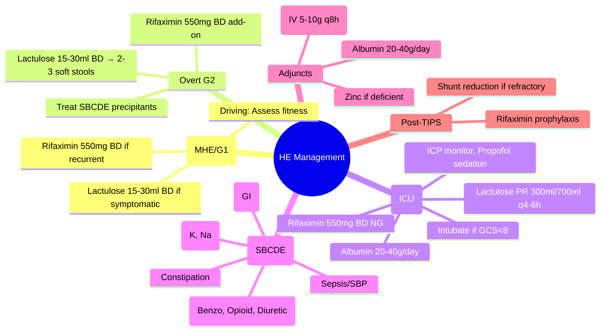

## 1. Learning Objectives
- [ ] Apply stepwise management of HE (Covert and Overt)
- [ ] Prescribe lactulose and rifaximin correctly
- [ ] Use L-ornithine L-aspartate (LOLA) and other adjuncts
- [ ] Manage HE in acute liver failure and post-TIPS
- [ ] Identify FCPS/MRCP high-yield management decisions

---

## 2. Management Overview

```mermaid
flowchart TD
    A[Diagnose HE Grade] --> B{Covert (MHE/G1) or Overt (G2-4)?}
    B -->|Covert| C[Lactulose if symptomatic/impairs driving]
    B -->|Overt G2| D[Lactulose 15-30ml BD PO/PR]
    B -->|Overt G3-4| E[ICU Admission]
    E --> F[Airway Protection: Intubate GCS<8]
    E --> G[Lactulose PR 300ml/700ml q4-6h]
    E --> H[Rifaximin 550mg BD NG/PO]
    E --> I[Albumin 20-40g/day if Cirrhosis + AKI/HE]
    E --> J[Treat Precipitants Aggressively]
```

---

## 3. Lactulose: First-Line Therapy

### Dosing & Titration

| Route | Dose | Target | Monitoring |
|-------|------|--------|------------|
| **Oral** | 15-30 ml BD (10-20g) | **2-3 soft stools/day** | Stool frequency, consistency |
| **Rectal (Grade 3-4)** | 300 ml in 700 ml water/NS q4-6h | Retain 30-60 min | Stool output, electrolytes |

### Mechanism of Action
- **Acidifies colon** → NH₄⁺ trapped as NH₄⁺ → ↓ absorption
- **Laxation** → ↓ transit time → ↓ bacterial ammonia production
- **Prebiotic effect** → ↑ Lactobacilli/Bifidobacteria (non-ammonia producers)

### Titration Protocol
| Step | Action |
|------|--------|
| **Start** | 15-30 ml BD PO (or 300ml PR q4-6h if Grade 3-4) |
| **Assess** | Stool frequency after 24-48h |
| **Adjust** | ↑ by 10-15ml/dose if <2 stools; ↓ if >3 watery stools |
| **Maintain** | Once target achieved, continue same dose |

> **FCPS/MRCP**: **Target = 2-3 soft stools/day** — NOT "as many as possible"

---

## 4. Rifaximin: Add-On for Recurrent/Refractory HE

| Indication | Dose | Evidence |
|------------|------|----------|
| **Recurrent HE (≥2 episodes)** | 550 mg BD PO | **Reduces recurrence 50%** (RCT) |
| **Refractory to lactulose** | 550 mg BD PO | Add to lactulose (not monotherapy) |
| **Post-TIPS HE** | 550 mg BD PO | Reduces recurrence |

### Mechanism
- **Non-absorbable antibiotic** → ↓ ammonia-producing bacteria
- Minimal systemic absorption (<0.4%)
- **Not effective as monotherapy** for acute HE

---

## 5. L-Ornithine L-Aspartate (LOLA)

| Indication | Dose | Evidence |
|------------|------|----------|
| **Adjunct in Overt HE** | **IV: 5-10g q8h** (or 10-20g/24h infusion) | Modest benefit; Enhances urea cycle |
| **Covert HE** | **Oral: 6-9g/day** (3g TDS) | Improves psychometric tests |

> **Not first-line** — Adjunct to lactulose/rifaximin

---

## 6. Other Adjunctive Therapies

| Agent | Role | Evidence |
|-------|------|----------|
| **Albumin** | 20-40g/day in cirrhosis + AKI/HE | Binds toxins; improves hemodynamics |
| **Probiotics** | VSL#3, others | Limited evidence; not standard |
| **Zinc** | If deficient | Adjunct only |
| **Branched-chain amino acids (BCAA)** | Malnutrition + HE | Not routine |
| **Sodium Benzoate / Phenylacetate** | Alternative ammonia scavengers | Limited availability; specialized use |

---

## 7. Management by HE Grade

### Covert HE (MHE + Grade 1)
| Intervention | Detail |
|-------------|--------|
| **Lactulose** | 15-30ml BD PO if symptomatic/impairs driving |
| **Rifaximin** | 550mg BD add-on if recurrent |
| **Driving** | Assess fitness (MHE = test; G1 = no driving) |

### Overt HE Grade 2
| Intervention | Detail |
|-------------|--------|
| **Lactulose** | 15-30ml BD PO/PR → 2-3 soft stools/day |
| **Rifaximin** | 550mg BD add-on if recurrent |
| **Precipitants** | Identify & treat (SBP, bleed, electrolytes, drugs, constipation) |

### Overt HE Grade 3-4 (ICU)
| Intervention | Detail |
|-------------|--------|
| **Airway** | Intubate if GCS ≤8 |
| **Lactulose PR** | 300ml in 700ml water/NS q4-6h (retain 30-60 min) |
| **Rifaximin** | 550mg BD NG/PO |
| **Albumin** | 20-40g/day if cirrhosis + AKI/HE |
| **ICP Monitoring** | If Grade 4 or refractory |
| **Sedation** | Propofol (short-acting) preferred |
| **Seizures** | Prophylactic levetiracetam if Grade 4 |

---

## 8. Precipitant Management (SBCDE)

| Precipitant | Frequency | Key Action |
|-------------|-----------|------------|
| **Infection (SBP #1)** | 30-50% | Ceftriaxone 2g IV + Albumin |
| **GI Bleed** | 20-30% | Vasoactives + Endoscopy + Ceftriaxone |
| **Electrolytes** | 15-20% | Correct K↓, Na↓, Alkalosis |
| **Drugs** | 10% | Stop Benzo, Opioids, Diuretics, PPI |
| **Constipation** | 10-15% | Lactulose → 2-3 soft stools/day |

> **Mnemonic: SBCDE** = **S**epsis, **B**leed, **C**onstipation, **D**rugs, **E**lectrolytes

---

## 9. Post-TIPS Hepatic Encephalopathy

| Scenario | Management |
|----------|------------|
| **New-onset** | Lactulose + Rifaximin (standard) |
| **Refractory** | **Reduce shunt diameter** (reduction stent) / **Occlusion** (last resort) |
| **Prophylaxis** | Rifaximin 550mg BD (reduces incidence) |

---

## 10. FCPS/MRCP High-Yield Summary

| Concept | Key Points |
|---------|------------|
| **Lactulose** | 15-30ml BD → **2-3 soft stools/day**; PR 300ml q4-6h for G3-4 |
| **Rifaximin** | 550mg BD **add-on** for recurrent/refractory (not monotherapy) |
| **LOLA** | IV 5-10g q8h or Oral 6-9g/day adjunct |
| **Covert HE** | Lactulose if symptomatic/impairs driving |
| **Overt G2** | Lactulose PO/PR → Rifaximin add-on if recurrent |
| **Grade 3-4** | ICU, Intubate (GCS<8), Lactulose PR, Rifaximin, Albumin |
| **Precipitants** | **SBCDE**: Sepsis/SBP, Bleed, Constipation, Drugs, Electrolytes |
| **Post-TIPS HE** | Rifaximin prophylaxis; Reduce shunt if refractory |

---

## 11. Viva Questions

1. **What is the lactulose dose and target stool frequency?**
2. **When do you add rifaximin? Dose?**
2. **What is the lactulose rectal dose for Grade 3-4 HE?**
3. **What is LOLA and when do you use it?**
3. **How do you manage Grade 3-4 HE in ICU?**
4. **What is the SBCDE mnemonic for precipitants?**
5. **How do you manage post-TIPS HE?**
5. **What is the role of albumin in HE?**
6. **Differentiate covert vs overt HE management.**
6. **What is the role of albumin in HE?**
7. **How do you manage post-TIPS HE?**

---

## 12. Confusions & Mnemonics

| Confusion | Clarification |
|-----------|---------------|
| Lactulose target | **2-3 soft stools/day** — NOT "max tolerated" |
| Rifaximin monotherapy | **Not effective** for acute HE — Always add-on |
| Lactulose PR vs PO | PR for Grade 3-4; PO for Grade 1-2 |
| LOLA | Adjunct only — Not first-line |
| Covert vs Overt | Covert: No asterixis (MHE, G1); Overt: Asterixis present (G2-4) |
| Rifaximin in post-TIPS | **Prophylactic** (prevents HE) |
| SBCDE | **S**epsis, **B**leed, **C**onstipation, **D**rugs, **E**lectrolytes |

---

## 13. Mind Map



---

## 14. One-Page Revision Card

| **HE Grade** | **Lactulose** | **Rifaximin** | **Setting** |
|--------------|---------------|---------------|-------------|
| **Covert (MHE/G1)** | 15-30ml BD if symptomatic | 550mg BD add-on if recurrent | Outpatient |
| **Grade 2** | 15-30ml BD PO/PR → 2-3 soft stools | 550mg BD add-on | Ward |
| **Grade 3** | PR 300ml/700ml q4-6h | 550mg BD NG/PO | ICU |
| **Grade 4** | PR 300ml/700ml q4-6h | 550mg BD NG/PO | ICU + Intubate |

| **Adjunct** | **Dose/Route** | **Indication** |
|-------------|----------------|----------------|
| Rifaximin | 550mg BD PO/NG | Add-on for recurrent/refractory |
| LOLA | IV 5-10g q8h / Oral 6-9g/day | Adjunct to lactulose/rifaximin |
| Albumin | 20-40g/day IV | Cirrhosis + AKI/HE |
| Zinc | 200mg PO daily | If deficient |

| **Precipitants (SBCDE)** | **Action** |
|--------------------------|------------|
| **S**epsis/SBP | Ceftriaxone + Albumin |
| **B**leed (GI) | Vasoactives + Endoscopy + Abx |
| **C**onstipation | Lactulose to target |
| **D**rugs (Benzo/Opioid/Diuretic) | Stop/Reduce |
| **E**lectrolytes (K, Na, Alk) | Correct |

---

## 15. Spaced Repetition Tracker

| Day | 1 | 3 | 7 | 15 | 30 |
|-----|---|---|---|----|----|
| Lactulose dose/target | ☐ | ☐ | ☐ | ☐ | ☐ |
| Rifaximin indication | ☐ | ☐ | ☐ | ☐ | ☐ |
| LOLA indication/dose | ☐ | ☐ | ☐ | ☐ | ☐ |
| SBCDE mnemonic | ☐ | ☐ | ☐ | ☐ | ☐ |
| Grade 3-4 ICU management | ☐ | ☐ | ☐ | ☐ | ☐ |

---

## 16. Self-Test Scorecard

| Question | My Answer | Correct? |
|----------|-----------|----------|
| Lactulose target stools/day |  |  |
| Rifaximin indication |  |  |
| Enema dose for G3-4 |  |  |
| SBCDE mnemonic |  |  |
| Post-TIPS HE management |  |  |

---

## 17. Local Navigation

- [[Portal Hypertension and Complications/Hepatic Encephalopathy|Hepatic Encephalopathy Overview]]
- [[Portal Hypertension and Complications/Precipitating factors|Precipitating Factors]]
- [[Portal Hypertension and Complications/Spontaneous bacterial peritonitis (SBP)|SBP]]
- [[Portal Hypertension and Complications/Acute variceal bleeding management|Acute Variceal Bleed]]
- [[Acute Liver Failure/ICU supportive care|ALF ICU Care]]
---

> Auto-generated study sections for "Portal Hypertension and Complications" — Ch 23: Hepatology.

## Flashcards (9 generated)

- Q: What is the definition of Portal Hypertension and Complications?
  A: | Route | Dose | Target | Monitoring |
- Q: What is Lactulose of Portal Hypertension and Complications?
  A: 15-30ml BD → 2-3 soft stools/day; PR 300ml q4-6h for G3-4
- Q: What is Rifaximin of Portal Hypertension and Complications?
  A: 550mg BD add-on for recurrent/refractory (not monotherapy)
- Q: What is LOLA of Portal Hypertension and Complications?
  A: IV 5-10g q8h or Oral 6-9g/day adjunct
- Q: What is Covert HE of Portal Hypertension and Complications?
  A: Lactulose if symptomatic/impairs driving
- Q: What is Overt G2 of Portal Hypertension and Complications?
  A: Lactulose PO/PR → Rifaximin add-on if recurrent
- Q: What is Grade 3-4 of Portal Hypertension and Complications?
  A: ICU, Intubate (GCS<8), Lactulose PR, Rifaximin, Albumin
- Q: What is Precipitants of Portal Hypertension and Complications?
  A: SBCDE: Sepsis/SBP, Bleed, Constipation, Drugs, Electrolytes
- Q: What is Post-TIPS HE of Portal Hypertension and Complications?
  A: Rifaximin prophylaxis; Reduce shunt if refractory

## MCQs (1 generated)

1. **Which of the following best describes Portal Hypertension and Complications?**
   A. **| Route | Dose | Target | Monitoring |**
   B. An unrelated condition not matching the clinical picture of Portal Hypertension and Complications
   C. A complication seen late in the disease course of Portal Hypertension and Complications
   D. A condition that mimics Portal Hypertension and Complications but has a different underlying cause

