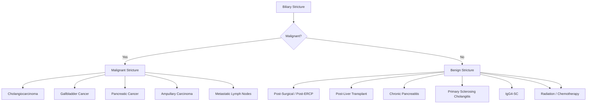
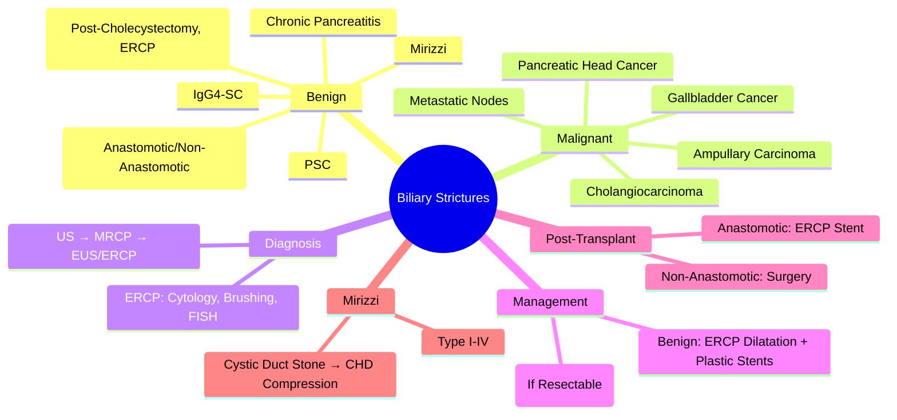

## 1. Learning Objectives
- [ ] Differentiate benign from malignant biliary strictures
- [ ] Apply diagnostic algorithm (US → MRCP/ERCP/EUS)
- [ ] Manage benign strictures (dilatation, stenting, surgery)
- [ ] Manage malignant strictures (stenting, neoadjuvant therapy, surgery)
- [ ] Identify FCPS/MRCP high-yield decision points

---

## 2. Classification



---

## 3. Benign Biliary Strictures

### Aetiology

| Cause | Mechanism | Timing |
|-------|-----------|--------|
| **Iatrogenic (Post-Surgical)** | Bile Duct Injury (Cholecystectomy) | Immediate to Years |
| **Post-ERCP** | Trauma from Instrumentation | Days-Weeks |
| **Post-Liver Transplant** | Anastomotic Stricture / Ischemic | 3-12 Months |
| **Chronic Pancreatitis** | Fibrosis of Pancreatic Head | Years |
| **PSC** | Autoimmune Fibrosis | Years |
| **IgG4-SC** | Autoimmune Fibrosis | Months-Years |
| **Mirizzi Syndrome** | Cystic Duct Stone Compression | Acute-Chronic |
| **Radiation** | Radiation-Induced Fibrosis | Years Post-RT |
| **Infections** | TB, Parasites (Ascariasis) | Variable |

---

## 4. Malignant Biliary Strictures

### Aetiology

| Cancer | Location | Key Features |
|--------|----------|--------------|
| **Cholangiocarcinoma** | Intra/Extrahepatic Bile Ducts | **MRCP Beading**, CA19-9↑ |
| **Pancreatic Head Cancer** | Pancreas Head | **Double Duct Sign**, Weight Loss |
| **Gallbladder Cancer** | GB Fossa/Neck | **Porcelain GB**, Direct Liver Invasion |
| **Ampullary Carcinoma** | Ampulla of Vater | **Intermittent Jaundice**, Endoscopically Visible |
| **Metastatic Nodes** | Porta Hepatis | Known Primary (GI, Breast, Lung) |

---

## 5. Clinical Presentation

| Feature | Benign | Malignant |
|---------|--------|-----------|
| **Jaundice** | Intermittent (Post-Prandial) | **Progressive, Constant** |
| **Pain** | Often Absent/Mild | **Present (Weight Loss, Anorexia)** |
| **Weight Loss** | Rare | **Common** |
| **Pruritus** | Variable | **Common** |
| **Fever** | If Cholangitis | If Cholangitis |
| **CA19-9** | Normal/Mildly ↑ | **Markedly ↑** |

> **Key**: **Progressive Painless Jaundice + Weight Loss = Malignancy Until Proven Otherwise**

---

## 6. Diagnostic Algorithm

```mermaid
flowchart TD
    A[Suspect Biliary Stricture: Obstructive Jaundice] --> B[Transabdominal US]
    B --> C{CBD Dilated?}
    C -->|No| D[Medical Jaundice / Intrahepatic Cause]
    C -->|Yes| E[MRCP (Non-Invasive Diagnostic)]
    E --> F{Stricture Seen?}
    F -->|Yes| G{Lesion/Mass Seen?}
    G -->|Yes| H[Malignant Suspected → CT + CA19-9]
    G -->|No| I[EUS for Tissue Diagnosis]
    F -->|No| J[Consider Functional / Intermittent]
    E -->|Equivocal| K[EUS / ERCP]
```

---

## 7. ERCP in Stricture Evaluation

```mermaid
flowchart TD
    A[ERCP Indicated] --> B[Diagnostic Cholangiography]
    B --> C{Stricture Type}
    C -->|Benign| D[Dilatation ± Short-Term Stent]
    C -->|Malignant| E[Tissue Diagnosis: Brushing + Biopsy + FISH]
    E --> F[Palliative Stenting (SEMS Preferred)]
    E --> G[Neoadjuvant Therapy if Resectable]
```

### ERCP Stricture Assessment

| Feature | Benign | Malignant |
|---------|--------|-----------|
| **Appearance** | Smooth, Concentric, Short | Irregular, Shouldered, Long |
| **Brushing Cytology** | Negative | **Positive (Sensitivity 30-50%)** |
| **FISH** | Negative | **Positive (Higher Sensitivity)** |
| **Stricture Length** | Usually <2cm | Often >2cm |

---

## 8. Management

### Benign Strictures

| Approach | Indication | Details |
|----------|------------|---------|
| **Endoscopic Dilatation + Stenting** | **First-Line** | Balloon Dilatation → Multiple Plastic Stents (6-12mo) |
| **Surgical Hepaticojejunostomy** | Failed Endoscopic / Complex | Roux-en-Y; Success >90% |
| **Post-Transplant** | Anastomotic Stricture | ERCP Dilatation/Stent → Surgery if Failed |

### Malignant Strictures

| Situation | Management |
|-----------|------------|
| **Resectable** | **Neoadjuvant Therapy → Surgery** (Whipple, Hepatectomy) |
| **Unresectable / Metastatic** | **Palliative Stenting (SEMS)** + Chemotherapy |
| **Palliative Stent** | **SEMS (8-12mo Patency) > Plastic (3-4mo)** |
| **Hilar (Klatskin)** | **Bismuth Type** Determines Resectability; Biliary Drainage Pre-Op |

---

## 9. Post-Liver Transplant Strictures

| Type | Timing | Management |
|------|--------|------------|
| **Anastomotic** | 3-12 Months | **ERCP Dilatation + Stent** (Primary); Surgery if Failed |
| **Non-Anastomotic (Ischemic)** | >1 Year | **ERCP Dilatation/Stent**; Higher Recurrence; Surgery (Hepaticojejunostomy) |

---

## 10. Mirizzi Syndrome

| Type | Description | Management |
|------|-------------|------------|
| **Type I** | Cystic Duct Stone Compressing CHD | Cholecystectomy + CBD Exploration/ERCP |
| **Type II** | Cholecystocholedochal Fistula (<1/3 CBD) | Cholecystectomy + Fistula Closure + CBD Repair |
| **Type III** | Fistula 1/3-2/3 CBD | Complex Reconstruction |
| **Type IV** | Fistula >2/3 CBD | Hepaticojejunostomy |

---

## 11. FCPS/MRCP High-Yield Summary

| Concept | Key Points |
|---------|------------|
| **Benign Aetiology** | Iatrogenic (Post-Cholecystectomy), PSC, Chronic Pancreatitis, IgG4-SC, Mirizzi |
| **Malignant Aetiology** | CCA, Pancreatic Ca, GB Ca, Ampullary Ca, Metastatic Nodes |
| **Differentiation** | **Progressive Painless Jaundice + Weight Loss = Malignant** |
| **Diagnosis** | US → MRCP → EUS/ERCP |
| **Benign Management** | **ERCP Dilatation + Multiple Plastic Stents** (6-12mo) |
| **Malignant Management** | **Resectable: Surgery; Unresectable: SEMS + Chemo** |
| **Post-Transplant** | Anastomotic: ERCP; Non-Anastomotic: Harder, Surgery Often |
| **Mirizzi** | Cystic Duct Stone → CHD Compression → Type I-IV |

---

## 12. Viva Questions

1. **Differentiate benign from malignant biliary strictures clinically.**
2. **What are the common causes of benign biliary strictures?**
3. **How do you diagnose a biliary stricture?**
3. **What is the management of a benign anastomotic stricture post-transplant?**
4. **How do you manage a malignant hilar stricture (Klatskin tumour)?**
4. **What is the role of ERCP in biliary strictures?**
5. **What is Mirizzi syndrome? Classification?**
5. **How do you differentiate benign from malignant on ERCP?**
6. **What is the role of SEMS vs plastic stents in malignant strictures?**
6. **What are the causes of post-transplant biliary strictures?**
7. **What is the algorithm for a new biliary stricture?**

---

## 13. Confusions & Mnemonics

| Confusion | Clarification |
|-----------|---------------|
| Benign vs Malignant Stricture | Benign: Intermittent Jaundice, No Weight Loss; Malignant: Progressive Jaundice, Weight Loss |
| ERCP vs PTC | ERCP = First-Line (Internal Drainage); PTC = Failed ERCP / Proximal Obstruction |
| SEMS vs Plastic | **SEMS for Malignant** (8-12mo Patency); **Plastic for Benign** (Multiple, 6-12mo) |
| Post-Tx Anastomotic vs Non-Anastomotic | Anastomotic = Technical (ERCP Fixable); Non-Anastomotic = Ischemic (Harder, Recurrent) |
| Klatskin Tumour | **Perihilar CCA** (Bismuth I-IV); Resectability Depends on Type |
| Dominant Stricture in PSC | Balloon Dilatation ± Short Stent; Avoid Long-Term Stents |
| Malignant Stricture Cytology | **Sensitivity 30-50%** — Repeat ×3, FISH Increases Sensitivity |

---

## 14. Mind Map



---

## 15. One-Page Revision Card

| **Benign Stricture** | **Malignant Stricture** |
|----------------------|-------------------------|
| **Aetiology** | Iatrogenic, PSC, Chronic Pancreatitis, IgG4-SC, Mirizzi | CCA, Pancreatic Ca, GB Ca, Ampullary Ca, Mets |
| **Clinical** | Intermittent Jaundice, No Weight Loss | **Progressive Jaundice, Weight Loss, Anorexia** |
| **CA19-9** | Normal/Mild ↑ | **Markedly ↑** |
| **ERCP** | Smooth, Short, Concentric | Irregular, Shouldered, Long |
| **Management** | **ERCP Dilatation + Multiple Plastic Stents (6-12mo)** | **Resectable: Surgery; Unresectable: SEMS + Chemo** |
| **Stent Choice** | Multiple Plastic (6-12mo) | **SEMS (8-12mo Patency)** |

| **Post-Transplant** | |
|---------------------|--|
| Anastomotic | ERCP Dilatation + Stent (Primary) |
| Non-Anastomotic (Ischemic) | ERCP → Surgery (Hepaticojejunostomy) |

| **Mirizzi Syndrome** | |
|----------------------|--|
| Type I | Cystic Duct Stone Compressing CHD |
| Type II-IV | Fistula with CBD Involvement (Increasing Severity) |

---

## 16. Spaced Repetition Tracker

| Day | 1 | 3 | 7 | 15 | 30 |
|-----|---|---|---|----|----|
| Benign vs Malignant Causes | ☐ | ☐ | ☐ | ☐ | ☐ |
| Clinical Differentiation | ☐ | ☐ | ☐ | ☐ | ☐ |
| ERCP Benign Management | ☐ | ☐ | ☐ | ☐ | ☐ |
| Malignant Stenting | ☐ | ☐ | ☐ | ☐ | ☐ |
| Post-Tx Strictures | ☐ | ☐ | ☐ | ☐ | ☐ |

---

## 17. Self-Test Scorecard

| Question | My Answer | Correct? |
|----------|-----------|----------|
| Benign Causes (5) |  |  |
| Malignant Causes (5) |  |  |
| Clinical Differentiation |  |  |
| Benign ERCP Management |  |  |
| Malignant SEMS vs Plastic |  |  |

---

## 18. Local Navigation

- [[Biliary Tract Disease/Choledocholithiasis|Choledocholithiasis]]
- [[Biliary Tract Disease/Acute cholangitis|Acute Cholangitis]]
- [[Biliary Tract Disease/Biliary tract tumours|Biliary Tumours]]
- [[Liver Transplantation/Liver Transplant Complications|Post-Tx Biliary Complications]]
- [[Autoimmune Liver Disease/Primary sclerosing cholangitis (PSC) Detailed|PSC]]
---

> Auto-generated study sections for "Biliary Tract Disease" — Ch 23: Hepatology.

## Flashcards (7 generated)

- Q: What is the definition of Biliary Tract Disease?
  A: | Iatrogenic (Post-Surgical) | Bile Duct Injury (Cholecystectomy) | Immediate to Years |
- Q: What causes Biliary Tract Disease?
  A: Iatrogenic (Post-Cholecystectomy), PSC, Chronic Pancreatitis, IgG4-SC, Mirizzi
- Q: What is Differentiation of Biliary Tract Disease?
  A: Progressive Painless Jaundice + Weight Loss = Malignant
- Q: What is the investigation of choice for Biliary Tract Disease?
  A: US → MRCP → EUS/ERCP
- Q: How is Biliary Tract Disease managed?
  A: ERCP Dilatation + Multiple Plastic Stents (6-12mo)
- Q: What is Post-Transplant of Biliary Tract Disease?
  A: Anastomotic: ERCP; Non-Anastomotic: Harder, Surgery Often
- Q: What is Mirizzi of Biliary Tract Disease?
  A: Cystic Duct Stone → CHD Compression → Type I-IV

## MCQs (1 generated)

1. **Which of the following best describes Biliary Tract Disease?**
   A. **| Iatrogenic (Post-Surgical) | Bile Duct Injury (Cholecystectomy) | Immediate to Years |**
   B. An unrelated condition not matching the clinical picture of Biliary Tract Disease
   C. A complication seen late in the disease course of Biliary Tract Disease
   D. A condition that mimics Biliary Tract Disease but has a different underlying cause

## SBA Questions (1 generated)

1. A patient with suspected Biliary Tract Disease presents with: A[Biliary Stricture] --> B{Malignant?}; B -->|Yes| C[Malignant Stricture]; B -->|No| D[Benign Stricture]. What is the most likely diagnosis?
   A. **Biliary Tract Disease**
   B. A condition that mimics Biliary Tract Disease but is not the same entity
   C. A complication of Biliary Tract Disease rather than the primary diagnosis
   D. An unrelated condition in the same clinical category as Biliary Tract Disease

## PasTest Scenario SBAs (Clinical Vignettes)

> **Auto-generated PasTest/Mediscope-style scenario SBAs** grounded in the authored source. Each scenario tests a real clinical fact (triad, specific sign, contraindication, trial, first-line Rx) extracted from the topic. *Source: Ch 23: Hepatology — Biliary strictures*

**Q1.** What is the most appropriate first-line therapy for Biliary strictures?

  - **A.** Endoscopic Dilatation + Stenting
  - **B.** An advanced/surgical therapy reserved for refractory disease
  - **C.** Symptomatic treatment only, no disease-modifying therapy
  - **D.** Empiric broad-spectrum therapy without specific indication

  > **Answer: A** — Endoscopic Dilatation + Stenting
  >
  > *Source:* **Endoscopic Dilatation + Stenting**   **First-Line**   Balloon Dilatation → Multiple Plastic Stents (6-12mo)

