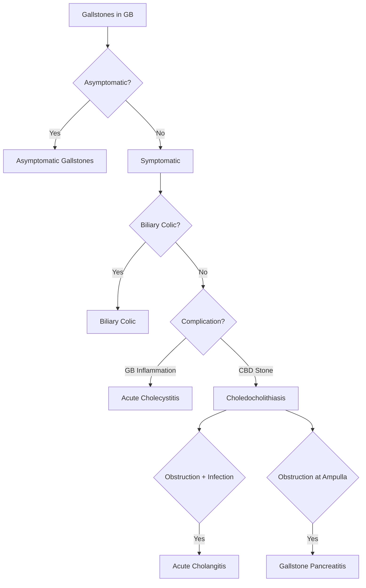
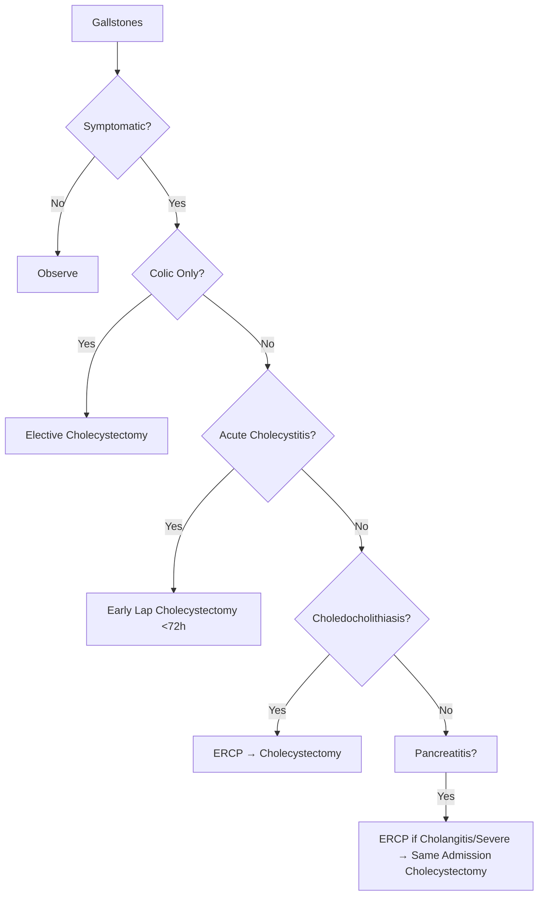
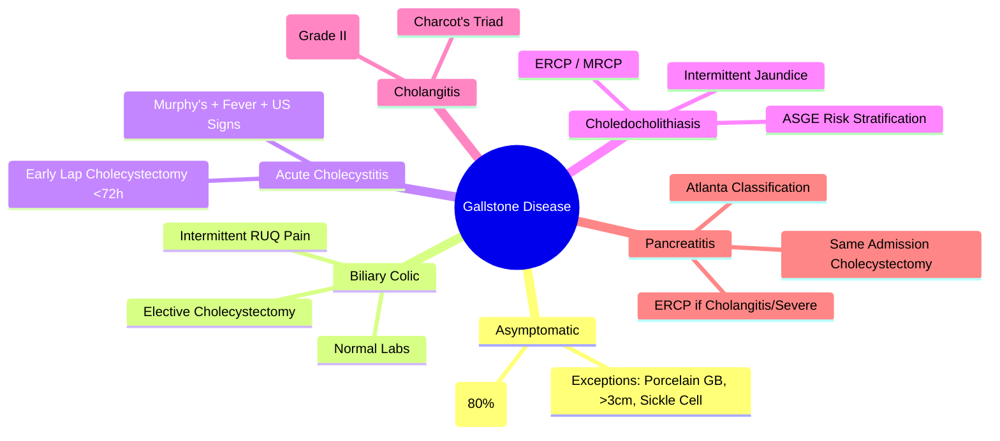

## 1. Learning Objectives
- [ ] Classify gallstone disease (asymptomatic, biliary colic, cholecystitis, choledocholithiasis, cholangitis, pancreatitis)
- [ ] Apply management algorithm for each presentation
- [ ] Identify FCPS/MRCP high-yield decision points

---

## 2. Gallstone Epidemiology

| Feature | Detail |
|--------|--------|
| **Prevalence** | 10-15% Adults (Western Countries) |
| **Composition** | **Cholesterol (80%)**, Pigment (15%), Mixed (5%) |
| **Risk Factors** | **4 F's**: Female, Forty, Fertile, Fat; Also: Rapid Weight Loss, TPN, Crohn's, Haemolysis |
| **Asymptomatic** | **80%** of Gallstones |

---

## 3. Spectrum of Disease

---

## 1. Asymptomatic Gallstones

| Feature | Management |
|--------|------------|
| **Incidental Finding** | US for Other Reason |
| **Management** | **Observation** — No Surgery |
| **Exception: Prophylactic Cholecystectomy** | **Porcelain GB**, **Giant Stones (>3cm)**, **Sickle Cell**, **Transplant Candidates**, **Diabetics (Some Guidelines)** |

> **FCPS/MRCP**: **Asymptomatic = Observe**; **Prophylactic Cholecystectomy Only in High-Risk Groups**

---

## 2. Biliary Colic

| Feature | Detail |
|-------|--------|
| **Mechanism** | Transient Cystic Duct Obstruction by Stone |
| **Pain** | **RUQ/Epigastric**, Colicky, Radiates to Right Scapula/Shoulder |
| **Duration** | **15 Min - 6 Hours** (Resolves Spontaneously) |
| **Associated** | Nausea, Vomiting, No Fever |
| **Exam** | **RUQ Tenderness**, **No Rebound/Guarding**, **Murphy's Sign Negative** |
| **Labs** | **Normal** (LFTs, Amylase, Lipase, WCC) |
| **Imaging** | US: Stones in GB, **No Wall Thickening**, No Pericholecystic Fluid |

### Management
| Step | Action |
|------|--------|
| **1. Analgesia** | NSAIDs (Diclofenac) > Opioids |
| **2. Antiemetics** | If Nausea/Vomiting |
| **3. Definitive** | **Elective Laparoscopic Cholecystectomy** (Within 3 Months) |

---

## 3. Acute Cholecystitis

| Feature | Detail |
|-------|--------|
| **Mechanism** | Persistent Cystic Duct Obstruction → Inflammation ± Bacterial Superinfection |
| **Pain** | **RUQ, Constant, Severe**, Radiates to Scapula, **>6 Hours** |
| **Murphy's Sign** | **Positive** (Inspiratory Arrest on RUQ Palpation) |
| **Fever** | **>38°C** (Common) |
| **Labs** | **WCC ↑, CRP ↑**, LFTs Usually Normal (Unless Choledocholithiasis) |
| **US Criteria (TG18)** | **GB Wall >3mm, Pericholecystic Fluid, Stones, Distension, Sonographic Murphy's** |

### Management
| Step | Management |
|------|------------|
| **1. Resuscitation** | IV Fluids, NBM, Analgesia |
| **2. Antibiotics** | Ceftriaxone 2g IV / Amox-Clav 1.2g q8h |
| **3. Early Cholecystectomy** | **Laparoscopic <72 Hours** (Grade I/II TG18) |
| **Grade III** | Stabilise → Delayed/Percutaneous Cholecystostomy |

---

## 4. Choledocholithiasis (CBD Stones)

| Feature | Detail |
|--------|--------|
| **Mechanism** | Stone Migration from GB → CBD |
| **Presentation** | **Intermittent Jaundice**, RUQ Pain, Cholangitis, Pancreatitis |
| **Diagnosis** | **ASGE Risk Stratification** (High/Intermediate/Low Risk) |
| **High Risk** | CBD Stone on US, CBD >10mm + Bil >4mg/dL, Cholangitis, Pancreatitis |
| **Intermediate** | Bil 1.8-4mg/dL + CBD 6-10mm |

### Management
| Risk | Action |
|------|--------|
| **High** | **ERCP (Sphincterotomy + Extraction)** |
| **Intermediate** | **MRCP/EUS** → ERCP if Positive |
| **Low** | Observe |

> **ERCP Indications**: Confirmed CBD Stones, Cholangitis, Gallstone Pancreatitis (Severe/With Cholangitis)

---

## 5. Acute Cholangitis

| Feature | Detail |
|--------|--------|
| **Triad (Charcot)** | **Fever + RUQ Pain + Jaundice** |
| **Pentad (Reynolds)** | Charcot + **Shock + AMS** |
| **TG18 Severity** | Grade I (Mild), II (Moderate), III (Severe/Organ Failure) |
| **Organisms** | E. coli, Klebsiella, Enterococcus |

### Management
| Step | Action |
|------|--------|
| **1. Resuscitation** | IV Fluids, Broad-Spectrum Abx (Pip-Taz/Ceftriaxone+Metro) |
| **2. Biliary Drainage** | **ERCP <24h (Grade II), <12h (Grade III)** |
| **3. Supportive** | Vasopressors, RRT if Needed |

---

## 6. Gallstone Pancreatitis

| Feature | Detail |
|--------|--------|
| **Mechanism** | Transient Ampullary Obstruction → Pancreatic Duct Obstruction |
| **Atlanta Classification** | Mild / Moderately Severe / Severe |
| **ERCP Timing** | Cholangitis: <24h; Predicted Severe: <48-72h; Mild: No Routine ERCP |
| **Cholecystectomy** | **Same Admission** (Mild/Moderate); Delayed 6-12w (Severe) |

---

## 4. Management Algorithm Summary

---

## 5. FCPS/MRCP High-Yield Summary

| Condition | Key Feature | Management |
|-----------|-------------|------------|
| **Asymptomatic** | Incidental US | Observe (Exception: Porcelain GB, >3cm Stone, Sickle Cell) |
| **Biliary Colic** | RUQ Colic, Normal Labs, Neg Murphy's | Elective Lap Cholecystectomy |
| **Acute Cholecystitis** | RUQ Pain + Fever + Murphy's + US Signs | **Early Lap Cholecystectomy <72h** |
| **Choledocholithiasis** | Intermittent Jaundice, Dilated CBD | ERCP (High Risk) / MRCP→ERCP (Intermediate) |
| **Acute Cholangitis** | Charcot's Triad + Fever | Abx + **ERCP <24h (Grade II)** |
| **Gallstone Pancreatitis** | Epigastric Pain → Back, Lipase >3x | ERCP if Cholangitis/Severe; **Same Admission Cholecystectomy** |

---

## 6. Viva Questions

1. **What is the management of asymptomatic gallstones?**
2. **Differentiate biliary colic from acute cholecystitis.**
3. **What are the Tokyo Guidelines criteria for acute cholecystitis?**
4. **When do you do ERCP for choledocholithiasis?**
4. **What is the management of acute cholangitis?**
5. **What is the cholecystectomy timing for gallstone pancreatitis?**
6. **What is Charcot's triad vs Reynolds' pentad?**
6. **What are the ASGE risk criteria for CBD stones?**
7. **When do you do prophylactic cholecystectomy?**
8. **What is the management of acute acalculous cholecystitis?**

---

## 7. Confusions & Mnemonics

| Confusion | Clarification |
|-----------|---------------|
| Colic vs Cholecystitis | Colic: Intermittent, Normal Labs, No Murphy's; Cholecystitis: Constant, Fever, Murphy's+, US Signs |
| ERCP Timing | Cholangitis: <24h; Pancreatitis + Cholangitis: <24h; Pancreatitis Severe: <48-72h |
| Asymptomatic Management | **Observe**; Exceptions: Porcelain GB, >3cm Stone, Sickle Cell, Transplant Candidates |
| TG18 Grade II vs III | Grade II: 2 of 5 Criteria; Grade III: Organ Failure |
| Same Admission Cholecystectomy | Mild/Moderate Pancreatitis; **NOT Severe** (Delayed 6-12w) |
| Mirizzi Syndrome | Cystic Duct Stone Compressing CHD → Jaundice (Type I-IV) |

---

## 8. Mind Map

---

## 9. One-Page Revision Card

| **Condition** | **Key Features** | **Management** |
|---------------|------------------|----------------|
| **Asymptomatic** | Incidental US, Normal Labs | Observe (Exceptions: Porcelain GB, >3cm, Sickle Cell) |
| **Biliary Colic** | RUQ Colic <6h, Normal Labs | Elective Lap Cholecystectomy |
| **Acute Cholecystitis** | Constant Pain>6h, Fever, Murphy's+, US: Wall>3mm, Fluid | **Early Lap Cholecystectomy <72h** |
| **Choledocholithiasis** | Intermittent Jaundice, Dilated CBD | **High Risk: ERCP; Intermediate: MRCP/EUS** |
| **Acute Cholangitis** | Fever + RUQ Pain + Jaundice | **Ceftriaxone + ERCP <24h (Grade II)** |
| **Gallstone Pancreatitis** | Epigastric→Back Pain, Lipase>3xULN | ERCP if Cholangitis/Severe; **Same Admission Cholecystectomy** |

| **ERCP Indications** | **Timing** |
|----------------------|------------|
| Cholangitis | <24h (Grade II) / <12h (Grade III) |
| Gallstone Pancreatitis + Cholangitis | <24h |
| Predicted Severe Pancreatitis | <48-72h |
| Mild Pancreatitis | No Routine ERCP |

---

## 10. Spaced Repetition Tracker

| Day | 1 | 3 | 7 | 15 | 30 |
|-----|---|---|---|----|----|
| Asymptomatic Exceptions | ☐ | ☐ | ☐ | ☐ | ☐ |
| Colic vs Cholecystitis | ☐ | ☐ | ☐ | ☐ | ☐ |
| TG18 Criteria | ☐ | ☐ | ☐ | ☐ | ☐ |
| ERCP Indications | ☐ | ☐ | ☐ | ☐ | ☐ |
| Cholecystectomy Timing | ☐ | ☐ | ☐ | ☐ | ☐ |

---

## 11. Self-Test Scorecard

| Question | My Answer | Correct? |
|----------|-----------|----------|
| Asymptomatic Exceptions |  |  |
| Biliary Colic vs Cholecystitis |  |  |
| ERCP for Cholangitis Timing |  |  |
| ASGE High Risk Criteria |  |  |
| Cholecystectomy Timing Pancreatitis |  |  |

---

## 12. Local Navigation

- [[Biliary Tract Disease/Acute cholecystitis detailed|Acute Cholecystitis]]
- [[Biliary Tract Disease/Acute cholangitis|Acute Cholangitis]]
- [[Biliary Tract Disease/Choledocholithiasis|Choledocholithiasis]]
- [[Biliary Tract Disease/Gallstone pancreatitis|Gallstone Pancreatitis]]
- [[Biliary Tract Disease/Biliary strictures|Biliary Strictures]]
- [[Biliary Tract Disease/Biliary tract tumours|Biliary Tumours]]
---

> Auto-generated study sections for "Biliary Tract Disease" — Ch 23: Hepatology.

## Flashcards (39 generated)

- Q: What is the definition of Biliary Tract Disease?
  A: | Mechanism | Transient Cystic Duct Obstruction by Stone |
- Q: What is the epidemiology of Biliary Tract Disease?
  A: 10-15% Adults (Western Countries)
- Q: What is Composition of Biliary Tract Disease?
  A: Cholesterol (80%), Pigment (15%), Mixed (5%)
- Q: What causes Biliary Tract Disease?
  A: 4 F's: Female, Forty, Fertile, Fat; Also: Rapid Weight Loss, TPN, Crohn's, Haemolysis
- Q: What are the clinical features of Biliary Tract Disease?
  A: 80% of Gallstones
- Q: What is Incidental Finding of Biliary Tract Disease?
  A: US for Other Reason
- Q: How is Biliary Tract Disease managed?
  A: Observation — No Surgery
- Q: What is Exception: Prophylactic Cholecystectomy of Biliary Tract Disease?
  A: Porcelain GB, Giant Stones (>3cm), Sickle Cell, Transplant Candidates, Diabetics (Some Guidelines)
- Q: What is the mechanism of Biliary Tract Disease?
  A: Transient Cystic Duct Obstruction by Stone
- Q: What is Pain of Biliary Tract Disease?
  A: RUQ/Epigastric, Colicky, Radiates to Right Scapula/Shoulder
- Q: What is Duration of Biliary Tract Disease?
  A: 15 Min - 6 Hours (Resolves Spontaneously)
- Q: What is Associated of Biliary Tract Disease?
  A: Nausea, Vomiting, No Fever
- Q: What is Exam of Biliary Tract Disease?
  A: RUQ Tenderness, No Rebound/Guarding, Murphy's Sign Negative
- Q: What is Labs of Biliary Tract Disease?
  A: Normal (LFTs, Amylase, Lipase, WCC)
- Q: What is Imaging of Biliary Tract Disease?
  A: US: Stones in GB, No Wall Thickening, No Pericholecystic Fluid
- Q: What is the mechanism of Biliary Tract Disease?
  A: Stone Migration from GB → CBD
- Q: What are the clinical features of Biliary Tract Disease?
  A: Intermittent Jaundice, RUQ Pain, Cholangitis, Pancreatitis
- Q: What is the investigation of choice for Biliary Tract Disease?
  A: ASGE Risk Stratification (High/Intermediate/Low Risk)
- Q: What is High Risk of Biliary Tract Disease?
  A: CBD Stone on US, CBD >10mm + Bil >4mg/dL, Cholangitis, Pancreatitis
- Q: What is Intermediate of Biliary Tract Disease?
  A: Bil 1.8-4mg/dL + CBD 6-10mm
- Q: What is Triad (Charcot) of Biliary Tract Disease?
  A: Fever + RUQ Pain + Jaundice
- Q: What is Pentad (Reynolds) of Biliary Tract Disease?
  A: Charcot + Shock + AMS
- Q: What is TG18 Severity of Biliary Tract Disease?
  A: Grade I (Mild), II (Moderate), III (Severe/Organ Failure)
- Q: What is Organisms of Biliary Tract Disease?
  A: E. coli, Klebsiella, Enterococcus
- Q: What is the mechanism of Biliary Tract Disease?
  A: Transient Ampullary Obstruction → Pancreatic Duct Obstruction
- Q: How is Biliary Tract Disease classified?
  A: Mild / Moderately Severe / Severe
- Q: What is ERCP Timing of Biliary Tract Disease?
  A: Cholangitis: <24h; Predicted Severe: <48-72h; Mild: No Routine ERCP
- Q: What is Cholecystectomy of Biliary Tract Disease?
  A: Same Admission (Mild/Moderate); Delayed 6-12w (Severe)
- Q: What is the mechanism of Biliary Tract Disease?
  A: Stone Migration from GB → CBD
- Q: What are the clinical features of Biliary Tract Disease?
  A: Intermittent Jaundice, RUQ Pain, Cholangitis, Pancreatitis
- Q: What is the investigation of choice for Biliary Tract Disease?
  A: ASGE Risk Stratification (High/Intermediate/Low Risk)
- Q: What is High Risk of Biliary Tract Disease?
  A: CBD Stone on US, CBD >10mm + Bil >4mg/dL, Cholangitis, Pancreatitis
- Q: What is Triad (Charcot) of Biliary Tract Disease?
  A: Fever + RUQ Pain + Jaundice
- Q: What is Pentad (Reynolds) of Biliary Tract Disease?
  A: Charcot + Shock + AMS
- Q: What is TG18 Severity of Biliary Tract Disease?
  A: Grade I (Mild), II (Moderate), III (Severe/Organ Failure)
- Q: What is the mechanism of Biliary Tract Disease?
  A: Transient Ampullary Obstruction → Pancreatic Duct Obstruction
- Q: How is Biliary Tract Disease classified?
  A: Mild / Moderately Severe / Severe
- Q: What is ERCP Timing of Biliary Tract Disease?
  A: Cholangitis: <24h; Predicted Severe: <48-72h; Mild: No Routine ERCP
- Q: What is Cholecystectomy of Biliary Tract Disease?
  A: Same Admission (Mild/Moderate); Delayed 6-12w (Severe)

## MCQs (1 generated)

1. **Which of the following best describes Biliary Tract Disease?**
   A. **| Mechanism | Transient Cystic Duct Obstruction by Stone |**
   B. An unrelated condition not matching the clinical picture of Biliary Tract Disease
   C. A complication seen late in the disease course of Biliary Tract Disease
   D. A condition that mimics Biliary Tract Disease but has a different underlying cause

