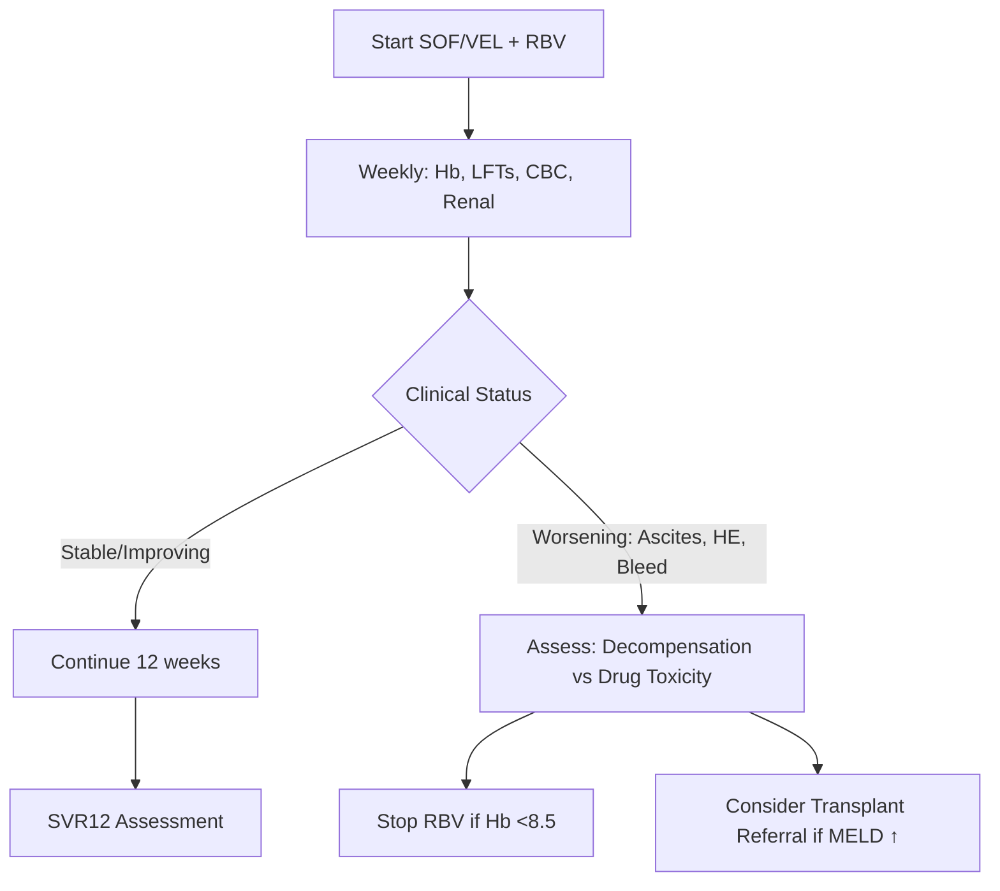
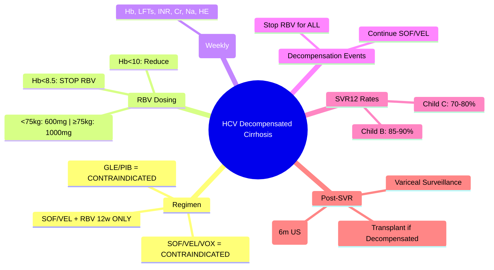

## 1. Learning Objectives
- [ ] Identify decompensated cirrhosis (Child-Pugh B/C) in HCV patients
- [ ] Apply SOF/VEL + RBV regimen (ONLY recommended)
- [ ] Understand contraindications of PI-based regimens (GLE/PIB, VOX)
- [ ] Monitor for decompensation during treatment
- [ ] Know transplant referral criteria and post-transplant management
- [ ] Identify FCPS/MRCP high-yield management steps

---

## 2. Why Decompensated Cirrhosis is Different

| Regimen | Decompensated (Child B/C) | Reason |
|---------|---------------------------|--------|
| **SOF/VEL** | **Allowed + RBV** | No PI; Safe hepatic metabolism |
| **GLE/PIB** | **CONTRAINDICATED** | Glecaprevir = PI → Hepatic metabolism impaired → ↑ Exposure → Toxicity |
| **SOF/VEL/VOX** | **CONTRAINDICATED** | Voxilaprevir = PI → Same as above |

> **FCPS/MRCP**: **ONLY SOF/VEL + RBV** for decompensated cirrhosis — PI-based regimens are contraindicated

---

## 3. Recommended Regimen

| Component | Dose | Duration |
|-----------|------|----------|
| **Sofosbuvir/Velpatasvir (SOF/VEL)** | 400/100 mg once daily | **12 weeks** |
| **Ribavirin (RBV)** | 600-1000 mg/day (weight-based: <75kg=600mg, ≥75kg=1000mg) | **12 weeks** |

> **SOF/VEL + RBV for 12 weeks** = Standard of care for Child-Pugh B/C

---

## 4. Ribavirin Dose Adjustment & Monitoring

| Parameter | Action |
|-----------|--------|
| **Baseline Hb** | Must be ≥10 g/dL (ideally ≥12 g/dL) |
| **Weekly Hb** | First 4 weeks, then every 2 weeks |
| **Hb <10 g/dL** | Reduce RBV: 600→400mg, 1000→600mg |
| **Hb <8.5 g/dL** | **Stop RBV** (continue SOF/VEL monotherapy) |
| **Erythropoietin** | Consider if Hb <10 and symptomatic |

---

## 5. Monitoring During Treatment

| Parameter | Frequency | Action Threshold |
|-----------|-----------|------------------|
| **Hb** | Weekly ×4, then 2-weekly | <10 → Reduce RBV; <8.5 → Stop RBV |
| **ALT/AST** | Weekly | Rising >2x baseline → Assess |
| **Bilirubin** | Weekly | Rising → May indicate decompensation |
| **INR** | Weekly | Rising → Assess synthetic function |
| **Albumin** | Weekly | Falling → Nutritional/Functional decline |
| **Platelets** | Weekly | Falling → Hypersplenism/Sepsis |
| **Creatinine** | Weekly | Rising → AKI/HRS |
| **Sodium** | Weekly | <130 → Diuretic adjustment |
| **HE Assessment** | Daily (ward) / Each visit | New/worsening → Lactulose + Rifaximin |

---

## 6. Decompensation Events During Treatment

| Event | Management |
|-------|------------|
| **New Ascites / Worsening** | Increase diuretics, albumin, consider LVP; **Stop RBV if severe** |
| **New/Worsening HE** | Lactulose + Rifaximin; **Stop RBV**; Assess for SBP/Sepsis |
| **SBP** | Ceftriaxone + Albumin; **Stop RBV** |
| **Variceal Bleed** | Vasoactives + Endoscopy + Antibiotics; **Stop RBV** |
| **AKI / HRS** | Albumin + Terlipressin; **Stop RBV** |
| **Severe Infection** | Antibiotics; **Stop RBV** |

> **RBV is dose-limiting toxicity** — Stop RBV for any decompensation event, continue SOF/VEL

---

## 7. Transplant Considerations

### Pre-Transplant HCV Treatment
| Scenario | Approach |
|----------|----------|
| **On Waiting List** | **Treat HCV before transplant** if possible (SOF/VEL+RBV) |
| **MELD <20, Stable** | Complete 12-week course |
| **MELD >20 / Unstable** | Consider treat POST-transplant (higher priority) |
| **Post-Transplant** | Treat recurrence with SOF/VEL (12w) or GLE/PIB (12w) |

### SVR Before Transplant = Better Outcomes
- **Reduces HCV recurrence** post-transplant
- **Improves graft survival**
- **May delist** if MELD improves significantly (rare)

---

## 8. SVR12 in Decompensated Cirrhosis

| Outcome | Rate |
|---------|------|
| **SVR12 (Child B)** | 85-90% |
| **SVR12 (Child C)** | 70-80% |
| **Factors Reducing SVR** | Child C, Low Albumin, High Bilirubin, Prior Null Response, HCC |

> **SVR12 improves survival** even in decompensated cirrhosis — treat whenever feasible

---

## 9. Post-SVR Management

| If SVR12 Achieved | If SVR12 Not Achieved |
|-------------------|----------------------|
| **Continue HCC Surveillance** (6m US ± AFP) — **Lifelong** | **Retreatment**: SOF/VEL/VOX 12w (if Child A/B) |
| **Monitor LFTs 6-monthly** | **Transplant Referral** if decompensation persists |
| **Portal Hypertension** may improve but persists | **Assess for MELD improvement** |
| **Variceal Surveillance** continues | **Consider Liver Transplant** |
| **Vaccinate HAV/HBV** |  |

---

## 10. FCPS/MRCP High-Yield Summary

| Concept | Key Points |
|---------|------------|
| **Only Regimen** | **SOF/VEL + RBV 12 weeks** for Child-Pugh B/C |
| **Contraindicated** | **GLE/PIB** (glecaprevir PI), **SOF/VEL/VOX** (voxilaprevir PI) |
| **RBV Dose** | 600mg (<75kg) / 1000mg (≥75kg); Adjust for Hb <10; Stop if Hb <8.5 |
| **Monitoring** | Weekly Hb, LFTs, INR, Creatinine, Sodium, HE assessment |
| **Decompensation** | **Stop RBV** for any event (ascites, HE, bleed, SBP, AKI) |
| **SVR12 Rates** | Child B: 85-90%; Child C: 70-80% |
| **Post-SVR** | Lifelong HCC surveillance (6m US ± AFP) |
| **Transplant** | Treat pre-transplant if feasible; Post-Tx: SOF/VEL or GLE/PIB |

---

## 11. Viva Questions

1. **What is the only recommended regimen for HCV in decompensated cirrhosis?**
2. **Why are GLE/PIB and SOF/VEL/VOX contraindicated in decompensated cirrhosis?**
3. **What is the RBV dose adjustment for Hb <10 g/dL?**
4. **What decompensation events require stopping RBV?**
5. **What are SVR12 rates in Child B vs Child C?**
6. **Can you use SOF/VEL without RBV in decompensated?**
7. **How do you monitor for decompensation during treatment?**
8. **What is the post-SVR management in cirrhosis?**
9. **When do you treat HCV pre-transplant vs post-transplant?**
10. **What is the mechanism of PI toxicity in hepatic impairment?**

---

## 12. Confusions & Mnemonics

| Confusion | Clarification |
|-----------|---------------|
| SOF/VEL vs SOF/VEL+RBV | **Decompensated = MUST ADD RBV**; Compensated = RBV optional |
| GLE/PIB contraindicated | **PI metabolism impaired** in hepatic failure → toxic accumulation |
| RBV dose | Weight-based: <75kg=600mg, ≥75kg=1000mg; **Adjust for Hb** |
| Stop RBV | **Any decompensation** → Stop RBV, Continue SOF/VEL |
| SOF/VEL alone in Child B/C | **Not recommended** — lower SVR; RBV essential |
| Post-SVR HCC surveillance | **LIFELONG 6m US ± AFP** even after SVR |
| PI in hepatic impairment | Glucuronidation/CYP3A4 impaired → ↑ Exposure → Toxicity |

---

## 13. Mind Map

---

## 14. One-Page Revision Card

| **Decompensated HCV** | **Details** |
|-----------------------|-------------|
| **Regimen** | **SOF/VEL + RBV 12w** (ONLY option) |
| **Contraindicated** | GLE/PIB, SOF/VEL/VOX (PI-based) |
| **RBV Dose** | <75kg: 600mg; ≥75kg: 1000mg |
| **RBV Adjustment** | Hb 8.5-10: Reduce; Hb <8.5: STOP |
| **Monitoring** | Weekly: Hb, LFTs, INR, Cr, Na, HE |

| **Decompensation → Action** | |
|-----------------------------|--|
| Ascites, HE, Bleed, SBP, AKI | **STOP RBV, Continue SOF/VEL** |

| **SVR12** | **Rate** |
|-----------|----------|
| Child B | 85-90% |
| Child C | 70-80% |

| **Post-SVR** | |
|--------------|--|
| HCC Surveillance | **Lifelong 6m US ± AFP** |

---

## 15. Spaced Repetition Tracker

| Day | 1 | 3 | 7 | 15 | 30 |
|-----|---|---|---|----|----|
| Regimen (SOF/VEL+RBV) | ☐ | ☐ | ☐ | ☐ | ☐ |
| Contraindicated regimens | ☐ | ☐ | ☐ | ☐ | ☐ |
| RBV dose/adjustment | ☐ | ☐ | ☐ | ☐ | ☐ |
| Decompensation management | ☐ | ☐ | ☐ | ☐ | ☐ |
| SVR12 rates | ☐ | ☐ | ☐ | ☐ | ☐ |

---

## 16. Self-Test Scorecard

| Question | My Answer | Correct? |
|----------|-----------|----------|
| Only regimen for Child B/C |  |  |
| Why GLE/PIB contraindicated |  |  |
| RBV dose adjustment |  |  |
| Decompensation → stop RBV |  |  |
| Post-SVR HCC surveillance |  |  |

---

## 17. Local Navigation

- [[Viral Hepatitis/Hepatitis C|HCV Overview]]
- [[Viral Hepatitis/HCV DAA Regimens by Genotype & Cirrhosis|HCV DAA Regimens]]
- [[Viral Hepatitis/Hepatitis C treatment endpoints|SVR12]]
- [[Portal Hypertension and Complications/Ascites|Ascites]]
- [[Portal Hypertension and Complications/Hepatic Encephalopathy|HE]]
- [[Liver Transplantation/Liver Transplantation|Liver Transplant]]
---

> Auto-generated study sections for "Viral Hepatitis" — Ch 23: Hepatology.

## Flashcards (14 generated)

- Q: What is the definition of Viral Hepatitis?
  A: | Sofosbuvir/Velpatasvir (SOF/VEL) | 400/100 mg once daily | 12 weeks |
- Q: What is Baseline Hb of Viral Hepatitis?
  A: Must be ≥10 g/dL (ideally ≥12 g/dL)
- Q: What is Weekly Hb of Viral Hepatitis?
  A: First 4 weeks, then every 2 weeks
- Q: What is Hb <10 g/dL of Viral Hepatitis?
  A: Reduce RBV: 600→400mg, 1000→600mg
- Q: What is Hb <8.5 g/dL of Viral Hepatitis?
  A: Stop RBV (continue SOF/VEL monotherapy)
- Q: What is Erythropoietin of Viral Hepatitis?
  A: Consider if Hb <10 and symptomatic
- Q: What is Only Regimen of Viral Hepatitis?
  A: SOF/VEL + RBV 12 weeks for Child-Pugh B/C
- Q: What is Contraindicated of Viral Hepatitis?
  A: GLE/PIB (glecaprevir PI), SOF/VEL/VOX (voxilaprevir PI)
- Q: What is the dose of Viral Hepatitis?
  A: 600mg (<75kg) / 1000mg (≥75kg); Adjust for Hb <10; Stop if Hb <8.5
- Q: How is Viral Hepatitis monitored?
  A: Weekly Hb, LFTs, INR, Creatinine, Sodium, HE assessment
- Q: What is Decompensation of Viral Hepatitis?
  A: Stop RBV for any event (ascites, HE, bleed, SBP, AKI)
- Q: What is SVR12 Rates of Viral Hepatitis?
  A: Child B: 85-90%; Child C: 70-80%
- Q: What is Post-SVR of Viral Hepatitis?
  A: Lifelong HCC surveillance (6m US ± AFP)
- Q: What is Transplant of Viral Hepatitis?
  A: Treat pre-transplant if feasible; Post-Tx: SOF/VEL or GLE/PIB

## MCQs (1 generated)

1. **Which of the following best describes Viral Hepatitis?**
   A. **| Sofosbuvir/Velpatasvir (SOF/VEL) | 400/100 mg once daily | 12 weeks |**
   B. An unrelated condition not matching the clinical picture of Viral Hepatitis
   C. A complication seen late in the disease course of Viral Hepatitis
   D. A condition that mimics Viral Hepatitis but has a different underlying cause

