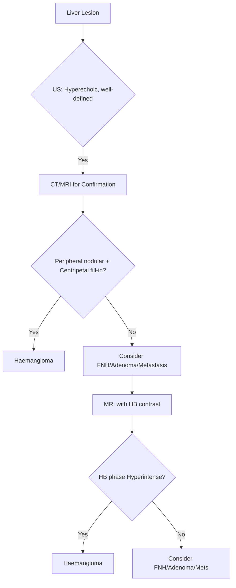

## 1. Learning Objectives
- [ ] Differentiate haemangioma, FNH, and hepatic adenoma
- [ ] Apply imaging criteria for diagnosis (US, CT, MRI)
- [ ] Determine management based on tumour type, size, and symptoms
- [ ] Know malignant transformation risk
- [ ] Identify FCPS/MRCP high-yield diagnostic and management points

---

## 2. Overview of Benign Liver Tumours

```mermaid
flowchart TD
    A[Benign Liver Tumour] --> B{Type}
    B -->|Vascular| C[Haemangioma]
    B -->|Non-vascular| D{Female + OCP?}
    D -->|Yes| E[Hepatic Adenoma]
    D -->|No| F[Focal Nodular Hyperplasia (FNH)]
    E --> G[Subtypes: HNF1a, Beta-catenin, etc.]
```

| Tumour | Prevalence | Sex Predilection | Malignant Potential |
|--------|------------|------------------|---------------------|
| **Haemangioma** | **Most common (1-20%)** | Women > Men (2:1) | **None** |
| **FNH** | **2nd most common (2-3%)** | Women > Men (8:1) | **None** |
| **Hepatic Adenoma** | Rare (0.03-0.5%) | **Women (OCP)** (9:1) | **Yes** (5-10% HCC risk) |

> **FCPS/MRCP**: **Haemangioma = Most common benign liver tumour**; **Adenoma = Malignant potential**

---

## 3. Haemangioma

### Pathophysiology
| Feature | Detail |
|---------|--------|
| **Histology** | Cavernous vascular channels lined by endothelium |
| **Pathogenesis** | Congenital hamartoma (not true neoplasm) |
| **Growth** | Slow; hormone-responsive (grows in pregnancy/OCP) |

### Clinical Features
| Feature | Detail |
|---------|--------|
| **Presentation** | **Asymptomatic** (>90% incidental) |
| **Symptoms (if large >10cm)** | RUQ fullness, pain, early satiety |
| **Complications (Rare)** | Rupture, Kasabach-Merritt (thrombocytopenia), compression |

### Imaging Diagnosis

| Modality | Haemangioma Features |
|--------|---------------------|
| **US** | Hyperechoic, well-defined, posterior acoustic enhancement |
| **CT (Triphasic)** | **Peripheral nodular enhancement** (arterial) → **Centripetal fill-in** (portal/delayed) |
| **MRI (Gold Standard)** | **T2: Very hyperintense** ("Light bulb sign"); **T1: Hypointense**; **Post-contrast: Peripheral nodular → Centripetal fill-in**; **Hepatobiliary phase: Hyperintense** |

### Diagnostic Algorithm



### Key MRI Sign: **"Light Bulb" Sign**
- **T2-weighted**: **Markedly hyperintense** ("light bulb bright")
- **T1**: Hypointense
- **Post-contrast**: Peripheral nodular → Centripetal fill-in
- **Hepatobiliary phase**: **Hyperintense** (retains contrast)

---

## 4. Focal Nodular Hyperplasia (FNH)

### Pathophysiology
| Feature | Detail |
|---------|--------|
| **Aetiology** | Vascular malformation + hepatocyte hyperplasia (response to arterial aberration) |
| **Central Scar** | Fibrosis + abnormal vessels (pathognomonic) |
| **Genetics** | Usually sporadic; rare familial |

### Clinical Features
| Feature | Detail |
|---------|--------|
| **Demographics** | **Women 80-90%**, age 20-50 |
| **OCP Association** | **Strong link** (hormone-responsive) |
| **Symptoms** | Usually asymptomatic; RUQ pain if large |
| **Complications** | Rare rupture, bleeding (unlike adenoma) |

### Imaging Diagnosis

| Modality | FNH Features |
|--------|--------------|
| **US** | Iso/hypoechoic, central scar (hyperechoic), spokewheel vessels (Doppler) |
| **CT** | **Early intense homogeneous enhancement** (arterial); **Central scar enhances late**; Rapid washout |
| **MRI (Gold Standard)** | **Central scar: T1 hypointense, T2 hyperintense**; **Arterial: Homogeneous enhancement**; **Central scar: T2 hyperintense, delayed enhancement**; **Hepatobiliary phase: Iso/hyperintense** (contains hepatocytes + bile ducts) |

### Key MRI Signs
| Sign | Description |
|------|-------------|
| **Central Scar** | T2 hyperintense, delayed enhancement (pathognomonic) |
| **"Wheel-spoke" Pattern** | Radial vessels on arterial phase |
| **Hepatobiliary Phase** | **Iso/hyperintense** (contains hepatocytes + bile ductules) |

> **FCPS/MRCP**: **Central scar on MRI = FNH**; **Central scar on CT = late enhancement**

---

## 5. Hepatic Adenoma

### Pathophysiology & Classification (Adenoma Subtypes)

| Subtype | Molecular Defect | Risk of HCC | Key Features |
|---------|-----------------|-------------|--------------|
| **HNF1α-inactivated (H-HCA)** | HNF1α mutation | Low (<5%) | Steatotic, coplanar on imaging |
| **β-catenin activated (b-HCA)** | CTNNB1 mutation | **High (30-40%)** | **Atypical imaging**, male predominance |
| **Inflammatory (I-HCA)** | FRK/IL6ST/STAT3/JAK1 | Low (<5%) | **Systemic inflammation** (CRP↑, fibrinogen↑) |
| **Unclassified (U-HCA)** | None identified | Unknown | Featureless |

### Clinical Features
| Feature | Detail |
|---------|--------|
| **Demographics** | **Women 90%** (OCP use 80-90%), age 15-45 |
| **Risk Factors** | **OCP >5 years**, anabolic steroids, glycogen storage diseases |
| **Symptoms** | Asymptomatic, RUQ pain, **rupture (haemorrhage) - 25-30%** |
| **Malignant Transformation** | **5-10%** (b-HCA highest) |

### Imaging Diagnosis

| Modality | Adenoma Features |
|--------|------------------|
| **US** | Hyperechoic/heterogeneous, well-defined, may have haemorrhage |
| **CT** | **Arterial hyperenhancement**, washout (less than HCC); may have fat/haemorrhage |
| **MRI (Gold Standard)** | **T1: Hyperintense** (fat/haemorrhage); **T2: Variable**; **Arterial hyperenhancement**; **HB phase: Variable** (H-HCA hypointense, I-HCA hyperintense) |

### Subtype Differentiation on MRI
| Subtype | MRI Features |
|---------|--------------|
| **H-HCA** | **Marked fat content** → T1 hyperintense (signal loss on opposed-phase) |
| **b-HCA** | **Arterial hyperenhancement**, washout; **Hepatobiliary phase: Hypointense** |
| **I-HCA** | **Arterial hyperenhancement**, **obscure margins**; **HB phase: Hyperintense** |

---


*...continued (truncated for renderer performance)*
---

> Auto-generated study sections for "Liver Tumours" — Ch 23: Hepatology.

## Flashcards (34 generated)

- Q: What is the definition of Liver Tumours?
  A: | Histology | Cavernous vascular channels lined by endothelium |
- Q: What is Histology of Liver Tumours?
  A: Cavernous vascular channels lined by endothelium
- Q: What is the pathogenesis of Liver Tumours?
  A: Congenital hamartoma (not true neoplasm)
- Q: What is Growth of Liver Tumours?
  A: Slow; hormone-responsive (grows in pregnancy/OCP)
- Q: What are the clinical features of Liver Tumours?
  A: Asymptomatic (>90% incidental)
- Q: What are the complications of Liver Tumours?
  A: Rupture, Kasabach-Merritt (thrombocytopenia), compression
- Q: What causes Liver Tumours?
  A: Vascular malformation + hepatocyte hyperplasia (response to arterial aberration)
- Q: What is Central Scar of Liver Tumours?
  A: Fibrosis + abnormal vessels (pathognomonic)
- Q: What is Genetics of Liver Tumours?
  A: Usually sporadic; rare familial
- Q: What is Demographics of Liver Tumours?
  A: Women 80-90%, age 20-50
- Q: What is OCP Association of Liver Tumours?
  A: Strong link (hormone-responsive)
- Q: What are the clinical features of Liver Tumours?
  A: Usually asymptomatic; RUQ pain if large
- Q: What are the complications of Liver Tumours?
  A: Rare rupture, bleeding (unlike adenoma)
- Q: What is Central Scar of Liver Tumours?
  A: T2 hyperintense, delayed enhancement (pathognomonic)
- Q: What is "Wheel-spoke" Pattern of Liver Tumours?
  A: Radial vessels on arterial phase
- Q: What is Hepatobiliary Phase of Liver Tumours?
  A: Iso/hyperintense (contains hepatocytes + bile ductules)
- Q: What is Demographics of Liver Tumours?
  A: Women 90% (OCP use 80-90%), age 15-45
- Q: What causes Liver Tumours?
  A: OCP >5 years, anabolic steroids, glycogen storage diseases
- Q: What are the clinical features of Liver Tumours?
  A: Asymptomatic, RUQ pain, rupture (haemorrhage) - 25-30%
- Q: What is Malignant Transformation of Liver Tumours?
  A: 5-10% (b-HCA highest)
- Q: What is Histology of Liver Tumours?
  A: Cavernous vascular channels lined by endothelium
- Q: What is the pathogenesis of Liver Tumours?
  A: Congenital hamartoma (not true neoplasm)
- Q: What are the clinical features of Liver Tumours?
  A: Asymptomatic (>90% incidental)
- Q: What causes Liver Tumours?
  A: Vascular malformation + hepatocyte hyperplasia (response to arterial aberration)
- Q: What is Central Scar of Liver Tumours?
  A: Fibrosis + abnormal vessels (pathognomonic)
- Q: What is Demographics of Liver Tumours?
  A: Women 80-90%, age 20-50
- Q: What is OCP Association of Liver Tumours?
  A: Strong link (hormone-responsive)
- Q: What are the clinical features of Liver Tumours?
  A: Usually asymptomatic; RUQ pain if large
- Q: What is Central Scar of Liver Tumours?
  A: T2 hyperintense, delayed enhancement (pathognomonic)
- Q: What is "Wheel-spoke" Pattern of Liver Tumours?
  A: Radial vessels on arterial phase
- Q: What is Hepatobiliary Phase of Liver Tumours?
  A: Iso/hyperintense (contains hepatocytes + bile ductules)
- Q: What is Demographics of Liver Tumours?
  A: Women 90% (OCP use 80-90%), age 15-45
- Q: What causes Liver Tumours?
  A: OCP >5 years, anabolic steroids, glycogen storage diseases
- Q: What are the clinical features of Liver Tumours?
  A: Asymptomatic, RUQ pain, rupture (haemorrhage) - 25-30%

## MCQs (1 generated)

1. **Which of the following best describes Liver Tumours?**
   A. **| Histology | Cavernous vascular channels lined by endothelium |**
   B. An unrelated condition not matching the clinical picture of Liver Tumours
   C. A complication seen late in the disease course of Liver Tumours
   D. A condition that mimics Liver Tumours but has a different underlying cause

## SBA Questions (1 generated)

1. A patient with suspected Liver Tumours presents with: Presentation — Asymptomatic (>90% incidental); Symptoms (if large >10cm) — RUQ fullness, pain, early satiety; Complications (Rare) — Rupture, Kasabach-Merritt (thrombocytopenia), compression. What is the most likely diagnosis?
   A. **Liver Tumours**
   B. A condition that mimics Liver Tumours but is not the same entity
   C. A complication of Liver Tumours rather than the primary diagnosis
   D. An unrelated condition in the same clinical category as Liver Tumours

