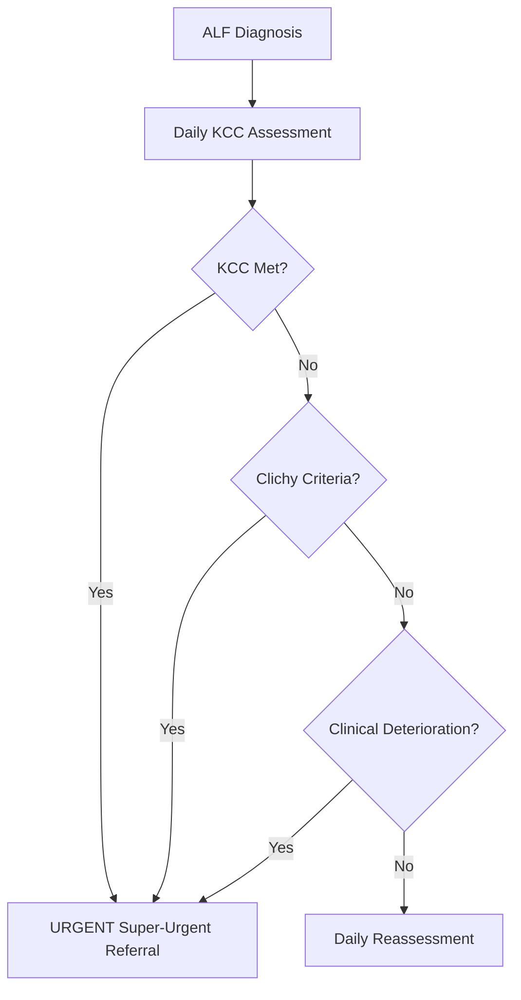

## 1. Learning Objectives
- [ ] Apply transplant referral criteria (King's College, Clichy, MELD)
- [ ] Understand super-urgent listing process
- [ ] Identify contraindications to transplant in ALF
- [ ] Manage patient while awaiting transplant
- [ ] Identify FCPS/MRCP high-yield referral timing

---

## 2. Transplant Referral Criteria



---

## 1. King's College Criteria (Primary Referral Standard)

### Paracetamol-Induced ALF
> **Any ONE of:**
1. **Arterial pH <7.30** (after adequate fluid resuscitation)
   **OR**
2. **PT >100 seconds (INR >6.5)** + **Serum Creatinine >300 μmol/L (3.4 mg/dL)** + **Grade III/IV Encephalopathy**

### Non-Paracetamol ALF
> **Any ONE of:**
1. **PT >100 seconds (INR >6.5)**
   **OR**
2. **Any THREE of the following 5 Minor Criteria:**
   - **Age** <10 years **or** >40 years
   - **Aetiology**: Non-A, Non-B Hepatitis, Drug-Induced, **Indeterminate**
   - **Jaundice to Encephalopathy Interval** >7 days
   - **PT >50 seconds (INR >3.5)**
   - **Serum Bilirubin >300 μmol/L (17.5 mg/dL)**

> **Mnemonic for Minor Criteria: "AAIII"** — Age, Aetiology, Interval, INR, Icterus

---

## 2. Clichy Criteria (Alternative for Paracetamol ALF)

| Criterion | Threshold |
|-----------|-----------|
| **Factor V** | **<20% of normal** (if age <30 years) |
| **Factor V** | **<30% of normal** (if age ≥30 years) |
| **AND** | **Hepatic Encephalopathy Grade III/IV** |

- **Used in some European centres** (France)
- **Factor V** reflects hepatic synthetic function better than PT
- **Same urgency** as KCC if met

---

## 3. MELD Score (Supplementary)

```
MELD = 3.78×ln(Bilirubin) + 11.2×ln(INR) + 9.57×ln(Creatinine) + 6.43
```
- **Range**: 6-40 (Higher = Sicker)
- **MELD ≥30**: High mortality; Consider Transplant Referral
- **Used when KCC not met** but clinical deterioration

---

## 3. Referral Timing & Process

### When to Refer
| Scenario | Action |
|----------|--------|
| **KCC Met** | **IMMEDIATE** — Super-Urgent Referral |
| **Clichy Met** | **IMMEDIATE** — Super-Urgent Referral |
| **MELD ≥30** | Urgent Referral (If KCC Not Met) |
| **Clinical Deterioration Despite Max Therapy** | Urgent Referral |
| **Uncontrollable ICP >25 mmHg** | Urgent Referral |
| **Progressive Multi-organ Failure** | Urgent Referral |

### Referral Process (UK Model)
```mermaid
flowchart TD
    A[ALF Unit Identifies KCC/Referral Criteria] --> B[Contact National Transplant Centre]
    B --> C[Provide: KCC, MELD, Labs, Imaging, Clinical Summary]
    C --> D[Centre Assesses: Suitability, Contraindications]
    D --> E{Accepted?}
    E -->|Yes| F[Super-Urgent Listing (Days 0-1)]
    E -->|No| G[Discuss Futility / Palliation / Retrieve]
    F --> H[Transfer for Transplant Assessment]
    H --> I[Final Workup: Cardiac, Pulmonary, Infection Screen, Psychosocial]
    I --> J[Transplant if Organ Available]
```

---

## 4. Super-Urgent Listing (UK) / Status 1A (US)

| Region | Listing Category | Priority |
|--------|------------------|----------|
| **UK (NHSBT)** | **Super-Urgent** (Category 1) | **Highest** — National Allocation |
| **US (UNOS)** | **Status 1A** | **Highest** — Regional/National |
| **Europe (Eurotransplant)** | **High Urgency (HU)** | **Highest** |

- **Time to Transplant**: Median **1-3 days** for Super-Urgent/Status 1A
- **Outcome**: **70-80% 1-year survival** post-transplant for ALF

---

## 5. Contraindications to Transplant in ALF

### Absolute Contraindications
| Contraindication | Rationale |
|------------------|-----------|
| **Uncontrolled Sepsis** | Immunosuppression Fatal |
| **Irreversible Brain Damage** (Brain Death) | No Neurological Recovery |
| **Extrahepatic Malignancy** (<5y Disease-Free) | Recurrence Risk |
| **Severe Cardiopulmonary Disease** | Perioperative Mortality |
| **Advanced AIDS** (CD4 <200, Uncontrolled) | Infection/Recurrence |
| **Active Substance Abuse** (Alcohol <6mo Abstinence) | Recurrence/Non-Adherence |
| **Severe Psychiatric Illness** (Non-Adherence Risk) | Graft Loss |
| **Lack of Social Support** | Post-Tx Care Failure |

### Relative Contraindications
| Factor | Assessment |
|--------|------------|
| **Age >70** | Biological > Chronological Age |
| **Severe Malnutrition / Sarcopenia** | Poor Outcomes |
| **Portal Vein Thrombosis (Complete, Non-reconstructible)** | Technical Failure |
| **Non-Adherence History** | Multidisciplinary Assessment |

---

## 6. Pre-Transplant Stabilisation (While Awaiting Organ)

| System | Target / Action |
|--------|-----------------|
| **Neurological** | ICP <20 mmHg; Mannitol/3% Saline; Sedation; Avoid Hypercarbia |
| **Coagulation** | FFP/Cryo for Bleeding/Procedures; **No Routine INR Correction** |
| **Renal** | CVVH if AKI/HRS; Electrolyte Correction; Avoid Nephrotoxins |
| **Cardiovascular** | MAP ≥65; Norepinephrine; Avoid Fluid Overload (CVP 8-12) |
| **Respiratory** | PaCO₂ 30-35 mmHg (If Cerebral Oedema); Lung Protective Ventilation |
| **Metabolic** | Glucose 4-7 mmol/L (Hourly); K 4-4.5, Mg/Phos Normal |
| **Infection** | Surveillance Cultures; Targeted Antibiotics; No Routine Prophylaxis |
| **Nutrition** | Early EN (24-48h); Protein 1.2-1.5 g/kg; Thiamine 100mg IV |

*...continued (truncated for renderer performance)*
---

> Auto-generated study sections for "Acute Liver Failure" — Ch 23: Hepatology.

## Flashcards (5 generated)

- Q: What is the definition of Acute Liver Failure?
  A: Mnemonic for Minor Criteria: "AAIII" — Age, Aetiology, Interval, INR, Icterus
- Q: What is Factor V of Acute Liver Failure?
  A: <20% of normal (if age <30 years)
- Q: What is AND of Acute Liver Failure?
  A: Hepatic Encephalopathy Grade III/IV
- Q: What is Factor V of Acute Liver Failure?
  A: <20% of normal (if age <30 years)
- Q: What is AND of Acute Liver Failure?
  A: Hepatic Encephalopathy Grade III/IV

## MCQs (1 generated)

1. **Which of the following best describes Acute Liver Failure?**
   A. **Mnemonic for Minor Criteria: "AAIII" — Age, Aetiology, Interval, INR, Icterus**
   B. An unrelated condition not matching the clinical picture of Acute Liver Failure
   C. A complication seen late in the disease course of Acute Liver Failure
   D. A condition that mimics Acute Liver Failure but has a different underlying cause

